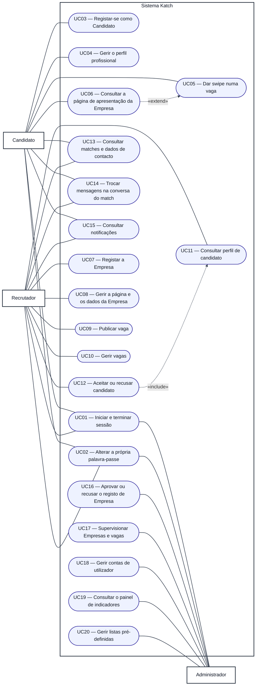

# Especificações de Casos de Uso — Katch

**Unidade curricular:** Laboratório de Desenvolvimento de Software — LDS
**Milestone:** `m2`
**Ficheiro:** `m2-especificacoes-casos-uso-v01.md`
**Pasta de arquivo:** `04-artefactos-tecnicos/04.04-casos-de-uso`

---

## 1. Identificação do documento

| Campo | Informação |
| --- | --- |
| Grupo | G11 |
| Sistema | Katch |
| Ano letivo | 2026/2027 |
| Curso | LEI — Licenciatura em Engenharia Informática |
| Turma | LEI3T2 |
| Versão do documento | v01 |
| Documentos de origem | `m1-proposta-sistema-v02.pdf`, `m1-declaracao-ambito-v02.pdf` e `m2-especificacao-requisitos-v01.md` (RF001 a RF118) |

O documento segue a estrutura prevista na secção 19 do Regulamento de Funcionamento da Unidade Curricular para `04.04-casos-de-uso`: atores, objetivos, fronteira e diagrama geral de casos de uso (secções 2 a 7), seguidos da especificação dos casos de uso relevantes (secção 8).

### 1.1. Responsáveis por secção

| Secção | Issue | Executor | Revisor | Auditor |
| --- | --- | --- | --- | --- |
| 2 a 7. Atores, objetivos, fronteira, diagrama geral, catálogo e cobertura | `I025` | Roberto Baptista | João Borguem | João Coelho |
| 8.1. UC03 — Registar-se como Candidato | `I026` | João Coelho | Roberto Baptista | Miguel Santos |
| 8.2. UC07 — Registar a Empresa | `I027` | Roberto Baptista | João Borguem | João Coelho |
| 8.3. UC16 — Aprovar ou recusar o registo de Empresa | `I028` | João Borguem | Roberto Baptista | João Coelho |
| 8.4. UC09 — Publicar vaga | `I029` | Miguel Santos | João Borguem | Roberto Baptista |
| 8.5. UC05 — Dar swipe numa vaga | `I030` | Miguel Santos | João Borguem | João Coelho |
| 8.6. UC12 — Aceitar ou recusar candidato | `I031` | Miguel Santos | João Coelho | Roberto Baptista |
| 8.7. UC11 — Consultar perfil de candidato | `I032` | Roberto Baptista | João Borguem | Miguel Santos |

### 1.2. Histórico de versões

| Versão | Data | Descrição das alterações | Issue |
| --- | --- | --- | --- |
| v01 | 2026-10-01 | Criação do documento e das secções 2 a 7 (atores, objetivos, fronteira, diagrama de casos de uso geral, catálogo e cobertura). | `I025` |
| v01 | 2026-10-02 | Especificação do UC07 — Registar a Empresa (secção 8.2). | `I027` |
| v01 | 2026-10-06 | Correção da revisão da I027: pré-condições do UC07 compatíveis com os fluxos A2 e A3 (D01) e unicidade do número de identificação fiscal verificada face às outras Empresas na nova submissão (D02). | `I027` |

Cada alteração posterior acrescenta uma linha. As versões anteriores são conservadas, nos termos da secção 18.2 do Regulamento de Funcionamento da Unidade Curricular.

---

## 2. Atores

Os três atores são os da secção 3 da Proposta de Sistema v02. Cada um acede ao sistema por um único ponto de acesso.

| Ator | Descrição | Ponto de acesso |
| --- | --- | --- |
| Candidato | Pessoa que procura oportunidades de trabalho. Mantém o perfil profissional, as competências e as preferências de procura, consulta as vagas que lhe são apresentadas e manifesta ou não interesse em cada uma. Depois de confirmado o match, comunica com o Recrutador responsável pela vaga. | Aplicação móvel (exclusivo) |
| Recrutador | Profissional que atua em nome de uma Empresa. Regista a Empresa, mantém a página de apresentação, publica e gere as vagas, consulta os candidatos que manifestaram interesse, decide sobre cada um e comunica com os candidatos com quem existe match. Só exerce estas funções depois de a Empresa ser aprovada. | Área de gestão web |
| Administrador | Responsável pela supervisão da plataforma. Decide sobre os registos de Empresas pendentes, mantém as listas pré-definidas, acompanha a atividade e consulta indicadores agregados. Não participa nas conversas nem acede ao seu conteúdo. | Área de gestão web |

---

## 3. Objetivos dos atores

| Ator | Objetivo | Casos de uso |
| --- | --- | --- |
| Candidato | Entrar na plataforma e começar a usá-la de imediato, sem aprovação. | UC03, UC01, UC02 |
| Candidato | Apresentar-se às empresas através de um perfil profissional completo. | UC04 |
| Candidato | Encontrar vagas compatíveis com as suas preferências e mostrar interesse nas que lhe agradam. | UC05, UC06 |
| Candidato | Saber quando há match e falar com o Recrutador. | UC13, UC14, UC15 |
| Recrutador | Colocar a Empresa na plataforma e obter a aprovação. | UC07, UC08, UC01, UC02 |
| Recrutador | Divulgar as vagas da Empresa e mantê-las atualizadas. | UC09, UC10 |
| Recrutador | Avaliar apenas candidatos com interesse real e decidir sobre cada um. | UC11, UC12 |
| Recrutador | Contactar os candidatos com quem existe match. | UC13, UC14, UC15 |
| Administrador | Garantir que só Empresas verificadas publicam vagas. | UC16, UC17 |
| Administrador | Manter a plataforma segura e as listas de referência atualizadas. | UC18, UC20, UC01, UC02 |
| Administrador | Acompanhar a atividade da plataforma. | UC19, UC17 |

---

## 4. Fronteira do sistema

A fronteira segue a Declaração de Âmbito v02.

| Dentro da fronteira (assegurado pelo sistema Katch) | Fora da fronteira (excluído pela DA v02) |
| --- | --- |
| Registo, autenticação e gestão das contas dos três atores, com validação automática dos registos. | Fornecedores externos de identidade. |
| Aprovação manual das Empresas pelo Administrador. | Integração com portais de emprego, redes profissionais e sistemas de gestão de recursos humanos. |
| Perfil profissional, exploração de vagas, quota de interesses e match. | Serviços externos de mapas ou de geolocalização; a distância é calculada com as coordenadas da lista pré-definida de localidades. |
| Conversa entre Candidato e Recrutador depois do match e notificações no interior das aplicações. | Envio de correio eletrónico, mensagens telefónicas ou notificações para fora da plataforma; serviços comerciais de comunicação; envio de ficheiros, imagens e mensagens de voz na conversa. |
| Área de supervisão e indicadores do Administrador. | Serviços de pagamento; migração de dados de aplicações anteriores; exploração real junto de candidatos ou empresas. |

No diagrama, a fronteira é o retângulo «Sistema Katch». Tudo o que está fora dele não é desenvolvido no projeto.

---

## 5. Diagrama de casos de uso geral

### 5.1. Convenções

Como o Mermaid não tem um tipo de diagrama UML de casos de uso, o diagrama usa um `flowchart` com as convenções seguintes:

| Elemento UML | Representação no diagrama |
| --- | --- |
| Ator | Retângulo fora da fronteira, com o nome do ator |
| Fronteira do sistema | Retângulo «Sistema Katch» |
| Caso de uso | Elipse (`([...])`) dentro da fronteira, identificada por `UCnn` |
| Associação ator–caso de uso | Linha contínua sem seta |
| Relação «include» | Seta tracejada do caso de uso base para o incluído (o incluído é sempre executado) |
| Relação «extend» | Seta tracejada do caso de uso que estende para o caso de uso base (a extensão é opcional) |

As cores estão fixadas no próprio diagrama (fundo branco, linhas escuras), para que o diagrama se leia da mesma forma em tema claro e em tema escuro.

Os comportamentos que o sistema executa sem intervenção direta de um ator (por exemplo, o cálculo da distância, o estado pendente da Empresa, o encerramento automático da vaga na data-limite, a criação da conversa e a geração das notificações) não são casos de uso autónomos. Fazem parte do caso de uso que os desencadeia e estão identificados no catálogo (secção 6).

### 5.2. Diagrama

### 5.3. Relações entre casos de uso

| Relação | Significado | Requisitos |
| --- | --- | --- |
| UC12 «include» UC11 | O Recrutador só pode aceitar ou recusar um Candidato depois de abrir o perfil completo; a consulta do perfil faz sempre parte da decisão. | RF061, RF063, RF064, RF118 |
| UC06 «extend» UC05 | Ao consultar uma vaga, o Candidato pode, se quiser, abrir a página de apresentação da Empresa; não é obrigatório para recusar a vaga ou manifestar interesse. | RF016, RF017 |

---

## 6. Catálogo dos casos de uso

| ID | Caso de uso | Ator(es) | Funcionalidades | Requisitos funcionais | Comportamento do sistema incluído | Especificação detalhada |
| --- | --- | --- | --- | --- | --- | --- |
| UC01 | Iniciar e terminar sessão | Candidato, Recrutador, Administrador | F001 | RF001, RF105 (Candidato); RF038, RF106 (Recrutador); RF083, RF107 (Administrador) | RF039 (operações reservadas só com Empresa aprovada), RF112 (registo do autor das operações) | — |
| UC02 | Alterar a própria palavra-passe | Candidato, Recrutador, Administrador | F001 | RF002 (Candidato); RF040 (Recrutador); RF084 (Administrador) | — | — |
| UC03 | Registar-se como Candidato | Candidato | F002 | RF003, RF004, RF005 | Validação automática e ativação imediata da conta | `I026` (secção 8.1) |
| UC04 | Gerir o perfil profissional | Candidato | F004 | RF006 a RF012 | — | — |
| UC05 | Dar swipe numa vaga | Candidato | F006, F011 | RF013, RF014, RF016, RF018 a RF023 | RF015 (distância em linha reta), RF113 (interesse em espera), RF033 (notificação da reposição da quota), RF076 (notificação de novo interesse ao Recrutador) | `I030` (secção 8.5) |
| UC06 | Consultar a página de apresentação da Empresa | Candidato | F003 | RF017 | — | — |
| UC07 | Registar a Empresa | Recrutador | F001, F003 | RF037, RF041, RF042, RF044, RF045 | RF043 (Empresa em estado pendente) | `I027` (secção 8.2) |
| UC08 | Gerir a página e os dados da Empresa | Recrutador | F003 | RF046, RF047, RF048, RF049 | — | — |
| UC09 | Publicar vaga | Recrutador | F005 | RF050, RF051, RF052, RF053 | RF039 (só com Empresa aprovada) | `I029` (secção 8.4) |
| UC10 | Gerir vagas | Recrutador | F005 | RF054, RF055, RF056, RF058, RF059, RF114, RF115 | RF057 (encerramento automático na data-limite) | — |
| UC11 | Consultar perfil de candidato | Recrutador | F004, F007 | RF060, RF061, RF062 | RF113 (interesse em espera até à decisão), RF118 (registo da abertura do perfil por vaga) | `I032` (secção 8.7) |
| UC12 | Aceitar ou recusar candidato | Recrutador | F007, F008, F010 | RF063, RF064, RF066, RF117 | RF065 (registo da decisão), RF068 (criação automática da conversa), RF031 e RF077 (notificação de novo match) | `I031` (secção 8.6) |
| UC13 | Consultar matches e dados de contacto | Candidato, Recrutador | F008 | RF024, RF025 (Candidato); RF067 (Recrutador) | — | — |
| UC14 | Trocar mensagens na conversa do match | Candidato, Recrutador | F010 | RF026 a RF030, RF108 (Candidato); RF069, RF071 a RF074, RF109 (Recrutador) | RF070 (comunicação só depois do match), RF075 (conversa só de consulta por bloqueio ou suspensão), RF103 (Administrador sem acesso às conversas), RF032 e RF078 (notificação de nova mensagem) | — |
| UC15 | Consultar notificações | Candidato, Recrutador | F011 | RF034, RF035, RF036, RF110 (Candidato); RF080, RF081, RF082, RF111 (Recrutador) | Notificações geradas pelos outros casos de uso (RF031 a RF033, RF076 a RF079) | — |
| UC16 | Aprovar ou recusar o registo de Empresa | Administrador | F003, F009, F011 | RF091, RF092, RF093, RF094 | RF079 (notificação da decisão ao Recrutador) | `I028` (secção 8.3) |
| UC17 | Supervisionar Empresas e vagas | Administrador | F003, F005, F009 | RF095, RF097, RF098, RF116 | RF075 (conversas em consulta quando a Empresa é suspensa) | — |
| UC18 | Gerir contas de utilizador | Administrador | F001, F002 | RF085 a RF090 | RF075 (conversas em consulta quando a conta é bloqueada ou suspensa) | — |
| UC19 | Consultar o painel de indicadores | Administrador | F009 | RF096 | RF104 (área de supervisão reservada ao Administrador) | — |
| UC20 | Gerir listas pré-definidas | Administrador | F009 | RF099, RF100, RF101, RF102 | — | — |

---

## 7. Verificação do diagrama

### 7.1. Restrições representadas pela ausência de associação

| Restrição | Como aparece no diagrama | Requisito |
| --- | --- | --- |
| O Administrador não acede às conversas. | Não existe associação entre o Administrador e o UC14. | RF103 |
| O Recrutador não procura candidatos que não tenham manifestado interesse nas suas vagas. | Não existe caso de uso de pesquisa livre de candidatos; o Recrutador só chega a um perfil através do UC11, que parte da lista de candidatos em espera de uma vaga. | RF060, RF061 |
| Só o Administrador decide sobre o registo de Empresas. | O UC16 está associado apenas ao Administrador. | RF093, RF094 |
| O Candidato não publica vagas nem decide sobre candidatos. | O Candidato não está associado aos UC07 a UC12. | F005, F007 |

### 7.2. Cobertura

| Verificação | Resultado |
| --- | --- |
| Funcionalidades F001 a F011 com, pelo menos, um caso de uso | F001 (UC01, UC02, UC07, UC18), F002 (UC03, UC18), F003 (UC06, UC07, UC08, UC16, UC17), F004 (UC04, UC11), F005 (UC09, UC10, UC17), F006 (UC05), F007 (UC11, UC12), F008 (UC12, UC13), F009 (UC16, UC17, UC19, UC20), F010 (UC12, UC14), F011 (UC05, UC15, UC16) |
| Requisitos funcionais RF001 a RF118 associados a um caso de uso | 118 de 118 (colunas «Requisitos funcionais» e «Comportamento do sistema incluído» da secção 6) |
| Atores | Candidato, Recrutador e Administrador, os três da Proposta de Sistema v02 |
| Casos de uso especificados em detalhe | UC03, UC05, UC07, UC09, UC11, UC12 e UC16 (Issues `I026` a `I032`) |

---

## 8. Especificações dos casos de uso

As especificações são acrescentadas neste ficheiro pelas Issues `I026` a `I032`, pela numeração da secção 1.1. Cada especificação segue a estrutura seguinte, exigida pela secção 19 do Regulamento de Funcionamento da Unidade Curricular:

| Campo | Conteúdo |
| --- | --- |
| Identificação | `UCnn` e nome, igual ao do diagrama |
| Ator principal | Ator que inicia o caso de uso |
| Objetivo | Resultado que o ator pretende obter |
| Pré-condições | Estado necessário antes do início |
| Fluxo principal | Passos numerados da interação entre o ator e o sistema |
| Fluxos alternativos | Variações válidas do fluxo principal, com o passo onde começam |
| Exceções | Situações de erro ou rejeição e a resposta do sistema |
| Pós-condições | Estado do sistema no fim, com sucesso |
| Requisitos relacionados | IDs dos RF (e RNF, quando existirem) da especificação de requisitos |

### 8.1. UC03 — Registar-se como Candidato

> A preencher pela Issue `I026`.

### 8.2. UC07 — Registar a Empresa

| Campo | Conteúdo |
| --- | --- |
| Identificação | `UC07` — Registar a Empresa |
| Ator principal | Recrutador |
| Objetivo | Criar a conta de Recrutador e submeter o registo da Empresa que representa, para que o Administrador o aprove e a Empresa possa publicar vagas. |
| Pré-condições | O Recrutador acede à área de gestão web. A conta do Recrutador, se já existir, não tem nenhuma Empresa associada, porque cada Recrutador representa uma única Empresa (secção 2.2 da especificação de requisitos). Exceções: no fluxo A2, a Empresa associada já foi submetida; no fluxo A3, a Empresa associada está no estado recusada. |

**Fluxo principal**

1. O Recrutador abre a criação de conta na área de gestão web.
2. O Recrutador indica o endereço de correio eletrónico e a palavra-passe e aceita as condições de utilização.
3. O sistema valida os dados e cria a conta de Recrutador (RF037).
4. O Recrutador inicia sessão (UC01) e abre o registo da Empresa.
5. O Recrutador indica a designação social, o número de identificação fiscal, o setor de atividade, a morada, a localidade (da lista pré-definida de localidades), o endereço de correio eletrónico, o contacto telefónico e o nome do responsável da Empresa, e submete o registo (RF041).
6. O sistema aplica a validação automática: campos obrigatórios preenchidos, formatos dos dados e número de identificação fiscal não registado por outra Empresa (RF042).
7. O sistema regista a Empresa no estado pendente, guarda o autor e a data e hora da submissão e apresenta ao Recrutador o estado do pedido (RF043, RF044, RF112).

**Fluxos alternativos**

* **A1 — Recrutador já tem conta (passo 1).** O Recrutador inicia sessão (UC01) e o caso de uso continua no passo 4.
* **A2 — Consulta do estado do pedido (depois do passo 7).** O Recrutador consulta, em qualquer momento, o estado do pedido (pendente, aprovada, recusada ou suspensa) e, no estado recusada, o motivo indicado pelo Administrador (RF044).
* **A3 — Nova submissão depois da recusa do registo (passo 5).** A Empresa está no estado recusada. O sistema apresenta os dados submetidos e o motivo da recusa. O Recrutador corrige os dados, incluindo, se necessário, o número de identificação fiscal, que só deixa de poder ser alterado depois da aprovação (RF049), e submete o registo de novo. O caso de uso continua no passo 6. A unicidade do número de identificação fiscal é verificada face às outras Empresas. Se a validação automática for cumprida, a mesma Empresa volta ao estado pendente, com nova data de submissão e sem o motivo da recusa anterior (RF045).
* **A4 — Saída antes de submeter (passo 5).** O Recrutador sai sem submeter o registo. A conta de Recrutador mantém-se, mas não fica nenhuma Empresa registada.

**Exceções**

* **E1 — Dados da conta não conformes (passo 3).** Há um campo em falta, o endereço de correio eletrónico não está no formato local@domínio, a palavra-passe não tem pelo menos 8 caracteres, com uma letra e um algarismo, ou as condições de utilização não foram aceites. O sistema rejeita a criação da conta e indica o motivo (RF037).
* **E2 — Endereço de correio eletrónico já registado (passo 3).** O sistema rejeita a criação da conta e indica o motivo (RF037).
* **E3 — Campos obrigatórios em falta (passo 6).** O sistema rejeita o registo e indica cada campo em falta. A Empresa não é registada e o Recrutador pode corrigir e submeter de novo, voltando ao passo 5 (RF042).
* **E4 — Formato inválido (passo 6).** O endereço de correio eletrónico não está no formato local@domínio, ou o contacto telefónico ou o número de identificação fiscal não têm 9 algarismos. O sistema rejeita o registo e indica cada campo em causa e o motivo (RF042).
* **E5 — Número de identificação fiscal duplicado (passo 6).** Já existe outra Empresa registada com o mesmo número de identificação fiscal. Na nova submissão (A3), a própria Empresa recusada não conta como duplicado. O sistema rejeita o registo e indica o campo e o motivo (RF042).
* **E6 — Operação reservada antes da aprovação (depois do passo 7).** Com a Empresa no estado pendente, recusada ou suspensa, o Recrutador tenta publicar uma vaga ou aceder a candidatos. O sistema rejeita a operação e apresenta o estado atual da Empresa (RF039).

**Pós-condições**

* Sucesso: a conta de Recrutador está ativa e a Empresa está registada no estado pendente, associada ao Recrutador, com o autor e a data e hora da submissão registados. A Empresa passa a constar da lista das Empresas pendentes do Administrador (UC16).
* Enquanto a Empresa não for aprovada, o Recrutador não publica vagas nem acede a candidatos (RF039). Só a aprovação do Administrador no UC16, notificada ao Recrutador (RF079), levanta esta restrição.
* Rejeição na validação automática: não fica registada nenhuma Empresa nova e o estado de uma Empresa recusada não muda.

**Requisitos relacionados:** RF037, RF039, RF041, RF042, RF043, RF044, RF045, RF112; parâmetros P04 e P15 da especificação de requisitos. Relacionados com o UC16: RF079, RF091.

### 8.3. UC16 — Aprovar ou recusar o registo de Empresa

> A preencher pela Issue `I028`.

### 8.4. UC09 — Publicar vaga

> A preencher pela Issue `I029`.

### 8.5. UC05 — Dar swipe numa vaga

> A preencher pela Issue `I030`.

### 8.6. UC12 — Aceitar ou recusar candidato

> A preencher pela Issue `I031`.

### 8.7. UC11 — Consultar perfil de candidato

> A preencher pela Issue `I032`.
