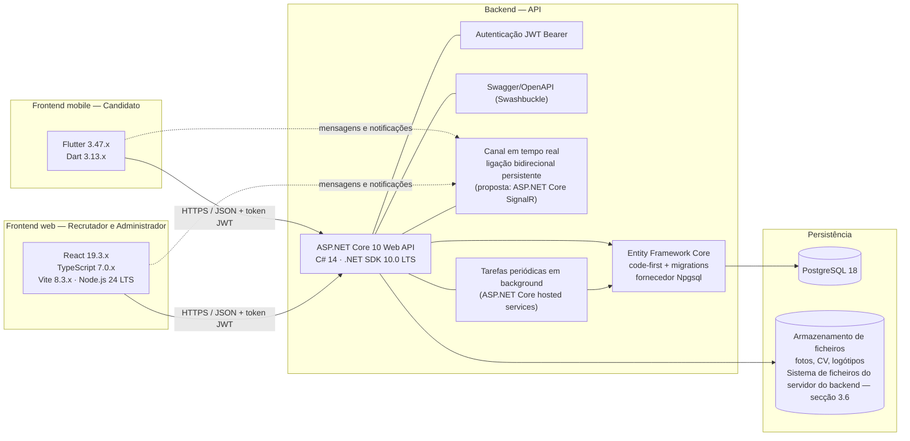

# Documentação de Arquitetura — Katch

**Unidade curricular:** Laboratório de Desenvolvimento de Software — LDS
**Milestone:** `m2`
**Ficheiro:** `m2-documentacao-arquitetura-v01.md`
**Pasta de arquivo:** `04-artefactos-tecnicos/04.05-arquitetura`

---

## 1. Identificação do documento

| Campo | Informação |
| --- | --- |
| Grupo | G11 |
| Sistema | Katch |
| Ano letivo | 2026/2027 |
| Curso | LEI — Licenciatura em Engenharia Informática |
| Turma | LEI3T2 |
| Versão do documento | v01 |
| Documentos de origem | `m1-proposta-sistema-v02.pdf`, `m1-declaracao-ambito-v02.pdf`, Regulamento Interno do Grupo v01 (`m1-regulamento-grupo-v01.pdf`, secções 5, 10 e 11), `m2-backlog-projeto-v02.xlsx` (Issues `I033`, `I034` e `I051`), `m2-modelo-de-dados-katch-v01.md` e `m2-especificacao-requisitos-v01.md` |

### 1.1. Responsáveis por secção

O documento é consolidado por várias Issues do Sprint 02. Cada secção indica a Issue que a produz, para que a revisão e a auditoria de cada tarefa incidam apenas sobre a parte que lhe corresponde.

| Secção | Issue | Executor | Revisor | Auditor |
| --- | --- | --- | --- | --- |
| 2. Visão geral, componentes, responsabilidades, relações, fronteiras, interfaces, restrições, padrões, atributos de qualidade e evolução prevista | `I033` | João Coelho | João Borguem | Roberto Baptista |
| 3. Tecnologias e decisões tecnológicas | `I034` | Roberto Baptista | João Borguem | Miguel Santos |

### 1.2. Histórico de versões

| Versão | Data | Descrição das alterações | Issue |
| --- | --- | --- | --- |
| v01 | 2026-10-01 | Criação do documento e da secção 3 (tecnologias e decisões tecnológicas). | `I034` |

Cada alteração posterior acrescenta uma linha. As versões anteriores são conservadas, nos termos da secção 18.2 do Regulamento de Funcionamento da Unidade Curricular.

---

## 2. Arquitetura do sistema

> Secção da responsabilidade da Issue `I033` (prazo do Executor: 2026-10-03 23:59). Será acrescentada neste mesmo ficheiro, com os diagramas Mermaid de componentes, responsabilidades, relações, fronteiras, interfaces, restrições, padrões, atributos de qualidade e evolução prevista.

---

## 3. Tecnologias e decisões tecnológicas

### 3.1. Objetivo e regra de coerência

Esta secção identifica a tecnologia de cada componente do Katch e explica porque foi escolhida. As versões são as fixadas na secção 11.2 do Regulamento Interno do Grupo v01. Quando o Regulamento Interno não fixa uma versão, isso é dito expressamente e a versão fica fixada no ficheiro de dependências do repositório respetivo. As tecnologias que o Regulamento Interno não menciona (JWT, canal em tempo real, tarefas em background, armazenamento de ficheiros) têm a origem indicada na coluna «Origem da versão» da secção 3.3.

Nos termos da secção 11.1 do Regulamento Interno, qualquer alteração a uma tecnologia, versão, regra ou limiar fixado na secção 11 exige uma nova versão do Regulamento Interno. Esta secção não altera nenhuma dessas escolhas; limita-se a documentá-las e a justificá-las.

### 3.2. Mapa da stack

O diagrama mostra apenas a correspondência entre componentes e tecnologias. A estrutura interna, as interfaces e os padrões arquiteturais são tratados na secção 2 (`I033`).

### 3.3. Tecnologias por componente

| Componente | Tecnologia e versão | Origem da versão | Justificação |
| --- | --- | --- | --- |
| Backend — linguagem e framework | C# 14 com ASP.NET Core 10 (Web API) | RI v01, secção 11.2 | Framework maduro para APIs REST, com injeção de dependências, validação, autenticação e documentação OpenAPI integradas. Cumpre o requisito da UC de um backend funcional com testes, cobertura, análise estática e collection Postman. |
| Backend — SDK e execução | .NET SDK 10.0 (LTS) | RI v01, secção 11.2 | Versão com suporte de longo prazo (até novembro de 2028), o que garante atualizações de segurança durante todo o semestre e depois dele. |
| Backend — documentação da API | Swagger/OpenAPI com Swashbuckle, disponível em `/swagger` | RI v01, secções 5 e 11.2 | Permite explorar e testar os endpoints sem ferramentas externas e serve de referência à documentação da API (`04.11`). |
| Backend — acesso a dados | Entity Framework Core, abordagem code-first com migrations (`dotnet ef migrations`), com o fornecedor Npgsql e o pacote `EFCore.NamingConventions` (`UseSnakeCaseNamingConvention()`) | EF Core: RI v01, secção 11.2 (o RI não fixa a versão). Npgsql e `EFCore.NamingConventions`: modelo de dados (`m2-modelo-de-dados-katch-v01.md`); versão não fixada no RI | O modelo de dados fica descrito em C# e versionado com o código; as migrations tornam reproduzível a criação da base de dados em qualquer máquina do grupo e na pipeline. O Npgsql é necessário para o `xmin` como controlo de concorrência otimista em `match`, para os arrays e para os tipos enumerados do esquema. |
| Backend — canal em tempo real | Ligação bidirecional persistente entre cliente e servidor; proposta: ASP.NET Core SignalR (parte do framework) | DA v02 (F010, F011); proposta de tecnologia em D-08 — não fixada no RI | A DA impõe que as mensagens (F010) e as notificações (F011) sejam entregues em tempo real «através de uma ligação bidirecional persistente entre cliente e servidor», assegurada pelo próprio sistema. A consulta periódica à API não cumpre esta exigência. |
| Backend — tarefas periódicas | Hosted services do ASP.NET Core (`BackgroundService`) | Modelo de dados (`m2-modelo-de-dados-katch-v01.md`); framework do v01, secção 11.2 | Encerrar vagas cuja data-limite expirou (F005) e repor a quota de interesses com a respetiva notificação (F006, F011). Não exige nenhuma tecnologia adicional ao backend. |
| Armazenamento de ficheiros | Sistema de ficheiros do servidor do backend | Modelo de dados (`m2-modelo-de-dados-katch-v01.md`: ficheiros fora da base de dados) | Fotos de perfil, CV, logótipos e galerias ficam fora da base de dados, que guarda apenas o caminho ou URL (`varchar(500)`). O local de armazenamento ainda não está decidido. |
| Base de dados | PostgreSQL 18 | RI v01, secções 5 e 11.2 | Base de dados relacional robusta e gratuita, adequada às relações do domínio (Candidato, Empresa, vaga, interesse, match). Em desenvolvimento corre em `localhost`, porta 6000 (RI, secção 5). |
| Base de dados — testes isolados | SQLite in-memory | RI v01, secções 5 e 11.2 | Usada apenas nos testes de integração do backend, para isolar cada execução. A base de dados de produção e entrega continua a ser PostgreSQL. Limitação: o SQLite não reproduz funcionalidades PostgreSQL usadas pelo esquema v01 (ver secção 3.6, ponto 4). |
| Autenticação e autorização | JSON Web Token (JWT) com o esquema JWT Bearer do ASP.NET Core 10 (pacote oficial `Microsoft.AspNetCore.Authentication.JwtBearer`, na versão correspondente ao .NET 10) | Backlog de Projeto (`I033`, `I034`, `I051`); não fixada no RI — ver decisão D-04 | Autenticação sem estado de sessão, adequada a dois clientes distintos (aplicação móvel e área de gestão web) que consomem a mesma API. O tipo de conta (Candidato, Recrutador ou Administrador) segue no token, que tem expiração curta. Como a F001 determina que uma conta bloqueada ou desativada, ou associada a uma empresa não aprovada, não tem acesso às operações reservadas, o backend confirma na base de dados o estado da conta (`app_user.status`) e da empresa (`company.status`) em cada operação reservada, e não confia apenas no conteúdo do token. O segredo de assinatura é guardado em variável de ambiente (desenvolvimento) ou GitHub Secrets (pipeline), nos termos do RI, secção 14.2. |
| Frontend web — linguagem e framework | TypeScript 7.0.x com React 19.3.x | RI v01, secção 11.2 | React é a biblioteca de interfaces mais usada e com mais documentação; a tipagem estática do TypeScript reduz erros na integração com a API. |
| Frontend web — construção | Vite 8.3.x, npm, Node.js 24 LTS | RI v01, secção 11.2 | Arranque e recompilação rápidos em desenvolvimento e build de produção simples, executável na pipeline. Node.js LTS garante suporte durante o semestre. |
| Frontend mobile | Flutter 3.47.x com Dart 3.13.x (Flutter SDK, pub) | RI v01, secção 11.2 | Um único código para Android e iOS, com widgets próprios que facilitam a interação por cartões da exploração de vagas (F006). |
| Integração contínua | GitHub Actions (`.github/workflows/ci.yml` em `katch-backend`, `katch-frontend-web` e `katch-frontend-mobile`) | RI v01, secção 11.6 | Integrado no GitHub, onde já estão os repositórios e as regras de proteção da `main`; executa os quality gates QG-01 a QG-07 em cada Merge Request. |
| Análise estática | SonarQube Server 2026.1 LTA (Community Build, self-hosted), com o Quality Profile «Sonar way» de cada linguagem | RI v01, secções 5 e 11.4 | Uma única ferramenta para os três componentes, com Quality Gate que bloqueia a pipeline (QG-05). A edição LTA mantém-se estável durante todo o projeto. |
| Linters e formatação — backend | Roslyn Analyzers + StyleCop.Analyzers; `dotnet format` | RI v01, secções 11.3 e 11.4 | Aplicam as Microsoft C# Coding Conventions, com severidade `Error` a bloquear a pipeline. |
| Linters e formatação — web | ESLint (TypeScript + React) e Prettier | RI v01, secções 11.3 e 11.4 | O ESLint, com `eslint:recommended`, `react-hooks/recommended` e `@typescript-eslint/recommended`, e o Prettier verificam a convenção adotada (Airbnb TypeScript/React Style Guide), com severidade `error` a bloquear a pipeline. |
| Linters e formatação — mobile | Dart analyzer com `flutter_lints`; `dart format` | RI v01, secções 11.3 e 11.4 | Conjunto de regras recomendado pela equipa do Flutter, alinhado com o Effective Dart. |
| Testes — backend | xUnit (projetos `Katch.Backend.UnitTests` e `Katch.Backend.IntegrationTests`, com `WebApplicationFactory`); cobertura com coverlet + reportgenerator | RI v01, secções 11.2 e 11.5 | Framework de testes de referência no .NET; a cobertura de linhas é medida para cumprir o limiar obrigatório de 70% (QG-04). |
| Testes de API | Postman (aplicação desktop), com a collection versionada no repositório | RI v01, secção 5; versão não fixada no RI | Exigência da secção 17 do Regulamento da UC para `m3` (collection Postman importável). A collection é guardada no repositório para que qualquer elemento a execute da mesma forma. |
| Testes — web | Jest (unitários, cobertura mínima de 40%) e Playwright (sistema) | RI v01, secções 5, 11.2 e 11.5; versão não fixada no RI | Jest testa a lógica de componentes e hooks; Playwright automatiza os testes de sistema no browser (QG-06). |
| Testes — mobile | `flutter_test` (unitários e de widget, cobertura mínima de 40%) e `integration_test` (sistema) | RI v01, secções 5, 11.2 e 11.5; integrados no Flutter SDK 3.47.x | Ferramentas oficiais do Flutter; `integration_test` executa os testes de sistema da aplicação (QG-07). |
| Diagramas | Mermaid, com a fonte incluída nos ficheiros Markdown | RI v01, secção 5; Regulamento da UC, secção 17 | Diagramas em texto, editáveis e versionáveis, como exige o Regulamento da UC. |

### 3.4. Ferramentas de desenvolvimento recomendadas

| Componente | IDE ou editor recomendado (RI v01, secção 11.2) |
| --- | --- |
| Backend | Visual Studio 2022, JetBrains Rider ou VS Code (C# Dev Kit) |
| Frontend web | VS Code |
| Frontend mobile | VS Code (extensão Flutter) ou Android Studio |
| Base de dados | pgAdmin ou DBeaver |

As versões das dependências que o RI não fixa ficam fixadas no momento da configuração base de cada repositório: Jest e Playwright no `package.json` e no `package-lock.json` do `katch-frontend-web`; pacote JWT Bearer, Swashbuckle, Npgsql, `EFCore.NamingConventions`, xUnit e coverlet nos ficheiros `.csproj`/`Directory.Build.props` do `katch-backend`; `flutter_lints` e as restantes dependências do mobile no `pubspec.yaml` e no `pubspec.lock` do `katch-frontend-mobile`. O Postman é uma aplicação desktop sem ficheiro de dependências; a versão usada fica registada junto da collection versionada no repositório do backend. A versão instalada passa a ser a referência e só muda através de um Merge Request revisto e auditado.

### 3.5. Decisões tecnológicas

| ID | Decisão | Alternativas consideradas | Fundamentação | Origem |
| --- | --- | --- | --- | --- |
| D-01 | Três componentes autónomos (API, área de gestão web e aplicação móvel), cada um no seu repositório. | Monorepo único; aplicação web responsiva em vez de app móvel. | A DA atribui a aplicação móvel exclusivamente ao Candidato e a área de gestão web ao Recrutador e ao Administrador; repositórios separados permitem pipelines e responsáveis próprios por tecnologia. | DA v02; RI v01, secção 10.1 |
| D-02 | Backend em ASP.NET Core 10 sobre .NET 10 LTS. | Node.js/Express; Java/Spring Boot. | Suporte de longo prazo, desempenho e suporte OpenAPI/Swagger com Swashbuckle. | RI v01, secção 11.2 |
| D-03 | PostgreSQL 18 com EF Core code-first; SQLite in-memory apenas nos testes de integração. | SQL Server; MySQL; abordagem database-first. | O esquema fica versionado com o código; os testes correm isolados e depressa sem depender de um servidor de base de dados. O SQLite não reproduz tudo o que o esquema v01 usa (limitação registada na secção 3.6, ponto 4). | RI v01, secções 5 e 11.2 |
| D-04 | Autenticação por JWT com o esquema JWT Bearer nativo do ASP.NET Core. | Sessões com cookies no servidor; fornecedor externo de identidade. | Os dois clientes (móvel e web) usam a mesma API sem estado de sessão no servidor; o tipo de conta segue no token, mas o estado da conta e da empresa é confirmado na base de dados em cada operação reservada, para que um bloqueio ou suspensão (F001, F003) produza efeito imediato. A secção 3 da DA (limites transversais) exclui expressamente «fornecedores externos de identidade», pelo que a autenticação tem de ser assegurada pela própria API. O JWT está previsto no Backlog de Projeto (`I033`, `I034`, `I051`). O RI não fixa esta tecnologia, pelo que esta decisão a documenta sem alterar nada do que o RI fixa. | Backlog de Projeto (`I033`, `I034`, `I051`); DA v02 (limites transversais); F001 |
| D-05 | Frontend web em React 19 + TypeScript + Vite. | Angular; Vue. | Ecossistema mais amplo, tipagem estática e build rápido; ferramentas de teste (Jest, Playwright) compatíveis. | RI v01, secção 11.2 |
| D-06 | Aplicação móvel em Flutter. | React Native; Android nativo (Kotlin). | Código único para Android e iOS; o Candidato acede apenas pela aplicação móvel (DA). | RI v01, secção 11.2; DA v02 |
| D-07 | GitHub Actions + SonarQube Server 2026.1 LTA para os quality gates. | GitLab CI; SonarCloud. | Integração direta com os repositórios GitHub e Quality Gate bloqueante em todos os componentes. | RI v01, secções 11.4 e 11.6 |
| D-08 | Mensagens (F010) e notificações (F011) entregues por uma ligação bidirecional persistente, com ASP.NET Core SignalR como tecnologia proposta, reutilizando a autenticação JWT. | Consulta periódica à API (polling); WebSockets diretos sem biblioteca; serviço externo de envio de notificações. | A DA exige a ligação bidirecional persistente, o que exclui a consulta periódica, e exclui os serviços comerciais de comunicação e de notificação, pelo que a solução tem de ser interna. O SignalR faz parte do ASP.NET Core, pelo que não acrescenta tecnologia ao backend. O token JWT tem de ser aceite também na ligação persistente. Proposta sujeita a confirmação em reunião formal, com decisão registada em ata (Regulamento da UC, secção 10.1), porque os clientes web e móvel precisam de uma biblioteca cliente. | DA v02 (F010, F011 e limites transversais) |

### 3.6. Pontos a acompanhar

| N.º | Ponto | Encaminhamento |
| --- | --- | --- |
| 1 | A receção de mensagens e notificações em tempo real (F010 e F011) exige uma ligação bidirecional persistente entre cliente e servidor, imposta pela DA. O RI não fixa nenhuma tecnologia para isso. | Proposta D-08 (ASP.NET Core SignalR). A DA determina que a comunicação em tempo real e as notificações são «asseguradas pelo próprio sistema», o que exclui serviços externos de envio de notificações. A decisão é confirmada em reunião formal e registada em ata (Regulamento da UC, secção 10.1). O tempo máximo de entrega fixado na especificação de requisitos (parâmetro P17) é verificado contra esta escolha quando esse documento for consolidado. |
| 2 | O RI não fixa versões para Jest, Playwright, Postman, Npgsql, `EFCore.NamingConventions` nem para o pacote JWT Bearer. | Versões fixadas nos ficheiros de dependências de cada repositório (secção 3.4). |
| 4 | O SQLite in-memory dos testes de integração não reproduz o `xmin` (concorrência otimista em `match`), os tipos enumerados nativos, nem as restrições `CHECK` com expressão regular do esquema v01. Estes aspetos não ficam cobertos pelos testes de integração. | Limitação aceite pelo RI (secções 5 e 11.2). Qualquer alternativa, como testar contra PostgreSQL, exige uma nova versão do RI. |
| 5 | O RI prevê o Quality Profile «Sonar way» para Dart no SonarQube Server Community Build. Está por confirmar que este perfil existe para essa edição; se não existir, o QG-05 do mobile não é cumprível como está definido. | Confirmar na instalação do SonarQube antes de `m3`. Uma eventual alteração exige uma nova versão do RI (secção 11.1). |