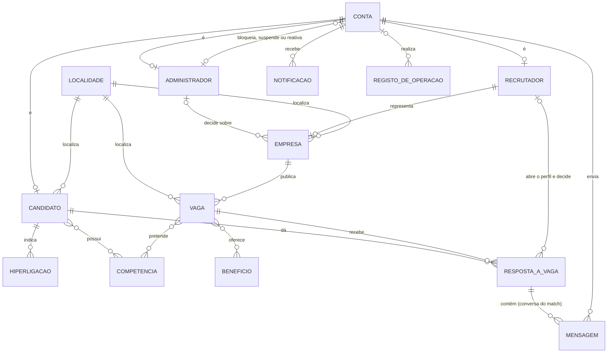
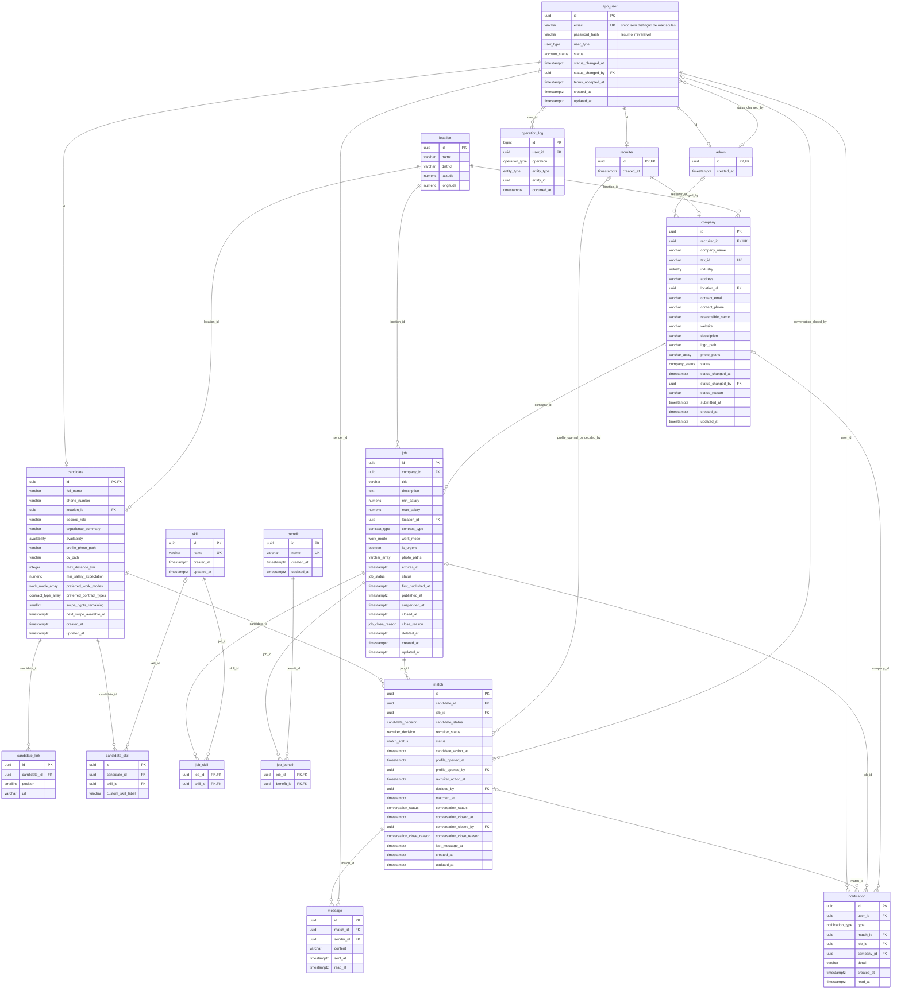

# Modelo de Dados — Base de dados `katch`

**Unidade curricular:** Laboratório de Desenvolvimento de Software — LDS
**Milestone:** `m2`
**Ficheiro:** `m2-modelo-de-dados-katch-v01.md`
**Pasta de arquivo:** `04-artefactos-tecnicos/04.06-modelos-de-dados`

---

## 1. Identificação do documento

| Campo | Informação |
| --- | --- |
| Grupo | G11 |
| Sistema | Katch |
| Ano letivo | 2026/2027 |
| Curso | LEI — Licenciatura em Engenharia Informática |
| Turma | LEI3T2 |
| Versão do documento | v01 |
| Base de dados | `katch` (PostgreSQL 18) |
| Issue | `I035` — Elaborar o modelo de dados (diagrama entidade-relação) |
| Executor / Revisor / Auditor | Roberto Baptista / João Borguem / Miguel Santos |
| Documentos de origem | `m1-proposta-sistema-v02.pdf`, `m1-declaracao-ambito-v02.pdf`, `m2-especificacao-requisitos-v01.md` (RF001 a RF118, RNF001 a RNF018, parâmetros P01 a P19), `m1-regulamento-grupo-v01.pdf` (secções 5, 11.2, 14.2 e 14.3), `m2-backlog-projeto-v02.xlsx` (Issue `I035`), `m2-documentacao-arquitetura-v01.md` (secção 2, decisão AD-01), `m2-diagrama-estados-interesse-match-v01.md` |

O documento segue a secção 19 do Regulamento de Funcionamento da Unidade Curricular para `04.06-modelos-de-dados`: um ficheiro por base de dados, com finalidade, tecnologia, modelos conceptual, lógico e físico e dicionário de dados. Corresponde à linha `OF-M2-006` — «Modelo de dados — katch v1» da Checklist de Controlo de Artefactos, gerida em code-first com o Entity Framework Core.

### 1.1. Histórico de versões

| Versão | Data | Descrição das alterações | Issue |
| --- | --- | --- | --- |
| v01 | 2026-10-03 | Criação do documento: modelos conceptual, lógico e físico, dicionário de dados, índices, integridade, dados sensíveis, dados iniciais, decisões e limitações. | `I035` |

Cada alteração posterior acrescenta uma linha. As versões anteriores são conservadas, nos termos da secção 18.2 do Regulamento de Funcionamento da Unidade Curricular.

---

## 2. Finalidade e tecnologia

| Campo | Informação |
| --- | --- |
| Finalidade | Guardar as contas dos três tipos de utilizador, o perfil profissional do Candidato, as Empresas e as suas vagas, as listas pré-definidas, as respostas dos Candidatos às vagas, as decisões dos Recrutadores, os matches e as conversas, as notificações e o registo de autoria das operações relevantes (F001 a F011). |
| Sistema de gestão | PostgreSQL 18 (RI, secção 11.2). Em desenvolvimento corre em `localhost`, porta 6000 (RI, secção 5). |
| Administração | João Coelho, administrador da base de dados de produção (RI, secção 14.2). |
| Acesso | Apenas o backend acede à base de dados, através do Entity Framework Core (code-first, migrations) com o fornecedor Npgsql (RI, secção 11.2; arquitetura, secção 2). |
| Ficheiros | Fotografias, logótipos e curriculum vitae ficam no sistema de ficheiros do servidor do backend. A base de dados guarda apenas o caminho de cada ficheiro (arquitetura, decisão AD-01). |
| Testes | Os testes de integração usam SQLite in-memory (RI, secções 5 e 11.2). As limitações dessa opção estão na secção 11. |
| Dados | Apenas dados fictícios, criados pelos scripts de dados iniciais do backend; é proibida a cópia de dados reais (RI, secção 14.3; DA, secção 3). |
| Codificação e fuso | Base de dados em UTF-8. Todas as datas e horas são `timestamptz`, guardadas em UTC. |
| Convenções | Tabelas em inglês, no singular e em minúsculas; colunas em `snake_case`; tipos enumerados com valores em maiúsculas. Chaves primárias `uuid` com `gen_random_uuid()`, exceto nas tabelas de especialização da conta (`admin`, `candidate`, `recruiter`), cuja chave primária é também chave estrangeira para `app_user`, e no `operation_log`, que usa uma sequência. A tabela de contas chama-se `app_user` porque `user` é palavra reservada do PostgreSQL. |

---

## 3. Modelo conceptual

O modelo conceptual mostra as entidades do domínio, com os nomes usados na especificação de requisitos, e as relações entre elas, sem atributos.



| Entidade | Significado | Tabela |
| --- | --- | --- |
| Conta | Credenciais, tipo de conta e estado da conta de qualquer utilizador. | `app_user` |
| Candidato, Recrutador, Administrador | Especializações da conta, uma por tipo de conta. | `candidate`, `recruiter`, `admin` |
| Localidade | Lista pré-definida de localidades com coordenadas, carregada inicialmente e não editável na plataforma. | `location` |
| Empresa | Empresa representada por um único Recrutador, com estado de aprovação e página de apresentação. | `company` |
| Vaga | Oportunidade de trabalho de uma Empresa. | `job` |
| Hiperligação | Hiperligação profissional externa do Candidato (até 3). | `candidate_link` |
| Competência, Benefício | Listas pré-definidas mantidas pelo Administrador. A competência do Candidato pode também ser introduzida pela opção «Outro». | `skill`, `candidate_skill`, `job_skill`, `benefit`, `job_benefit` |
| Resposta a vaga | Recusa ou interesse do Candidato numa vaga, abertura do perfil e decisão do Recrutador, match e conversa associada. | `match` |
| Mensagem | Texto enviado na conversa de um match. | `message` |
| Notificação | Aviso apresentado na área de notificações do Candidato ou do Recrutador, com acesso ao elemento a que se refere (resposta a vaga, vaga ou Empresa). | `notification` |
| Registo de operação | Autoria e data e hora das operações relevantes (RF112). | `operation_log` |

A conversa não é uma entidade autónoma: existe exatamente uma por match, criada no instante da confirmação e associada ao match e à vaga de origem (RF068; DA, F010). Os seus atributos ficam na tabela `match` (decisão DM-05).

---

## 4. Modelo lógico

O modelo lógico mostra as tabelas, as colunas, as chaves e as cardinalidades. Os tipos são os do PostgreSQL. Os sufixos `_array` representam colunas do tipo array (por exemplo, `work_mode[]`), porque a sintaxe do Mermaid não aceita parênteses retos nos tipos.



### 4.1. Cardinalidades

| Relação | Cardinalidade | Regra |
| --- | --- | --- |
| `app_user` — `candidate` / `recruiter` / `admin` | 1 : 0..1 | Cada conta tem exatamente uma especialização, a do seu `user_type` (validado no backend). |
| `admin` — `app_user`, `admin` — `company` (`status_changed_by`) | 0..1 : 0..N | Administrador que fez a última mudança de estado da conta ou a última decisão sobre a Empresa. |
| `recruiter` — `company` | 1 : 0..1 | Cada Recrutador representa no máximo uma Empresa e cada Empresa tem exatamente um Recrutador (`company.recruiter_id` obrigatório e único). A conta de Recrutador existe antes do registo da Empresa (RF037, RF041). |
| `company` — `job` | 1 : 0..N | As vagas pertencem à Empresa. O Recrutador responsável pela vaga é o Recrutador da Empresa (especificação de requisitos, secção 2.2). |
| `location` — `candidate` / `company` / `job` | 1 : 0..N | Localidade obrigatória nas três tabelas. |
| `candidate` — `candidate_link` | 1 : 0..3 | Máximo de 3 hiperligações (P10), garantido pela coluna `position` (1 a 3) única por Candidato. |
| `candidate` — `skill` | N : M | Através de `candidate_skill`, que também guarda as competências da opção «Outro». |
| `job` — `skill` | N : M (1..N por vaga) | Através de `job_skill`. Cada vaga tem pelo menos uma competência pretendida (RF050, validado no backend). |
| `job` — `benefit` | N : M (0..N por vaga) | Através de `job_benefit`. |
| `candidate` — `job` (resposta) | N : M | Através de `match`, com no máximo uma resposta por par Candidato–vaga (RF019). |
| `recruiter` — `match` (`profile_opened_by`, `decided_by`) | 0..1 : 0..N | Preenchidas na abertura do perfil e na decisão. |
| `match` — `message` | 1 : 0..N | Só existem mensagens em matches confirmados (validado no backend, RF070). |
| `app_user` — `message` | 1 : 0..N | Remetente da mensagem. |
| `app_user` — `notification` | 1 : 0..N | Cada notificação tem um destinatário, Candidato ou Recrutador. |
| `match` / `job` / `company` — `notification` | 0..1 : 0..N | Elemento a que a notificação dá acesso; exatamente um, ou nenhum na reposição da quota. |
| `app_user` — `operation_log` | 0..1 : 0..N | O autor é obrigatório, exceto no encerramento automático de vaga (RF057), feito pelo sistema. |

---

## 5. Modelo físico

Script de criação para PostgreSQL 18. Em `m3`, o esquema é criado pelas migrations do Entity Framework Core (`OF-M3-003`), que têm de produzir o mesmo resultado.

### 5.1. Tipos enumerados

```sql
CREATE TYPE user_type                 AS ENUM ('CANDIDATE', 'RECRUITER', 'ADMIN');
CREATE TYPE account_status            AS ENUM ('ACTIVE', 'BLOCKED', 'SUSPENDED');
CREATE TYPE work_mode                 AS ENUM ('ON_SITE', 'HYBRID', 'REMOTE');
CREATE TYPE contract_type             AS ENUM ('PERMANENT', 'FIXED_TERM', 'INTERNSHIP', 'SERVICE_PROVISION');
CREATE TYPE availability              AS ENUM ('IMMEDIATE', 'FIFTEEN_DAYS', 'ONE_MONTH', 'TO_BE_AGREED');
CREATE TYPE industry                  AS ENUM ('TECHNOLOGY', 'HEALTHCARE', 'RETAIL', 'HOSPITALITY', 'CONSTRUCTION',
                                               'MANUFACTURING', 'EDUCATION', 'FINANCE', 'LOGISTICS', 'SERVICES', 'OTHER');
CREATE TYPE company_status            AS ENUM ('PENDING', 'APPROVED', 'REJECTED', 'SUSPENDED');
CREATE TYPE job_status                AS ENUM ('UNPUBLISHED', 'PUBLISHED', 'SUSPENDED', 'CLOSED');
CREATE TYPE job_close_reason          AS ENUM ('MANUAL', 'EXPIRED');
CREATE TYPE candidate_decision        AS ENUM ('INTERESTED', 'DECLINED');
CREATE TYPE recruiter_decision        AS ENUM ('PENDING', 'ACCEPTED', 'DECLINED');
CREATE TYPE match_status              AS ENUM ('WAITING', 'MATCHED', 'REJECTED');
CREATE TYPE conversation_status       AS ENUM ('OPEN', 'CLOSED');
CREATE TYPE conversation_close_reason AS ENUM ('CLOSED_BY_PARTY', 'ACCOUNT_BLOCKED_OR_SUSPENDED', 'COMPANY_SUSPENDED');
CREATE TYPE notification_type         AS ENUM ('MATCH_CONFIRMED', 'NEW_MESSAGE', 'NEW_INTEREST',
                                               'COMPANY_APPROVED', 'COMPANY_REJECTED', 'INTEREST_QUOTA_RESTORED');
CREATE TYPE entity_type               AS ENUM ('ACCOUNT', 'COMPANY', 'JOB', 'SKILL', 'BENEFIT');
CREATE TYPE operation_type            AS ENUM ('COMPANY_SUBMITTED', 'COMPANY_UPDATED', 'COMPANY_APPROVED', 'COMPANY_REJECTED',
                                               'COMPANY_SUSPENDED', 'COMPANY_REACTIVATED',
                                               'JOB_CREATED', 'JOB_PUBLISHED', 'JOB_UPDATED', 'JOB_SUSPENDED',
                                               'JOB_REPUBLISHED', 'JOB_CLOSED', 'JOB_DELETED',
                                               'ACCOUNT_BLOCKED', 'ACCOUNT_REACTIVATED', 'ACCOUNT_SUSPENDED',
                                               'SKILL_CREATED', 'SKILL_RENAMED', 'BENEFIT_CREATED', 'BENEFIT_RENAMED');
```

Correspondência com os valores da especificação de requisitos:

| Tipo | Valores na especificação de requisitos |
| --- | --- |
| `account_status` | ativa, bloqueada, suspensa (secção 2.2; o estado «suspensa» corresponde à desativação referida na DA, F001) |
| `work_mode` | presencial, híbrido, remoto (P16) |
| `contract_type` | sem termo, a termo, estágio, prestação de serviços (P09) |
| `availability` | imediata, 15 dias, 1 mês, a combinar (P14) |
| `industry` | tecnologia, saúde, comércio, hotelaria e restauração, construção, indústria, educação, finanças, logística, serviços, outro (P15) |
| `company_status` | pendente, aprovada, recusada, suspensa (secção 2.2) |
| `job_status` | não publicada, publicada, suspensa, encerrada (secção 2.2) |
| `match_status` | `WAITING` = Candidato em espera; `MATCHED` = match confirmado; `REJECTED` = recusa da vaga pelo Candidato, recusa do Candidato pelo Recrutador ou interesse encerrado sem match |
| `notification_type` | Os cinco acontecimentos da F011 da DA: nova ligação confirmada, nova mensagem, novo candidato interessado, decisão sobre o registo da Empresa (aprovação ou recusa) e reposição da quota |
| `operation_type` | As operações enumeradas no RF112, exceto o interesse e a recusa de vaga, registados na tabela `match` |

### 5.2. Tabelas

```sql
CREATE TABLE location (
    id         uuid PRIMARY KEY DEFAULT gen_random_uuid(),
    name       varchar(100) NOT NULL CHECK (btrim(name) <> ''),
    district   varchar(50)  NOT NULL CHECK (btrim(district) <> ''),
    latitude   numeric(9,6) NOT NULL CHECK (latitude  BETWEEN -90  AND 90),
    longitude  numeric(9,6) NOT NULL CHECK (longitude BETWEEN -180 AND 180),
    CONSTRAINT uq_location_name_district UNIQUE (name, district)
);

CREATE TABLE app_user (
    id                 uuid PRIMARY KEY DEFAULT gen_random_uuid(),
    email              varchar(255) NOT NULL CHECK (email ~ '^[^@[:space:]]+@[^@[:space:]]+$'),
    password_hash      varchar(255) NOT NULL,
    user_type          user_type NOT NULL,
    status             account_status NOT NULL DEFAULT 'ACTIVE',
    status_changed_at  timestamptz,
    status_changed_by  uuid,
    terms_accepted_at  timestamptz,
    created_at         timestamptz NOT NULL DEFAULT now(),
    updated_at         timestamptz NOT NULL DEFAULT now(),
    CONSTRAINT ck_app_user_terms         CHECK (user_type = 'ADMIN' OR terms_accepted_at IS NOT NULL),
    CONSTRAINT ck_app_user_suspended     CHECK (status <> 'SUSPENDED' OR user_type = 'CANDIDATE'),
    CONSTRAINT ck_app_user_admin_active  CHECK (user_type <> 'ADMIN' OR status = 'ACTIVE'),
    CONSTRAINT ck_app_user_status_change CHECK ((status_changed_at IS NULL) = (status_changed_by IS NULL))
);

CREATE TABLE admin (
    id          uuid PRIMARY KEY REFERENCES app_user (id),
    created_at  timestamptz NOT NULL DEFAULT now()
);

ALTER TABLE app_user
    ADD CONSTRAINT fk_app_user_status_changed_by FOREIGN KEY (status_changed_by) REFERENCES admin (id);

CREATE TABLE recruiter (
    id          uuid PRIMARY KEY REFERENCES app_user (id),
    created_at  timestamptz NOT NULL DEFAULT now()
);

CREATE TABLE candidate (
    id                        uuid PRIMARY KEY REFERENCES app_user (id),
    full_name                 varchar(150) NOT NULL CHECK (btrim(full_name) <> ''),
    phone_number              varchar(9)   NOT NULL CHECK (phone_number ~ '^[0-9]{9}$'),
    location_id               uuid NOT NULL REFERENCES location (id),
    desired_role              varchar(150),
    experience_summary        varchar(1000),
    availability              availability,
    profile_photo_path        varchar(500),
    cv_path                   varchar(500),
    max_distance_km           integer CHECK (max_distance_km BETWEEN 1 AND 500),
    min_salary_expectation    numeric(10,2) CHECK (min_salary_expectation >= 0),
    preferred_work_modes      work_mode[]     NOT NULL DEFAULT '{}',
    preferred_contract_types  contract_type[] NOT NULL DEFAULT '{}',
    swipe_rights_remaining    smallint NOT NULL DEFAULT 10 CHECK (swipe_rights_remaining BETWEEN 0 AND 10),
    next_swipe_available_at   timestamptz,
    created_at                timestamptz NOT NULL DEFAULT now(),
    updated_at                timestamptz NOT NULL DEFAULT now(),
    CONSTRAINT ck_candidate_quota_block CHECK (next_swipe_available_at IS NULL OR swipe_rights_remaining = 0)
);

CREATE TABLE candidate_link (
    id            uuid PRIMARY KEY DEFAULT gen_random_uuid(),
    candidate_id  uuid NOT NULL REFERENCES candidate (id) ON DELETE CASCADE,
    position      smallint NOT NULL CHECK (position BETWEEN 1 AND 3),
    url           varchar(500) NOT NULL CHECK (url ~* '^https?://'),
    CONSTRAINT uq_candidate_link_position UNIQUE (candidate_id, position),
    CONSTRAINT uq_candidate_link_url      UNIQUE (candidate_id, url)
);

CREATE TABLE skill (
    id          uuid PRIMARY KEY DEFAULT gen_random_uuid(),
    name        varchar(100) NOT NULL CHECK (btrim(name) <> ''),
    created_at  timestamptz NOT NULL DEFAULT now(),
    updated_at  timestamptz NOT NULL DEFAULT now()
);

CREATE TABLE benefit (
    id          uuid PRIMARY KEY DEFAULT gen_random_uuid(),
    name        varchar(100) NOT NULL CHECK (btrim(name) <> ''),
    created_at  timestamptz NOT NULL DEFAULT now(),
    updated_at  timestamptz NOT NULL DEFAULT now()
);

CREATE TABLE candidate_skill (
    id                  uuid PRIMARY KEY DEFAULT gen_random_uuid(),
    candidate_id        uuid NOT NULL REFERENCES candidate (id) ON DELETE CASCADE,
    skill_id            uuid REFERENCES skill (id),
    custom_skill_label  varchar(40) CHECK (char_length(custom_skill_label) BETWEEN 2 AND 40
                                           AND btrim(custom_skill_label) <> ''
                                           AND custom_skill_label ~ '^[[:alnum:] +#.-]+$'),
    CONSTRAINT ck_candidate_skill_source CHECK (num_nonnulls(skill_id, custom_skill_label) = 1)
);

CREATE TABLE company (
    id                 uuid PRIMARY KEY DEFAULT gen_random_uuid(),
    recruiter_id       uuid NOT NULL REFERENCES recruiter (id),
    company_name       varchar(200) NOT NULL CHECK (btrim(company_name) <> ''),
    tax_id             varchar(9)   NOT NULL CHECK (tax_id ~ '^[0-9]{9}$'),
    industry           industry NOT NULL,
    address            varchar(255) NOT NULL CHECK (btrim(address) <> ''),
    location_id        uuid NOT NULL REFERENCES location (id),
    contact_email      varchar(255) NOT NULL CHECK (contact_email ~ '^[^@[:space:]]+@[^@[:space:]]+$'),
    contact_phone      varchar(9)   NOT NULL CHECK (contact_phone ~ '^[0-9]{9}$'),
    responsible_name   varchar(150) NOT NULL CHECK (btrim(responsible_name) <> ''),
    website            varchar(500) CHECK (website ~* '^https?://'),
    description        varchar(1000),
    logo_path          varchar(500),
    photo_paths        varchar(500)[] NOT NULL DEFAULT '{}' CHECK (cardinality(photo_paths) <= 6),
    status             company_status NOT NULL DEFAULT 'PENDING',
    status_changed_at  timestamptz,
    status_changed_by  uuid REFERENCES admin (id),
    status_reason      varchar(500),
    submitted_at       timestamptz NOT NULL DEFAULT now(),
    created_at         timestamptz NOT NULL DEFAULT now(),
    updated_at         timestamptz NOT NULL DEFAULT now(),
    CONSTRAINT uq_company_recruiter      UNIQUE (recruiter_id),
    CONSTRAINT uq_company_tax_id         UNIQUE (tax_id),
    CONSTRAINT ck_company_reason         CHECK ((status = 'REJECTED') = (status_reason IS NOT NULL)),
    CONSTRAINT ck_company_reason_length  CHECK (status_reason IS NULL OR char_length(btrim(status_reason)) BETWEEN 10 AND 500),
    CONSTRAINT ck_company_status_change  CHECK ((status_changed_at IS NULL) = (status_changed_by IS NULL)),
    CONSTRAINT ck_company_decided        CHECK (status = 'PENDING' OR status_changed_by IS NOT NULL)
);

CREATE TABLE job (
    id                  uuid PRIMARY KEY DEFAULT gen_random_uuid(),
    company_id          uuid NOT NULL REFERENCES company (id),
    title               varchar(150) NOT NULL CHECK (btrim(title) <> ''),
    description         text NOT NULL CHECK (btrim(description) <> ''),
    min_salary          numeric(10,2) NOT NULL CHECK (min_salary > 0),
    max_salary          numeric(10,2) NOT NULL,
    location_id         uuid NOT NULL REFERENCES location (id),
    contract_type       contract_type NOT NULL,
    work_mode           work_mode NOT NULL,
    is_urgent           boolean NOT NULL DEFAULT false,
    photo_paths         varchar(500)[] NOT NULL DEFAULT '{}' CHECK (cardinality(photo_paths) <= 5),
    expires_at          timestamptz,
    status              job_status NOT NULL DEFAULT 'UNPUBLISHED',
    first_published_at  timestamptz,
    published_at        timestamptz,
    suspended_at        timestamptz,
    closed_at           timestamptz,
    close_reason        job_close_reason,
    deleted_at          timestamptz,
    created_at          timestamptz NOT NULL DEFAULT now(),
    updated_at          timestamptz NOT NULL DEFAULT now(),
    CONSTRAINT ck_job_salary     CHECK (max_salary >= min_salary),
    CONSTRAINT ck_job_published  CHECK (status NOT IN ('PUBLISHED', 'SUSPENDED') OR first_published_at IS NOT NULL),
    CONSTRAINT ck_job_closed     CHECK ((status = 'CLOSED') = (closed_at IS NOT NULL)
                                        AND (status = 'CLOSED') = (close_reason IS NOT NULL)),
    CONSTRAINT ck_job_expired    CHECK (close_reason IS DISTINCT FROM 'EXPIRED' OR expires_at IS NOT NULL)
);

CREATE TABLE job_skill (
    job_id    uuid NOT NULL REFERENCES job (id) ON DELETE CASCADE,
    skill_id  uuid NOT NULL REFERENCES skill (id),
    PRIMARY KEY (job_id, skill_id)
);

CREATE TABLE job_benefit (
    job_id      uuid NOT NULL REFERENCES job (id) ON DELETE CASCADE,
    benefit_id  uuid NOT NULL REFERENCES benefit (id),
    PRIMARY KEY (job_id, benefit_id)
);

CREATE TABLE match (
    id                         uuid PRIMARY KEY DEFAULT gen_random_uuid(),
    candidate_id               uuid NOT NULL REFERENCES candidate (id),
    job_id                     uuid NOT NULL REFERENCES job (id),
    candidate_status           candidate_decision NOT NULL,
    recruiter_status           recruiter_decision NOT NULL DEFAULT 'PENDING',
    status                     match_status NOT NULL,
    candidate_action_at        timestamptz NOT NULL DEFAULT now(),
    profile_opened_at          timestamptz,
    profile_opened_by          uuid REFERENCES recruiter (id),
    recruiter_action_at        timestamptz,
    decided_by                 uuid REFERENCES recruiter (id),
    matched_at                 timestamptz,
    conversation_status        conversation_status,
    conversation_closed_at     timestamptz,
    conversation_closed_by     uuid REFERENCES app_user (id),
    conversation_close_reason  conversation_close_reason,
    last_message_at            timestamptz,
    created_at                 timestamptz NOT NULL DEFAULT now(),
    updated_at                 timestamptz NOT NULL DEFAULT now(),
    CONSTRAINT uq_match_candidate_job      UNIQUE (candidate_id, job_id),
    CONSTRAINT ck_match_declined           CHECK (candidate_status <> 'DECLINED'
                                                  OR (recruiter_status = 'PENDING' AND status = 'REJECTED'
                                                      AND profile_opened_at IS NULL)),
    CONSTRAINT ck_match_waiting            CHECK (status <> 'WAITING'
                                                  OR (candidate_status = 'INTERESTED' AND recruiter_status = 'PENDING')),
    CONSTRAINT ck_match_matched            CHECK ((status = 'MATCHED') = (recruiter_status = 'ACCEPTED')
                                                  AND (status = 'MATCHED') = (matched_at IS NOT NULL)),
    CONSTRAINT ck_match_decision           CHECK (recruiter_status = 'PENDING'
                                                  OR (decided_by IS NOT NULL AND recruiter_action_at IS NOT NULL
                                                      AND profile_opened_at IS NOT NULL)),
    CONSTRAINT ck_match_profile_opened     CHECK ((profile_opened_at IS NULL) = (profile_opened_by IS NULL)),
    CONSTRAINT ck_match_conversation       CHECK ((conversation_status IS NOT NULL) = (status = 'MATCHED')),
    CONSTRAINT ck_match_conversation_close CHECK (coalesce(conversation_status = 'CLOSED', false) = (conversation_closed_at IS NOT NULL)
                                                  AND coalesce(conversation_status = 'CLOSED', false) = (conversation_close_reason IS NOT NULL)),
    CONSTRAINT ck_match_closed_by          CHECK ((conversation_closed_by IS NOT NULL)
                                                  = coalesce(conversation_close_reason = 'CLOSED_BY_PARTY', false))
);

CREATE TABLE message (
    id         uuid PRIMARY KEY DEFAULT gen_random_uuid(),
    match_id   uuid NOT NULL REFERENCES match (id),
    sender_id  uuid NOT NULL REFERENCES app_user (id),
    content    varchar(1000) NOT NULL CHECK (btrim(content) <> ''),
    sent_at    timestamptz NOT NULL DEFAULT now(),
    read_at    timestamptz,
    CONSTRAINT ck_message_read CHECK (read_at IS NULL OR read_at >= sent_at)
);

CREATE TABLE notification (
    id          uuid PRIMARY KEY DEFAULT gen_random_uuid(),
    user_id     uuid NOT NULL REFERENCES app_user (id),
    type        notification_type NOT NULL,
    match_id    uuid REFERENCES match (id),
    job_id      uuid REFERENCES job (id),
    company_id  uuid REFERENCES company (id),
    detail      varchar(500),
    created_at  timestamptz NOT NULL DEFAULT now(),
    read_at     timestamptz,
    CONSTRAINT ck_notification_target CHECK (
        CASE type
            WHEN 'MATCH_CONFIRMED'         THEN match_id IS NOT NULL AND job_id IS NULL AND company_id IS NULL
            WHEN 'NEW_MESSAGE'             THEN match_id IS NOT NULL AND job_id IS NULL AND company_id IS NULL
            WHEN 'NEW_INTEREST'            THEN job_id IS NOT NULL AND match_id IS NULL AND company_id IS NULL
            WHEN 'COMPANY_APPROVED'        THEN company_id IS NOT NULL AND match_id IS NULL AND job_id IS NULL
            WHEN 'COMPANY_REJECTED'        THEN company_id IS NOT NULL AND match_id IS NULL AND job_id IS NULL
            WHEN 'INTEREST_QUOTA_RESTORED' THEN num_nonnulls(match_id, job_id, company_id) = 0
        END),
    CONSTRAINT ck_notification_detail CHECK ((type = 'COMPANY_REJECTED') = (detail IS NOT NULL)),
    CONSTRAINT ck_notification_read   CHECK (read_at IS NULL OR read_at >= created_at)
);

CREATE TABLE operation_log (
    id           bigint GENERATED ALWAYS AS IDENTITY PRIMARY KEY,
    user_id      uuid REFERENCES app_user (id),
    operation    operation_type NOT NULL,
    entity_type  entity_type NOT NULL,
    entity_id    uuid NOT NULL,
    occurred_at  timestamptz NOT NULL DEFAULT now(),
    CONSTRAINT ck_operation_log_author CHECK (user_id IS NOT NULL OR operation = 'JOB_CLOSED')
);
```

### 5.3. Índices

```sql
CREATE UNIQUE INDEX uq_app_user_email          ON app_user (lower(email));
CREATE UNIQUE INDEX uq_skill_name              ON skill (lower(name));
CREATE UNIQUE INDEX uq_benefit_name            ON benefit (lower(name));
CREATE UNIQUE INDEX uq_candidate_skill_list    ON candidate_skill (candidate_id, skill_id) WHERE skill_id IS NOT NULL;
CREATE UNIQUE INDEX uq_candidate_skill_custom  ON candidate_skill (candidate_id, lower(custom_skill_label))
                                                  WHERE custom_skill_label IS NOT NULL;

CREATE INDEX ix_candidate_location             ON candidate (location_id);
CREATE INDEX ix_company_status                 ON company (status);
CREATE INDEX ix_job_company_status             ON job (company_id, status) WHERE deleted_at IS NULL;
CREATE INDEX ix_job_location                   ON job (location_id) WHERE deleted_at IS NULL;
CREATE INDEX ix_job_expiry                     ON job (expires_at) WHERE status = 'PUBLISHED';
CREATE INDEX ix_match_job_status               ON match (job_id, status);
CREATE INDEX ix_match_matched                  ON match (status, matched_at);
CREATE INDEX ix_match_interest_at              ON match (candidate_action_at) WHERE candidate_status = 'INTERESTED';
CREATE INDEX ix_message_match_sent             ON message (match_id, sent_at);
CREATE INDEX ix_message_unread                 ON message (match_id) WHERE read_at IS NULL;
CREATE INDEX ix_notification_user_created      ON notification (user_id, created_at DESC);
CREATE INDEX ix_notification_unread            ON notification (user_id) WHERE read_at IS NULL;
CREATE INDEX ix_operation_log_entity           ON operation_log (entity_type, entity_id, occurred_at);
CREATE INDEX ix_operation_log_occurred         ON operation_log (operation, occurred_at);
```

| Índice | Finalidade | Requisitos |
| --- | --- | --- |
| `uq_app_user_email` | Endereço de correio eletrónico único no sistema, sem distinção de maiúsculas. | RF004, RF037 |
| `uq_skill_name`, `uq_benefit_name` | Rejeitar designações já existentes nas listas. | RF099 a RF102 |
| `uq_candidate_skill_list`, `uq_candidate_skill_custom` | A mesma competência não é associada duas vezes ao mesmo Candidato. | RF008, RF009 |
| `uq_company_tax_id` (restrição) | Número de identificação fiscal único. | RF042 |
| `uq_match_candidate_job` (restrição) | Uma única resposta por par Candidato–vaga; a sua primeira coluna serve também a exclusão das vagas já respondidas. | RF014, RF019 |
| `ix_company_status` | Lista das Empresas pendentes e listas por estado. | RF091, RF097 |
| `ix_job_company_status`, `ix_job_location` | Seleção das vagas publicadas, filtro por distância e número de vagas publicadas por Empresa. | RF014, RF097 |
| `ix_job_expiry` | Encerramento automático na data-limite. | RF057 |
| `ix_match_job_status` | Candidatos em espera por vaga e número de interesses por vaga. | RF060, RF098 |
| `ix_match_matched`, `ix_match_interest_at` | Indicadores do período. | RF096 |
| `ix_message_match_sent`, `ix_message_unread` | Histórico, obtenção das mensagens novas e mensagens por ler. | RF027 a RF029, RF071 a RF073 |
| `ix_notification_user_created`, `ix_notification_unread` | Área de notificações, obtenção das notificações novas e contador de não lidas. | RF034, RF080, RF110, RF111 |
| `ix_operation_log_*` | Reconstituir o estado das contas e das Empresas numa data passada. | RF096, RF112 |

---

## 6. Dicionário de dados

Legenda: **Nulo** — «Não» significa obrigatório. **Origem** — requisito, parâmetro ou secção da especificação de requisitos que justifica a coluna ou a regra. Os dados sensíveis estão identificados na secção 8. Os comprimentos máximos que a especificação de requisitos não fixa são limites técnicos (decisão DM-12).

### 6.1. `app_user` — conta de utilizador

| Coluna | Tipo | Nulo | Predefinido | Regras e domínio | Origem |
| --- | --- | --- | --- | --- | --- |
| `id` | `uuid` | Não | `gen_random_uuid()` | Chave primária. | — |
| `email` | `varchar(255)` | Não | — | Formato local@domínio; único no sistema, sem distinção de maiúsculas. Usado no início de sessão. | RF001, RF003, RF004, RF037, P04 |
| `password_hash` | `varchar(255)` | Não | — | Resumo criptográfico irreversível com valor aleatório próprio da conta. A palavra-passe nunca é guardada. A regra P05 é validada antes do cálculo do resumo. | RF002, RF040, RF084, RNF003, P05 |
| `user_type` | `user_type` | Não | — | Candidato, Recrutador ou Administrador. Determina o ponto de acesso e as operações autorizadas. | RF085, RF104, RNF006 |
| `status` | `account_status` | Não | `ACTIVE` | `SUSPENDED` só em contas de Candidato; contas de Administrador sempre `ACTIVE`. | RF005, RF085 a RF090 |
| `status_changed_at` | `timestamptz` | Sim | — | Data e hora da última mudança de estado. Preenchida em conjunto com `status_changed_by`. | RF086, RF087, RF089, RF090 |
| `status_changed_by` | `uuid` | Sim | — | Chave estrangeira para `admin`. Administrador que fez a última mudança de estado. | RF086 a RF090 |
| `terms_accepted_at` | `timestamptz` | Sim | — | Aceitação das condições de utilização; obrigatória em contas de Candidato e de Recrutador. | RF003, RF037; DA, F001 |
| `created_at` | `timestamptz` | Não | `now()` | Data de registo apresentada ao Administrador. | RF088, RF096 |
| `updated_at` | `timestamptz` | Não | `now()` | Atualizada pelo backend em cada alteração. | — |

### 6.2. `admin` — Administrador

| Coluna | Tipo | Nulo | Predefinido | Regras e domínio | Origem |
| --- | --- | --- | --- | --- | --- |
| `id` | `uuid` | Não | — | Chave primária e estrangeira para `app_user`, com `user_type = 'ADMIN'`. As contas de Administrador são criadas pelos dados iniciais; não há registo de Administrador na plataforma. | RF083; DA, F001 |
| `created_at` | `timestamptz` | Não | `now()` | — | — |

### 6.3. `recruiter` — Recrutador

| Coluna | Tipo | Nulo | Predefinido | Regras e domínio | Origem |
| --- | --- | --- | --- | --- | --- |
| `id` | `uuid` | Não | — | Chave primária e estrangeira para `app_user`, com `user_type = 'RECRUITER'`. Criada na criação de conta, antes do registo da Empresa. | RF037 |
| `created_at` | `timestamptz` | Não | `now()` | — | — |

### 6.4. `candidate` — Candidato e perfil profissional

| Coluna | Tipo | Nulo | Predefinido | Regras e domínio | Origem |
| --- | --- | --- | --- | --- | --- |
| `id` | `uuid` | Não | — | Chave primária e estrangeira para `app_user`, com `user_type = 'CANDIDATE'`. | RF003 |
| `full_name` | `varchar(150)` | Não | — | Nome do Candidato, não vazio. | RF003, RF088 |
| `phone_number` | `varchar(9)` | Não | — | Exatamente 9 algarismos. | RF003, RF004, P04 |
| `location_id` | `uuid` | Não | — | Chave estrangeira para `location`. Localidade do Candidato, usada no cálculo da distância. | RF003, RF006, RF015 |
| `desired_role` | `varchar(150)` | Sim | — | Função pretendida. | RF006 |
| `experience_summary` | `varchar(1000)` | Sim | — | Resumo da experiência, máximo de 1000 caracteres. | RF006, P08 |
| `availability` | `availability` | Sim | — | Imediata, 15 dias, 1 mês ou a combinar. | RF006, P14 |
| `profile_photo_path` | `varchar(500)` | Sim | — | Caminho da fotografia de perfil opcional (JPEG ou PNG, até 5 MB, validados no backend). | RF010, P01, RNF016 |
| `cv_path` | `varchar(500)` | Sim | — | Caminho do curriculum vitae opcional (PDF, até 5 MB). Acesso restrito. | RF011, RF061, P02, RNF007 |
| `max_distance_km` | `integer` | Sim | — | Distância máxima, 1 a 500 km, número inteiro. `NULL` enquanto o Candidato não a definir; nesse caso o filtro de distância não é aplicado (DM-11). | RF007, RF014, P06 |
| `min_salary_expectation` | `numeric(10,2)` | Sim | — | Pretensão salarial mínima em euros brutos mensais, maior ou igual a 0. `NULL` = sem filtro salarial. | RF007, RF014 |
| `preferred_work_modes` | `work_mode[]` | Não | `'{}'` | Regimes de trabalho pretendidos. Lista vazia = todos os regimes (DM-11). | RF007, RF014, P16 |
| `preferred_contract_types` | `contract_type[]` | Não | `'{}'` | Tipos de contrato pretendidos. Lista vazia = todos os tipos (DM-11). | RF007, RF014, P09 |
| `swipe_rights_remaining` | `smallint` | Não | `10` | Interesses disponíveis na quota, de 0 a 10. | RF020 a RF022, P11 |
| `next_swipe_available_at` | `timestamptz` | Sim | — | Fim do período de bloqueio: 24 horas depois do interesse que esgotou a quota. Só preenchido com a quota a 0. | RF020, RF021, RF033, P11 |
| `created_at` | `timestamptz` | Não | `now()` | — | — |
| `updated_at` | `timestamptz` | Não | `now()` | — | — |

### 6.5. `location` — lista pré-definida de localidades

| Coluna | Tipo | Nulo | Predefinido | Regras e domínio | Origem |
| --- | --- | --- | --- | --- | --- |
| `id` | `uuid` | Não | `gen_random_uuid()` | Chave primária. | — |
| `name` | `varchar(100)` | Não | — | Nome da localidade. Único em conjunto com `district`. | RF003, RF041, RF050 |
| `district` | `varchar(50)` | Não | — | Distrito; distingue localidades com o mesmo nome. | — |
| `latitude` | `numeric(9,6)` | Não | — | −90 a 90. | RF015; DA, F002 |
| `longitude` | `numeric(9,6)` | Não | — | −180 a 180. | RF015; DA, F002 |

Carregada pelos dados iniciais e não editável na plataforma (DA, F002). Não tem operações de escrita na interface do servidor.

### 6.6. `candidate_link` — hiperligações profissionais

| Coluna | Tipo | Nulo | Predefinido | Regras e domínio | Origem |
| --- | --- | --- | --- | --- | --- |
| `id` | `uuid` | Não | `gen_random_uuid()` | Chave primária. | — |
| `candidate_id` | `uuid` | Não | — | Chave estrangeira para `candidate`. | RF012 |
| `position` | `smallint` | Não | — | 1 a 3, única por Candidato. Limita o número de hiperligações e fixa a ordem de apresentação. | RF012, P10 |
| `url` | `varchar(500)` | Não | — | Iniciado por `http://` ou `https://`; guardado tal como indicado, sem importar conteúdo da página. | RF012, P10; DA, F004 |

### 6.7. `skill` — lista pré-definida de competências

| Coluna | Tipo | Nulo | Predefinido | Regras e domínio | Origem |
| --- | --- | --- | --- | --- | --- |
| `id` | `uuid` | Não | `gen_random_uuid()` | Chave primária. | — |
| `name` | `varchar(100)` | Não | — | Designação não vazia, única sem distinção de maiúsculas. | RF099, RF100 |
| `created_at` | `timestamptz` | Não | `now()` | — | — |
| `updated_at` | `timestamptz` | Não | `now()` | Data da última alteração da designação. | RF100 |

### 6.8. `candidate_skill` — competências do Candidato

| Coluna | Tipo | Nulo | Predefinido | Regras e domínio | Origem |
| --- | --- | --- | --- | --- | --- |
| `id` | `uuid` | Não | `gen_random_uuid()` | Chave primária (permite várias competências «Outro»). | — |
| `candidate_id` | `uuid` | Não | — | Chave estrangeira para `candidate`. | RF008, RF009 |
| `skill_id` | `uuid` | Sim | — | Chave estrangeira para `skill`. Competência da lista. | RF008 |
| `custom_skill_label` | `varchar(40)` | Sim | — | Competência da opção «Outro»: 2 a 40 caracteres; apenas letras, algarismos, espaços e `+ # . -`; não só espaços. | RF009, P07 |

Exatamente uma das colunas `skill_id` e `custom_skill_label` está preenchida. As competências «Outro» não entram no destaque de competências coincidentes, porque as vagas só pretendem competências da lista (RF050, RF062).

### 6.9. `benefit` — lista pré-definida de benefícios

| Coluna | Tipo | Nulo | Predefinido | Regras e domínio | Origem |
| --- | --- | --- | --- | --- | --- |
| `id` | `uuid` | Não | `gen_random_uuid()` | Chave primária. | — |
| `name` | `varchar(100)` | Não | — | Designação não vazia, única sem distinção de maiúsculas. | RF101, RF102 |
| `created_at` | `timestamptz` | Não | `now()` | — | — |
| `updated_at` | `timestamptz` | Não | `now()` | Data da última alteração da designação. | RF102 |

### 6.10. `company` — Empresa

| Coluna | Tipo | Nulo | Predefinido | Regras e domínio | Origem |
| --- | --- | --- | --- | --- | --- |
| `id` | `uuid` | Não | `gen_random_uuid()` | Chave primária. | — |
| `recruiter_id` | `uuid` | Não | — | Chave estrangeira para `recruiter`, única. Recrutador que representa a Empresa. | RF041; especificação, secção 2.2 |
| `company_name` | `varchar(200)` | Não | — | Designação social. | RF041, RF092 |
| `tax_id` | `varchar(9)` | Não | — | Número de identificação fiscal: 9 algarismos, único. Não alterável depois da aprovação (backend). | RF041, RF042, RF049, P04 |
| `industry` | `industry` | Não | — | Setor de atividade. | RF041, P15 |
| `address` | `varchar(255)` | Não | — | Morada. | RF041 |
| `location_id` | `uuid` | Não | — | Chave estrangeira para `location`. Proposta por omissão nas vagas. | RF041, RF050 |
| `contact_email` | `varchar(255)` | Não | — | Formato local@domínio. Visível ao Candidato só depois do match. | RF041, RF025, P04 |
| `contact_phone` | `varchar(9)` | Não | — | 9 algarismos. Visível ao Candidato só depois do match. | RF041, RF025, P04 |
| `responsible_name` | `varchar(150)` | Não | — | Nome do responsável da Empresa. | RF041, RF092 |
| `website` | `varchar(500)` | Sim | — | Um único endereço do sítio na Internet, iniciado por `http://` ou `https://`. | RF046, RF017, P10 |
| `description` | `varchar(1000)` | Sim | — | Descrição da atividade, máximo de 1000 caracteres. | RF046, RF017, P08 |
| `logo_path` | `varchar(500)` | Sim | — | Caminho do logótipo (JPEG ou PNG, até 2 MB). | RF047, RF013, P01 |
| `photo_paths` | `varchar(500)[]` | Não | `'{}'` | Galeria: no máximo 6 caminhos; a ordem da lista é a ordem de apresentação. | RF048, RF017, P13 |
| `status` | `company_status` | Não | `PENDING` | Pendente, aprovada, recusada ou suspensa. | RF043, RF044, RF093 a RF095, RF116 |
| `status_changed_at` | `timestamptz` | Sim | — | Data e hora da última decisão do Administrador. | RF093 a RF095, RF116 |
| `status_changed_by` | `uuid` | Sim | — | Chave estrangeira para `admin`. Obrigatória fora do estado pendente. | RF093 a RF095, RF116 |
| `status_reason` | `varchar(500)` | Sim | — | Motivo da recusa do registo: 10 a 500 caracteres; preenchido apenas no estado `REJECTED` e limpo na nova submissão. | RF044, RF094, P12 |
| `submitted_at` | `timestamptz` | Não | `now()` | Data de submissão do pedido; atualizada em cada nova submissão. | RF045, RF091 |
| `created_at` | `timestamptz` | Não | `now()` | — | — |
| `updated_at` | `timestamptz` | Não | `now()` | — | — |

### 6.11. `job` — vaga

| Coluna | Tipo | Nulo | Predefinido | Regras e domínio | Origem |
| --- | --- | --- | --- | --- | --- |
| `id` | `uuid` | Não | `gen_random_uuid()` | Chave primária. | — |
| `company_id` | `uuid` | Não | — | Chave estrangeira para `company`. | RF050, RF059 |
| `title` | `varchar(150)` | Não | — | Função. | RF050, RF013 |
| `description` | `text` | Não | — | Descrição da oportunidade, não vazia. | RF050, RF016 |
| `min_salary` | `numeric(10,2)` | Não | — | Valor mínimo do intervalo salarial em euros, número positivo. | RF050, RF051 |
| `max_salary` | `numeric(10,2)` | Não | — | Valor máximo em euros, maior ou igual a `min_salary`. | RF050, RF051 |
| `location_id` | `uuid` | Não | — | Chave estrangeira para `location`; proposta por omissão igual à da Empresa (backend). | RF050, RF015 |
| `contract_type` | `contract_type` | Não | — | Tipo de contrato. | RF050, P09 |
| `work_mode` | `work_mode` | Não | — | Regime de trabalho. As vagas `REMOTE` ficam fora do filtro de distância. | RF050, RF014, P16 |
| `is_urgent` | `boolean` | Não | `false` | Indicação de urgência. | RF050, RF013 |
| `photo_paths` | `varchar(500)[]` | Não | `'{}'` | No máximo 5 caminhos. | RF052, RF013, P13 |
| `expires_at` | `timestamptz` | Sim | — | Data-limite de publicação (opcional). | RF050, RF057 |
| `status` | `job_status` | Não | `UNPUBLISHED` | Não publicada, publicada, suspensa ou encerrada. | RF050, RF053, RF055 a RF057, RF115 |
| `first_published_at` | `timestamptz` | Sim | — | Primeira publicação; não muda numa nova publicação. | RF096 |
| `published_at` | `timestamptz` | Sim | — | Última publicação (data de publicação apresentada). | RF053, RF098, RF115 |
| `suspended_at` | `timestamptz` | Sim | — | Última suspensão. | RF055 |
| `closed_at` | `timestamptz` | Sim | — | Encerramento; preenchido só no estado `CLOSED`. | RF056, RF057 |
| `close_reason` | `job_close_reason` | Sim | — | `MANUAL` (Recrutador) ou `EXPIRED` (data-limite atingida). | RF056, RF057 |
| `deleted_at` | `timestamptz` | Sim | — | Eliminação da vaga pelo Recrutador. Uma vaga eliminada deixa de ser apresentada e de poder ser gerida (DM-09). | RF114, RF058 |
| `created_at` | `timestamptz` | Não | `now()` | — | — |
| `updated_at` | `timestamptz` | Não | `now()` | — | — |

### 6.12. `job_skill` e `job_benefit`

| Tabela | Coluna | Tipo | Nulo | Regras e domínio | Origem |
| --- | --- | --- | --- | --- | --- |
| `job_skill` | `job_id` | `uuid` | Não | Parte da chave primária; chave estrangeira para `job`. | RF050 |
| `job_skill` | `skill_id` | `uuid` | Não | Parte da chave primária; chave estrangeira para `skill`. Só competências da lista. | RF050, RF062 |
| `job_benefit` | `job_id` | `uuid` | Não | Parte da chave primária; chave estrangeira para `job`. | RF050 |
| `job_benefit` | `benefit_id` | `uuid` | Não | Parte da chave primária; chave estrangeira para `benefit`. Só benefícios da lista. | RF050, RF016; DA, F005 |

### 6.13. `match` — resposta a vaga, decisão, match e conversa

| Coluna | Tipo | Nulo | Predefinido | Regras e domínio | Origem |
| --- | --- | --- | --- | --- | --- |
| `id` | `uuid` | Não | `gen_random_uuid()` | Chave primária. Identifica também a conversa do match. | RF068 |
| `candidate_id` | `uuid` | Não | — | Chave estrangeira para `candidate`. Único em conjunto com `job_id`. Autor da recusa ou do interesse. | RF018, RF019, RF112 |
| `job_id` | `uuid` | Não | — | Chave estrangeira para `job`. Vaga de origem. | RF019, RF068 |
| `candidate_status` | `candidate_decision` | Não | — | `INTERESTED` (interesse) ou `DECLINED` (recusa da vaga). | RF018, RF019 |
| `recruiter_status` | `recruiter_decision` | Não | `PENDING` | `ACCEPTED` ou `DECLINED` só depois da abertura do perfil. Não alterável depois de registada (backend). | RF063, RF064, RF117 |
| `status` | `match_status` | Não | — | Estado geral: `WAITING`, `MATCHED` ou `REJECTED`. | RF060, RF066, RF113 |
| `candidate_action_at` | `timestamptz` | Não | `now()` | Data e hora do interesse ou da recusa. | RF060, RF096, RF112 |
| `profile_opened_at` | `timestamptz` | Sim | — | Data e hora da primeira abertura do perfil completo para esta vaga. | RF118, RF063, RF064 |
| `profile_opened_by` | `uuid` | Sim | — | Chave estrangeira para `recruiter`. Recrutador que abriu o perfil. | RF118 |
| `recruiter_action_at` | `timestamptz` | Sim | — | Data e hora da decisão. | RF065 |
| `decided_by` | `uuid` | Sim | — | Chave estrangeira para `recruiter`. Recrutador que decidiu. | RF065 |
| `matched_at` | `timestamptz` | Sim | — | Confirmação do match. | RF066, RF096 |
| `conversation_status` | `conversation_status` | Sim | — | Preenchido só com `status = 'MATCHED'`: `OPEN` ou `CLOSED` (modo apenas de consulta). | RF068, RF030, RF074, RF075 |
| `conversation_closed_at` | `timestamptz` | Sim | — | Instante em que a conversa passou ao modo apenas de consulta. | RF030, RF074, RF075 |
| `conversation_closed_by` | `uuid` | Sim | — | Chave estrangeira para `app_user`. Parte que encerrou; `NULL` quando o encerramento foi automático. | RF030, RF074 |
| `conversation_close_reason` | `conversation_close_reason` | Sim | — | `CLOSED_BY_PARTY`, `ACCOUNT_BLOCKED_OR_SUSPENDED` ou `COMPANY_SUSPENDED`. Mantém-se depois de qualquer reativação. | RF075 |
| `last_message_at` | `timestamptz` | Sim | — | Ordenação da lista de conversas. | RF027, RF071 |
| `created_at` | `timestamptz` | Não | `now()` | — | — |
| `updated_at` | `timestamptz` | Não | `now()` | — | — |

Combinações válidas dos estados, com as transições do diagrama de estados do interesse e do match:

| Situação | `candidate_status` | `recruiter_status` | `status` | Transição |
| --- | --- | --- | --- | --- |
| Recusa da vaga pelo Candidato | `DECLINED` | `PENDING` | `REJECTED` | T1 |
| Candidato em espera | `INTERESTED` | `PENDING` | `WAITING` | T2, T3, T4 |
| Match confirmado | `INTERESTED` | `ACCEPTED` | `MATCHED` | T5 |
| Recusa do Candidato pelo Recrutador | `INTERESTED` | `DECLINED` | `REJECTED` | T6 |
| Interesse encerrado sem match | `INTERESTED` | `PENDING` | `REJECTED` | T7 (decisão `m2-decisao-encerramento-interesses-em-espera-v01.md`, por ratificar) |

### 6.14. `message` — mensagem

| Coluna | Tipo | Nulo | Predefinido | Regras e domínio | Origem |
| --- | --- | --- | --- | --- | --- |
| `id` | `uuid` | Não | `gen_random_uuid()` | Chave primária. | — |
| `match_id` | `uuid` | Não | — | Chave estrangeira para `match` (conversa). Só matches confirmados com conversa aberta aceitam mensagens (backend). | RF026, RF069, RF070 |
| `sender_id` | `uuid` | Não | — | Chave estrangeira para `app_user`: o Candidato ou o Recrutador do match (backend). | RF026, RF069 |
| `content` | `varchar(1000)` | Não | — | Texto com 1 a 1000 caracteres, não só espaços. Confidencial. Não é editável nem eliminável. | RF026, RF069, P03, RF103, RNF017; DA, F010 |
| `sent_at` | `timestamptz` | Não | `now()` | Data e hora de envio. | RF028, RF072, RF096 |
| `read_at` | `timestamptz` | Sim | — | Indicação de leitura pelo destinatário. | RF027, RF028, RF108, RF109 |

### 6.15. `notification` — notificação

| Coluna | Tipo | Nulo | Predefinido | Regras e domínio | Origem |
| --- | --- | --- | --- | --- | --- |
| `id` | `uuid` | Não | `gen_random_uuid()` | Chave primária. | — |
| `user_id` | `uuid` | Não | — | Chave estrangeira para `app_user`. Destinatário: Candidato ou Recrutador, nunca Administrador (backend). | RF034, RF080; DA, F011 |
| `type` | `notification_type` | Não | — | Ver tabela seguinte. | RF031 a RF033, RF076 a RF079 |
| `match_id` | `uuid` | Sim | — | Elemento de acesso de `MATCH_CONFIRMED` (match) e `NEW_MESSAGE` (conversa). | RF036, RF082 |
| `job_id` | `uuid` | Sim | — | Elemento de acesso de `NEW_INTEREST` (vaga). | RF076, RF082 |
| `company_id` | `uuid` | Sim | — | Elemento de acesso de `COMPANY_APPROVED` e `COMPANY_REJECTED` (pedido de registo). | RF079, RF082 |
| `detail` | `varchar(500)` | Sim | — | Motivo da recusa do registo, copiado no instante da notificação. Só em `COMPANY_REJECTED`. | RF079 |
| `created_at` | `timestamptz` | Não | `now()` | Instante da notificação; serve a obtenção das notificações novas. | RF110, RF111 |
| `read_at` | `timestamptz` | Sim | — | Marcação como lida. | RF035, RF081 |

| Tipo | Destinatário | Elemento | Origem |
| --- | --- | --- | --- |
| `MATCH_CONFIRMED` | Candidato e Recrutador (uma notificação para cada) | `match_id` | RF031, RF077 |
| `NEW_MESSAGE` | Destinatário da mensagem | `match_id` (conversa) | RF032, RF078 |
| `NEW_INTEREST` | Recrutador | `job_id` | RF076 |
| `COMPANY_APPROVED`, `COMPANY_REJECTED` | Recrutador | `company_id` | RF079 |
| `INTEREST_QUOTA_RESTORED` | Candidato | Nenhum (área de exploração de vagas) | RF033, RF036 |

### 6.16. `operation_log` — registo de autoria das operações relevantes

| Coluna | Tipo | Nulo | Predefinido | Regras e domínio | Origem |
| --- | --- | --- | --- | --- | --- |
| `id` | `bigint` | Não | identidade | Chave primária, sequencial. | — |
| `user_id` | `uuid` | Sim | — | Chave estrangeira para `app_user`. Autor; `NULL` só no encerramento automático de vaga. | RF112, RF057 |
| `operation` | `operation_type` | Não | — | Operação enumerada no RF112. | RF112 |
| `entity_type` | `entity_type` | Não | — | Conta, Empresa, vaga, competência ou benefício. | RF112 |
| `entity_id` | `uuid` | Não | — | Identificador do elemento. Sem chave estrangeira, porque o elemento pode estar em tabelas diferentes. | RF112 |
| `occurred_at` | `timestamptz` | Não | `now()` | Data e hora da operação. | RF112, RF096 |

Só recebe inserções e não é apresentado na plataforma, porque a DA exclui a consulta de um registo detalhado de auditoria (F009). O interesse e a recusa de vaga e a decisão do Recrutador ficam registados com autor e data na tabela `match` (`candidate_id` e `candidate_action_at`; `decided_by` e `recruiter_action_at`).

---

## 7. Integridade

### 7.1. Regras garantidas pela base de dados

| Regra | Mecanismo | Requisitos |
| --- | --- | --- |
| Formatos de correio eletrónico, telefone, NIF e hiperligações | `CHECK` com expressões regulares | P04, P10 |
| Unicidade do correio eletrónico, do NIF e das designações das listas | Índices únicos e restrições `UNIQUE` | RF004, RF037, RF042, RF099 a RF102 |
| Uma Empresa por Recrutador e um Recrutador por Empresa | `company.recruiter_id` `NOT NULL UNIQUE` | Especificação, secção 2.2 |
| Máximo de 3 hiperligações, 6 fotografias da galeria, 5 fotografias da vaga | `position` 1 a 3 único; `cardinality()` | P10, P13 |
| Limites de comprimento | Tamanho das colunas `varchar` e `CHECK` | P03, P07, P08, P12 |
| Quota de interesses entre 0 e 10; bloqueio só com a quota esgotada | `CHECK` | P11 |
| Intervalo salarial positivo e coerente | `CHECK` | RF051 |
| Uma resposta por par Candidato–vaga | `UNIQUE (candidate_id, job_id)` | RF019 |
| Recusa da vaga sem decisão do Recrutador nem abertura do perfil | `ck_match_declined` | RF018, RF060 |
| Decisão do Recrutador só depois da abertura do perfil, com autor e data | `ck_match_decision` | RF063, RF064, RF065 |
| Match só com aceitação; conversa existe se e só se houver match | `ck_match_matched`, `ck_match_conversation` | RF066, RF068, RF070 |
| Encerramento da conversa com data e motivo; autor só quando encerrada por uma das partes | `ck_match_conversation_close`, `ck_match_closed_by` | RF030, RF074, RF075 |
| Motivo obrigatório só na recusa do registo da Empresa | `ck_company_reason`, `ck_company_reason_length` | RF094, P12 |
| Notificação aponta para o elemento certo | `ck_notification_target` | RF036, RF082 |
| Estado `SUSPENDED` só em contas de Candidato; Administrador sempre ativo | `CHECK` | RF086, RF089 |

### 7.2. Regras garantidas pelo backend

Estas regras dependem de outras linhas ou do momento da operação e ficam nos serviços de negócio, dentro de transações (arquitetura, secção 2). A validação automática é sempre aplicada no servidor (RNF008).

| Regra | Requisitos |
| --- | --- |
| A especialização (`candidate`, `recruiter`, `admin`) corresponde ao `user_type` da conta. | RF085, RNF006 |
| As operações reservadas confirmam o estado da conta e, no Recrutador, o estado da Empresa. | RF001, RF038, RF039 |
| Uma vaga só é eliminada sem interesses registados (sem linhas com `candidate_status = 'INTERESTED'`); a eliminação preenche `deleted_at` e fica no `operation_log`. As vagas com `deleted_at` são excluídas de todas as consultas. | RF058, RF114, RF112 |
| O NIF não é alterado depois da aprovação. | RF049; DA, F003 |
| Uma decisão do Recrutador não é alterada depois de registada. | RF117; DA, F007 |
| Só o Candidato ou o Recrutador do match enviam mensagens, e só com a conversa aberta. | RF026, RF069, RF070 |
| Confirmação do match numa única transação: atualizar `match` (incluindo `conversation_status = 'OPEN'`) e criar as duas notificações `MATCH_CONFIRMED`. | RF066, RF068, RF031, RF077 |
| Bloqueio ou suspensão de conta, e suspensão de Empresa: passar a `CLOSED` as conversas abertas, com o motivo correspondente; encerrar os interesses em espera (T7, se a decisão for ratificada). | RF075, RF086, RF089, RF095 |
| Tarefas periódicas: encerrar as vagas publicadas com `expires_at` atingida (`close_reason = 'EXPIRED'`) e repor a quota com a notificação `INTEREST_QUOTA_RESTORED`. | RF057, RF021, RF033 |
| Vagas apresentadas ao Candidato: filtro do RF014 e distância em linha reta pela fórmula de Haversine sobre `location`, arredondada às unidades. | RF014, RF015 |
| Acesso ao CV apenas pelo Recrutador de uma vaga em que o Candidato está em espera. | RNF007; DA, F004 |
| As notificações são dirigidas apenas a contas de Candidato e de Recrutador. | DA, F011 |
| Formato real do ficheiro (JPEG, PNG ou PDF) e dimensão máxima. | P01, P02, RNF016 |
| Inserção no `operation_log` em cada operação do RF112. | RF112 |

### 7.3. Concorrência

A tabela `match` usa a coluna de sistema `xmin` do PostgreSQL como marca de concorrência otimista, mapeada pelo Npgsql no Entity Framework Core. Protege o caso de o encerramento automático de um interesse (tarefa periódica ou suspensão) coincidir com a decisão do Recrutador sobre o mesmo interesse. Não é criada coluna própria de versão.

---

## 8. Dados sensíveis

| Dado | Coluna | Proteção | Requisitos |
| --- | --- | --- | --- |
| Palavra-passe | `app_user.password_hash` | Só o resumo irreversível com valor aleatório por conta. Nunca nos registos de diagnóstico. | RNF003, RNF017 |
| Credencial de sessão | Não persistida | Emitida no início de sessão e validada em cada pedido; expira ao fim de 8 horas. Nunca nos registos de diagnóstico. | RNF004, RNF005, RNF017 |
| Contactos pessoais do Candidato | `app_user.email`, `candidate.phone_number` | Visíveis ao Recrutador só depois do match; ao Administrador na lista de contas. | RF067, RF085, RF088 |
| Curriculum vitae e fotografia | `candidate.cv_path`, `candidate.profile_photo_path` e ficheiros | CV só para o Recrutador de uma vaga em que o Candidato está em espera; pedidos diretos ao ficheiro rejeitados. | RF061, RNF007 |
| Conteúdo das mensagens | `message.content` | Sem acesso do Administrador; os indicadores usam apenas contagens; nunca nos registos de diagnóstico. | RF103, RF096, RNF017 |
| Contactos da Empresa | `company.contact_email`, `company.contact_phone` | Visíveis ao Candidato só depois do match. | RF025 |
| Pretensão salarial e preferências | `candidate.min_salary_expectation` e preferências | Usadas apenas no filtro de vagas; não fazem parte do perfil completo apresentado ao Recrutador. | RF014, RF061 |

Todos os dados são fictícios (P18; RI, secção 14.3). A certificação formal de conformidade legal em matéria de proteção de dados está fora do âmbito (DA, secção 3).

---

## 9. Dados iniciais

Os dados iniciais são criados por scripts do backend (RI, secção 14.3).

| Tabela | Conteúdo | Origem |
| --- | --- | --- |
| `location` | Lista pré-definida de localidades com coordenadas. Obrigatória antes de qualquer Candidato, Empresa ou vaga. | DA, F002 |
| `skill`, `benefit` | Listas iniciais de competências e de benefícios. | DA, F009 |
| `app_user`, `admin` | Pelo menos uma conta de Administrador. | RF083 |
| Restantes | Dados de demonstração: mínimo de 20 Candidatos com conta ativa, 5 Empresas aprovadas, 2 Empresas pendentes e 50 vagas publicadas, todos fictícios. | P18 |

---

## 10. Decisões de modelação

| ID | Decisão | Fundamentação |
| --- | --- | --- |
| DM-01 | Tipos enumerados nativos do PostgreSQL para todos os domínios fechados, com os valores da especificação de requisitos (secção 5.1). | Domínios fixados nos parâmetros P09, P14, P15 e P16 e nos estados da secção 2.2 da especificação. O estado «suspensa» da conta corresponde à «desativação» da DA (F001), como fixa a secção 2.2 da especificação. |
| DM-02 | Uma tabela de contas (`app_user`) e três tabelas de especialização (`candidate`, `recruiter`, `admin`) com a mesma chave primária. | Os três tipos de conta partilham credenciais, estado e unicidade do correio eletrónico (RF037: «único no sistema»), mas têm dados próprios. |
| DM-03 | Relação Recrutador–Empresa 1 : 0..1, com `company.recruiter_id` obrigatório e único. As vagas pertencem à Empresa e não guardam o Recrutador. | Especificação, secção 2.2: cada Empresa tem um único Recrutador e o Recrutador responsável pela vaga é o da Empresa. A conta de Recrutador é criada antes da Empresa (RF037 e RF041 são passos distintos do UC07). |
| DM-04 | A tabela `match` guarda a resposta do Candidato, a abertura do perfil, a decisão do Recrutador e o match, numa única linha por par Candidato–vaga. | RF019 (uma única resposta por vaga), RF063, RF064, RF065, RF118 e o diagrama de estados do interesse e do match. As restrições da secção 5.2 impedem combinações de estados inválidas. |
| DM-05 | A conversa não tem tabela própria: os atributos ficam em `match`, e o modo apenas de consulta é guardado (`conversation_status = 'CLOSED'` com `conversation_close_reason`). | RF068 e DA, F010: uma única conversa por match, criada no instante da confirmação. RF075: a conversa mantém-se só de consulta depois de qualquer reativação, o que obriga a guardar o encerramento em vez de o calcular a partir do estado atual da conta ou da Empresa. |
| DM-06 | Preferências de procura e fotografias como arrays (`work_mode[]`, `contract_type[]`, `varchar(500)[]`) com limite de cardinalidade. | Domínios pequenos e fechados, sem atributos próprios, e limites fixos (P13). A ordem da lista é a ordem de apresentação. |
| DM-07 | `notification` com uma coluna por tipo de elemento (`match_id`, `job_id`, `company_id`) e `detail` com o motivo da recusa copiado. | RF036 e RF082: acesso direto ao match, à conversa, à vaga ou ao pedido de registo. RF079: o motivo apresentado é o da decisão notificada, mesmo que haja uma recusa posterior. |
| DM-08 | Nova tabela `operation_log`, só de inserção e não apresentada na plataforma. | RF112 exige registar o autor e a data e hora de cada operação enumerada, incluindo mudanças sucessivas de estado e eliminações, que as colunas `*_changed_*` não conservam. RF096 precisa do estado das contas e das Empresas numa data passada. A DA (F009) exclui apenas a **consulta** de um registo detalhado de auditoria. |
| DM-09 | Eliminação lógica da vaga (`deleted_at`). | RF114 permite eliminar uma vaga sem interesses, mas a vaga pode ter recusas de Candidatos, que o RF112 obriga a conservar. A eliminação lógica tira a vaga de todas as consultas sem perder esses registos. |
| DM-10 | `job.first_published_at` separado de `job.published_at`. | RF096 conta as vagas publicadas pela primeira vez no período; `published_at` muda numa nova publicação (RF115). |
| DM-11 | Preferências de procura opcionais: `max_distance_km` e `min_salary_expectation` sem valor predefinido, e listas vazias de regimes e tipos de contrato = sem restrição. | Nenhum requisito fixa valores iniciais e o RF003 não pede preferências no registo. Sem esta regra, um Candidato acabado de registar não veria nenhuma vaga (RF014). |
| DM-12 | Comprimentos máximos técnicos onde a especificação não fixa limite: nomes até 150 caracteres (Empresa até 200), morada e correio eletrónico até 255, endereços e caminhos até 500, função da vaga até 150, designações das listas até 100. | Limites folgados para os dados de demonstração. Uma alteração a estes limites não altera nenhum requisito. |
| DM-13 | Colunas de ficheiros com o caminho do ficheiro (`*_path`). | Arquitetura, decisão AD-01: os ficheiros ficam no sistema de ficheiros do servidor do backend. |
| DM-14 | Abertura do perfil guardada uma vez por resposta (`profile_opened_at`, primeira abertura). | RF118 regista a abertura do perfil por vaga; é a primeira abertura que habilita a decisão (RF063, RF064). |
| DM-15 | Sem colunas para dados que nenhum requisito usa (por exemplo, tipo de hiperligação, desativação de competências ou benefícios, nome ou cargo do Recrutador, último início de sessão). | DA e especificação de requisitos: não guardar dados de funcionalidades não previstas. RF099 a RF102 só preveem acrescentar e alterar designações. |

---

## 11. Limitações

| Limitação | Consequência |
| --- | --- |
| Os testes de integração usam SQLite in-memory, que não tem tipos enumerados nativos, arrays, `xmin` nem o operador `~` das expressões regulares. | Estas restrições não são exercitadas pelos testes de integração. São verificadas nos testes de sistema, que correm sobre PostgreSQL, e na revisão das migrations. |
| O ficheiro e o caminho guardado podem ficar inconsistentes (por exemplo, ficheiro apagado no servidor). | O backend grava o ficheiro antes de guardar o caminho e apaga o ficheiro substituído depois de confirmar a transação. |
| O `operation_log` não tem chave estrangeira para o elemento registado. | A coerência entre `entity_type` e `entity_id` depende do backend. |
| A eliminação de vagas é lógica. | Todas as consultas têm de excluir as vagas com `deleted_at` preenchido. |
| A transição T7 (encerramento do interesse em espera) depende da ratificação da decisão `m2-decisao-encerramento-interesses-em-espera-v01.md` e dos requisitos que ela propõe. | O modelo suporta-a sem alterações (`status = 'REJECTED'` com `recruiter_status = 'PENDING'`). Se a decisão não for ratificada, a transição não é usada. |
| As expressões regulares com `[:alnum:]` dependem da configuração regional da base de dados para aceitar letras acentuadas. | A base de dados é criada em UTF-8 com uma configuração regional portuguesa ou ICU. |

---

## 12. Rastreabilidade

| Requisitos | Tabelas e colunas |
| --- | --- |
| RF001 a RF005, RF037, RF038, RF083 (registo e início de sessão) | `app_user`, `candidate`, `recruiter`, `admin` |
| RF002, RF040, RF084 (palavra-passe) | `app_user.password_hash` |
| RF105 a RF107 (terminar sessão) | Sem persistência: a credencial de sessão não é guardada (RNF005). |
| RF006 a RF012 (perfil profissional) | `candidate`, `candidate_link`, `candidate_skill`, `skill` |
| RF013 a RF023 (exploração de vagas e quota) | `job`, `company`, `location`, `job_skill`, `job_benefit`, `match`, `candidate.swipe_rights_remaining`, `candidate.next_swipe_available_at` |
| RF024, RF025, RF067 (matches e contactos) | `match`, `company`, `app_user`, `candidate` |
| RF026 a RF030, RF068 a RF075, RF108, RF109 (conversas) | `match` (colunas `conversation_*`, `last_message_at`), `message` |
| RF031 a RF036, RF076 a RF082, RF110, RF111 (notificações) | `notification` |
| RF039, RF041 a RF049 (Empresa) | `company`, `recruiter` |
| RF050 a RF059, RF114, RF115 (vagas) | `job`, `job_skill`, `job_benefit` |
| RF060 a RF066, RF113, RF117, RF118 (decisão sobre Candidatos) | `match` |
| RF085 a RF090 (contas) | `app_user` |
| RF091 a RF095, RF116 (aprovação e supervisão de Empresas) | `company` |
| RF096 a RF098 (indicadores e listas) | `app_user`, `company`, `job.first_published_at`, `match`, `message`, `operation_log` |
| RF099 a RF102 (listas pré-definidas) | `skill`, `benefit` |
| RF103, RF104 (restrições do Administrador) | Sem coluna própria; autorização no backend com `app_user.user_type`. |
| RF112 (autoria das operações) | `operation_log`, `match` |
| RNF003, RNF004, RNF005, RNF007, RNF013, RNF016, RNF017 | Secções 7.2 e 8; RNF013 assegurado pela persistência transacional do PostgreSQL |
| P01 a P16 | Restrições da secção 5.2 e regras da secção 7 |
| P18 | Secção 9 |