# Modelo de Classes — Backend

**Unidade curricular:** Laboratório de Desenvolvimento de Software — LDS
**Milestone:** `m2`
**Ficheiro:** `m2-modelo-classes-backend-v01.md`
**Pasta de arquivo:** `04-artefactos-tecnicos/04.07-modelos-de-classes`

---

## 1. Identificação do documento

| Campo | Informação |
| --- | --- |
| Grupo | G11 |
| Sistema | Katch |
| Ano letivo | 2026/2027 |
| Curso | LEI — Licenciatura em Engenharia Informática |
| Turma | LEI3T2 |
| Versão do documento | v01 |
| Módulo | Backend (`katch-backend`), API ASP.NET Core 10 em C# 14 |
| Issue | `I036` — Elaborar o diagrama de classes do backend |
| Executor / Revisor / Auditor | Roberto Baptista / João Coelho / João Borguem |
| Documentos de origem | `m2-documentacao-arquitetura-v01.md` (secção 2, `I033`), `m2-modelo-de-dados-katch-v01.md` (`I035`), `m2-especificacao-requisitos-v01.md` (RF001 a RF118, RNF001 a RNF018), `m2-especificacoes-casos-uso-v01.md`, `m2-diagrama-estados-interesse-match-v01.md` (`I086`), `m1-proposta-sistema-v02.pdf`, `m1-declaracao-ambito-v02.pdf`, `m1-regulamento-grupo-v01.pdf` (secções 11.2 a 11.5 e 14.2), `m2-backlog-projeto-v02.xlsx` (Issue `I036`) |

O documento segue a secção 19 do Regulamento de Funcionamento da Unidade Curricular para `04.07-modelos-de-classes`: um ficheiro por módulo relevante, com classes, responsabilidades, atributos, operações, relações e multiplicidades. Corresponde à linha `OF-M2-007` — «Modelo de classes — backend v1» da Checklist de Controlo de Artefactos.

### 1.1. Histórico de versões

| Versão | Data | Descrição das alterações | Issue |
| --- | --- | --- | --- |
| v01 | 2026-10-05 | Criação do documento: camadas, classes de domínio, enumerações, repositórios, serviços, tarefas periódicas, controllers e DTOs, com responsabilidades, atributos, operações, relações e multiplicidades. | `I036` |

Cada alteração posterior acrescenta uma linha. As versões anteriores são conservadas, nos termos da secção 18.2 do Regulamento de Funcionamento da Unidade Curricular.

---

## 2. Âmbito e convenções

### 2.1. Módulo e camadas

O módulo é o backend do Katch, o único componente com acesso à base de dados e aos ficheiros (arquitetura, secção 2.1). As classes seguem as camadas da arquitetura (secção 2.6) e o âmbito de cobertura do Regulamento Interno (secção 11.5): **Controllers**, **Services**, **Repositories** e **Domain**. Acrescentam-se os **DTOs**, as **tarefas periódicas** e os serviços de **infraestrutura** (ficheiros, credencial de sessão, palavras-passe, relógio e registo de autoria), que a arquitetura identifica como componentes do backend.

| Camada | Namespace | Responsabilidade | Depende de |
| --- | --- | --- | --- |
| Controllers | `Katch.Backend.Controllers` | Receber os pedidos HTTP, validar o formato dos DTOs, aplicar a autorização por tipo de conta e devolver as respostas. Não acedem à base de dados. | Services, DTOs |
| DTOs | `Katch.Backend.Dtos` | Formato dos dados trocados com os clientes. Registos imutáveis, sem lógica (excluídos da cobertura, RI 11.5). | — |
| Services | `Katch.Backend.Services` | Regras de negócio de F001 a F011, transações e geração de notificações e de registos de autoria. | Repositories, Domain, Infraestrutura |
| Tarefas periódicas | `Katch.Backend.BackgroundJobs` | Encerramento automático de vagas e reposição da quota de interesses. | Services |
| Repositories | `Katch.Backend.Repositories` | Persistência e consultas das entidades, com Entity Framework Core e Npgsql. | Domain |
| Domain | `Katch.Backend.Domain` | Entidades, enumerações e regras de estado que não dependem de outras linhas. | — |
| Infraestrutura | `Katch.Backend.Infrastructure` | Armazenamento de ficheiros, emissão da credencial de sessão, resumo das palavras-passe, relógio e registo de autoria. | Repositories |

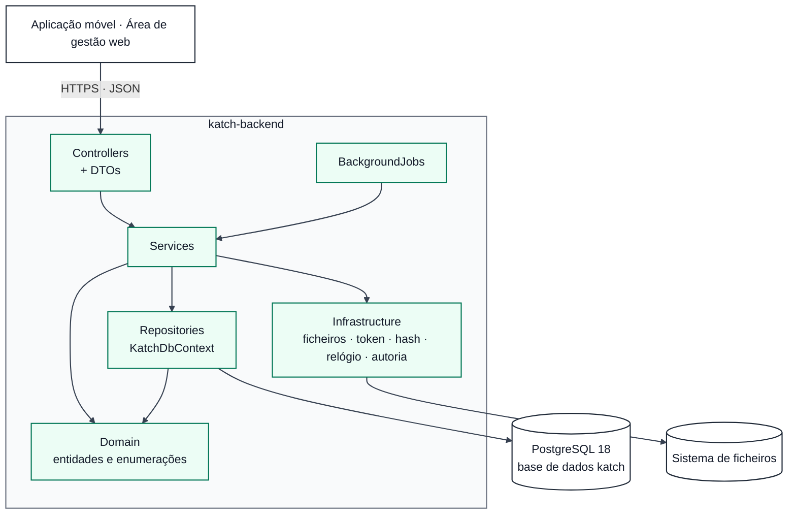

### 2.2. Convenções de código e de diagrama

- **Nomes:** Microsoft C# Coding Conventions (RI, secção 11.3): classes, propriedades e métodos em PascalCase; parâmetros em camelCase; interfaces com o prefixo `I`; métodos assíncronos com o sufixo `Async`. As colunas `snake_case` do modelo de dados resultam do `UseSnakeCaseNamingConvention()` (por exemplo, `PasswordHash` ↔ `password_hash`).
- **Tipos:** `Guid` ↔ `uuid`; `DateTimeOffset` ↔ `timestamptz` (UTC); `decimal` ↔ `numeric`; `short` ↔ `smallint`; `List<T>` de enumeração ou de texto ↔ arrays do PostgreSQL; `T?` = coluna que admite `NULL`.
- **Diagramas Mermaid (`classDiagram`):** `+` público, `-` privado; `$` = método estático; `~T~` = tipo genérico; `<<interface>>`, `<<enumeration>>` e `<<record>>` identificam o estereótipo.
- **Relações:** `--` associação com multiplicidades nas extremidades; `*--` composição (o filho não existe sem o pai); `..>` dependência (uso por injeção de dependências); `..|>` realização de interface.
- **Assíncrono:** as operações de Services e Repositories devolvem `Task` ou `Task<T>`; nos diagramas indica-se apenas o tipo `T`, para facilitar a leitura.

---

## 3. Domínio

As entidades correspondem uma a uma às tabelas do modelo de dados (secção 9 deste documento). As operações das entidades aplicam apenas as regras de estado que dependem da própria linha; as que dependem de outras linhas ficam nos Services (modelo de dados, secções 7.1 e 7.2).

### 3.1. Contas, Empresa e localidades

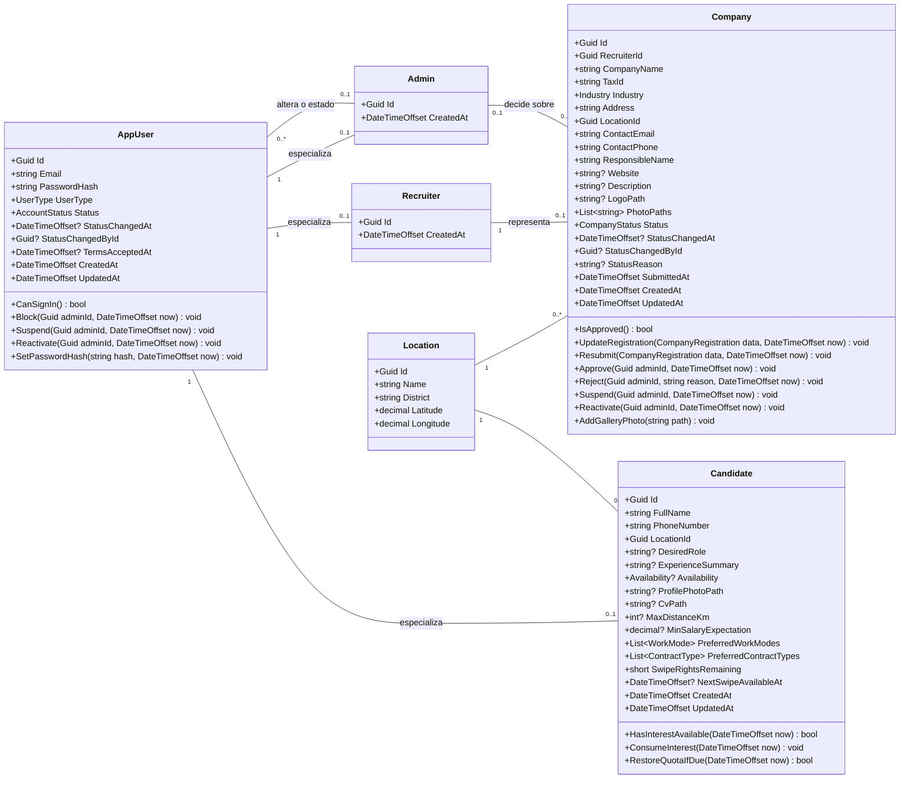

`CompanyRegistration` é um objeto de valor com os oito dados de registo da Empresa (RF041). `UpdateRegistration` rejeita a alteração do NIF com a Empresa aprovada (RF049).

### 3.2. Perfil profissional e listas pré-definidas

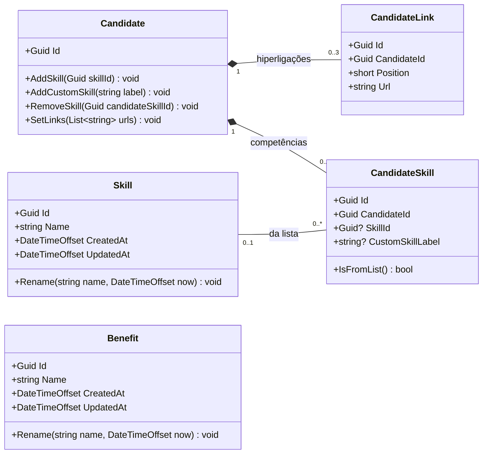

### 3.3. Vagas

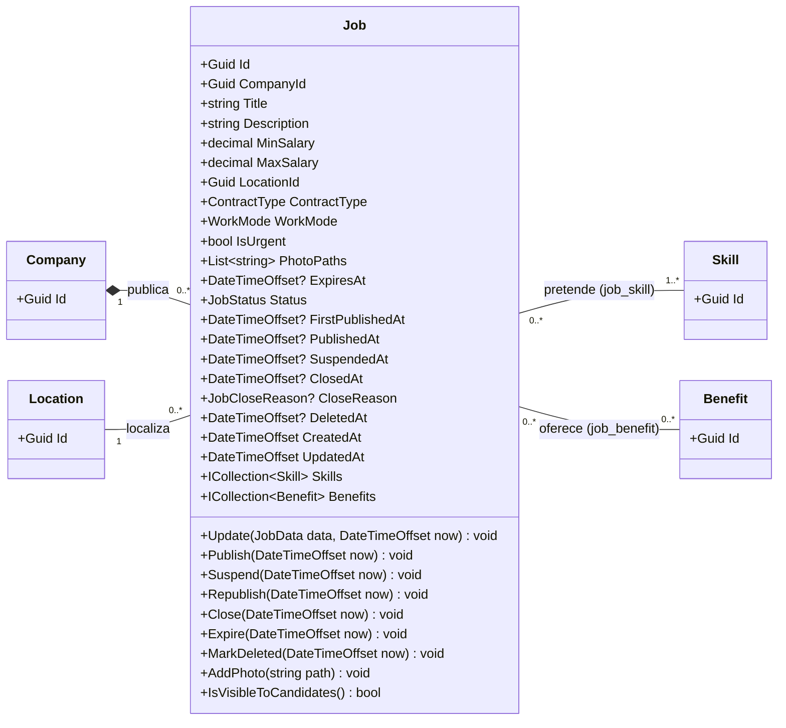

`JobData` é um objeto de valor com os campos da vaga (RF050). As relações N:M com `Skill` e `Benefit` são navegações do Entity Framework Core sobre as tabelas `job_skill` e `job_benefit`, sem classe própria. `IsVisibleToCandidates()` só verifica o estado da vaga e `DeletedAt`; o estado da Empresa é verificado na consulta (RF014).

### 3.4. Resposta a vaga, match, conversa e notificações

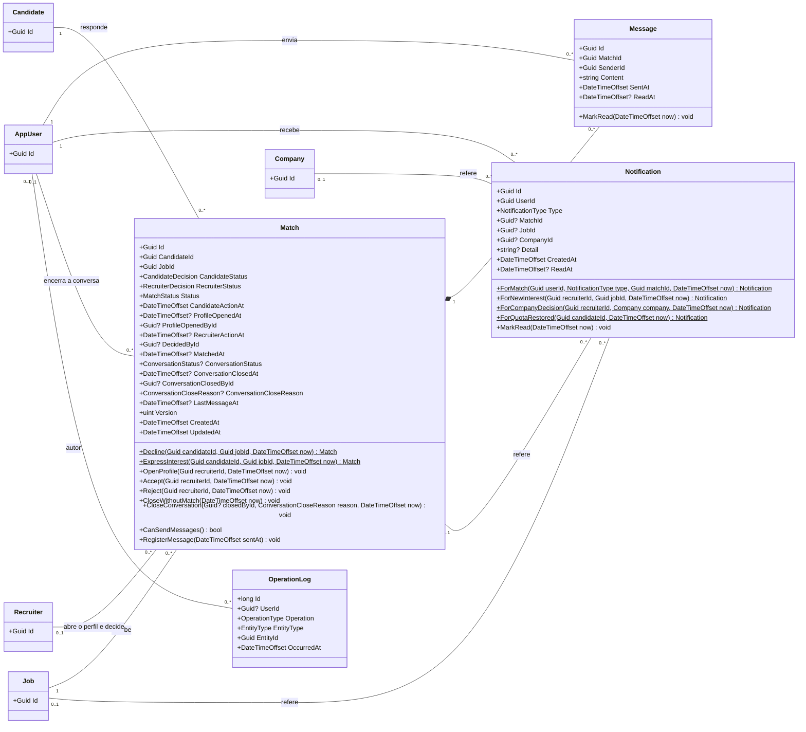

Regras aplicadas pelas operações de `Match` (modelo de dados, secções 6.13 e 7.1; diagrama de estados do interesse e do match):

| Operação | Pré-condição verificada | Efeito | Requisitos |
| --- | --- | --- | --- |
| `Decline` (estática) | — | `DECLINED` / `PENDING` / `REJECTED` | RF018 |
| `ExpressInterest` (estática) | — (a quota é verificada no serviço) | `INTERESTED` / `PENDING` / `WAITING` | RF019, RF113 |
| `OpenProfile` | `Status = WAITING` | Regista a primeira abertura (data e Recrutador) | RF061, RF118 |
| `Accept` | `Status = WAITING` e perfil aberto | `ACCEPTED` / `MATCHED`; abre a conversa (`ConversationStatus = OPEN`) | RF063, RF065, RF066, RF068 |
| `Reject` | `Status = WAITING` e perfil aberto | `DECLINED` / `REJECTED` | RF064, RF065 |
| `CloseWithoutMatch` | `Status = WAITING` | `REJECTED`, mantendo `RecruiterStatus = PENDING` (transição T7, por ratificar) | Decisão da I086 |
| `CloseConversation` | Conversa aberta | `CLOSED`, com data, motivo e autor quando é uma das partes | RF030, RF074, RF075 |
| Qualquer decisão | Decisão já registada | Rejeitada (não altera a decisão) | RF117 |

`Version` é mapeada para a coluna de sistema `xmin` (concorrência otimista, modelo de dados, secção 7.3).

### 3.5. Enumerações

```mermaid
classDiagram
    direction LR
    class UserType {
        <<enumeration>>
        Candidate
        Recruiter
        Admin
    }
    class AccountStatus {
        <<enumeration>>
        Active
        Blocked
        Suspended
    }
    class WorkMode {
        <<enumeration>>
        OnSite
        Hybrid
        Remote
    }
    class ContractType {
        <<enumeration>>
        Permanent
        FixedTerm
        Internship
        ServiceProvision
    }
    class Availability {
        <<enumeration>>
        Immediate
        FifteenDays
        OneMonth
        ToBeAgreed
    }
    class Industry {
        <<enumeration>>
        Technology
        Healthcare
        Retail
        Hospitality
        Construction
        Manufacturing
        Education
        Finance
        Logistics
        Services
        Other
    }
    class CompanyStatus {
        <<enumeration>>
        Pending
        Approved
        Rejected
        Suspended
    }
    class JobStatus {
        <<enumeration>>
        Unpublished
        Published
        Suspended
        Closed
    }
    class JobCloseReason {
        <<enumeration>>
        Manual
        Expired
    }
    class CandidateDecision {
        <<enumeration>>
        Interested
        Declined
    }
    class RecruiterDecision {
        <<enumeration>>
        Pending
        Accepted
        Declined
    }
    class MatchStatus {
        <<enumeration>>
        Waiting
        Matched
        Rejected
    }
    class ConversationStatus {
        <<enumeration>>
        Open
        Closed
    }
    class ConversationCloseReason {
        <<enumeration>>
        ClosedByParty
        AccountBlockedOrSuspended
        CompanySuspended
    }
    class NotificationType {
        <<enumeration>>
        MatchConfirmed
        NewMessage
        NewInterest
        CompanyApproved
        CompanyRejected
        InterestQuotaRestored
    }
    class EntityType {
        <<enumeration>>
        Account
        Company
        Job
        Skill
        Benefit
    }
    class OperationType {
        <<enumeration>>
        CompanySubmitted
        CompanyUpdated
        CompanyApproved
        CompanyRejected
        CompanySuspended
        CompanyReactivated
        JobCreated
        JobPublished
        JobUpdated
        JobSuspended
        JobRepublished
        JobClosed
        JobDeleted
        AccountBlocked
        AccountReactivated
        AccountSuspended
        SkillCreated
        SkillRenamed
        BenefitCreated
        BenefitRenamed
    }
```

Cada enumeração é mapeada para o tipo enumerado do PostgreSQL com o mesmo nome em `snake_case` e os valores em maiúsculas (por exemplo, `ContractType.ServiceProvision` ↔ `'SERVICE_PROVISION'`), através do mapeamento de enumerações do Npgsql.

---

## 4. Repositories

Os repositórios isolam o Entity Framework Core dos Services. O `KatchDbContext` concentra o mapeamento das entidades (convenção `snake_case`, tipos enumerados, arrays, `xmin`, filtro das vagas eliminadas) e funciona como unidade de trabalho.

```mermaid
classDiagram
    direction TB
    class KatchDbContext {
        +DbSet~AppUser~ Users
        +DbSet~Admin~ Admins
        +DbSet~Recruiter~ Recruiters
        +DbSet~Candidate~ Candidates
        +DbSet~Location~ Locations
        +DbSet~CandidateLink~ CandidateLinks
        +DbSet~CandidateSkill~ CandidateSkills
        +DbSet~Skill~ Skills
        +DbSet~Benefit~ Benefits
        +DbSet~Company~ Companies
        +DbSet~Job~ Jobs
        +DbSet~Match~ Matches
        +DbSet~Message~ Messages
        +DbSet~Notification~ Notifications
        +DbSet~OperationLog~ OperationLogs
        #OnModelCreating(ModelBuilder modelBuilder) void
    }
    class IUnitOfWork {
        <<interface>>
        +SaveChangesAsync() int
        +BeginTransactionAsync() IDbContextTransaction
    }
    class IUserRepository {
        <<interface>>
        +GetByIdAsync(Guid id) AppUser?
        +GetByEmailAsync(string email) AppUser?
        +EmailExistsAsync(string email) bool
        +AddAsync(AppUser user) void
        +ListAsync(AccountFilter filter) List~AppUser~
        +CountActiveCandidatesAtAsync(DateTimeOffset at) int
    }
    class ICandidateRepository {
        <<interface>>
        +GetWithProfileAsync(Guid id) Candidate?
        +AddAsync(Candidate candidate) void
        +ListForAdminAsync() List~Candidate~
        +ListQuotaDueAsync(DateTimeOffset now) List~Candidate~
    }
    class ICompanyRepository {
        <<interface>>
        +GetByIdAsync(Guid id) Company?
        +GetByRecruiterAsync(Guid recruiterId) Company?
        +TaxIdExistsAsync(string taxId, Guid? exceptId) bool
        +AddAsync(Company company) void
        +ListPendingAsync() List~Company~
        +ListAllWithPublishedCountAsync() List~CompanyWithCount~
        +CountByStatusAtAsync(CompanyStatus status, DateTimeOffset at) int
    }
    class IJobRepository {
        <<interface>>
        +GetByIdAsync(Guid id) Job?
        +AddAsync(Job job) void
        +ListByCompanyAsync(Guid companyId) List~Job~
        +ListEligibleForCandidateAsync(Candidate candidate, int take) List~Job~
        +ListPublishedWithInterestCountAsync() List~JobWithCount~
        +ListExpiredAsync(DateTimeOffset now) List~Job~
        +HasInterestsAsync(Guid jobId) bool
        +CountFirstPublishedAsync(DateTimeOffset from, DateTimeOffset to) int
    }
    class IMatchRepository {
        <<interface>>
        +GetByIdAsync(Guid id) Match?
        +GetAsync(Guid candidateId, Guid jobId) Match?
        +AddAsync(Match match) void
        +ListWaitingByJobAsync(Guid jobId) List~Match~
        +ListWaitingByCandidateAsync(Guid candidateId) List~Match~
        +ListWaitingByCompanyAsync(Guid companyId) List~Match~
        +ListMatchesByCandidateAsync(Guid candidateId) List~Match~
        +ListMatchesByCompanyAsync(Guid companyId) List~Match~
        +ListOpenConversationsByUserAsync(Guid userId) List~Match~
        +ListDeclinedByJobAsync(Guid jobId) List~Match~
        +CountInterestsAsync(DateTimeOffset from, DateTimeOffset to) int
        +CountMatchesAsync(DateTimeOffset from, DateTimeOffset to) int
    }
    class IMessageRepository {
        <<interface>>
        +AddAsync(Message message) void
        +ListByMatchAsync(Guid matchId) List~Message~
        +ListSinceAsync(Guid matchId, DateTimeOffset since) List~Message~
        +MarkReadAsync(Guid matchId, Guid readerId, DateTimeOffset now) int
        +CountUnreadAsync(Guid matchId, Guid readerId) int
        +CountConversationsStartedAsync(DateTimeOffset from, DateTimeOffset to) int
    }
    class INotificationRepository {
        <<interface>>
        +GetByIdAsync(Guid id) Notification?
        +AddAsync(Notification notification) void
        +ListByUserAsync(Guid userId) List~Notification~
        +ListSinceAsync(Guid userId, DateTimeOffset since) List~Notification~
        +CountUnreadAsync(Guid userId) int
    }
    class IReferenceDataRepository {
        <<interface>>
        +ListLocationsAsync() List~Location~
        +ListSkillsAsync() List~Skill~
        +ListBenefitsAsync() List~Benefit~
        +GetSkillAsync(Guid id) Skill?
        +GetBenefitAsync(Guid id) Benefit?
        +SkillNameExistsAsync(string name, Guid? exceptId) bool
        +BenefitNameExistsAsync(string name, Guid? exceptId) bool
        +AddSkillAsync(Skill skill) void
        +AddBenefitAsync(Benefit benefit) void
    }
    class IOperationLogRepository {
        <<interface>>
        +AddAsync(OperationLog entry) void
    }
    class JobRepository {
        -KatchDbContext _context
    }
    class MatchRepository {
        -KatchDbContext _context
    }
    KatchDbContext ..|> IUnitOfWork
    JobRepository ..|> IJobRepository
    MatchRepository ..|> IMatchRepository
    JobRepository "1" --> "1" KatchDbContext : usa
    MatchRepository "1" --> "1" KatchDbContext : usa
```

Cada interface tem uma implementação com o mesmo nome sem o prefixo `I` (`UserRepository`, `CandidateRepository`, `CompanyRepository`, `JobRepository`, `MatchRepository`, `MessageRepository`, `NotificationRepository`, `ReferenceDataRepository`, `OperationLogRepository`), que recebe o `KatchDbContext` por injeção de dependências. O diagrama mostra duas, como exemplo da relação. `CompanyWithCount` e `JobWithCount` são projeções de leitura (entidade e contagem) usadas nas listas do Administrador (RF097, RF098).

Regras das consultas:

- `ListEligibleForCandidateAsync` aplica no SQL os filtros do RF014 que não dependem da distância: vaga publicada e não eliminada, Empresa aprovada, sem resposta anterior do Candidato, intervalo salarial, regimes e tipos de contrato. O filtro de distância é aplicado no serviço (secção 5).
- O filtro global de consulta do `KatchDbContext` exclui as vagas com `DeletedAt` preenchido (modelo de dados, DM-09).
- `CountActiveCandidatesAtAsync` e `CountByStatusAtAsync` calculam o estado das contas e das Empresas na data final do período a partir do estado atual e das linhas do `operation_log` posteriores a essa data (modelo de dados, índices `ix_operation_log_*`; RF096). As restantes contagens do RF096 usam `job.first_published_at`, `match.candidate_action_at`, `match.matched_at` e a primeira mensagem de cada conversa.
- `ListSinceAsync` (mensagens e notificações) devolve apenas os elementos criados depois do instante indicado, para a consulta periódica (arquitetura, secção 2.4).

---

## 5. Services e infraestrutura

### 5.1. Serviços de negócio

```mermaid
classDiagram
    direction LR
    class IAuthService {
        <<interface>>
        +RegisterCandidateAsync(RegisterCandidateRequest request) LoginResponse
        +CreateRecruiterAccountAsync(CreateRecruiterAccountRequest request) LoginResponse
        +LoginAsync(LoginRequest request, ClientApp app) LoginResponse
        +ChangePasswordAsync(Guid userId, ChangePasswordRequest request) void
    }
    class ICandidateProfileService {
        <<interface>>
        +GetAsync(Guid candidateId) CandidateProfileDto
        +UpdateAsync(Guid candidateId, UpdateCandidateProfileRequest request) CandidateProfileDto
        +UpdatePreferencesAsync(Guid candidateId, SearchPreferencesDto request) SearchPreferencesDto
        +AddSkillAsync(Guid candidateId, AddSkillRequest request) CandidateProfileDto
        +RemoveSkillAsync(Guid candidateId, Guid candidateSkillId) void
        +SetLinksAsync(Guid candidateId, SetLinksRequest request) CandidateProfileDto
        +UploadPhotoAsync(Guid candidateId, IFormFile file) string
        +UploadCvAsync(Guid candidateId, IFormFile file) string
    }
    class IJobExplorationService {
        <<interface>>
        +GetNextCardAsync(Guid candidateId) JobCardDto?
        +GetDetailAsync(Guid candidateId, Guid jobId) JobDetailDto
        +GetCompanyPageAsync(Guid companyId) CompanyPageDto
        +DeclineAsync(Guid candidateId, Guid jobId) void
        +ExpressInterestAsync(Guid candidateId, Guid jobId) QuotaDto
        +GetQuotaAsync(Guid candidateId) QuotaDto
    }
    class ICompanyService {
        <<interface>>
        +RegisterAsync(Guid recruiterId, CompanyRegistrationRequest request) CompanyStatusDto
        +ResubmitAsync(Guid recruiterId, CompanyRegistrationRequest request) CompanyStatusDto
        +GetStatusAsync(Guid recruiterId) CompanyStatusDto
        +UpdateRegistrationAsync(Guid recruiterId, CompanyRegistrationRequest request) CompanyStatusDto
        +UpdatePageAsync(Guid recruiterId, CompanyPageRequest request) CompanyPageDto
        +UploadLogoAsync(Guid recruiterId, IFormFile file) string
        +AddGalleryPhotoAsync(Guid recruiterId, IFormFile file) string
    }
    class IJobService {
        <<interface>>
        +CreateAsync(Guid recruiterId, JobRequest request) JobDto
        +UpdateAsync(Guid recruiterId, Guid jobId, JobRequest request) JobDto
        +PublishAsync(Guid recruiterId, Guid jobId) JobDto
        +SuspendAsync(Guid recruiterId, Guid jobId) JobDto
        +RepublishAsync(Guid recruiterId, Guid jobId) JobDto
        +CloseAsync(Guid recruiterId, Guid jobId) JobDto
        +DeleteAsync(Guid recruiterId, Guid jobId) void
        +AddPhotoAsync(Guid recruiterId, Guid jobId, IFormFile file) string
        +ListOwnAsync(Guid recruiterId) List~JobDto~
        +CloseExpiredAsync() int
    }
    class ICandidateEvaluationService {
        <<interface>>
        +ListWaitingAsync(Guid recruiterId, Guid jobId) List~WaitingCandidateDto~
        +OpenProfileAsync(Guid recruiterId, Guid matchId) CandidateFullProfileDto
        +GetCvAsync(Guid recruiterId, Guid matchId) Stream
        +AcceptAsync(Guid recruiterId, Guid matchId) MatchDto
        +RejectAsync(Guid recruiterId, Guid matchId) void
    }
    class IMatchService {
        <<interface>>
        +ListForCandidateAsync(Guid candidateId) List~MatchDto~
        +ListForRecruiterAsync(Guid recruiterId) List~MatchDto~
    }
    class IConversationService {
        <<interface>>
        +ListAsync(Guid userId) List~ConversationSummaryDto~
        +OpenAsync(Guid userId, Guid matchId) List~MessageDto~
        +ListNewAsync(Guid userId, Guid matchId, DateTimeOffset since) List~MessageDto~
        +SendAsync(Guid userId, Guid matchId, SendMessageRequest request) MessageDto
        +CloseAsync(Guid userId, Guid matchId) void
    }
    class INotificationService {
        <<interface>>
        +ListAsync(Guid userId) NotificationListDto
        +ListNewAsync(Guid userId, DateTimeOffset since) List~NotificationDto~
        +MarkReadAsync(Guid userId, Guid notificationId) int
        +AddAsync(Notification notification) void
    }
    class IAccountAdminService {
        <<interface>>
        +ListAccountsAsync() List~AccountDto~
        +ListCandidatesAsync() List~CandidateAdminDto~
        +BlockAsync(Guid adminId, Guid userId) void
        +SuspendCandidateAsync(Guid adminId, Guid candidateId) void
        +ReactivateAsync(Guid adminId, Guid userId) void
    }
    class ICompanyAdminService {
        <<interface>>
        +ListPendingAsync() List~PendingCompanyDto~
        +GetSubmittedDataAsync(Guid companyId) CompanyRegistrationDto
        +ApproveAsync(Guid adminId, Guid companyId) void
        +RejectAsync(Guid adminId, Guid companyId, RejectCompanyRequest request) void
        +SuspendAsync(Guid adminId, Guid companyId) void
        +ReactivateAsync(Guid adminId, Guid companyId) void
        +ListCompaniesAsync() List~CompanyAdminDto~
        +ListPublishedJobsAsync() List~PublishedJobAdminDto~
    }
    class IIndicatorService {
        <<interface>>
        +GetAsync(DateOnly from, DateOnly to) IndicatorsDto
    }
    class IReferenceListService {
        <<interface>>
        +ListLocationsAsync() List~ReferenceItemDto~
        +ListSkillsAsync() List~ReferenceItemDto~
        +ListBenefitsAsync() List~ReferenceItemDto~
        +AddSkillAsync(Guid adminId, ReferenceItemRequest request) ReferenceItemDto
        +RenameSkillAsync(Guid adminId, Guid skillId, ReferenceItemRequest request) ReferenceItemDto
        +AddBenefitAsync(Guid adminId, ReferenceItemRequest request) ReferenceItemDto
        +RenameBenefitAsync(Guid adminId, Guid benefitId, ReferenceItemRequest request) ReferenceItemDto
    }
    class IQuotaService {
        <<interface>>
        +RestoreDueQuotasAsync() int
    }
```

Cada interface tem uma implementação com o mesmo nome sem o prefixo `I` (por exemplo, `CandidateEvaluationService`), registada no contentor de injeção de dependências com tempo de vida `Scoped`. As dependências de cada implementação estão na secção 5.3.

### 5.2. Infraestrutura e tarefas periódicas

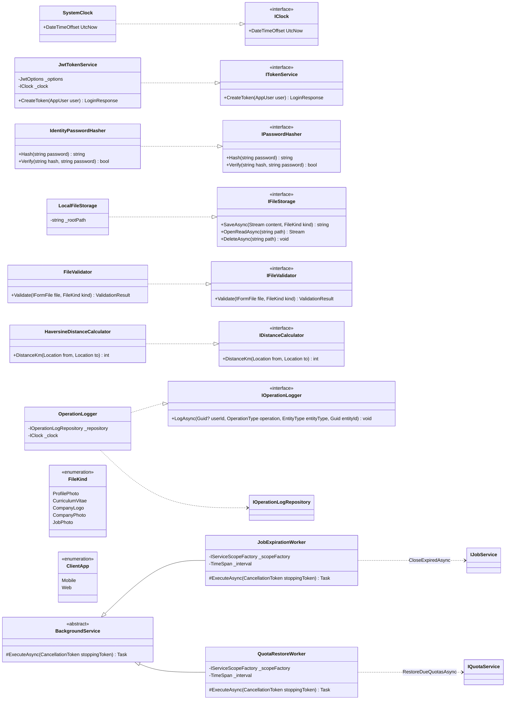

| Classe | Responsabilidade | Requisitos |
| --- | --- | --- |
| `SystemClock` (`IClock`) | Fornece a data e hora atual em UTC. Nos testes é substituído por um relógio simulado, para verificar o período de bloqueio e a expiração da credencial de sessão. | RF020, RF021, RNF005 |
| `JwtTokenService` | Emite a credencial de sessão (JWT) com o identificador e o tipo de conta e validade de 8 horas. O segredo vem de variável de ambiente ou GitHub Secrets. | RNF004, RNF005; RI 14.2 |
| `IdentityPasswordHasher` | Calcula e verifica o resumo das palavras-passe com valor aleatório por conta (`PasswordHasher` do ASP.NET Core Identity). | RNF003 |
| `LocalFileStorage` | Guarda e lê os ficheiros no sistema de ficheiros do servidor e devolve o caminho a guardar na base de dados. | Arquitetura, AD-01 |
| `FileValidator` | Valida o formato real (assinatura do ficheiro), a extensão e a dimensão de cada tipo de ficheiro. | P01, P02, RNF016 |
| `HaversineDistanceCalculator` | Calcula a distância em linha reta entre duas localidades, em km arredondados às unidades. | RF015 |
| `OperationLogger` | Insere uma linha no `operation_log` por cada operação do RF112. | RF112 |
| `JobExpirationWorker` | Executa periodicamente o encerramento das vagas publicadas com data-limite atingida. | RF057 |
| `QuotaRestoreWorker` | Executa periodicamente a reposição das quotas cujo período de bloqueio terminou, com a notificação. | RF021, RF033 |

### 5.3. Dependências dos serviços

```mermaid
classDiagram
    direction LR
    class AuthService
    class CandidateProfileService
    class JobExplorationService
    class CompanyService
    class JobService
    class CandidateEvaluationService
    class ConversationService
    class NotificationService
    class AccountAdminService
    class CompanyAdminService
    class MatchService
    class IndicatorService
    class ReferenceListService
    class QuotaService
    AuthService ..> IUserRepository
    AuthService ..> ICandidateRepository
    AuthService ..> IPasswordHasher
    AuthService ..> ITokenService
    CandidateProfileService ..> ICandidateRepository
    CandidateProfileService ..> IReferenceDataRepository
    CandidateProfileService ..> IFileStorage
    CandidateProfileService ..> IFileValidator
    JobExplorationService ..> ICandidateRepository
    JobExplorationService ..> IJobRepository
    JobExplorationService ..> ICompanyRepository
    JobExplorationService ..> IMatchRepository
    JobExplorationService ..> IDistanceCalculator
    JobExplorationService ..> INotificationService
    CompanyService ..> ICompanyRepository
    CompanyService ..> IFileStorage
    CompanyService ..> IFileValidator
    CompanyService ..> IOperationLogger
    JobService ..> IJobRepository
    JobService ..> ICompanyRepository
    JobService ..> IMatchRepository
    JobService ..> IFileStorage
    JobService ..> IFileValidator
    JobService ..> IOperationLogger
    CandidateEvaluationService ..> IMatchRepository
    CandidateEvaluationService ..> ICompanyRepository
    CandidateEvaluationService ..> IFileStorage
    CandidateEvaluationService ..> INotificationService
    ConversationService ..> IMatchRepository
    ConversationService ..> IMessageRepository
    ConversationService ..> INotificationService
    NotificationService ..> INotificationRepository
    AccountAdminService ..> IUserRepository
    AccountAdminService ..> ICandidateRepository
    AccountAdminService ..> IMatchRepository
    AccountAdminService ..> IOperationLogger
    CompanyAdminService ..> ICompanyRepository
    CompanyAdminService ..> IJobRepository
    CompanyAdminService ..> IMatchRepository
    CompanyAdminService ..> INotificationService
    CompanyAdminService ..> IOperationLogger
    IndicatorService ..> IUserRepository
    IndicatorService ..> ICompanyRepository
    IndicatorService ..> IJobRepository
    IndicatorService ..> IMatchRepository
    IndicatorService ..> IMessageRepository
    ReferenceListService ..> IReferenceDataRepository
    ReferenceListService ..> IOperationLogger
    MatchService ..> IMatchRepository
    QuotaService ..> ICandidateRepository
    QuotaService ..> INotificationService
```

Todos os serviços que alteram dados dependem também de `IUnitOfWork` e de `IClock`; essas dependências não são desenhadas para não sobrecarregar o diagrama.

| Serviço | Responsabilidade | Casos de uso | Requisitos |
| --- | --- | --- | --- |
| `AuthService` | Registo de Candidato com validação automática e ativação imediata; criação de conta de Recrutador; início de sessão com mensagem única para credenciais erradas e rejeição de contas bloqueadas ou suspensas; alteração da palavra-passe. | UC01, UC02, UC03, UC07 | RF001 a RF005, RF037, RF038, RF040, RF083, RF084; RNF003, RNF009 |
| `CandidateProfileService` | Perfil profissional, preferências de procura (também a partir da área de exploração), competências da lista e «Outro», hiperligações, fotografia e CV. | UC04, UC05 | RF006 a RF012, RF023 |
| `JobExplorationService` | Cartão de vaga seguinte com o filtro do RF014 e a distância; detalhe da vaga e página da Empresa; recusa e interesse (verificação da quota, uma resposta por vaga), com notificação de novo interesse. O autor e a data do interesse e da recusa ficam na própria linha de `match`, e não no `operation_log` (modelo de dados, tipo `operation_type`). | UC05, UC06 | RF013 a RF022, RF076, RF112; RNF002 |
| `CompanyService` | Registo, nova submissão e alteração da Empresa (NIF único e imutável depois da aprovação), estado do pedido, página de apresentação, logótipo e galeria. | UC07, UC08 | RF039, RF041 a RF049, RF112 |
| `JobService` | Criação, alteração, publicação, suspensão, nova publicação, encerramento e eliminação lógica de vagas da própria Empresa; fotografias; encerramento automático. Ao suspender ou encerrar, encerra os interesses em espera (T7, se ratificada). | UC09, UC10 | RF050 a RF059, RF114, RF115, RF112 |
| `CandidateEvaluationService` | Lista de candidatos em espera; abertura do perfil completo com registo; acesso ao CV; aceitação (match, conversa e duas notificações numa transação) e recusa. | UC11, UC12 | RF060 a RF066, RF068, RF031, RF077, RF117, RF118; RNF007 |
| `MatchService` | Listas de matches do Candidato e da Empresa, com os contactos. | UC13 | RF024, RF025, RF067 |
| `ConversationService` | Lista de conversas com mensagens por ler, histórico com marcação de leitura ao abrir, mensagens novas desde a última consulta, envio (só com match e conversa aberta) com notificação, encerramento. Nenhuma operação para o Administrador. | UC14 | RF026 a RF030, RF069 a RF074, RF108, RF109, RF032, RF078, RF103 |
| `NotificationService` | Área de notificações, contador de não lidas, notificações novas desde a última consulta, marcação como lida e criação de notificações pelos outros serviços. | UC15 | RF034 a RF036, RF080 a RF082, RF110, RF111 |
| `AccountAdminService` | Listas de contas e de Candidatos; bloqueio, suspensão e reativação, com passagem das conversas a só de consulta e registo de autoria. | UC18 | RF085 a RF090, RF075, RF112 |
| `CompanyAdminService` | Empresas pendentes e dados submetidos; aprovação e recusa com motivo (com notificação); suspensão (conversas a só de consulta) e reativação; listas globais de Empresas e de vagas publicadas. | UC16, UC17 | RF091 a RF095, RF097, RF098, RF116, RF079, RF075, RF112 |
| `IndicatorService` | Os sete indicadores do período, só com contagens e sem acesso ao texto das mensagens. | UC19 | RF096, RF103, RF104 |
| `ReferenceListService` | Listas pré-definidas: consulta de localidades, competências e benefícios; acrescento e alteração de designações pelo Administrador. | UC20 | RF099 a RF102, RF112 |
| `QuotaService` | Reposição integral das quotas no fim do período de bloqueio, com a notificação. | UC05 | RF021, RF033 |

---

## 6. Controllers

```mermaid
classDiagram
    direction LR
    class ControllerBase {
        <<abstract>>
    }
    class AuthController {
        -IAuthService _authService
        +RegisterCandidate(RegisterCandidateRequest request) ActionResult~LoginResponse~
        +CreateRecruiterAccount(CreateRecruiterAccountRequest request) ActionResult~LoginResponse~
        +Login(LoginRequest request) ActionResult~LoginResponse~
        +Logout() IActionResult
        +ChangePassword(ChangePasswordRequest request) IActionResult
    }
    class CandidateProfileController {
        -ICandidateProfileService _profileService
        +Get() ActionResult~CandidateProfileDto~
        +Update(UpdateCandidateProfileRequest request) ActionResult~CandidateProfileDto~
        +UpdatePreferences(SearchPreferencesDto request) ActionResult~SearchPreferencesDto~
        +AddSkill(AddSkillRequest request) ActionResult~CandidateProfileDto~
        +RemoveSkill(Guid candidateSkillId) IActionResult
        +SetLinks(SetLinksRequest request) ActionResult~CandidateProfileDto~
        +UploadPhoto(IFormFile file) IActionResult
        +UploadCv(IFormFile file) IActionResult
    }
    class JobExplorationController {
        -IJobExplorationService _explorationService
        +GetNextCard() ActionResult~JobCardDto~
        +GetDetail(Guid jobId) ActionResult~JobDetailDto~
        +GetCompanyPage(Guid companyId) ActionResult~CompanyPageDto~
        +Decline(Guid jobId) IActionResult
        +ExpressInterest(Guid jobId) ActionResult~QuotaDto~
        +GetQuota() ActionResult~QuotaDto~
    }
    class CompanyController {
        -ICompanyService _companyService
        +Register(CompanyRegistrationRequest request) ActionResult~CompanyStatusDto~
        +Resubmit(CompanyRegistrationRequest request) ActionResult~CompanyStatusDto~
        +GetStatus() ActionResult~CompanyStatusDto~
        +UpdateRegistration(CompanyRegistrationRequest request) ActionResult~CompanyStatusDto~
        +UpdatePage(CompanyPageRequest request) ActionResult~CompanyPageDto~
        +UploadLogo(IFormFile file) IActionResult
        +AddGalleryPhoto(IFormFile file) IActionResult
    }
    class JobsController {
        -IJobService _jobService
        +List() ActionResult~List~JobDto~~
        +Create(JobRequest request) ActionResult~JobDto~
        +Update(Guid jobId, JobRequest request) ActionResult~JobDto~
        +Publish(Guid jobId) ActionResult~JobDto~
        +Suspend(Guid jobId) ActionResult~JobDto~
        +Republish(Guid jobId) ActionResult~JobDto~
        +Close(Guid jobId) ActionResult~JobDto~
        +Delete(Guid jobId) IActionResult
        +AddPhoto(Guid jobId, IFormFile file) IActionResult
    }
    class CandidateEvaluationController {
        -ICandidateEvaluationService _evaluationService
        +ListWaiting(Guid jobId) ActionResult~List~WaitingCandidateDto~~
        +OpenProfile(Guid matchId) ActionResult~CandidateFullProfileDto~
        +GetCv(Guid matchId) IActionResult
        +Accept(Guid matchId) ActionResult~MatchDto~
        +Reject(Guid matchId) IActionResult
    }
    class MatchesController {
        -IMatchService _matchService
        +List() ActionResult~List~MatchDto~~
    }
    class ConversationsController {
        -IConversationService _conversationService
        +List() ActionResult~List~ConversationSummaryDto~~
        +Open(Guid matchId) ActionResult~List~MessageDto~~
        +ListNew(Guid matchId, DateTimeOffset since) ActionResult~List~MessageDto~~
        +Send(Guid matchId, SendMessageRequest request) ActionResult~MessageDto~
        +Close(Guid matchId) IActionResult
    }
    class NotificationsController {
        -INotificationService _notificationService
        +List() ActionResult~NotificationListDto~
        +ListNew(DateTimeOffset since) ActionResult~List~NotificationDto~~
        +MarkRead(Guid notificationId) IActionResult
    }
    class AdminAccountsController {
        -IAccountAdminService _accountAdminService
        +ListAccounts() ActionResult~List~AccountDto~~
        +ListCandidates() ActionResult~List~CandidateAdminDto~~
        +Block(Guid userId) IActionResult
        +SuspendCandidate(Guid candidateId) IActionResult
        +Reactivate(Guid userId) IActionResult
    }
    class AdminCompaniesController {
        -ICompanyAdminService _companyAdminService
        +ListPending() ActionResult~List~PendingCompanyDto~~
        +GetSubmittedData(Guid companyId) ActionResult~CompanyRegistrationDto~
        +Approve(Guid companyId) IActionResult
        +Reject(Guid companyId, RejectCompanyRequest request) IActionResult
        +Suspend(Guid companyId) IActionResult
        +Reactivate(Guid companyId) IActionResult
        +ListCompanies() ActionResult~List~CompanyAdminDto~~
        +ListPublishedJobs() ActionResult~List~PublishedJobAdminDto~~
    }
    class AdminIndicatorsController {
        -IIndicatorService _indicatorService
        +Get(DateOnly from, DateOnly to) ActionResult~IndicatorsDto~
    }
    class ReferenceListsController {
        -IReferenceListService _referenceListService
        +ListLocations() ActionResult~List~ReferenceItemDto~~
        +ListSkills() ActionResult~List~ReferenceItemDto~~
        +ListBenefits() ActionResult~List~ReferenceItemDto~~
        +AddSkill(ReferenceItemRequest request) ActionResult~ReferenceItemDto~
        +RenameSkill(Guid skillId, ReferenceItemRequest request) ActionResult~ReferenceItemDto~
        +AddBenefit(ReferenceItemRequest request) ActionResult~ReferenceItemDto~
        +RenameBenefit(Guid benefitId, ReferenceItemRequest request) ActionResult~ReferenceItemDto~
    }
    ControllerBase <|-- AuthController
    ControllerBase <|-- CandidateProfileController
    ControllerBase <|-- JobExplorationController
    ControllerBase <|-- CompanyController
    ControllerBase <|-- JobsController
    ControllerBase <|-- CandidateEvaluationController
    ControllerBase <|-- MatchesController
    ControllerBase <|-- ConversationsController
    ControllerBase <|-- NotificationsController
    ControllerBase <|-- AdminAccountsController
    ControllerBase <|-- AdminCompaniesController
    ControllerBase <|-- AdminIndicatorsController
    ControllerBase <|-- ReferenceListsController
    AuthController "1" ..> "1" IAuthService
    CandidateProfileController "1" ..> "1" ICandidateProfileService
    JobExplorationController "1" ..> "1" IJobExplorationService
    CompanyController "1" ..> "1" ICompanyService
    JobsController "1" ..> "1" IJobService
    CandidateEvaluationController "1" ..> "1" ICandidateEvaluationService
    MatchesController "1" ..> "1" IMatchService
    ConversationsController "1" ..> "1" IConversationService
    NotificationsController "1" ..> "1" INotificationService
    AdminAccountsController "1" ..> "1" IAccountAdminService
    AdminCompaniesController "1" ..> "1" ICompanyAdminService
    AdminIndicatorsController "1" ..> "1" IIndicatorService
    ReferenceListsController "1" ..> "1" IReferenceListService
```

O identificador do utilizador (`userId`, `candidateId`, `recruiterId`, `adminId`) é sempre obtido da credencial de sessão, nunca do corpo do pedido (RNF006).

| Controller | Rota base | Autorização | Casos de uso |
| --- | --- | --- | --- |
| `AuthController` | `/api/auth` | Registo, criação de conta e início de sessão sem credencial; fim de sessão e alteração da palavra-passe com qualquer tipo de conta | UC01, UC02, UC03, UC07 |
| `CandidateProfileController` | `/api/candidate/profile` | Candidato | UC04 |
| `JobExplorationController` | `/api/candidate/jobs` | Candidato | UC05, UC06 |
| `CompanyController` | `/api/recruiter/company` | Recrutador; página e logótipo também exigem Empresa aprovada | UC07, UC08 |
| `JobsController` | `/api/recruiter/jobs` | Recrutador com Empresa aprovada | UC09, UC10 |
| `CandidateEvaluationController` | `/api/recruiter` | Recrutador com Empresa aprovada | UC11, UC12 |
| `MatchesController` | `/api/matches` | Candidato ou Recrutador | UC13 |
| `ConversationsController` | `/api/conversations` | Candidato ou Recrutador (o Administrador é rejeitado) | UC14 |
| `NotificationsController` | `/api/notifications` | Candidato ou Recrutador | UC15 |
| `AdminAccountsController` | `/api/admin/accounts` | Administrador (RF104) | UC18 |
| `AdminCompaniesController` | `/api/admin/companies` | Administrador (RF104) | UC16, UC17 |
| `AdminIndicatorsController` | `/api/admin/indicators` | Administrador (RF104) | UC19 |
| `ReferenceListsController` | `/api/reference-lists` | Consulta com sessão iniciada; acrescento e alteração só pelo Administrador | UC20 |

A autorização usa atributos `[Authorize(Roles = …)]` com o tipo de conta da credencial de sessão (RF104). Em cada pedido autenticado, o backend confirma na base de dados que a conta continua ativa e rejeita as contas bloqueadas ou suspensas (RF086, RF089). A política `ApprovedCompany` confirma também o estado da Empresa em cada operação reservada (arquitetura, secção 2.6; RF039; RNF004, RNF006).

O fim de sessão (RF105 a RF107) não altera dados no servidor, porque a autenticação não guarda estado de sessão (arquitetura, secção 2.6): o cliente descarta a credencial e passa a exigir novo início de sessão, e `Logout` apenas confirma o pedido. As rotas e os formatos detalhados são definidos na documentação da API (`04.11`).

---

## 7. DTOs

Os DTOs são `record` imutáveis, sem lógica, validados pelos atributos de validação do ASP.NET Core e, de novo, nos serviços (RNF008). Não expõem entidades nem colunas internas (por exemplo, `PasswordHash`, `CvPath` ou `Version`).

### 7.1. DTOs principais

```mermaid
classDiagram
    direction LR
    class RegisterCandidateRequest {
        <<record>>
        +string FullName
        +string Email
        +string PhoneNumber
        +Guid LocationId
        +string Password
        +bool AcceptTerms
    }
    class LoginRequest {
        <<record>>
        +string Email
        +string Password
    }
    class LoginResponse {
        <<record>>
        +string Token
        +DateTimeOffset ExpiresAt
        +UserType UserType
        +Guid UserId
    }
    class JobCardDto {
        <<record>>
        +Guid JobId
        +string Title
        +string CompanyName
        +string? LogoUrl
        +decimal MinSalary
        +decimal MaxSalary
        +string LocationName
        +int DistanceKm
        +ContractType ContractType
        +WorkMode WorkMode
        +bool IsUrgent
        +List~string~ PhotoUrls
    }
    class JobDetailDto {
        <<record>>
        +JobCardDto Card
        +string Description
        +List~string~ Skills
        +List~string~ Benefits
        +Guid CompanyId
    }
    class QuotaDto {
        <<record>>
        +int Available
        +DateTimeOffset? BlockedUntil
    }
    class WaitingCandidateDto {
        <<record>>
        +Guid MatchId
        +Guid CandidateId
        +string FullName
        +DateTimeOffset InterestAt
    }
    class CandidateFullProfileDto {
        <<record>>
        +Guid MatchId
        +string FullName
        +string? PhotoUrl
        +string? DesiredRole
        +string LocationName
        +Availability? Availability
        +string? ExperienceSummary
        +List~string~ Links
        +List~SkillTagDto~ Skills
        +bool HasCv
    }
    class SkillTagDto {
        <<record>>
        +string Name
        +bool MatchesJob
    }
    class MatchDto {
        <<record>>
        +Guid MatchId
        +string JobTitle
        +string CompanyName
        +string CounterpartName
        +string ContactEmail
        +string ContactPhone
        +DateTimeOffset MatchedAt
    }
    class MessageDto {
        <<record>>
        +Guid MessageId
        +Guid SenderId
        +string Content
        +DateTimeOffset SentAt
        +DateTimeOffset? ReadAt
    }
    class SendMessageRequest {
        <<record>>
        +string Content
    }
    class NotificationDto {
        <<record>>
        +Guid NotificationId
        +NotificationType Type
        +string Text
        +Guid? TargetId
        +DateTimeOffset CreatedAt
        +bool IsRead
    }
    class CompanyRegistrationRequest {
        <<record>>
        +string CompanyName
        +string TaxId
        +Industry Industry
        +string Address
        +Guid LocationId
        +string ContactEmail
        +string ContactPhone
        +string ResponsibleName
    }
    class JobRequest {
        <<record>>
        +string Title
        +string Description
        +decimal MinSalary
        +decimal MaxSalary
        +Guid LocationId
        +ContractType ContractType
        +WorkMode WorkMode
        +List~Guid~ SkillIds
        +List~Guid~ BenefitIds
        +bool IsUrgent
        +DateTimeOffset? ExpiresAt
    }
    class RejectCompanyRequest {
        <<record>>
        +string Reason
    }
    class IndicatorsDto {
        <<record>>
        +int ActiveCandidates
        +int ApprovedCompanies
        +int PendingCompanies
        +int JobsFirstPublished
        +int InterestsExpressed
        +int MatchesConfirmed
        +int ConversationsStarted
    }
    class ApiErrorDto {
        <<record>>
        +string Message
        +List~FieldErrorDto~ Fields
    }
    class FieldErrorDto {
        <<record>>
        +string Field
        +string Reason
    }
    JobDetailDto "1" *-- "1" JobCardDto
    CandidateFullProfileDto "1" *-- "0..*" SkillTagDto
    ApiErrorDto "1" *-- "0..*" FieldErrorDto
```

### 7.2. Lista completa

| DTO | Direção | Usado em | Requisitos |
| --- | --- | --- | --- |
| `RegisterCandidateRequest`, `CreateRecruiterAccountRequest`, `LoginRequest`, `LoginResponse`, `ChangePasswordRequest` | Pedido / resposta | `AuthController` | RF001 a RF005, RF037, RF038, RF040, RF083, RF084, RF105 a RF107 |
| `CandidateProfileDto`, `UpdateCandidateProfileRequest`, `SearchPreferencesDto`, `AddSkillRequest`, `SetLinksRequest` | Pedido / resposta | `CandidateProfileController` | RF006 a RF012, RF023 |
| `JobCardDto`, `JobDetailDto`, `CompanyPageDto`, `QuotaDto` | Resposta | `JobExplorationController` | RF013, RF016, RF017, RF020, RF022 |
| `CompanyRegistrationRequest`, `CompanyRegistrationDto`, `CompanyStatusDto`, `CompanyPageRequest` | Pedido / resposta | `CompanyController`, `AdminCompaniesController` | RF041 a RF049, RF092 |
| `JobRequest`, `JobDto` | Pedido / resposta | `JobsController` | RF050 a RF056, RF114, RF115 |
| `WaitingCandidateDto`, `CandidateFullProfileDto`, `SkillTagDto` | Resposta | `CandidateEvaluationController` | RF060 a RF062 |
| `MatchDto` | Resposta | `MatchesController`, `CandidateEvaluationController` | RF024, RF025, RF067 |
| `ConversationSummaryDto`, `MessageDto`, `SendMessageRequest` | Pedido / resposta | `ConversationsController` | RF026 a RF028, RF069, RF071, RF072 |
| `NotificationDto`, `NotificationListDto` | Resposta | `NotificationsController` | RF034 a RF036, RF080 a RF082 |
| `AccountDto`, `CandidateAdminDto` | Resposta | `AdminAccountsController` | RF085, RF088 |
| `PendingCompanyDto`, `RejectCompanyRequest`, `CompanyAdminDto`, `PublishedJobAdminDto` | Pedido / resposta | `AdminCompaniesController` | RF091, RF094, RF097, RF098 |
| `IndicatorsDto` | Resposta | `AdminIndicatorsController` | RF096 |
| `ReferenceItemDto`, `ReferenceItemRequest` | Pedido / resposta | `ReferenceListsController` | RF099 a RF102 |
| `ApiErrorDto`, `FieldErrorDto` | Resposta de erro | Todos os controllers | RF004, RF042 (cada campo em causa e o motivo) |

Os URL de fotografias e logótipos dos DTOs são endereços da API que servem o ficheiro depois de verificar a autorização; o caminho no sistema de ficheiros nunca é enviado ao cliente (arquitetura, secção 2.4). `MatchDto.ContactEmail` e `ContactPhone` são os contactos da outra parte: os da Empresa para o Candidato e os do Candidato para o Recrutador (RF025, RF067).

---

## 8. Exemplo de interação entre camadas

Aceitação de um Candidato pelo Recrutador (UC12), com as multiplicidades de cada ligação.

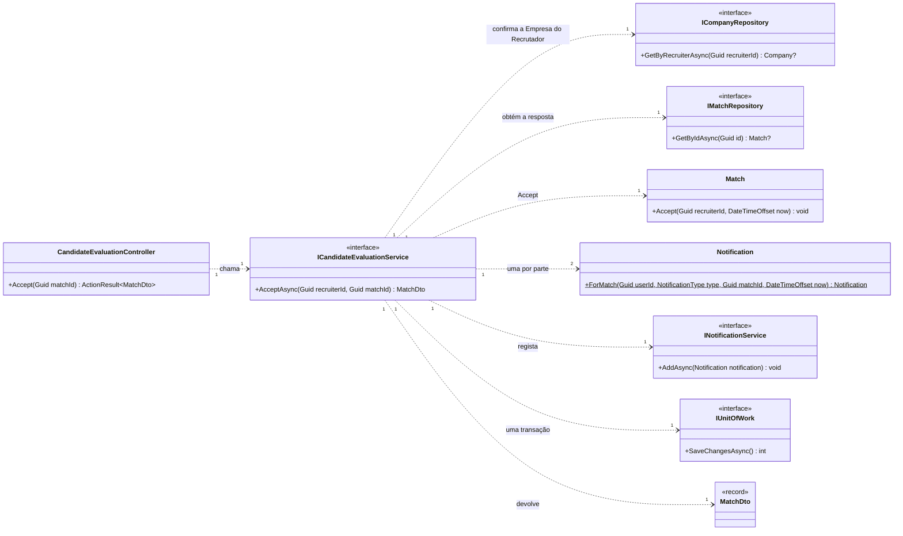

O serviço confirma que a vaga do `Match` pertence à Empresa do Recrutador e que a Empresa está aprovada, chama `Match.Accept` (que exige o perfil aberto e a decisão por registar), cria as duas notificações `MatchConfirmed` e grava tudo numa única transação. Se outro processo tiver alterado o `Match` entretanto (por exemplo, a suspensão da vaga), a gravação falha pelo controlo de concorrência (`xmin`) e o pedido é rejeitado (RF063, RF066, RF068, RF031, RF077, RF117).

---

## 9. Correspondência com o modelo de dados

| Classe de domínio | Tabela | Notas de mapeamento |
| --- | --- | --- |
| `AppUser` | `app_user` | Índice único sobre `lower(email)`. |
| `Admin`, `Recruiter`, `Candidate` | `admin`, `recruiter`, `candidate` | Chave primária partilhada com `app_user` (relação 1 : 0..1). |
| `Location` | `location` | Só leitura na aplicação. |
| `CandidateLink` | `candidate_link` | `Position` de 1 a 3. |
| `Skill`, `Benefit` | `skill`, `benefit` | Índices únicos sobre `lower(name)`. |
| `CandidateSkill` | `candidate_skill` | Exatamente um de `SkillId` e `CustomSkillLabel`. |
| `Company` | `company` | `RecruiterId` único; `PhotoPaths` ↔ `varchar(500)[]`. |
| `Job` | `job`, `job_skill`, `job_benefit` | `Skills` e `Benefits` são navegações N:M sobre `job_skill` e `job_benefit`; `PhotoPaths` ↔ array; filtro global `DeletedAt IS NULL`. |
| `Match` | `match` | `Version` ↔ `xmin`; atributos da conversa na própria tabela. |
| `Message` | `message` | Sem operações de edição nem eliminação (DA, F010). |
| `Notification` | `notification` | Exatamente um elemento de acesso por tipo, exceto a reposição da quota. |
| `OperationLog` | `operation_log` | Só inserções; chave `long` com identidade. |
| Enumerações (secção 3.5) | Tipos enumerados (modelo de dados, secção 5.1) | Mesmos valores, em PascalCase no C# e em maiúsculas no PostgreSQL. |

As 17 tabelas do modelo de dados têm correspondência nas 15 classes de domínio; `job_skill` e `job_benefit` não têm classe própria, por serem associações sem atributos.

---

## 10. Decisões de desenho

| ID | Decisão | Fundamentação |
| --- | --- | --- |
| DC-01 | Quatro camadas (Controllers, Services, Repositories, Domain), com DTOs, tarefas periódicas e infraestrutura à parte. | Arquitetura, secção 2.6; âmbito de cobertura do RI, secção 11.5. |
| DC-02 | Um repositório por agregado, com interface, e o `KatchDbContext` como unidade de trabalho. | Os Services ficam testáveis com repositórios simulados; os testes de integração usam o `KatchDbContext` com SQLite in-memory (RI, secção 11.2). |
| DC-03 | Regras de estado nas entidades e regras entre várias linhas nos Services. | Mesma divisão do modelo de dados (secções 7.1 e 7.2); as entidades rejeitam transições inválidas antes de chegar à base de dados. |
| DC-04 | `IClock` em vez de `DateTimeOffset.UtcNow` direto. | Permite verificar com relógio simulado o período de bloqueio de 24 horas e a expiração da credencial de sessão (RF020, RF021, RNF005). |
| DC-05 | Os identificadores do utilizador vêm sempre da credencial de sessão. | Impede que um pedido direto atue em nome de outro utilizador (RNF004, RNF006). |
| DC-06 | Um serviço e um controller por caso de uso ou grupo de casos de uso do mesmo ator. | Cada classe tem uma responsabilidade identificável e rastreável aos casos de uso (secção 5.3). |
| DC-07 | Mensagens e notificações novas obtidas por `ListNew…(since)`. | Arquitetura, secção 2.4 e decisão AD-02 (consulta periódica, por ratificar). Se a decisão não for ratificada, estas operações mantêm-se e acrescenta-se o canal persistente na camada dos controllers, sem alterar os Services. |
| DC-08 | DTOs como `record` sem lógica. | Excluídos da cobertura pelo RI (secção 11.5) e nunca expõem dados internos. |

---

## 11. Limitações

| Limitação | Consequência |
| --- | --- |
| O modelo depende da arquitetura (`I033`) e do modelo de dados (`I035`), ainda em revisão. | Uma alteração a qualquer deles obriga a rever as classes afetadas. |
| A transição T7 (`Match.CloseWithoutMatch`) depende da ratificação da decisão `m2-decisao-encerramento-interesses-em-espera-v01.md`. | Se não for ratificada, a operação não é chamada pelos serviços. |
| As assinaturas mostram os tipos de retorno sem `Task`, e as dependências de `IUnitOfWork` e `IClock` não estão todas desenhadas. | Simplificação de leitura; a implementação em `m3` segue a convenção assíncrona da secção 2.2. |
| Depois do fim de sessão, a credencial descartada pelo cliente continua tecnicamente válida até expirar (8 horas, RNF005). | Risco aceite no ambiente académico; uma lista de credenciais revogadas pode ser acrescentada mais tarde sem alterar os Services. |
| As rotas são indicativas. | As rotas, os códigos de estado e os exemplos são fixados na documentação da API (`04.11`). |

---

## 12. Rastreabilidade

| Casos de uso | Controllers | Services | Entidades |
| --- | --- | --- | --- |
| UC01, UC02 (início e fim de sessão e palavra-passe) | `AuthController` | `AuthService` | `AppUser` |
| UC03 (registo do Candidato) | `AuthController` | `AuthService` | `AppUser`, `Candidate` |
| UC04 (perfil profissional) | `CandidateProfileController` | `CandidateProfileService` | `Candidate`, `CandidateLink`, `CandidateSkill`, `Skill` |
| UC05, UC06 (exploração de vagas e página da Empresa) | `JobExplorationController`, `CandidateProfileController` | `JobExplorationService`, `QuotaService`, `CandidateProfileService` | `Job`, `Company`, `Match`, `Candidate`, `Location`, `Notification` |
| UC07, UC08 (registo e página da Empresa) | `AuthController`, `CompanyController` | `AuthService`, `CompanyService` | `Recruiter`, `Company`, `OperationLog` |
| UC09, UC10 (vagas) | `JobsController` | `JobService` | `Job`, `Skill`, `Benefit`, `Match`, `OperationLog` |
| UC11, UC12 (perfil do Candidato e decisão) | `CandidateEvaluationController` | `CandidateEvaluationService` | `Match`, `Candidate`, `Notification` |
| UC13 (matches) | `MatchesController` | `MatchService` | `Match`, `Company`, `Candidate` |
| UC14 (conversas) | `ConversationsController` | `ConversationService` | `Match`, `Message`, `Notification` |
| UC15 (notificações) | `NotificationsController` | `NotificationService` | `Notification` |
| UC16, UC17 (aprovação e supervisão de Empresas e vagas) | `AdminCompaniesController` | `CompanyAdminService` | `Company`, `Job`, `Match`, `Notification`, `OperationLog` |
| UC18 (contas) | `AdminAccountsController` | `AccountAdminService` | `AppUser`, `Match`, `OperationLog` |
| UC19 (indicadores) | `AdminIndicatorsController` | `IndicatorService` | `AppUser`, `Company`, `Job`, `Match`, `Message`, `OperationLog` |
| UC20 (listas pré-definidas) | `ReferenceListsController` | `ReferenceListService` | `Skill`, `Benefit`, `Location`, `OperationLog` |
