# Modelo de Classes — Frontend Mobile

**Unidade curricular:** Laboratório de Desenvolvimento de Software — LDS
**Milestone:** `m2`
**Ficheiro:** `m2-modelo-classes-frontend-mobile-v01.md`
**Pasta de arquivo:** `04-artefactos-tecnicos/04.07-modelos-de-classes`

---

## 1. Identificação do documento

| Campo | Informação |
| --- | --- |
| Grupo | G11 |
| Sistema | Katch |
| Ano letivo | 2026/2027 |
| Curso | LEI — Licenciatura em Engenharia Informática |
| Turma | LEI3T2 |
| Versão do documento | v01 |
| Módulo | Frontend mobile (`katch-frontend-mobile`), aplicação Flutter 3.47.x em Dart 3.13.x, exclusiva do Candidato |
| Issue | `I091` — Elaborar o modelo de classes do frontend mobile |
| Executor / Revisor / Auditor | João Coelho / Roberto Baptista / João Borguem |
| Documentos de origem | `m2-s02-i039-20261005-prototipo-baixa-fidelidade-v01.pdf` (ecrãs M01 a M21, `I039`), `m2-modelo-classes-backend-v01.md` (controllers, hubs e DTOs, `I036`), `m2-documentacao-arquitetura-v01.md` (secção 2, `I033`, e secção 3, `I034`), `m2-especificacao-requisitos-v01.md` (RF001 a RF036, RF075, RF105, RF108, RF110 e RNF002, RNF005, RNF010, RNF011, RNF014; parâmetros P01 a P11 e P17), `m2-especificacoes-casos-uso-v01.md` (UC01 a UC06 e UC13 a UC15), `m2-documentacao-api-v01.md` (secções 2 a 7 e 11, `I092`), `m2-decisao-consulta-periodica-mensagens-notificacoes-v01.md`, `m1-proposta-sistema-v02.pdf`, `m1-declaracao-ambito-v02.pdf` e `m1-regulamento-grupo-v01.pdf` (secções 11.2 a 11.5) |

O documento segue a secção 19 do Regulamento de Funcionamento da Unidade Curricular para `04.07-modelos-de-classes`: um ficheiro por módulo relevante, com classes, responsabilidades, atributos, operações, relações e multiplicidades. Corresponde à linha `OF-M2-009` — «Modelo de classes — frontend mobile v1» da Checklist de Controlo de Artefactos. É o módulo da aplicação Flutter do Candidato; o backend está em `m2-modelo-classes-backend-v01.md` e a área de gestão web tem o seu próprio módulo.

### 1.1. Histórico de versões

| Versão | Data | Descrição das alterações | Issue |
| --- | --- | --- | --- |
| v01 | 2026-10-08 | Criação do documento: camadas, modelos que espelham os DTOs, núcleo, serviços de acesso à API, sessão, cliente da ligação persistente, gestão de estado, ecrãs e widgets, com responsabilidades, atributos, operações, relações e multiplicidades. | `I091` |
| v01 | 2026-10-09 | Correções da revisão da `I091` e alinhamento com a documentação da API (`I092`): motivo do início de sessão igual à `message` do `ApiErrorDto` (D01); classificação dos erros pelo código HTTP (D02); cabeçalho `X-Client-App`, enumerações em maiúsculas com `_`, rotas e parâmetro `access_token` da API (D03); pontos de coerência ligados aos pontos em aberto da API e acrescentados PC-09 a PC-12 (M01); recarga da lista de conversas ao receber `ConversationClosed` (M02); correspondência das operações com as do controller (M03). | `I091` |

Cada alteração posterior acrescenta uma linha. As versões anteriores são conservadas, nos termos da secção 18.2 do Regulamento de Funcionamento da Unidade Curricular.

---

## 2. Âmbito e convenções

### 2.1. Módulo e camadas

O módulo é a aplicação móvel do Katch, o ponto de acesso exclusivo do Candidato (arquitetura, secção 2.3). Comunica com o backend por HTTPS e JSON, com a credencial de sessão (JWT) em cada pedido, e pela ligação bidirecional persistente que entrega as mensagens e as notificações em tempo real (arquitetura, secção 2.4, AD-02 e D-08). Nunca acede à base de dados nem aos ficheiros do servidor. Cobre as funcionalidades F001, F002, F004, F006, F008, F010 e F011 (arquitetura, secção 2.3) e os 21 ecrãs do protótipo da `I039`.

A arquitetura não fixa a estrutura interna da aplicação Flutter. As classes seguem as camadas da tabela seguinte, que separam o que muda por razões diferentes: a apresentação, o estado, o acesso à API e a sessão. A regra de dependência é única: cada camada só usa as camadas indicadas na coluna «Depende de».

| Camada | Pasta em `lib/` | Responsabilidade | Depende de |
| --- | --- | --- | --- |
| Ecrãs e widgets | `app/`, `screens/`, `widgets/` | Apresentar os 21 ecrãs do protótipo, captar a interação e mostrar o estado dos controllers e dos stores. Não chamam serviços nem o `ApiClient`. | Estado, Modelos |
| Estado | `state/` | Estado de apresentação de cada ecrã e estado partilhado entre ecrãs: carregamento, erros por campo, filtros, contadores. Valida o que o utilizador escreve e orquestra os serviços. | Serviços, Sessão, Tempo real, Núcleo, Modelos |
| Serviços | `services/` | Um serviço por controller do backend usado pelo Candidato. Traduz cada operação num pedido e devolve modelos. Não tem estado de apresentação. | Núcleo, Modelos |
| Tempo real | `realtime/` | Cliente da ligação persistente (`MessagesHub` e `NotificationsHub`): liga, religa e entrega os eventos ao estado. | Núcleo, Modelos |
| Sessão | `session/` | Guardar, restaurar e terminar a credencial de sessão; fornecer a credencial ao `ApiClient` e ao cliente de tempo real. | Núcleo, Modelos |
| Núcleo | `core/` | `ApiClient` (pedidos HTTPS, tempo limite, erros), relógio, estado da ligação, regras de validação local e acesso a recursos do dispositivo (ficheiros e aplicações externas). | Modelos |
| Modelos | `models/` | Espelho dos DTOs do backend, enumerações e valores auxiliares. Imutáveis e sem lógica de negócio. | — |

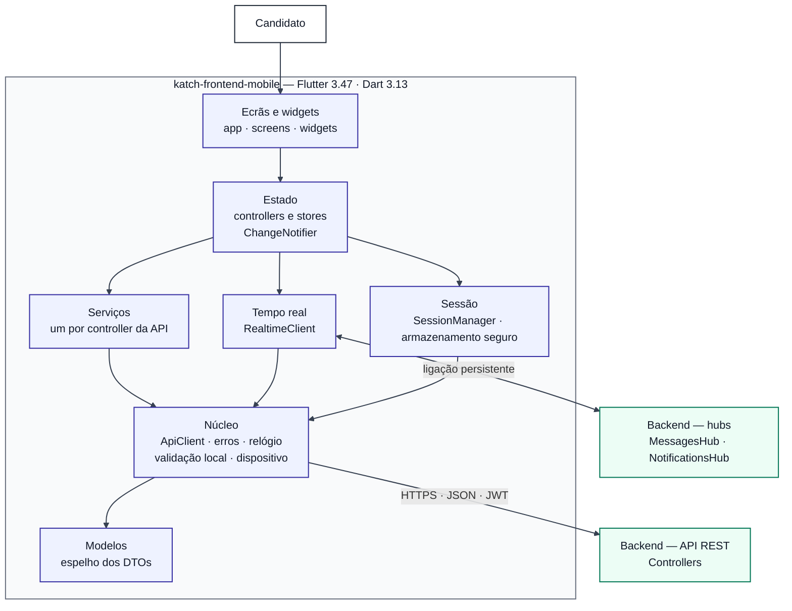
```mermaid
flowchart TB
    Cand["Candidato"]
    subgraph App["katch-frontend-mobile — Flutter 3.47 · Dart 3.13"]
        UI["Ecrãs e widgets<br/>app · screens · widgets"]
        ST["Estado<br/>controllers e stores<br/>ChangeNotifier"]
        SV["Serviços<br/>um por controller da API"]
        RT["Tempo real<br/>RealtimeClient"]
        SE["Sessão<br/>SessionManager · armazenamento seguro"]
        CO["Núcleo<br/>ApiClient · erros · relógio<br/>validação local · dispositivo"]
        MO["Modelos<br/>espelho dos DTOs"]
    end
    API["Backend — API REST<br/>Controllers"]
    HUB["Backend — hubs<br/>MessagesHub · NotificationsHub"]
    Cand --> UI
    UI --> ST
    ST --> SV
    ST --> RT
    ST --> SE
    SV --> CO
    RT --> CO
    SE --> CO
    CO --> MO
    CO -->|"HTTPS · JSON · JWT"| API
    RT <-->|"ligação persistente"| HUB
    classDef camada fill:#eef2ff,stroke:#3730a3,stroke-width:1.5px,color:#111827
    classDef externo fill:#ffffff,stroke:#1f2937,stroke-width:1.5px,color:#111827
    classDef servidor fill:#ecfdf5,stroke:#047857,stroke-width:1.5px,color:#111827
    class UI,ST,SV,RT,SE,CO,MO camada
    class Cand externo
    class API,HUB servidor
    style App fill:#f9fafb,stroke:#6b7280,stroke-width:1.5px,color:#111827
    linkStyle default stroke:#374151,stroke-width:1.5px
```

Todas as camadas usam os Modelos; a seta só está desenhada a partir do Núcleo para não sobrecarregar o diagrama. O `ApiClient` obtém a credencial através da interface `CredentialProvider`, que fica no Núcleo e é implementada pelo `SessionManager`; assim o Núcleo não depende da Sessão e não há dependências circulares entre pastas.

### 2.2. Convenções de código e de diagrama

- **Nomes:** Effective Dart (RI, secção 11.3): tipos em `UpperCamelCase`; membros, parâmetros e constantes em `lowerCamelCase`; ficheiros e pastas em `lowercase_with_underscores` (por exemplo, `JobCardDto` em `job_card_dto.dart`); membros privados com o prefixo `_`. As interfaces não têm o prefixo `I` do C#: são `abstract interface class` e a implementação tem um prefixo que a identifica (`HttpAuthService` implementa `AuthService`). A formatação é verificada com `dart format` e a análise estática com `flutter_lints` (RI, secções 11.3 e 11.4).
- **Sufixos:** `...Screen` (ecrã), `...Controller` (estado de um ecrã), `...Store` (estado partilhado entre ecrãs), `...Service` (acesso a um controller da API), `...Dto`, `...Request` e `...Response` (modelos que espelham os DTOs do backend, com o mesmo nome).
- **Tipos:** o mapeamento dos tipos do backend (modelo de classes do backend, secção 2.2) é o da tabela seguinte. `Json` é o `typedef` de `Map<String, Object?>` usado nas operações `fromJson` e `toJson`.

| Backend (C#) | Frontend (Dart) | Notas |
| --- | --- | --- |
| `Guid` | `String` | Texto do UUID, tal como segue no JSON. |
| `DateTimeOffset` | `DateTime` | ISO 8601 em UTC com o sufixo `Z` (API, secção 2.3); convertido para a hora local só na apresentação. |
| `decimal` | `double` | Número JSON com até 2 casas decimais; salários em euros brutos mensais. |
| `int`, `bool`, `string` | `int`, `bool`, `String` | — |
| `T?` | `T?` | A coluna ou o campo admite ausência. |
| `List<T>` | `List<T>` | Imutável depois de criada. |
| Enumerações | `enum` | Valores em `lowerCamelCase` (`WorkMode.onSite`); `fromWire` e `toWire` de cada enumeração convertem de e para o texto em maiúsculas com `_` da API (secções 2.3 e 2.4, DAPI-01): `WorkMode.onSite` ↔ `"ON_SITE"`, `Availability.fifteenDays` ↔ `"FIFTEEN_DAYS"`. Os nomes das propriedades JSON são os dos atributos em `camelCase`. |

- **Diagramas Mermaid (`classDiagram`):** `+` público, `-` privado (em Dart, `_`); `$` = membro estático; `~T~` = tipo genérico; `Future~T~` = operação assíncrona; `<<interface>>`, `<<abstract>>`, `<<enumeration>>`, `<<model>>` (modelo imutável que espelha um DTO), `<<widget>>` e `<<mixin>>` identificam o estereótipo. As operações `fromJson` e `toJson` dos modelos, os construtores e o método `build` dos widgets não são desenhados, exceto onde são relevantes; a convenção está nesta secção.
- **Relações:** `..>` dependência (recebida por construtor); `..|>` realização de interface; `<|--` herança; `-->` associação; `*--` composição (o filho não existe sem o pai); `o--` agregação (o estado de um controller ou store contém modelos). As multiplicidades estão nas extremidades.

### 2.3. Estrutura de pastas do repositório `katch-frontend-mobile`

O modelo orienta a estrutura do código de `m4`. Cada pasta de `lib/` corresponde a uma camada da secção 2.1 e cada classe deste documento tem o seu ficheiro, nomeado segundo a convenção de nomes.

```text
katch-frontend-mobile/
├── lib/
│   ├── main.dart            # arranque: cria AppDependencies, restaura a sessão e executa KatchApp
│   ├── app/                 # KatchApp, AppScope, AppDependencies, AppRoutes, AuthGate, HomeShell
│   ├── core/                # api_client, http_api_client, api_exception, credential_provider, clock,
│   │                        # connection_monitor, input_rules, device/ (file_picker, external_launcher)
│   ├── models/              # um ficheiro por DTO, enumerações e modelos auxiliares
│   ├── services/            # uma interface e uma implementação Http por serviço
│   ├── session/             # session, session_manager, session_storage
│   ├── realtime/            # realtime_client, signalr_realtime_client, hub_channel, realtime_coordinator
│   ├── state/               # stores/ (estado partilhado) e controllers/ (estado de cada ecrã)
│   ├── screens/             # auth/, profile/, exploration/, matches/, conversations/, notifications/, account/
│   └── widgets/             # widgets reutilizados por mais de um ecrã
├── test/                    # flutter_test: models, services, state e widgets
├── integration_test/        # integration_test: testes de sistema (QG-07)
├── analysis_options.yaml    # flutter_lints
└── pubspec.yaml             # dependências e versões fixadas na configuração base do repositório
```

Os pacotes de terceiros necessários (cliente HTTP, armazenamento seguro, cliente da ligação persistente, seletor de ficheiros e abertura de aplicações externas) não são fixados pelo Regulamento Interno; as versões ficam fixadas no `pubspec.yaml` e no `pubspec.lock` na configuração base do repositório, como a arquitetura prevê (secção 3.4). Cada um fica atrás de uma interface do Núcleo, do Tempo real ou da Sessão, pelo que a escolha do pacote só altera uma classe (secção 12, DFM-03).

---

## 3. Modelos

Os modelos espelham os DTOs do backend (modelo de classes do backend, secção 7) com o mesmo nome e os mesmos atributos, para que a rastreabilidade seja direta. São classes imutáveis (`final class`, atributos `final`, construtor `const`), escritas à mão, sem geração de código e sem lógica de negócio. Cada resposta tem a fábrica estática `fromJson(Json json)` e cada pedido tem `toJson()`; `SearchPreferencesDto` tem as duas porque é pedido e resposta. Dos 41 DTOs do backend, o Candidato usa 23; os restantes 18 pertencem ao Recrutador e ao Administrador e não têm modelo na aplicação (secção 11.3).

### 3.1. Autenticação e perfil

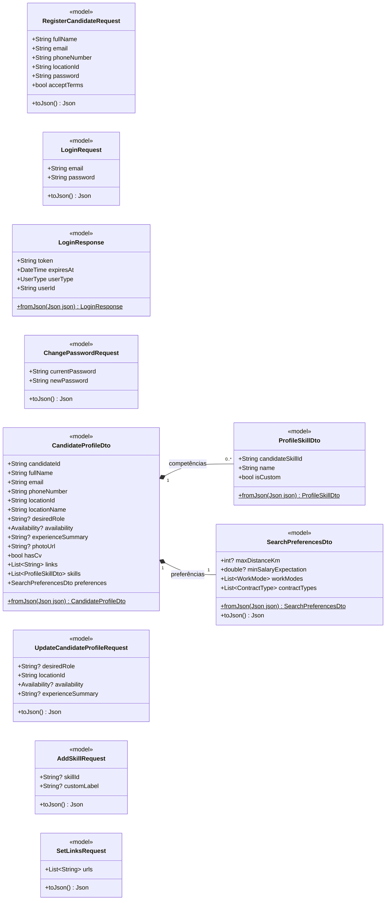
```mermaid
classDiagram
    direction LR
    class RegisterCandidateRequest {
        <<model>>
        +String fullName
        +String email
        +String phoneNumber
        +String locationId
        +String password
        +bool acceptTerms
        +toJson() Json
    }
    class LoginRequest {
        <<model>>
        +String email
        +String password
        +toJson() Json
    }
    class LoginResponse {
        <<model>>
        +String token
        +DateTime expiresAt
        +UserType userType
        +String userId
        +fromJson(Json json)$ LoginResponse
    }
    class ChangePasswordRequest {
        <<model>>
        +String currentPassword
        +String newPassword
        +toJson() Json
    }
    class CandidateProfileDto {
        <<model>>
        +String candidateId
        +String fullName
        +String email
        +String phoneNumber
        +String locationId
        +String locationName
        +String? desiredRole
        +Availability? availability
        +String? experienceSummary
        +String? photoUrl
        +bool hasCv
        +List~String~ links
        +List~ProfileSkillDto~ skills
        +SearchPreferencesDto preferences
        +fromJson(Json json)$ CandidateProfileDto
    }
    class ProfileSkillDto {
        <<model>>
        +String candidateSkillId
        +String name
        +bool isCustom
        +fromJson(Json json)$ ProfileSkillDto
    }
    class UpdateCandidateProfileRequest {
        <<model>>
        +String? desiredRole
        +String locationId
        +Availability? availability
        +String? experienceSummary
        +toJson() Json
    }
    class SearchPreferencesDto {
        <<model>>
        +int? maxDistanceKm
        +double? minSalaryExpectation
        +List~WorkMode~ workModes
        +List~ContractType~ contractTypes
        +fromJson(Json json)$ SearchPreferencesDto
        +toJson() Json
    }
    class AddSkillRequest {
        <<model>>
        +String? skillId
        +String? customLabel
        +toJson() Json
    }
    class SetLinksRequest {
        <<model>>
        +List~String~ urls
        +toJson() Json
    }
    CandidateProfileDto "1" *-- "0..*" ProfileSkillDto : competências
    CandidateProfileDto "1" *-- "1" SearchPreferencesDto : preferências
```

`LoginResponse` é a resposta de `login` e de `register`. `CandidateProfileDto` nunca contém o caminho dos ficheiros: `photoUrl` é um endereço da API que serve a imagem depois de verificar a autorização e `hasCv` só indica se existe curriculum vitae (backend, secção 7.2). A aplicação só envia o CV (RF011): o modelo de classes do backend não tem operação para o Candidato o obter, embora o RNF007 admita esse pedido (PC-11).

### 3.2. Exploração, matches, conversas, notificações, listas e erros

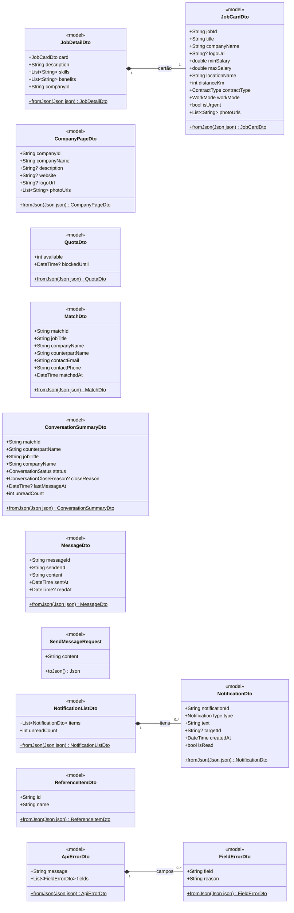
```mermaid
classDiagram
    direction LR
    class JobCardDto {
        <<model>>
        +String jobId
        +String title
        +String companyName
        +String? logoUrl
        +double minSalary
        +double maxSalary
        +String locationName
        +int distanceKm
        +ContractType contractType
        +WorkMode workMode
        +bool isUrgent
        +List~String~ photoUrls
        +fromJson(Json json)$ JobCardDto
    }
    class JobDetailDto {
        <<model>>
        +JobCardDto card
        +String description
        +List~String~ skills
        +List~String~ benefits
        +String companyId
        +fromJson(Json json)$ JobDetailDto
    }
    class CompanyPageDto {
        <<model>>
        +String companyId
        +String companyName
        +String? description
        +String? website
        +String? logoUrl
        +List~String~ photoUrls
        +fromJson(Json json)$ CompanyPageDto
    }
    class QuotaDto {
        <<model>>
        +int available
        +DateTime? blockedUntil
        +fromJson(Json json)$ QuotaDto
    }
    class MatchDto {
        <<model>>
        +String matchId
        +String jobTitle
        +String companyName
        +String counterpartName
        +String contactEmail
        +String contactPhone
        +DateTime matchedAt
        +fromJson(Json json)$ MatchDto
    }
    class ConversationSummaryDto {
        <<model>>
        +String matchId
        +String counterpartName
        +String jobTitle
        +String companyName
        +ConversationStatus status
        +ConversationCloseReason? closeReason
        +DateTime? lastMessageAt
        +int unreadCount
        +fromJson(Json json)$ ConversationSummaryDto
    }
    class MessageDto {
        <<model>>
        +String messageId
        +String senderId
        +String content
        +DateTime sentAt
        +DateTime? readAt
        +fromJson(Json json)$ MessageDto
    }
    class SendMessageRequest {
        <<model>>
        +String content
        +toJson() Json
    }
    class NotificationDto {
        <<model>>
        +String notificationId
        +NotificationType type
        +String text
        +String? targetId
        +DateTime createdAt
        +bool isRead
        +fromJson(Json json)$ NotificationDto
    }
    class NotificationListDto {
        <<model>>
        +List~NotificationDto~ items
        +int unreadCount
        +fromJson(Json json)$ NotificationListDto
    }
    class ReferenceItemDto {
        <<model>>
        +String id
        +String name
        +fromJson(Json json)$ ReferenceItemDto
    }
    class ApiErrorDto {
        <<model>>
        +String message
        +List~FieldErrorDto~ fields
        +fromJson(Json json)$ ApiErrorDto
    }
    class FieldErrorDto {
        <<model>>
        +String field
        +String reason
        +fromJson(Json json)$ FieldErrorDto
    }
    JobDetailDto "1" *-- "1" JobCardDto : cartão
    NotificationListDto "1" *-- "0..*" NotificationDto : itens
    ApiErrorDto "1" *-- "0..*" FieldErrorDto : campos
```

`MessageDto` é também o conteúdo do evento `MessageReceived` da ligação persistente, e `NotificationDto` o do evento `NotificationReceived` (secção 7). `MatchDto.contactEmail` e `contactPhone` são os contactos da Empresa (RF025). `ApiErrorDto` é o formato único dos erros que o servidor devolve; indica o motivo e, quando a rejeição é de validação, cada campo em causa (RF004).

### 3.3. Enumerações

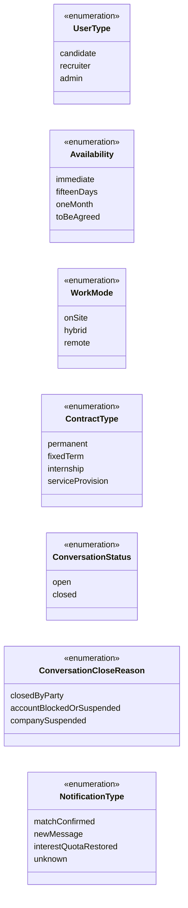
```mermaid
classDiagram
    direction LR
    class UserType {
        <<enumeration>>
        candidate
        recruiter
        admin
    }
    class Availability {
        <<enumeration>>
        immediate
        fifteenDays
        oneMonth
        toBeAgreed
    }
    class WorkMode {
        <<enumeration>>
        onSite
        hybrid
        remote
    }
    class ContractType {
        <<enumeration>>
        permanent
        fixedTerm
        internship
        serviceProvision
    }
    class ConversationStatus {
        <<enumeration>>
        open
        closed
    }
    class ConversationCloseReason {
        <<enumeration>>
        closedByParty
        accountBlockedOrSuspended
        companySuspended
    }
    class NotificationType {
        <<enumeration>>
        matchConfirmed
        newMessage
        interestQuotaRestored
        unknown
    }
```

As seis primeiras enumerações têm os mesmos valores das do backend (modelo de classes do backend, secção 3.5). `NotificationType` tem apenas os três tipos que o servidor envia ao Candidato — `MatchConfirmed` (RF031), `NewMessage` (RF032) e `InterestQuotaRestored` (RF033) — e `unknown`, para onde vai qualquer valor que a aplicação não reconheça, de modo que uma notificação nova de um tipo futuro nunca impede a leitura da lista. Os tipos `NewInterest`, `CompanyApproved` e `CompanyRejected` são dirigidos ao Recrutador (RF076 e RF079) e não chegam à aplicação móvel. Na API, os três tipos do Candidato são `MATCH_CONFIRMED`, `NEW_MESSAGE` e `INTEREST_QUOTA_RESTORED` (API, secção 7.3).

As enumerações de estado do cliente (`SessionStatus`, `RealtimeState`, `LoadStatus`, `ExplorationStatus`, `RegistrationStep`, `ListFilter` e `NotificationTargetKind`) estão nas secções em que são usadas.

### 3.4. Modelos auxiliares do cliente

Os modelos auxiliares não existem no backend; resultam das necessidades da aplicação.

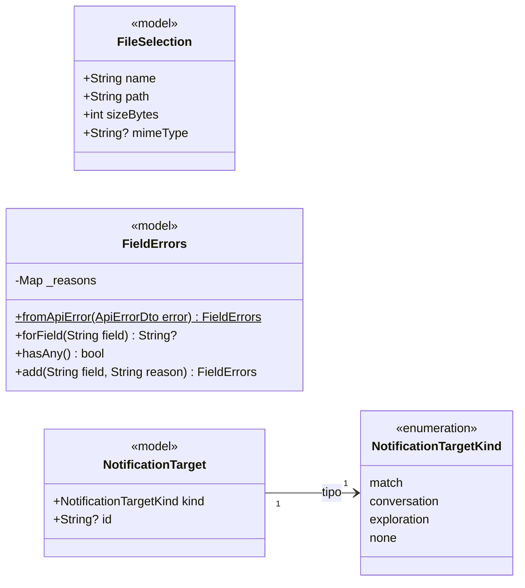
```mermaid
classDiagram
    direction LR
    class FileSelection {
        <<model>>
        +String name
        +String path
        +int sizeBytes
        +String? mimeType
    }
    class FieldErrors {
        <<model>>
        -Map _reasons
        +fromApiError(ApiErrorDto error)$ FieldErrors
        +forField(String field) String?
        +hasAny() bool
        +add(String field, String reason) FieldErrors
    }
    class NotificationTarget {
        <<model>>
        +NotificationTargetKind kind
        +String? id
    }
    class NotificationTargetKind {
        <<enumeration>>
        match
        conversation
        exploration
        none
    }
    NotificationTarget "1" --> "1" NotificationTargetKind : tipo
```

| Classe | Responsabilidade | Requisitos |
| --- | --- | --- |
| `FileSelection` | Ficheiro escolhido no dispositivo (fotografia ou curriculum vitae), com o nome, o caminho local, a dimensão e o tipo. É validado localmente (`InputRules`) antes de ser enviado. | RF010, RF011 |
| `FieldErrors` | Motivo de rejeição por campo de um formulário, obtido de `ApiErrorDto` ou da validação local. O atributo `_reasons` é um mapa do nome do campo para o motivo. Cada ecrã com formulário mostra o motivo junto do campo. | RF004, RF009 |
| `NotificationTarget` | Destino de uma notificação: o match, a conversa, a área de exploração de vagas ou nenhum, com o identificador do elemento quando existe. | RF036 |

---

## 4. Núcleo

O Núcleo concentra o que todas as outras camadas partilham: o acesso HTTPS ao backend, os erros, o relógio, o estado da ligação, as regras de validação local e o acesso a recursos do dispositivo.

### 4.1. Pedidos à API e erros

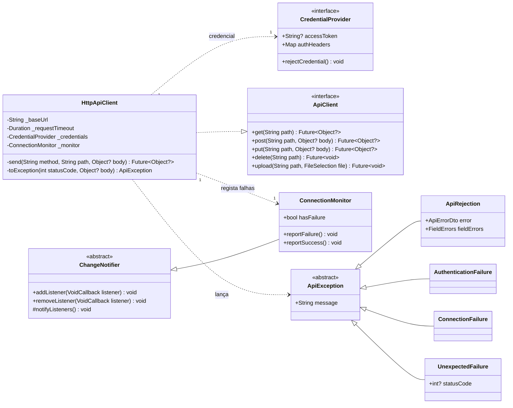
```mermaid
classDiagram
    direction LR
    class ChangeNotifier {
        <<abstract>>
        +addListener(VoidCallback listener) void
        +removeListener(VoidCallback listener) void
        #notifyListeners() void
    }
    class CredentialProvider {
        <<interface>>
        +String? accessToken
        +Map authHeaders
        +rejectCredential() void
    }
    class ApiClient {
        <<interface>>
        +get(String path) Future~Object?~
        +post(String path, Object? body) Future~Object?~
        +put(String path, Object? body) Future~Object?~
        +delete(String path) Future~void~
        +upload(String path, FileSelection file) Future~void~
    }
    class HttpApiClient {
        -String _baseUrl
        -Duration _requestTimeout
        -CredentialProvider _credentials
        -ConnectionMonitor _monitor
        -send(String method, String path, Object? body) Future~Object?~
        -toException(int statusCode, Object? body) ApiException
    }
    class ConnectionMonitor {
        +bool hasFailure
        +reportFailure() void
        +reportSuccess() void
    }
    class ApiException {
        <<abstract>>
        +String message
    }
    class ApiRejection {
        +ApiErrorDto error
        +FieldErrors fieldErrors
    }
    class AuthenticationFailure
    class ConnectionFailure
    class UnexpectedFailure {
        +int? statusCode
    }
    HttpApiClient ..|> ApiClient
    HttpApiClient "1" ..> "1" CredentialProvider : credencial
    HttpApiClient "1" ..> "1" ConnectionMonitor : regista falhas
    HttpApiClient ..> ApiException : lança
    ChangeNotifier <|-- ConnectionMonitor
    ApiException <|-- ApiRejection
    ApiException <|-- AuthenticationFailure
    ApiException <|-- ConnectionFailure
    ApiException <|-- UnexpectedFailure
```

| Classe | Responsabilidade | Requisitos |
| --- | --- | --- |
| `ApiClient` | Interface única dos pedidos à API. As operações devolvem o JSON já descodificado (`Object?`) e os serviços convertem-no em modelos. É a fronteira que os testes substituem por uma implementação simulada. | Arquitetura, secção 2.6 |
| `HttpApiClient` | Envia cada pedido por HTTPS, em JSON, com a credencial de sessão no cabeçalho de autorização. O tempo limite de cada pedido é de 9 segundos, abaixo dos 10 segundos do RNF014. Quando não há resposta nesse tempo, regista a falha em `ConnectionMonitor` e lança `ConnectionFailure`. Todas as respostas de erro da API trazem um `ApiErrorDto` (API, secção 4.1), incluindo `401` e `403`, pelo que a exceção se escolhe pelo código HTTP e pelo tipo de operação, segundo as regras abaixo. | RNF004, RNF005, RNF009, RNF014 |
| `CredentialProvider` | Interface do Núcleo através da qual `HttpApiClient` e o cliente de tempo real obtêm a credencial e comunicam que o servidor a recusou. É implementada por `SessionManager`. | RNF004 |
| `ConnectionMonitor` | Guarda se o último pedido falhou por falta de ligação e notifica `ConnectionBanner`. Volta a `false` no primeiro pedido que obtém resposta. | RNF014 |
| `ApiRejection` | O servidor rejeitou o pedido e indicou o motivo, por regra de negócio (quota esgotada, vaga indisponível, conversa só de consulta, palavra-passe atual errada) ou por validação (cada campo em causa, em `fieldErrors`). | RF001, RF004, RF009, RF010 a RF012, RF020, RF026, RNF009 |
| `AuthenticationFailure` | A credencial foi recusada numa operação reservada: expirada ou inválida (`401`, ERR-01) ou conta bloqueada ou suspensa durante a sessão (`403`, ERR-03 ou ERR-04). Termina a sessão. No início de sessão, ERR-02 a ERR-05 chegam como `ApiRejection`, com a `message` do servidor. | RF086, RF089, RNF004, RNF005 |
| `ConnectionFailure` | O pedido não obteve resposta em 9 segundos ou a ligação não pôde ser estabelecida. Os formulários mantêm o que o Candidato escreveu e permitem voltar a submeter. | RNF014 |
| `UnexpectedFailure` | Resposta de erro que o modelo de erros não prevê. Mostra uma mensagem genérica e permite repetir a operação. | — |

Regras de classificação das respostas de erro, segundo a API (secções 3.4, 4.1, 4.2 e 4.3). As operações não reservadas são as que a API admite sem credencial: o registo do Candidato e o início de sessão (API, secção 3.3); todas as outras são reservadas.

| Resposta | Operação | Exceção |
| --- | --- | --- |
| Sem resposta em 9 segundos ou sem ligação | Qualquer | `ConnectionFailure` (regista a falha em `ConnectionMonitor`) |
| `401` (ERR-01) | Reservada | `AuthenticationFailure` (chama `rejectCredential()`) |
| `403` com a mensagem de ERR-03 («A conta está bloqueada.») ou de ERR-04 («A conta está suspensa.») | Reservada | `AuthenticationFailure` (chama `rejectCredential()`) |
| `401` (ERR-02) e `403` (ERR-03, ERR-04, ERR-05) | Início de sessão | `ApiRejection`, com a `message` do `ApiErrorDto` |
| Restantes `4xx` (`400`, `403` de ERR-06 a ERR-08, `404`, `409`, `413`, `415`) | Qualquer | `ApiRejection` |
| `5xx` (ERR-50) | Qualquer | `UnexpectedFailure` |

O `ApiErrorDto` não tem código de erro (API, PA-05), e o ERR-03 e o ERR-04 têm o mesmo código HTTP que o ERR-06, o ERR-07 e o ERR-08. Até o PA-05 ser resolvido, o `403` de conta bloqueada ou suspensa reconhece-se pela mensagem fixa do catálogo da API (secção 4.3), o que é frágil (PC-12).

### 4.2. Relógio, validação local e dispositivo

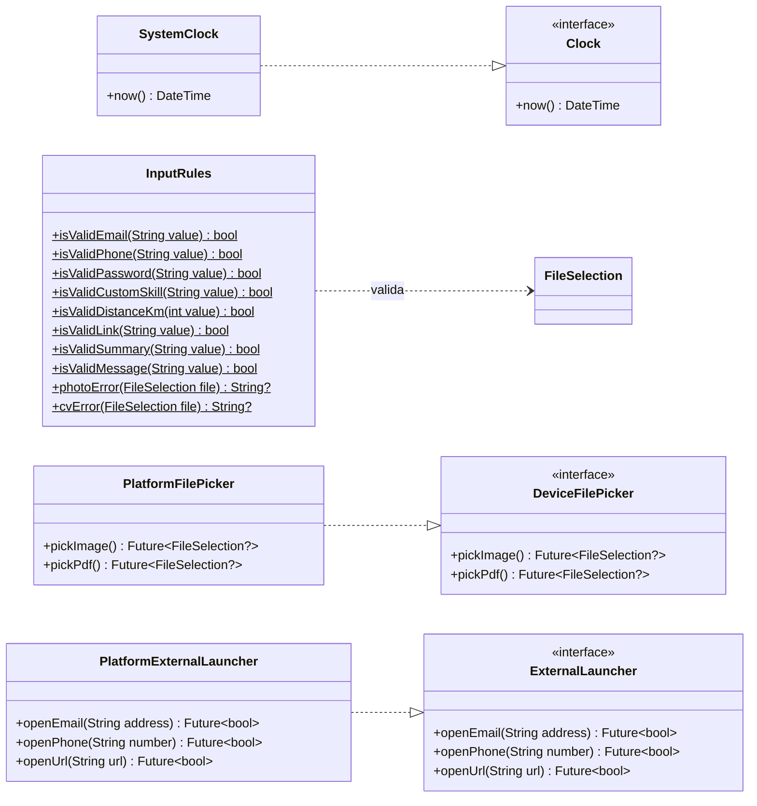
```mermaid
classDiagram
    direction LR
    class Clock {
        <<interface>>
        +now() DateTime
    }
    class SystemClock {
        +now() DateTime
    }
    class InputRules {
        +isValidEmail(String value)$ bool
        +isValidPhone(String value)$ bool
        +isValidPassword(String value)$ bool
        +isValidCustomSkill(String value)$ bool
        +isValidDistanceKm(int value)$ bool
        +isValidLink(String value)$ bool
        +isValidSummary(String value)$ bool
        +isValidMessage(String value)$ bool
        +photoError(FileSelection file)$ String?
        +cvError(FileSelection file)$ String?
    }
    class DeviceFilePicker {
        <<interface>>
        +pickImage() Future~FileSelection?~
        +pickPdf() Future~FileSelection?~
    }
    class PlatformFilePicker {
        +pickImage() Future~FileSelection?~
        +pickPdf() Future~FileSelection?~
    }
    class ExternalLauncher {
        <<interface>>
        +openEmail(String address) Future~bool~
        +openPhone(String number) Future~bool~
        +openUrl(String url) Future~bool~
    }
    class PlatformExternalLauncher {
        +openEmail(String address) Future~bool~
        +openPhone(String number) Future~bool~
        +openUrl(String url) Future~bool~
    }
    SystemClock ..|> Clock
    PlatformFilePicker ..|> DeviceFilePicker
    PlatformExternalLauncher ..|> ExternalLauncher
    InputRules ..> FileSelection : valida
```

| Classe | Responsabilidade | Requisitos |
| --- | --- | --- |
| `Clock` e `SystemClock` | Data e hora atuais em UTC. Nos testes é substituído por um relógio simulado, para verificar o tempo em falta até ao fim do bloqueio da quota e a expiração da sessão. Mesma razão do `IClock` do backend (DC-04). | RF020, RNF005 |
| `InputRules` | Regras de validação local, só para dar ao Candidato o motivo antes de enviar o pedido. O servidor aplica as mesmas regras e é a autoridade (RNF008); o formato real dos ficheiros é verificado no servidor (RNF016). | RF003, RF004, RF007 a RF012, RF026; P01 a P08, P10 |
| `DeviceFilePicker` | Abre o seletor de ficheiros do dispositivo para a fotografia (JPEG ou PNG) e para o curriculum vitae (PDF). Devolve `null` quando o Candidato desiste. | RF010, RF011 |
| `ExternalLauncher` | Abre uma aplicação externa do dispositivo: o correio eletrónico e a chamada telefónica para os contactos do match e o navegador para o sítio da Empresa. A plataforma nunca envia correio eletrónico nem SMS por si própria (arquitetura, secção 2.5). | RF017, RF025 |

Valores aplicados por `InputRules` (especificação de requisitos, secção 3):

| Regra | Valor | Parâmetro | Usada em |
| --- | --- | --- | --- |
| `isValidEmail` | Formato local@domínio | P04 | `RegisterController` |
| `isValidPhone` | 9 algarismos | P04 | `RegisterController` |
| `isValidPassword` | Pelo menos 8 caracteres, uma letra e um algarismo | P05 | `RegisterController`, `ChangePasswordController` |
| `isValidCustomSkill` | 2 a 40 caracteres: letras, algarismos, espaços e os símbolos + # . - | P07 | `SkillsController` |
| `isValidDistanceKm` | Número inteiro de 1 a 500 | P06 | `PreferencesController` |
| `isValidLink` | Endereço iniciado por `http://` ou `https://` | P10 | `ProfileFilesController` |
| `isValidSummary` | No máximo 1000 caracteres | P08 | `ProfileFormController` |
| `isValidMessage` | 1 a 1000 caracteres | P03 | `ChatController` |
| `photoError` | JPEG ou PNG, no máximo 5 MB | P01 | `ProfileFilesController` |
| `cvError` | PDF, no máximo 5 MB | P02 | `ProfileFilesController` |

---

## 5. Serviços de acesso à API

Há um serviço por controller do backend usado pelo Candidato: sete serviços para sete controllers (secção 11.2). Cada serviço é uma interface (`abstract interface class`) e tem uma implementação `Http...` que recebe o `ApiClient` por construtor; os controllers de estado dependem da interface, pelo que os testes usam serviços simulados. Cada operação de um serviço corresponde a uma operação do controller (modelo de classes do backend, secção 6), com os mesmos parâmetros e resultados, sem o identificador do utilizador, que o servidor obtém da credencial (backend, DC-05). O nome é o da operação do controller em `lowerCamelCase`, com três exceções por legibilidade: `Get` e `Update` do perfil passam a `getProfile` e `updateProfile`, e `RegisterCandidate` passa a `register`. A correspondência completa, com o método e a rota da API, está na secção 11.2.

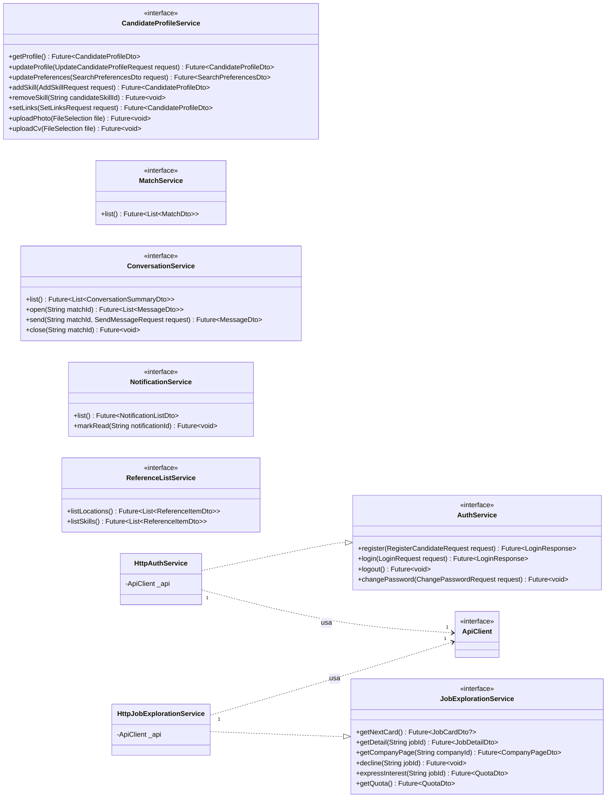
```mermaid
classDiagram
    direction LR
    class AuthService {
        <<interface>>
        +register(RegisterCandidateRequest request) Future~LoginResponse~
        +login(LoginRequest request) Future~LoginResponse~
        +logout() Future~void~
        +changePassword(ChangePasswordRequest request) Future~void~
    }
    class CandidateProfileService {
        <<interface>>
        +getProfile() Future~CandidateProfileDto~
        +updateProfile(UpdateCandidateProfileRequest request) Future~CandidateProfileDto~
        +updatePreferences(SearchPreferencesDto request) Future~SearchPreferencesDto~
        +addSkill(AddSkillRequest request) Future~CandidateProfileDto~
        +removeSkill(String candidateSkillId) Future~void~
        +setLinks(SetLinksRequest request) Future~CandidateProfileDto~
        +uploadPhoto(FileSelection file) Future~void~
        +uploadCv(FileSelection file) Future~void~
    }
    class JobExplorationService {
        <<interface>>
        +getNextCard() Future~JobCardDto?~
        +getDetail(String jobId) Future~JobDetailDto~
        +getCompanyPage(String companyId) Future~CompanyPageDto~
        +decline(String jobId) Future~void~
        +expressInterest(String jobId) Future~QuotaDto~
        +getQuota() Future~QuotaDto~
    }
    class MatchService {
        <<interface>>
        +list() Future~List~MatchDto~~
    }
    class ConversationService {
        <<interface>>
        +list() Future~List~ConversationSummaryDto~~
        +open(String matchId) Future~List~MessageDto~~
        +send(String matchId, SendMessageRequest request) Future~MessageDto~
        +close(String matchId) Future~void~
    }
    class NotificationService {
        <<interface>>
        +list() Future~NotificationListDto~
        +markRead(String notificationId) Future~void~
    }
    class ReferenceListService {
        <<interface>>
        +listLocations() Future~List~ReferenceItemDto~~
        +listSkills() Future~List~ReferenceItemDto~~
    }
    class ApiClient {
        <<interface>>
    }
    class HttpAuthService {
        -ApiClient _api
    }
    class HttpJobExplorationService {
        -ApiClient _api
    }
    HttpAuthService ..|> AuthService
    HttpJobExplorationService ..|> JobExplorationService
    HttpAuthService "1" ..> "1" ApiClient : usa
    HttpJobExplorationService "1" ..> "1" ApiClient : usa
```

O diagrama mostra duas implementações, como exemplo da relação. As restantes cinco seguem o mesmo padrão: `HttpCandidateProfileService`, `HttpMatchService`, `HttpConversationService`, `HttpNotificationService` e `HttpReferenceListService`.

| Serviço | Controller do backend | Rota base (API, secção 5) | Casos de uso | Requisitos |
| --- | --- | --- | --- | --- |
| `AuthService` | `AuthController` | `/api/auth` | UC01, UC02, UC03 | RF001 a RF005, RF105 |
| `CandidateProfileService` | `CandidateProfileController` | `/api/candidate/profile` | UC04, UC05 | RF006 a RF012, RF023 |
| `JobExplorationService` | `JobExplorationController` | `/api/candidate/jobs` | UC05, UC06 | RF013, RF014, RF016 a RF022 |
| `MatchService` | `MatchesController` | `/api/matches` | UC13 | RF024, RF025 |
| `ConversationService` | `ConversationsController` | `/api/conversations` | UC14 | RF026 a RF030, RF108 |
| `NotificationService` | `NotificationsController` | `/api/notifications` | UC15 | RF034 a RF036 |
| `ReferenceListService` | `ReferenceListsController` | `/api/reference-lists` | UC03, UC04 | RF003, RF006, RF008 |

As rotas, os métodos, os códigos de estado, os formatos e os exemplos são os da documentação da API (`m2-documentacao-api-v01.md`, secções 5 e 6), que é o contrato com o backend.

Regras dos serviços:

- `register` e `login` não exigem credencial de sessão; as restantes operações exigem-na. `HttpAuthService.login` envia o cabeçalho `X-Client-App: mobile` (API, secção 3.2, DAPI-02); uma conta que não seja do Candidato recebe ERR-05. `ReferenceListService.listLocations` é usada também antes do início de sessão (ecrã de registo), o que o backend ainda não permite (secção 13, PC-01).
- `getNextCard` devolve `null` quando nenhuma vaga cumpre as preferências de procura (RF014), a que a API responde com `204 No Content` (6.3.1); o ecrã mostra então M11.
- `expressInterest` devolve a quota atualizada. Uma tentativa com a quota esgotada, uma segunda manifestação na mesma vaga ou uma vaga já indisponível são rejeitadas pelo servidor (`ApiRejection`) sem alterar a quota (UC05, E1 a E3).
- `uploadPhoto` e `uploadCv` não devolvem endereço: os DTOs nunca expõem o caminho dos ficheiros. Depois de cada envio, o estado volta a pedir o perfil (`getProfile`) para obter o novo `photoUrl` e `hasCv`.
- `open` devolve o histórico e, no servidor, marca como lidas as mensagens da outra parte (RF108). `list` devolve o número de mensagens por ler de cada conversa.
- `markRead` não devolve valor (`204`): o contador de notificações por ler é reduzido em uma unidade no estado (RF035).
- `uploadPhoto` e `uploadCv` enviam o ficheiro em `multipart/form-data`, no campo `file` (API, secção 2.6), e a API responde `204 No Content`.
- `changePassword` com a palavra-passe atual errada recebe `400` com o campo `currentPassword` (API, 6.1.5), e não `401`; a aplicação não o confunde com sessão expirada.

---

## 6. Sessão

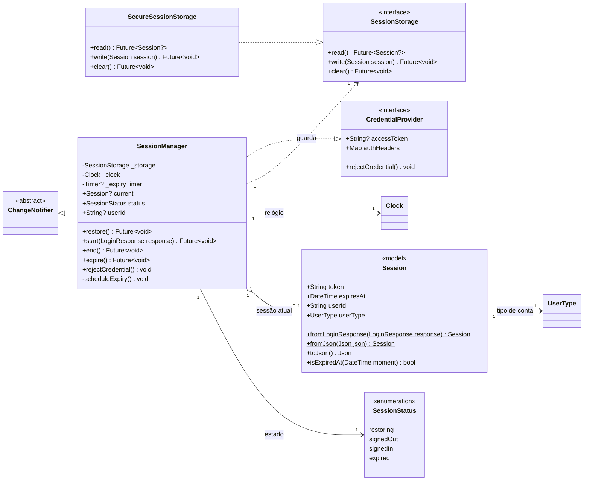
```mermaid
classDiagram
    direction LR
    class Session {
        <<model>>
        +String token
        +DateTime expiresAt
        +String userId
        +UserType userType
        +fromLoginResponse(LoginResponse response)$ Session
        +fromJson(Json json)$ Session
        +toJson() Json
        +isExpiredAt(DateTime moment) bool
    }
    class SessionStatus {
        <<enumeration>>
        restoring
        signedOut
        signedIn
        expired
    }
    class SessionStorage {
        <<interface>>
        +read() Future~Session?~
        +write(Session session) Future~void~
        +clear() Future~void~
    }
    class SecureSessionStorage {
        +read() Future~Session?~
        +write(Session session) Future~void~
        +clear() Future~void~
    }
    class CredentialProvider {
        <<interface>>
        +String? accessToken
        +Map authHeaders
        +rejectCredential() void
    }
    class SessionManager {
        -SessionStorage _storage
        -Clock _clock
        -Timer? _expiryTimer
        +Session? current
        +SessionStatus status
        +String? userId
        +restore() Future~void~
        +start(LoginResponse response) Future~void~
        +end() Future~void~
        +expire() Future~void~
        +rejectCredential() void
        -scheduleExpiry() void
    }
    class ChangeNotifier {
        <<abstract>>
    }
    SecureSessionStorage ..|> SessionStorage
    SessionManager ..|> CredentialProvider
    ChangeNotifier <|-- SessionManager
    SessionManager "1" ..> "1" SessionStorage : guarda
    SessionManager "1" ..> "1" Clock : relógio
    SessionManager "1" o-- "0..1" Session : sessão atual
    SessionManager "1" --> "1" SessionStatus : estado
    Session "1" --> "1" UserType : tipo de conta
```

| Operação | Efeito | Requisitos |
| --- | --- | --- |
| `restore()` | Chamada no arranque, com o estado `restoring`. Lê a sessão do armazenamento seguro; se existir e ainda não tiver expirado, passa a `signedIn`; caso contrário, apaga-a e passa a `signedOut`. Permite que o ecrã «Conta» (M20) afirme que o dispositivo está ligado à conta. | RNF005, P20 |
| `start(response)` | Chamada depois do início de sessão ou do registo. Rejeita (`AuthenticationFailure`) uma resposta cujo `userType` não seja `candidate`, porque a aplicação móvel é exclusiva do Candidato. Guarda a sessão, passa a `signedIn` e agenda a expiração para `expiresAt` (8 horas depois do início de sessão). | RF001, RF005, RNF005, P20 |
| `end()` | Fim de sessão pedido pelo Candidato: apaga a sessão do armazenamento e passa a `signedOut`. O servidor não guarda estado de sessão; a credencial descartada fica válida até expirar (backend, secção 11). | RF105 |
| `expire()` e `rejectCredential()` | A sessão chegou a `expiresAt` ou o servidor recusou a credencial numa operação reservada (ERR-01, ERR-03 ou ERR-04). Apaga a sessão e passa a `expired`; `AuthGate` volta ao ecrã de início de sessão (M01). | RF086, RF089, RNF004, RNF005 |
| `accessToken` e `authHeaders` | Dão a credencial ao `HttpApiClient` (cabeçalho de autorização) e ao cliente de tempo real (abertura da ligação). | RNF004, RNF006 |

Os stores e o `RealtimeCoordinator` observam `SessionManager`: quando o estado deixa de ser `signedIn`, os stores esvaziam os dados do Candidato e a ligação persistente é fechada.

---

## 7. Cliente da ligação persistente

A arquitetura exige que as mensagens e as notificações cheguem à aplicação sem atualização manual, no máximo 5 segundos depois do acontecimento (P17; arquitetura, AD-02), por uma ligação bidirecional persistente entre o cliente e o backend. A tecnologia está por ratificar em reunião formal (D-08, proposta ASP.NET Core SignalR). O estado da aplicação depende só da interface `RealtimeClient`; a implementação `SignalRRealtimeClient` é a que concretiza a proposta e é a única classe que muda se a tecnologia mudar (secção 12, DFM-05), tal como o backend isola a biblioteca em `IRealtimePublisher`.

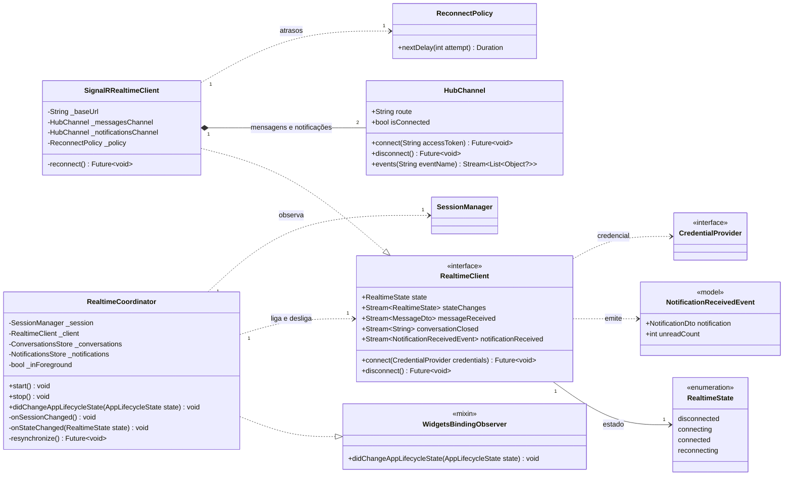
```mermaid
classDiagram
    direction LR
    class RealtimeState {
        <<enumeration>>
        disconnected
        connecting
        connected
        reconnecting
    }
    class NotificationReceivedEvent {
        <<model>>
        +NotificationDto notification
        +int unreadCount
    }
    class RealtimeClient {
        <<interface>>
        +RealtimeState state
        +Stream~RealtimeState~ stateChanges
        +Stream~MessageDto~ messageReceived
        +Stream~String~ conversationClosed
        +Stream~NotificationReceivedEvent~ notificationReceived
        +connect(CredentialProvider credentials) Future~void~
        +disconnect() Future~void~
    }
    class SignalRRealtimeClient {
        -String _baseUrl
        -HubChannel _messagesChannel
        -HubChannel _notificationsChannel
        -ReconnectPolicy _policy
        -reconnect() Future~void~
    }
    class HubChannel {
        +String route
        +bool isConnected
        +connect(String accessToken) Future~void~
        +disconnect() Future~void~
        +events(String eventName) Stream~List~Object?~~
    }
    class ReconnectPolicy {
        +nextDelay(int attempt) Duration
    }
    class WidgetsBindingObserver {
        <<mixin>>
        +didChangeAppLifecycleState(AppLifecycleState state) void
    }
    class RealtimeCoordinator {
        -SessionManager _session
        -RealtimeClient _client
        -ConversationsStore _conversations
        -NotificationsStore _notifications
        -bool _inForeground
        +start() void
        +stop() void
        +didChangeAppLifecycleState(AppLifecycleState state) void
        -onSessionChanged() void
        -onStateChanged(RealtimeState state) void
        -resynchronize() Future~void~
    }
    class CredentialProvider {
        <<interface>>
    }
    SignalRRealtimeClient ..|> RealtimeClient
    SignalRRealtimeClient "1" *-- "2" HubChannel : mensagens e notificações
    SignalRRealtimeClient "1" ..> "1" ReconnectPolicy : atrasos
    RealtimeClient "1" --> "1" RealtimeState : estado
    RealtimeClient ..> NotificationReceivedEvent : emite
    RealtimeClient ..> CredentialProvider : credencial
    RealtimeCoordinator ..|> WidgetsBindingObserver
    RealtimeCoordinator "1" ..> "1" RealtimeClient : liga e desliga
    RealtimeCoordinator "1" ..> "1" SessionManager : observa
```

`RealtimeCoordinator` usa o mixin `WidgetsBindingObserver` do Flutter para saber quando a aplicação passa a primeiro e a segundo plano. O contrato dos eventos é o dos hubs do backend (modelo de classes do backend, secção 6.1; API, secções 7.2 e 7.3):

| Hub (rota) | Evento do servidor | Conteúdo | Stream no cliente | Requisitos |
| --- | --- | --- | --- | --- |
| `MessagesHub` (`/hubs/messages`) | `MessageReceived` | `MessageDto` | `messageReceived` | RF029 |
| `MessagesHub` (`/hubs/messages`) | `ConversationClosed` | Identificador do match | `conversationClosed` | RF030, RF075 |
| `NotificationsHub` (`/hubs/notifications`) | `NotificationReceived` | `NotificationDto` e número de notificações por ler | `notificationReceived` | RF110, RF034 |

Regras:

- **Abertura.** Cada `HubChannel` abre a sua ligação com a credencial de sessão, enviada no parâmetro `access_token` da consulta (API, secção 7.1), porque o WebSocket não admite cabeçalhos; a credencial não é registada em nenhum registo de diagnóstico (RNF017). O servidor rejeita a ligação de contas que não sejam do Candidato ou do Recrutador, ou que estejam bloqueadas ou suspensas.
- **Quando liga.** `RealtimeCoordinator` liga quando a sessão está iniciada e a aplicação está em primeiro plano, e desliga quando a sessão termina ou a aplicação passa a segundo plano. É o âmbito do RF029 e do RF110: aplicação aberta com sessão iniciada. Não há notificações nativas do sistema operativo, nem envio por correio eletrónico ou SMS (arquitetura, secção 2.4).
- **Encerramento da conversa.** Ao receber `ConversationClosed`, o cliente recarrega a lista de conversas para ler o `closeReason`, porque o evento só traz o identificador do match (API, secção 7.2). O motivo é o que o ecrã M18 apresenta (RF075).
- **Sentido.** Os hubs só enviam eventos ao cliente. O envio de mensagens, a marcação como lida e o encerramento passam sempre pelo `ConversationService` (backend, secção 6.1).
- **Perda e reposição da ligação.** Quando a ligação cai, `SignalRRealtimeClient` passa a `reconnecting` e volta a ligar com atrasos crescentes (`ReconnectPolicy`). Quando volta a `connected`, e também quando a aplicação regressa ao primeiro plano, `resynchronize()` pede de novo a lista de conversas, o histórico da conversa aberta e a área de notificações pelos serviços, porque os eventos enviados entretanto não se repetem (backend, secção 6.1). Não há consulta periódica.

### 7.1. Sequência: receção de uma mensagem

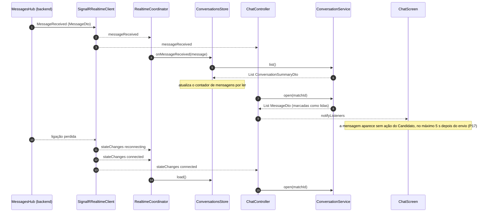
```mermaid
sequenceDiagram
    autonumber
    participant Hub as MessagesHub (backend)
    participant RC as SignalRRealtimeClient
    participant CO as RealtimeCoordinator
    participant CS as ConversationsStore
    participant CH as ChatController
    participant SV as ConversationService
    participant UI as ChatScreen
    Hub->>RC: MessageReceived (MessageDto)
    RC-->>CO: messageReceived
    RC-->>CH: messageReceived
    CO->>CS: onMessageReceived(message)
    CS->>SV: list()
    SV-->>CS: List ConversationSummaryDto
    Note over CS: atualiza o contador de mensagens por ler
    CH->>SV: open(matchId)
    SV-->>CH: List MessageDto (marcadas como lidas)
    CH-->>UI: notifyListeners
    Note over UI: a mensagem aparece sem ação do Candidato, no máximo 5 s depois do envio (P17)
    Hub--xRC: ligação perdida
    RC-->>CO: stateChanges reconnecting
    RC-->>CO: stateChanges connected
    RC-->>CH: stateChanges connected
    CO->>CS: load()
    CH->>SV: open(matchId)
```

O evento `MessageReceived` não identifica a conversa a que a mensagem pertence (`MessageDto` não tem o identificador do match). Enquanto isso não for corrigido (secção 13, PC-02), `ChatController` não acrescenta a mensagem diretamente: recarrega o histórico da conversa aberta com `open` e junta-o por `messageId`, sem duplicados. Se a mensagem for de outra conversa, o histórico recarregado fica igual e só o contador da lista (`ConversationsStore`) muda.

---

## 8. Estado

O estado da aplicação é gerido com o `ChangeNotifier` do próprio Flutter, sem pacote externo (secção 12, DFM-02). Há dois tipos de classes:

- **Stores** — estado partilhado entre ecrãs (perfil, conversas, notificações, listas pré-definidas). Existem uma vez por aplicação, são criados em `AppDependencies` e esvaziam-se quando a sessão termina.
- **Controllers** — estado de um ecrã ou de um fluxo (formulário, carregamento, erros por campo). São criados quando o ecrã abre e destruídos (`dispose`) quando fecha.

Os ecrãs não chamam serviços: pedem ao controller ou ao store, que chama o serviço, atualiza o estado e chama `notifyListeners()`. Os widgets reconstroem-se com `ListenableBuilder`. A lógica de estado é a que o Regulamento Interno inclui na cobertura mínima de 40% do frontend mobile (RI, secção 11.5) e é testada com `flutter_test` sobre serviços simulados.

Tratamento comum dos erros dos serviços (secção 4.1):

| Erro | Resposta do estado |
| --- | --- |
| `ApiRejection` | Mostra o motivo; nos formulários, mostra cada campo em causa através de `FieldErrors`. O que o Candidato escreveu mantém-se. |
| `ConnectionFailure` | Mantém os dados e o formulário; `ConnectionBanner` indica a falha (RNF014) e o Candidato volta a submeter. |
| `AuthenticationFailure` | Já tratada por `SessionManager` (`expire()`); o estado não faz mais nada. |
| `UnexpectedFailure` | Mostra uma mensagem genérica e permite repetir a operação. |

### 8.1. Stores partilhados

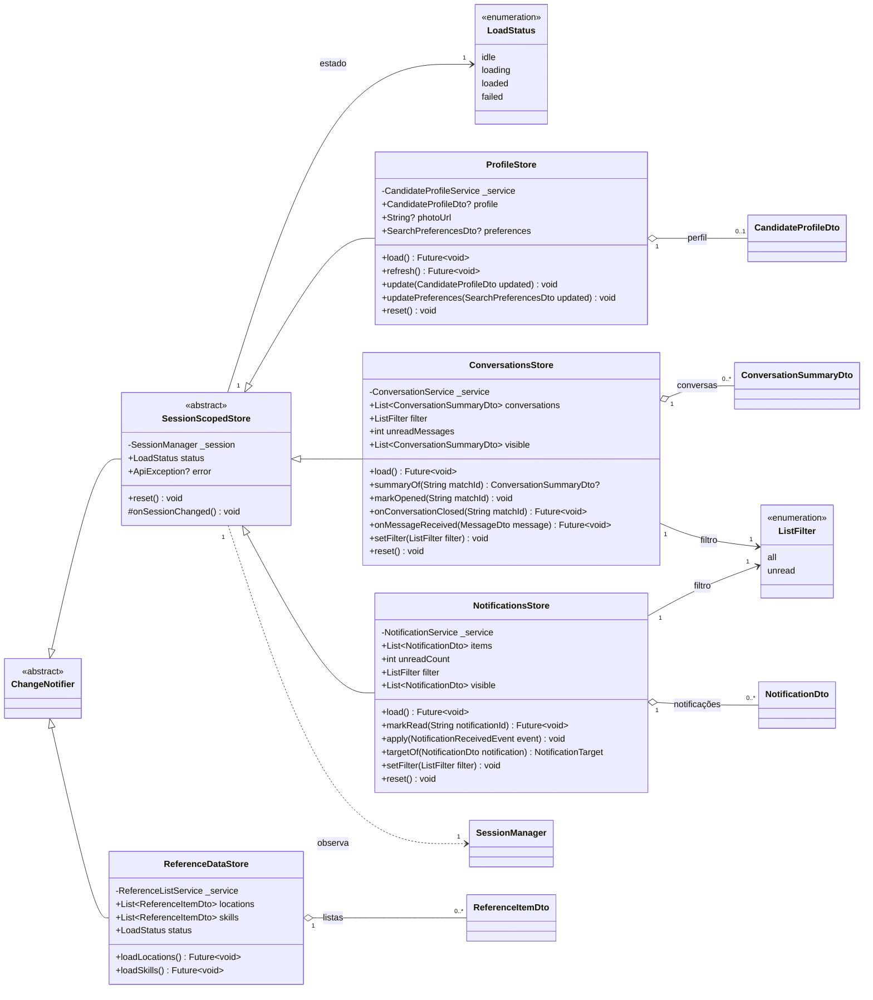
```mermaid
classDiagram
    direction LR
    class LoadStatus {
        <<enumeration>>
        idle
        loading
        loaded
        failed
    }
    class ListFilter {
        <<enumeration>>
        all
        unread
    }
    class ChangeNotifier {
        <<abstract>>
    }
    class SessionScopedStore {
        <<abstract>>
        -SessionManager _session
        +LoadStatus status
        +ApiException? error
        +reset() void
        #onSessionChanged() void
    }
    class ProfileStore {
        -CandidateProfileService _service
        +CandidateProfileDto? profile
        +String? photoUrl
        +SearchPreferencesDto? preferences
        +load() Future~void~
        +refresh() Future~void~
        +update(CandidateProfileDto updated) void
        +updatePreferences(SearchPreferencesDto updated) void
        +reset() void
    }
    class ConversationsStore {
        -ConversationService _service
        +List~ConversationSummaryDto~ conversations
        +ListFilter filter
        +int unreadMessages
        +List~ConversationSummaryDto~ visible
        +load() Future~void~
        +summaryOf(String matchId) ConversationSummaryDto?
        +markOpened(String matchId) void
        +onConversationClosed(String matchId) Future~void~
        +onMessageReceived(MessageDto message) Future~void~
        +setFilter(ListFilter filter) void
        +reset() void
    }
    class NotificationsStore {
        -NotificationService _service
        +List~NotificationDto~ items
        +int unreadCount
        +ListFilter filter
        +List~NotificationDto~ visible
        +load() Future~void~
        +markRead(String notificationId) Future~void~
        +apply(NotificationReceivedEvent event) void
        +targetOf(NotificationDto notification) NotificationTarget
        +setFilter(ListFilter filter) void
        +reset() void
    }
    class ReferenceDataStore {
        -ReferenceListService _service
        +List~ReferenceItemDto~ locations
        +List~ReferenceItemDto~ skills
        +LoadStatus status
        +loadLocations() Future~void~
        +loadSkills() Future~void~
    }
    ChangeNotifier <|-- SessionScopedStore
    ChangeNotifier <|-- ReferenceDataStore
    SessionScopedStore <|-- ProfileStore
    SessionScopedStore <|-- ConversationsStore
    SessionScopedStore <|-- NotificationsStore
    SessionScopedStore "1" ..> "1" SessionManager : observa
    SessionScopedStore "1" --> "1" LoadStatus : estado
    ProfileStore "1" o-- "0..1" CandidateProfileDto : perfil
    ConversationsStore "1" o-- "0..*" ConversationSummaryDto : conversas
    NotificationsStore "1" o-- "0..*" NotificationDto : notificações
    ReferenceDataStore "1" o-- "0..*" ReferenceItemDto : listas
    ConversationsStore "1" --> "1" ListFilter : filtro
    NotificationsStore "1" --> "1" ListFilter : filtro
```

| Store | Responsabilidade | Usado em | Requisitos |
| --- | --- | --- | --- |
| `SessionScopedStore` | Base dos stores com dados do Candidato. Observa `SessionManager` e chama `reset()` quando a sessão deixa de estar iniciada, para que nenhum dado de uma conta fique em memória depois do fim de sessão. | — | RF105 |
| `ProfileStore` | Perfil profissional do Candidato, carregado depois do início de sessão. Cada controller que altera o perfil entrega o `CandidateProfileDto` devolvido pelo serviço (`update`); depois de um envio de ficheiro volta a pedir o perfil (`refresh`) para obter `photoUrl` e `hasCv`. Expõe as preferências de procura, que a área de exploração observa. | M05 a M08, M09, M20 | RF006 a RF012, RF023 |
| `ConversationsStore` | Lista de conversas com o número de mensagens por ler. `unreadMessages` é a soma de `unreadCount` e alimenta o cabeçalho «mensagens por ler» do ecrã M16 e o contador do separador «Conversas». `markOpened` põe a zero o contador da conversa que o Candidato abriu (o servidor já a marcou como lida, RF108) e `onConversationClosed` recarrega a lista para obter o `closeReason` e passar a conversa a só de consulta (API, secção 7.2). `filter` é o filtro «Todas» ou «Não lidas», aplicado só à lista já carregada. | M16, M17, M18, barra inferior | RF027, RF028, RF030, RF075, RF108 |
| `NotificationsStore` | Notificações recebidas. `unreadCount` é sempre o número que o servidor indica (na lista ou no evento) e é o contador do separador «Notificações». `markRead` reduz o contador em uma unidade depois de o servidor confirmar (RF035). `apply` junta a notificação recebida pela ligação persistente, sem duplicados por `notificationId`. `targetOf` converte o tipo da notificação no destino (`matchConfirmed` → match, `newMessage` → conversa, `interestQuotaRestored` → exploração de vagas). | M19, barra inferior, M09 | RF031 a RF036, RF110 |
| `ReferenceDataStore` | Listas pré-definidas de localidades e de competências. Não é de âmbito de sessão, porque as localidades são precisas no registo, antes do início de sessão (PC-01). | M02, M05, M07 | RF003, RF006, RF008 |

### 8.2. Autenticação, registo e conta

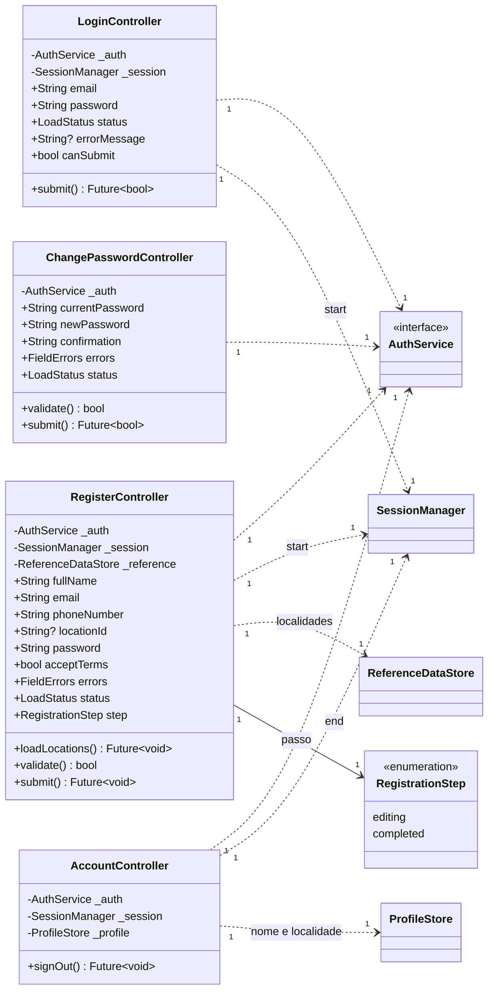
```mermaid
classDiagram
    direction LR
    class RegistrationStep {
        <<enumeration>>
        editing
        completed
    }
    class LoginController {
        -AuthService _auth
        -SessionManager _session
        +String email
        +String password
        +LoadStatus status
        +String? errorMessage
        +bool canSubmit
        +submit() Future~bool~
    }
    class RegisterController {
        -AuthService _auth
        -SessionManager _session
        -ReferenceDataStore _reference
        +String fullName
        +String email
        +String phoneNumber
        +String? locationId
        +String password
        +bool acceptTerms
        +FieldErrors errors
        +LoadStatus status
        +RegistrationStep step
        +loadLocations() Future~void~
        +validate() bool
        +submit() Future~void~
    }
    class ChangePasswordController {
        -AuthService _auth
        +String currentPassword
        +String newPassword
        +String confirmation
        +FieldErrors errors
        +LoadStatus status
        +validate() bool
        +submit() Future~bool~
    }
    class AccountController {
        -AuthService _auth
        -SessionManager _session
        -ProfileStore _profile
        +signOut() Future~void~
    }
    class AuthService {
        <<interface>>
    }
    LoginController "1" ..> "1" AuthService
    RegisterController "1" ..> "1" AuthService
    ChangePasswordController "1" ..> "1" AuthService
    AccountController "1" ..> "1" AuthService
    LoginController "1" ..> "1" SessionManager : start
    RegisterController "1" ..> "1" SessionManager : start
    AccountController "1" ..> "1" SessionManager : end
    RegisterController "1" ..> "1" ReferenceDataStore : localidades
    RegisterController "1" --> "1" RegistrationStep : passo
    AccountController "1" ..> "1" ProfileStore : nome e localidade
```

| Controller | Ecrãs | Responsabilidade | Requisitos |
| --- | --- | --- | --- |
| `LoginController` | M01 | Envia o correio eletrónico e a palavra-passe; em caso de êxito, entrega a `LoginResponse` a `SessionManager.start`. Quando o servidor rejeita o início de sessão, mostra a `message` do `ApiErrorDto` devolvido, sem a alterar nem a juntar com outras: ERR-02 (credenciais erradas, a mesma mensagem para correio inexistente e palavra-passe errada, RNF009), ERR-03 (conta bloqueada), ERR-04 (conta suspensa) e ERR-05 (ponto de acesso) (API, 6.1.3 e 4.3). O RF001 exige a indicação do motivo também quando a conta está bloqueada ou suspensa, e o RNF009 só uniformiza o das credenciais erradas; o ecrã M01 do protótipo junta os motivos num só texto (PC-09). | RF001, RNF009 |
| `RegisterController` | M02, M03, M04 | Formulário de registo: valida localmente (`InputRules`: campos obrigatórios, correio eletrónico, contacto de 9 algarismos, palavra-passe, aceitação das condições) e, só depois, envia. Os motivos do servidor, por campo, também vão para `errors` (M03). Em caso de êxito, inicia a sessão com a `LoginResponse` do registo e passa a `step = completed` (M04, «A sua conta está ativa»). Se o Candidato sair do formulário, nada é guardado. | RF003, RF004, RF005 |
| `ChangePasswordController` | M21 | Valida que a palavra-passe nova cumpre o P05, é diferente da atual e coincide com a confirmação; a confirmação só existe no cliente e não segue no `ChangePasswordRequest`. O servidor rejeita uma palavra-passe atual errada. | RF002 |
| `AccountController` | M20 | Mostra o nome, o correio eletrónico e a localidade do `ProfileStore`. `signOut()` pede o fim de sessão ao servidor (`AuthService.logout`), sem depender do resultado, e termina a sessão local (`SessionManager.end`): o cliente descarta a credencial e passa a exigir novo início de sessão. | RF105 |

### 8.3. Perfil profissional

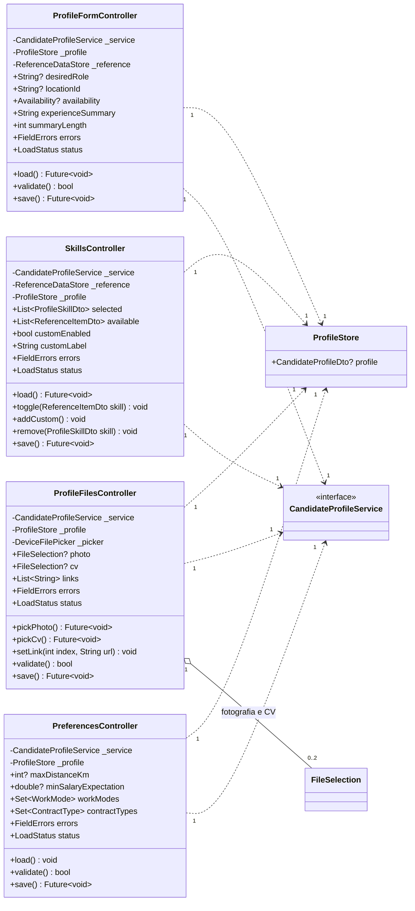
```mermaid
classDiagram
    direction LR
    class ProfileFormController {
        -CandidateProfileService _service
        -ProfileStore _profile
        -ReferenceDataStore _reference
        +String? desiredRole
        +String? locationId
        +Availability? availability
        +String experienceSummary
        +int summaryLength
        +FieldErrors errors
        +LoadStatus status
        +load() Future~void~
        +validate() bool
        +save() Future~void~
    }
    class ProfileFilesController {
        -CandidateProfileService _service
        -ProfileStore _profile
        -DeviceFilePicker _picker
        +FileSelection? photo
        +FileSelection? cv
        +List~String~ links
        +FieldErrors errors
        +LoadStatus status
        +pickPhoto() Future~void~
        +pickCv() Future~void~
        +setLink(int index, String url) void
        +validate() bool
        +save() Future~void~
    }
    class SkillsController {
        -CandidateProfileService _service
        -ReferenceDataStore _reference
        -ProfileStore _profile
        +List~ProfileSkillDto~ selected
        +List~ReferenceItemDto~ available
        +bool customEnabled
        +String customLabel
        +FieldErrors errors
        +LoadStatus status
        +load() Future~void~
        +toggle(ReferenceItemDto skill) void
        +addCustom() void
        +remove(ProfileSkillDto skill) void
        +save() Future~void~
    }
    class PreferencesController {
        -CandidateProfileService _service
        -ProfileStore _profile
        +int? maxDistanceKm
        +double? minSalaryExpectation
        +Set~WorkMode~ workModes
        +Set~ContractType~ contractTypes
        +FieldErrors errors
        +LoadStatus status
        +load() void
        +validate() bool
        +save() Future~void~
    }
    class ProfileStore {
        +CandidateProfileDto? profile
    }
    class CandidateProfileService {
        <<interface>>
    }
    ProfileFormController "1" ..> "1" ProfileStore
    ProfileFilesController "1" ..> "1" ProfileStore
    SkillsController "1" ..> "1" ProfileStore
    PreferencesController "1" ..> "1" ProfileStore
    ProfileFormController "1" ..> "1" CandidateProfileService
    ProfileFilesController "1" ..> "1" CandidateProfileService
    SkillsController "1" ..> "1" CandidateProfileService
    PreferencesController "1" ..> "1" CandidateProfileService
    ProfileFilesController "1" o-- "0..2" FileSelection : fotografia e CV
```

| Controller | Ecrãs | Responsabilidade | Requisitos |
| --- | --- | --- | --- |
| `ProfileFormController` | M05 | Função pretendida, localidade (da lista), disponibilidade (imediata, 15 dias, 1 mês ou a combinar) e resumo da experiência com o contador «n/1000». Valida o limite do resumo (P08) e grava com `updateProfile`. | RF006 |
| `ProfileFilesController` | M06 (e as linhas de fotografia e CV de M05) | Fotografia, curriculum vitae e até 3 hiperligações. Valida localmente o formato e a dimensão (P01, P02) e os endereços (P10) **antes do primeiro pedido**, para que nenhum envio se faça com dados que já se sabe estarem errados; depois envia a fotografia, o CV e as hiperligações por esta ordem e volta a pedir o perfil. Os motivos, por campo, ficam em `errors` e são os que M06 mostra («Só JPEG ou PNG até 5 MB», «Só PDF até 5 MB», «A hiperligação tem de começar por http:// ou https://»). | RF010, RF011, RF012 |
| `SkillsController` | M07 | Competências como etiquetas: escolhe da lista pré-definida, acrescenta uma competência «Outro» (2 a 40 caracteres, P07) ou remove uma etiqueta. `save()` envia ao serviço só as diferenças: `addSkill` por cada competência nova e `removeSkill` por cada removida. | RF008, RF009 |
| `PreferencesController` | M08 | Distância máxima (1 a 500 km, P06), pretensão salarial mínima, regimes de trabalho e tipos de contrato. Grava com `updatePreferences` e entrega as novas preferências ao `ProfileStore`, que a área de exploração observa. | RF007, RF023 |

### 8.4. Exploração de vagas

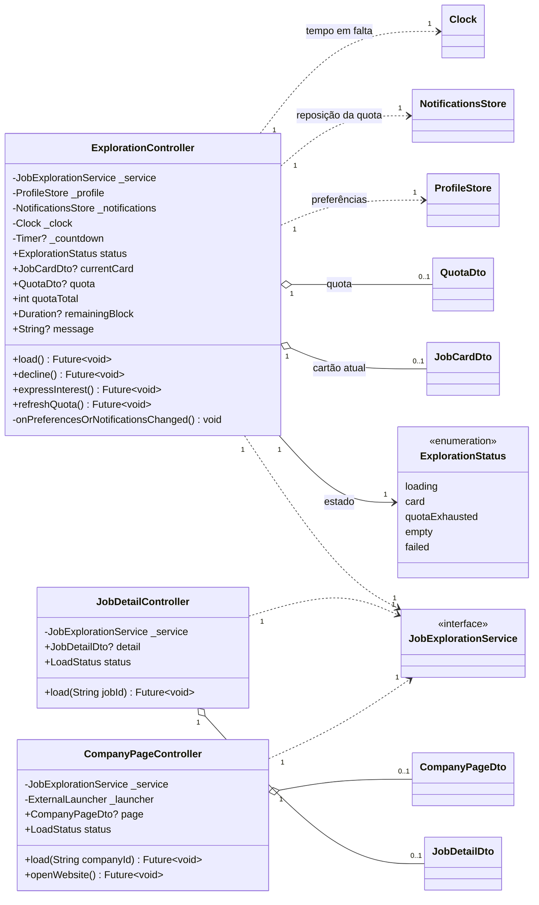
```mermaid
classDiagram
    direction LR
    class ExplorationStatus {
        <<enumeration>>
        loading
        card
        quotaExhausted
        empty
        failed
    }
    class ExplorationController {
        -JobExplorationService _service
        -ProfileStore _profile
        -NotificationsStore _notifications
        -Clock _clock
        -Timer? _countdown
        +ExplorationStatus status
        +JobCardDto? currentCard
        +QuotaDto? quota
        +int quotaTotal
        +Duration? remainingBlock
        +String? message
        +load() Future~void~
        +decline() Future~void~
        +expressInterest() Future~void~
        +refreshQuota() Future~void~
        -onPreferencesOrNotificationsChanged() void
    }
    class JobDetailController {
        -JobExplorationService _service
        +JobDetailDto? detail
        +LoadStatus status
        +load(String jobId) Future~void~
    }
    class CompanyPageController {
        -JobExplorationService _service
        -ExternalLauncher _launcher
        +CompanyPageDto? page
        +LoadStatus status
        +load(String companyId) Future~void~
        +openWebsite() Future~void~
    }
    class JobExplorationService {
        <<interface>>
    }
    ExplorationController "1" --> "1" ExplorationStatus : estado
    ExplorationController "1" o-- "0..1" JobCardDto : cartão atual
    ExplorationController "1" o-- "0..1" QuotaDto : quota
    JobDetailController "1" o-- "0..1" JobDetailDto
    CompanyPageController "1" o-- "0..1" CompanyPageDto
    ExplorationController "1" ..> "1" JobExplorationService
    JobDetailController "1" ..> "1" JobExplorationService
    CompanyPageController "1" ..> "1" JobExplorationService
    ExplorationController "1" ..> "1" ProfileStore : preferências
    ExplorationController "1" ..> "1" NotificationsStore : reposição da quota
    ExplorationController "1" ..> "1" Clock : tempo em falta
```

`ExplorationController` é o estado dos ecrãs M09, M10 e M11, que são três estados do mesmo ecrã:

| `status` | Ecrã | Quando | Comportamento |
| --- | --- | --- | --- |
| `card` | M09 | Há um cartão e a quota tem interesses disponíveis. | Mostra o cartão e «Interesses disponíveis: n de 10» (RF022). Recusar, manifestar interesse e abrir o detalhe exigem uma só interação (RNF010). |
| `quotaExhausted` | M10 | A quota não tem interesses e `blockedUntil` está no futuro. | Mostra o cartão com o aviso «Esgotou os 10 interesses» e o tempo em falta (`remainingBlock`, calculado com `Clock`). O botão de interesse fica desativado, mas recusar, ver o detalhe e ajustar as preferências continuam disponíveis (UC05, A4). |
| `empty` | M11 | `getNextCard` não devolveu cartão. | Indica que não há vagas compatíveis e oferece «Ajustar preferências» (UC05, A6). |

Operações:

- `load()` pede a quota (`getQuota`) e o cartão seguinte (`getNextCard`) e escolhe o estado.
- `decline()` recusa a vaga e pede o cartão seguinte; não altera a quota (RF018).
- `expressInterest()` não faz nenhum pedido com a quota esgotada (RF020). Caso contrário, regista o interesse (`expressInterest`), guarda a quota devolvida (a vaga deixa de ser mostrada) e pede o cartão seguinte (RF019). Se o servidor rejeitar o interesse (segunda manifestação na mesma vaga, quota esgotada entretanto ou vaga que deixou de estar disponível, UC05 E1 a E3), mostra o motivo em `message`, atualiza a quota e passa ao cartão seguinte; a quota não é alterada.
- Em `quotaExhausted`, um temporizador atualiza `remainingBlock` a cada minuto. Quando chega a zero, pede a quota (`getQuota`): se o período já terminou, o servidor aplica a reposição antes de responder (API, 6.3.6), pelo que a resposta já traz os 10 interesses. A notificação de reposição (RF033), que `ExplorationController` observa em `NotificationsStore`, também faz pedir a quota, quando a reposição ocorre com a aplicação aberta por ação da tarefa periódica.
- Quando as preferências do `ProfileStore` mudam (M08, aberto a partir de M09 ou de M11), `load()` volta a pedir os cartões, que passam a respeitar os novos valores (RF023).
- `quotaTotal` é 10, o valor do parâmetro P11 (PC-07).

### 8.5. Matches, conversas e notificações

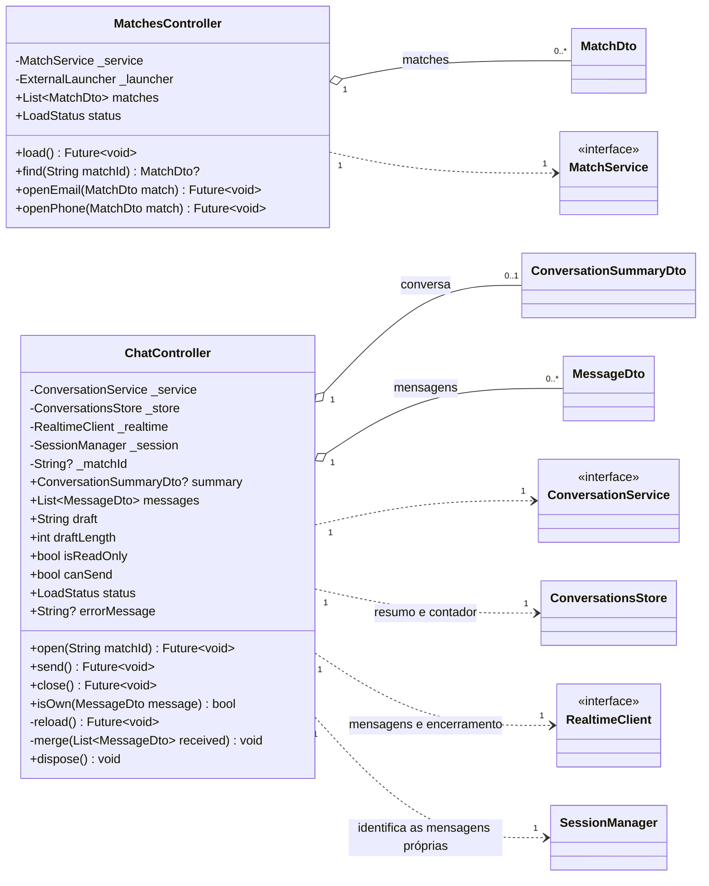
```mermaid
classDiagram
    direction LR
    class MatchesController {
        -MatchService _service
        -ExternalLauncher _launcher
        +List~MatchDto~ matches
        +LoadStatus status
        +load() Future~void~
        +find(String matchId) MatchDto?
        +openEmail(MatchDto match) Future~void~
        +openPhone(MatchDto match) Future~void~
    }
    class ChatController {
        -ConversationService _service
        -ConversationsStore _store
        -RealtimeClient _realtime
        -SessionManager _session
        -String? _matchId
        +ConversationSummaryDto? summary
        +List~MessageDto~ messages
        +String draft
        +int draftLength
        +bool isReadOnly
        +bool canSend
        +LoadStatus status
        +String? errorMessage
        +open(String matchId) Future~void~
        +send() Future~void~
        +close() Future~void~
        +isOwn(MessageDto message) bool
        -reload() Future~void~
        -merge(List~MessageDto~ received) void
        +dispose() void
    }
    class MatchService {
        <<interface>>
    }
    class ConversationService {
        <<interface>>
    }
    class RealtimeClient {
        <<interface>>
    }
    MatchesController "1" o-- "0..*" MatchDto : matches
    ChatController "1" o-- "0..1" ConversationSummaryDto : conversa
    ChatController "1" o-- "0..*" MessageDto : mensagens
    MatchesController "1" ..> "1" MatchService
    ChatController "1" ..> "1" ConversationService
    ChatController "1" ..> "1" ConversationsStore : resumo e contador
    ChatController "1" ..> "1" RealtimeClient : mensagens e encerramento
    ChatController "1" ..> "1" SessionManager : identifica as mensagens próprias
```

| Classe | Ecrãs | Responsabilidade | Requisitos |
| --- | --- | --- | --- |
| `MatchesController` | M14, M15 | Lista de matches, com a vaga e a Empresa de cada um, incluindo os de vagas encerradas ou de Empresas suspensas. Os contactos (correio eletrónico e telefone) já vêm no `MatchDto`, pelo que M15 não faz novo pedido; abrir o correio ou a chamada passa por `ExternalLauncher`. «Abrir conversa» navega para `ChatScreen` com o `matchId`. | RF024, RF025 |
| `ConversationsStore` (M16) | M16 | Ver a secção 8.1. A lista só mostra conversas dos matches do Candidato; o Administrador não tem acesso a conversas. | RF027 |
| `ChatController` | M17, M18 | Abre a conversa (`open`: devolve o histórico e o servidor marca as mensagens como lidas, RF108), envia (`send`) e encerra (`close`, depois do qual recarrega a lista de conversas para obter o motivo). O resumo (Empresa, vaga, estado) vem de `ConversationsStore`, porque `open` só devolve mensagens; quando a conversa é aberta a partir de uma notificação, o store é carregado primeiro. `canSend` exige conversa aberta e texto de 1 a 1000 caracteres (P03); em modo só de consulta, `isReadOnly` desativa a escrita e o ecrã passa a M18 (RF026, RF075). `isOwn` compara `senderId` com o utilizador da sessão para alinhar as mensagens. Enquanto o ecrã está aberto, ouve `messageReceived` (recarrega o histórico, secção 7.1), `conversationClosed` (recarrega a lista de conversas em `ConversationsStore`, para obter o `closeReason`, e passa a só de consulta) e as mudanças de estado da ligação. As mensagens são juntadas por `messageId`, sem duplicados, porque o servidor também pode entregar a mensagem enviada ao próprio remetente. | RF026, RF028, RF029, RF030, RF075, RF108 |
| `NotificationsStore` (M19) | M19 | Ver a secção 8.1. A lista mostra o texto, a data e a categoria de cada notificação, com «Marcar como lida» e o acesso ao elemento a que se refere (`targetOf`). | RF034 a RF036, RF110 |

---

## 9. Ecrãs e widgets

### 9.1. Estrutura de navegação

Os 21 ecrãs do protótipo correspondem a 17 classes de ecrã: M03, M10, M11 e M18 são estados de M02, M09 e M17 e não classes próprias (secção 12, DFM-12). `HomeShell` tem a barra de navegação inferior com os cinco separadores do protótipo; os ecrãs M06, M07 e M08 abrem por cima da barra.

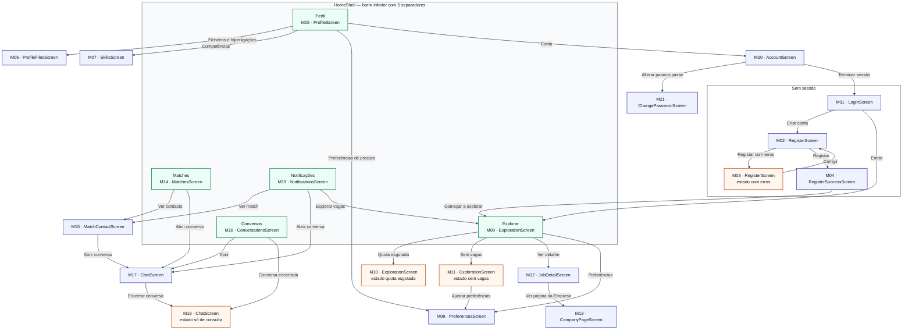
```mermaid
flowchart TB
    subgraph Sem["Sem sessão"]
        direction LR
        M01["M01 · LoginScreen"]
        M02["M02 · RegisterScreen"]
        M03["M03 · RegisterScreen<br/>estado com erros"]
        M04["M04 · RegisterSuccessScreen"]
    end
    subgraph Shell["HomeShell — barra inferior com 5 separadores"]
        direction LR
        TE["Explorar<br/>M09 · ExplorationScreen"]
        TM["Matches<br/>M14 · MatchesScreen"]
        TC["Conversas<br/>M16 · ConversationsScreen"]
        TN["Notificações<br/>M19 · NotificationsScreen"]
        TP["Perfil<br/>M05 · ProfileScreen"]
    end
    M10["M10 · ExplorationScreen<br/>estado quota esgotada"]
    M11["M11 · ExplorationScreen<br/>estado sem vagas"]
    M12["M12 · JobDetailScreen"]
    M13["M13 · CompanyPageScreen"]
    M15["M15 · MatchContactScreen"]
    M17["M17 · ChatScreen"]
    M18["M18 · ChatScreen<br/>estado só de consulta"]
    M20["M20 · AccountScreen"]
    M21["M21 · ChangePasswordScreen"]
    M06["M06 · ProfileFilesScreen"]
    M07["M07 · SkillsScreen"]
    M08["M08 · PreferencesScreen"]
    M01 -->|"Criar conta"| M02
    M02 -->|"Registar com erros"| M03
    M03 -->|"Corrigir"| M02
    M02 -->|"Registar"| M04
    M01 -->|"Entrar"| TE
    M04 -->|"Começar a explorar"| TE
    TE -->|"Quota esgotada"| M10
    TE -->|"Sem vagas"| M11
    TE -->|"Ver detalhe"| M12
    M12 -->|"Ver página da Empresa"| M13
    TE -->|"Preferências"| M08
    M11 -->|"Ajustar preferências"| M08
    TM -->|"Ver contacto"| M15
    TM -->|"Abrir conversa"| M17
    M15 -->|"Abrir conversa"| M17
    TC -->|"Abrir"| M17
    TC -->|"Conversa encerrada"| M18
    M17 -->|"Encerrar conversa"| M18
    TN -->|"Ver match"| M15
    TN -->|"Abrir conversa"| M17
    TN -->|"Explorar vagas"| TE
    TP -->|"Ficheiros e hiperligações"| M06
    TP -->|"Competências"| M07
    TP -->|"Preferências de procura"| M08
    TP -->|"Conta"| M20
    M20 -->|"Alterar palavra-passe"| M21
    M20 -->|"Terminar sessão"| M01
    classDef ecra fill:#eef2ff,stroke:#3730a3,stroke-width:1.5px,color:#111827
    classDef estado fill:#fff7ed,stroke:#c2410c,stroke-width:1.5px,color:#111827
    classDef tab fill:#ecfdf5,stroke:#047857,stroke-width:1.5px,color:#111827
    class M01,M02,M04,M06,M07,M08,M12,M13,M15,M17,M20,M21 ecra
    class M03,M10,M11,M18 estado
    class TE,TM,TC,TN,TP tab
    style Sem fill:#ffffff,stroke:#6b7280,stroke-width:1.5px,color:#111827
    style Shell fill:#f9fafb,stroke:#6b7280,stroke-width:1.5px,color:#111827
    linkStyle default stroke:#374151,stroke-width:1.5px
```

Os nós a verde são os cinco separadores de `HomeShell`, cada um com o seu ecrã inicial; os nós a laranja são estados de um ecrã. A partir de M09, cada uma das áreas do RNF011 (perfil profissional, preferências de procura, matches, conversas e notificações) está a uma ou duas interações: um toque no separador da barra inferior ou, nas preferências, no botão «Preferências» de M09.

### 9.2. Estrutura da aplicação

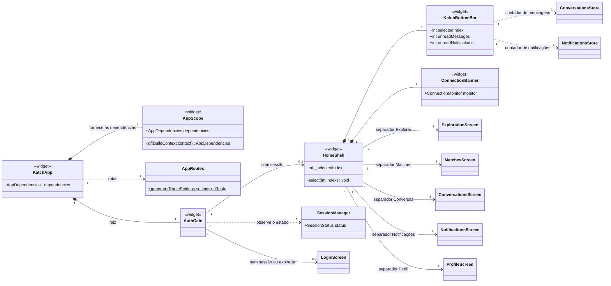
```mermaid
classDiagram
    direction LR
    class KatchApp {
        <<widget>>
        -AppDependencies _dependencies
    }
    class AppScope {
        <<widget>>
        +AppDependencies dependencies
        +of(BuildContext context)$ AppDependencies
    }
    class AppRoutes {
        +generate(RouteSettings settings)$ Route
    }
    class AuthGate {
        <<widget>>
    }
    class HomeShell {
        <<widget>>
        -int _selectedIndex
        -select(int index) void
    }
    class KatchBottomBar {
        <<widget>>
        +int selectedIndex
        +int unreadMessages
        +int unreadNotifications
    }
    class ConnectionBanner {
        <<widget>>
        +ConnectionMonitor monitor
    }
    class SessionManager {
        +SessionStatus status
    }
    KatchApp "1" *-- "1" AppScope : fornece as dependências
    KatchApp "1" *-- "1" AuthGate : raiz
    KatchApp "1" ..> "1" AppRoutes : rotas
    AuthGate "1" ..> "1" SessionManager : observa o estado
    AuthGate "1" --> "0..1" LoginScreen : sem sessão ou expirada
    AuthGate "1" --> "0..1" HomeShell : com sessão
    HomeShell "1" *-- "1" KatchBottomBar
    HomeShell "1" *-- "1" ConnectionBanner
    HomeShell "1" --> "1" ExplorationScreen : separador Explorar
    HomeShell "1" --> "1" MatchesScreen : separador Matches
    HomeShell "1" --> "1" ConversationsScreen : separador Conversas
    HomeShell "1" --> "1" NotificationsScreen : separador Notificações
    HomeShell "1" --> "1" ProfileScreen : separador Perfil
    KatchBottomBar "1" ..> "1" ConversationsStore : contador de mensagens
    KatchBottomBar "1" ..> "1" NotificationsStore : contador de notificações
```

| Classe | Responsabilidade | Requisitos |
| --- | --- | --- |
| `KatchApp` | Raiz da aplicação: `MaterialApp` com as rotas de `AppRoutes` e o `AppScope`. | — |
| `AppScope` | `InheritedWidget` que dá aos ecrãs as dependências de `AppDependencies` (serviços, stores e dispositivo), sem pacote de injeção de dependências (secção 12, DFM-03). | — |
| `AppRoutes` | Associa cada rota à classe de ecrã e aos seus argumentos (`jobId`, `companyId`, `matchId`). | — |
| `AuthGate` | Escolhe o que a aplicação mostra segundo `SessionManager.status`: um ecrã de espera (`LoadStateView`) enquanto restaura a sessão, o início de sessão e o registo sem sessão, ou `HomeShell` com sessão. Quando a sessão expira, volta a M01. | RNF005 |
| `HomeShell` | Contentor dos cinco separadores (Explorar, Matches, Conversas, Notificações e Perfil), com a barra inferior. Garante que cada área é alcançada em, no máximo, 3 interações a partir da exploração de vagas. | RNF011 |
| `KatchBottomBar` | Barra inferior com os cinco separadores; o separador «Conversas» mostra `unreadMessages` e o separador «Notificações» mostra `unreadNotifications`. | RF027, RF034, RNF011 |
| `ConnectionBanner` | Faixa que indica a falha de ligação quando `ConnectionMonitor.hasFailure`. | RNF014 |

### 9.3. Ecrãs e controllers

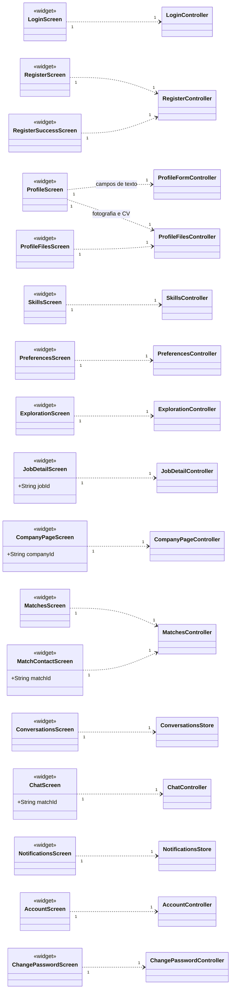
```mermaid
classDiagram
    direction LR
    class LoginScreen {
        <<widget>>
    }
    class RegisterScreen {
        <<widget>>
    }
    class RegisterSuccessScreen {
        <<widget>>
    }
    class ProfileScreen {
        <<widget>>
    }
    class ProfileFilesScreen {
        <<widget>>
    }
    class SkillsScreen {
        <<widget>>
    }
    class PreferencesScreen {
        <<widget>>
    }
    class ExplorationScreen {
        <<widget>>
    }
    class JobDetailScreen {
        <<widget>>
        +String jobId
    }
    class CompanyPageScreen {
        <<widget>>
        +String companyId
    }
    class MatchesScreen {
        <<widget>>
    }
    class MatchContactScreen {
        <<widget>>
        +String matchId
    }
    class ConversationsScreen {
        <<widget>>
    }
    class ChatScreen {
        <<widget>>
        +String matchId
    }
    class NotificationsScreen {
        <<widget>>
    }
    class AccountScreen {
        <<widget>>
    }
    class ChangePasswordScreen {
        <<widget>>
    }
    LoginScreen "1" ..> "1" LoginController
    RegisterScreen "1" ..> "1" RegisterController
    RegisterSuccessScreen "1" ..> "1" RegisterController
    ProfileScreen "1" ..> "1" ProfileFormController : campos de texto
    ProfileScreen "1" ..> "1" ProfileFilesController : fotografia e CV
    ProfileFilesScreen "1" ..> "1" ProfileFilesController
    SkillsScreen "1" ..> "1" SkillsController
    PreferencesScreen "1" ..> "1" PreferencesController
    ExplorationScreen "1" ..> "1" ExplorationController
    JobDetailScreen "1" ..> "1" JobDetailController
    CompanyPageScreen "1" ..> "1" CompanyPageController
    MatchesScreen "1" ..> "1" MatchesController
    MatchContactScreen "1" ..> "1" MatchesController
    ConversationsScreen "1" ..> "1" ConversationsStore
    ChatScreen "1" ..> "1" ChatController
    NotificationsScreen "1" ..> "1" NotificationsStore
    AccountScreen "1" ..> "1" AccountController
    ChangePasswordScreen "1" ..> "1" ChangePasswordController
```

Cada ecrã cria o seu controller em `initState`, obtendo as dependências de `AppScope`, e destrói-o em `dispose`. Os ecrãs que mostram estado partilhado (`ConversationsScreen`, `NotificationsScreen`) usam diretamente o store. `RegisterSuccessScreen` e `MatchContactScreen` partilham o controller do ecrã de onde vêm (`RegisterController` e `MatchesController`) para não repetirem pedidos.

### 9.4. Widgets principais

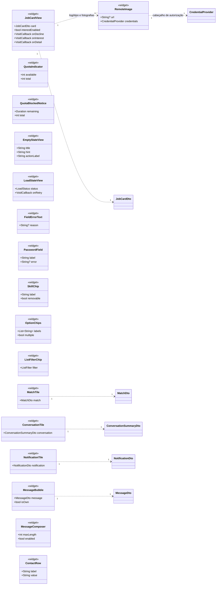
```mermaid
classDiagram
    direction LR
    class RemoteImage {
        <<widget>>
        +String? url
        +CredentialProvider credentials
    }
    class JobCardView {
        <<widget>>
        +JobCardDto card
        +bool interestEnabled
        +VoidCallback onDecline
        +VoidCallback onInterest
        +VoidCallback onDetail
    }
    class QuotaIndicator {
        <<widget>>
        +int available
        +int total
    }
    class QuotaBlockedNotice {
        <<widget>>
        +Duration remaining
        +int total
    }
    class EmptyStateView {
        <<widget>>
        +String title
        +String hint
        +String actionLabel
    }
    class LoadStateView {
        <<widget>>
        +LoadStatus status
        +VoidCallback onRetry
    }
    class FieldErrorText {
        <<widget>>
        +String? reason
    }
    class PasswordField {
        <<widget>>
        +String label
        +String? error
    }
    class SkillChip {
        <<widget>>
        +String label
        +bool removable
    }
    class OptionChips {
        <<widget>>
        +List~String~ labels
        +bool multiple
    }
    class ListFilterChip {
        <<widget>>
        +ListFilter filter
    }
    class MatchTile {
        <<widget>>
        +MatchDto match
    }
    class ConversationTile {
        <<widget>>
        +ConversationSummaryDto conversation
    }
    class NotificationTile {
        <<widget>>
        +NotificationDto notification
    }
    class MessageBubble {
        <<widget>>
        +MessageDto message
        +bool isOwn
    }
    class MessageComposer {
        <<widget>>
        +int maxLength
        +bool enabled
    }
    class ContactRow {
        <<widget>>
        +String label
        +String value
    }
    JobCardView "1" ..> "1" JobCardDto
    JobCardView "1" ..> "0..*" RemoteImage : logótipo e fotografias
    MatchTile "1" ..> "1" MatchDto
    ConversationTile "1" ..> "1" ConversationSummaryDto
    NotificationTile "1" ..> "1" NotificationDto
    MessageBubble "1" ..> "1" MessageDto
    RemoteImage "1" ..> "1" CredentialProvider : cabeçalho de autorização
```

| Widget | Responsabilidade | Usado em | Requisitos |
| --- | --- | --- | --- |
| `RemoteImage` | Mostra a fotografia ou o logótipo de um endereço da API. Esses endereços só servem o ficheiro com credencial, pelo que o pedido leva o cabeçalho de autorização. Sem endereço, mostra o marcador do protótipo (o «X»). | M05, M09, M12 a M16, M20 | RF010, RF013, RF017 |
| `JobCardView` | Cartão de vaga com função, designação e logótipo da Empresa, intervalo salarial, localidade e distância, tipo de contrato, regime, indicação de urgência e fotografias. Recusar, manifestar interesse e ver o detalhe são botões do cartão, e recusar e manifestar interesse também podem ser feitos com o gesto de deslizar para a esquerda ou para a direita, cada um com uma só interação. O logótipo e as fotografias só aparecem quando existem. | M09, M10 | RF013, RF018, RF019, RNF010 |
| `QuotaIndicator` | «Interesses disponíveis: n de 10». | M09 | RF022 |
| `QuotaBlockedNotice` | «Esgotou os 10 interesses. Poderá voltar a manifestar interesse dentro de n h m min.» | M10 | RF020 |
| `EmptyStateView` | Estado sem conteúdo, com a ação sugerida («Ajustar preferências»). | M11 | RF014 |
| `LoadStateView` | Indicador de carregamento e de erro, com a ação de repetir. | todos os ecrãs com pedidos | RNF014 |
| `FieldErrorText` | Motivo de rejeição junto do campo. | M01 a M03, M06 a M08, M21 | RF004 |
| `PasswordField` | Campo de palavra-passe com a indicação do formato exigido (P05). | M01, M02, M21 | RF001, RF002, RF003 |
| `SkillChip` | Etiqueta de competência, removível com um toque. | M05, M07 | RF008 |
| `OptionChips` | Seleção por etiquetas: disponibilidade (uma opção), regimes e tipos de contrato (várias). | M05, M08 | RF006, RF007 |
| `ListFilterChip` | Filtro «Todas» ou «Não lidas» da lista. | M16, M19 | RF027, RF034 |
| `MatchTile` | Linha de um match, com a vaga, a Empresa e as ações «Ver contacto» e «Abrir conversa». | M14 | RF024 |
| `ContactRow` | Linha de contacto (correio eletrónico ou telefone) que abre a aplicação externa. | M15 | RF025 |
| `ConversationTile` | Linha de uma conversa, com a Empresa, a vaga, o contador de mensagens por ler e a indicação de conversa encerrada. | M16 | RF027, RF075 |
| `MessageBubble` | Mensagem do histórico, alinhada pelo remetente, com a data e hora e a indicação de leitura nas mensagens enviadas pelo Candidato. | M17, M18 | RF028 |
| `MessageComposer` | Caixa de escrita com o contador «n/1000» e o botão «Enviar»; desativada quando a conversa é só de consulta. | M17, M18 | RF026, RF075 |
| `NotificationTile` | Notificação com o texto, a data, a categoria e as ações «Marcar como lida» e a de acesso ao elemento. | M19 | RF035, RF036 |

Os botões «Simular: ...» do protótipo servem para navegar entre estados do protótipo estático; não fazem parte da aplicação e não têm classe (secção 12, DFM-13).

---

## 10. Composição e interação entre camadas

### 10.1. Composição das dependências

`AppDependencies` é a raiz de composição: cria, uma vez, as instâncias que o resto da aplicação usa e liga-as por construtor. É criada em `main.dart` com a configuração do ambiente (`AppConfig`), antes de `KatchApp`.

```mermaid
classDiagram
    direction LR
    class AppConfig {
        +String apiBaseUrl
    }
    class AppDependencies {
        +create(AppConfig config)$ AppDependencies
        +dispose() void
    }
    class Clock {
        <<interface>>
    }
    class ConnectionMonitor
    class SessionManager
    class ApiClient {
        <<interface>>
    }
    class RealtimeClient {
        <<interface>>
    }
    class RealtimeCoordinator
    class DeviceFilePicker {
        <<interface>>
    }
    class ExternalLauncher {
        <<interface>>
    }
    class AuthService {
        <<interface>>
    }
    class CandidateProfileService {
        <<interface>>
    }
    class JobExplorationService {
        <<interface>>
    }
    class MatchService {
        <<interface>>
    }
    class ConversationService {
        <<interface>>
    }
    class NotificationService {
        <<interface>>
    }
    class ReferenceListService {
        <<interface>>
    }
    class ProfileStore
    class ConversationsStore
    class NotificationsStore
    class ReferenceDataStore
    AppDependencies "1" ..> "1" AppConfig : lê
    AppDependencies "1" *-- "1" Clock
    AppDependencies "1" *-- "1" ConnectionMonitor
    AppDependencies "1" *-- "1" SessionManager
    AppDependencies "1" *-- "1" ApiClient
    AppDependencies "1" *-- "1" RealtimeClient
    AppDependencies "1" *-- "1" RealtimeCoordinator
    AppDependencies "1" *-- "1" DeviceFilePicker
    AppDependencies "1" *-- "1" ExternalLauncher
    AppDependencies "1" *-- "1" AuthService
    AppDependencies "1" *-- "1" CandidateProfileService
    AppDependencies "1" *-- "1" JobExplorationService
    AppDependencies "1" *-- "1" MatchService
    AppDependencies "1" *-- "1" ConversationService
    AppDependencies "1" *-- "1" NotificationService
    AppDependencies "1" *-- "1" ReferenceListService
    AppDependencies "1" *-- "1" ProfileStore
    AppDependencies "1" *-- "1" ConversationsStore
    AppDependencies "1" *-- "1" NotificationsStore
    AppDependencies "1" *-- "1" ReferenceDataStore
```

### 10.2. Exemplo: manifestar interesse numa vaga

Manifestar interesse (UC05, ecrãs M09 e M10), com as multiplicidades de cada ligação.

```mermaid
classDiagram
    direction LR
    class ExplorationScreen {
        <<widget>>
    }
    class JobCardView {
        <<widget>>
        +VoidCallback onInterest
    }
    class ExplorationController {
        +expressInterest() Future~void~
    }
    class JobExplorationService {
        <<interface>>
        +expressInterest(String jobId) Future~QuotaDto~
        +getNextCard() Future~JobCardDto?~
    }
    class HttpJobExplorationService
    class ApiClient {
        <<interface>>
        +post(String path, Object? body) Future~Object?~
    }
    class HttpApiClient
    class CredentialProvider {
        <<interface>>
    }
    class SessionManager
    class QuotaDto {
        <<model>>
        +int available
        +DateTime? blockedUntil
    }
    class JobCardDto {
        <<model>>
    }
    class ApiRejection
    ExplorationScreen "1" *-- "1" JobCardView : cartão atual
    JobCardView "1" ..> "1" ExplorationController : onInterest
    ExplorationController "1" ..> "1" JobExplorationService : chama
    HttpJobExplorationService ..|> JobExplorationService
    HttpJobExplorationService "1" ..> "1" ApiClient : POST
    HttpApiClient ..|> ApiClient
    HttpApiClient "1" ..> "1" CredentialProvider : credencial
    SessionManager ..|> CredentialProvider
    JobExplorationService "1" ..> "1" QuotaDto : devolve
    JobExplorationService "1" ..> "0..1" JobCardDto : cartão seguinte
    ExplorationController "1" o-- "0..1" QuotaDto : guarda
    ExplorationController "1" o-- "0..1" JobCardDto : mostra
    HttpApiClient ..> ApiRejection : quota esgotada ou vaga indisponível
```

O Candidato toca em «Manifestar interesse» (ou desliza o cartão para a direita): `JobCardView` chama `onInterest` e o controller verifica que a quota tem interesses disponíveis. `expressInterest` chega ao `HttpApiClient`, que acrescenta a credencial de sessão e envia o pedido com tempo limite de 9 segundos. O servidor verifica a quota com controlo de concorrência, regista o interesse e devolve a `QuotaDto` atualizada; o controller guarda-a, deixa de mostrar a vaga e pede o cartão seguinte. Se este foi o décimo interesse, `blockedUntil` fica preenchido e o ecrã passa a M10. Se o servidor rejeitar o interesse, o `HttpApiClient` lança `ApiRejection` com o motivo, que o controller mostra sem alterar a quota (UC05, E1 a E3).

---

## 11. Correspondências

### 11.1. Ecrãs do protótipo (`I039`)

Os 21 ecrãs do protótipo, com os requisitos e os casos de uso que o próprio protótipo indica na legenda de cada ecrã.

| Ecrã | Nome no protótipo | Classe de ecrã (estado) | Controller ou store | Serviço e operação | Modelos | Requisitos | UC |
| --- | --- | --- | --- | --- | --- | --- | --- |
| M01 | Início de sessão | `LoginScreen` | `LoginController` | `AuthService.login` | `LoginRequest`, `LoginResponse`, `ApiErrorDto` | RF001 | UC01 |
| M02 | Registo | `RegisterScreen` (formulário) | `RegisterController`, `ReferenceDataStore` | `AuthService.register`; `ReferenceListService.listLocations` | `RegisterCandidateRequest`, `LoginResponse`, `ReferenceItemDto` | RF003 | UC03 |
| M03 | Registo com erros | `RegisterScreen` (estado com erros de campo) | `RegisterController` | `AuthService.register` | `ApiErrorDto`, `FieldErrorDto` | RF004 | UC03 |
| M04 | Conta ativa | `RegisterSuccessScreen` | `RegisterController` (`step = completed`) | — (a sessão começa com a `LoginResponse` do registo) | `LoginResponse` | RF005 | UC03 |
| M05 | Perfil profissional | `ProfileScreen` | `ProfileFormController`, `ProfileFilesController`, `ProfileStore` | `CandidateProfileService.getProfile`, `updateProfile`, `uploadPhoto`, `uploadCv`; `ReferenceListService.listLocations` | `CandidateProfileDto`, `UpdateCandidateProfileRequest`, `ReferenceItemDto` | RF006, RF010, RF011, RF012 | UC04 |
| M06 | Erros de ficheiro | `ProfileFilesScreen` | `ProfileFilesController` | `CandidateProfileService.uploadPhoto`, `uploadCv`, `setLinks` | `SetLinksRequest`, `CandidateProfileDto`, `ApiErrorDto` | RF010 a RF012 | UC04 |
| M07 | Competências | `SkillsScreen` | `SkillsController` | `CandidateProfileService.addSkill`, `removeSkill`; `ReferenceListService.listSkills` | `AddSkillRequest`, `ProfileSkillDto`, `ReferenceItemDto` | RF008, RF009 | UC04 |
| M08 | Preferências de procura | `PreferencesScreen` | `PreferencesController`, `ProfileStore` | `CandidateProfileService.updatePreferences` | `SearchPreferencesDto` | RF007, RF023 | UC04, UC05 |
| M09 | Exploração | `ExplorationScreen` (estado `card`) | `ExplorationController` | `JobExplorationService.getNextCard`, `decline`, `expressInterest`, `getQuota` | `JobCardDto`, `QuotaDto` | RF013, RF014, RF018, RF019, RF022 | UC05 |
| M10 | Quota esgotada | `ExplorationScreen` (estado `quotaExhausted`) | `ExplorationController` | `JobExplorationService.expressInterest` (rejeição), `getQuota` | `QuotaDto`, `ApiErrorDto` | RF020, RF021 | UC05 |
| M11 | Sem vagas | `ExplorationScreen` (estado `empty`) | `ExplorationController` | `JobExplorationService.getNextCard` (sem cartão) | — (`JobCardDto?` nulo) | RF014 | UC05 |
| M12 | Detalhe da vaga | `JobDetailScreen` | `JobDetailController` | `JobExplorationService.getDetail` | `JobDetailDto`, `JobCardDto` | RF016 | UC05 |
| M13 | Página da Empresa | `CompanyPageScreen` | `CompanyPageController` | `JobExplorationService.getCompanyPage` | `CompanyPageDto` | RF017 | UC06 |
| M14 | Matches | `MatchesScreen` | `MatchesController` | `MatchService.list` | `MatchDto` | RF024 | UC13 |
| M15 | Contacto do match | `MatchContactScreen` | `MatchesController` | — (os contactos já estão em `MatchDto`) | `MatchDto` | RF025 | UC13 |
| M16 | Lista de conversas | `ConversationsScreen` | `ConversationsStore` | `ConversationService.list` | `ConversationSummaryDto` | RF027 | UC14 |
| M17 | Conversa | `ChatScreen` (conversa aberta) | `ChatController` | `ConversationService.open`, `send`, `close` | `MessageDto`, `SendMessageRequest`, `ConversationSummaryDto` | RF026, RF028, RF030, RF108 | UC14 |
| M18 | Conversa só de consulta | `ChatScreen` (estado só de consulta) | `ChatController` | `ConversationService.open` | `ConversationSummaryDto`, `MessageDto` | RF026, RF030, RF075 | UC14 |
| M19 | Notificações | `NotificationsScreen` | `NotificationsStore` | `NotificationService.list`, `markRead` | `NotificationDto`, `NotificationListDto` | RF031 a RF036 | UC15 |
| M20 | Conta | `AccountScreen` | `AccountController`, `ProfileStore` | `AuthService.logout` | `CandidateProfileDto` | RF002, RF105 | UC01, UC02 |
| M21 | Alterar palavra-passe | `ChangePasswordScreen` | `ChangePasswordController` | `AuthService.changePassword` | `ChangePasswordRequest`, `ApiErrorDto` | RF002 | UC02 |

### 11.2. Controllers e hubs do backend

Cada operação dos sete controllers usados pelo Candidato tem uma operação no serviço correspondente, com os mesmos parâmetros e resultados (secção 5). O método, a rota e a secção são os de `m2-documentacao-api-v01.md`.

| Controller | Operação do controller | Método e rota (API) | API | Serviço e operação na aplicação | Ecrãs |
| --- | --- | --- | --- | --- | --- |
| `AuthController` | `RegisterCandidate` | `POST /api/auth/candidates` | 6.1.1 | `AuthService.register` | M02, M03 |
| `AuthController` | `Login` | `POST /api/auth/login` (cabeçalho `X-Client-App: mobile`) | 6.1.3 | `AuthService.login` | M01 |
| `AuthController` | `Logout` | `POST /api/auth/logout` | 6.1.4 | `AuthService.logout` | M20 |
| `AuthController` | `ChangePassword` | `PUT /api/auth/password` | 6.1.5 | `AuthService.changePassword` | M21 |
| `CandidateProfileController` | `Get` | `GET /api/candidate/profile` | 6.2.1 | `CandidateProfileService.getProfile` | M05, M20 |
| `CandidateProfileController` | `Update` | `PUT /api/candidate/profile` | 6.2.2 | `CandidateProfileService.updateProfile` | M05 |
| `CandidateProfileController` | `UpdatePreferences` | `PUT /api/candidate/profile/preferences` | 6.2.3 | `CandidateProfileService.updatePreferences` | M08 |
| `CandidateProfileController` | `AddSkill` | `POST /api/candidate/profile/skills` | 6.2.4 | `CandidateProfileService.addSkill` | M07 |
| `CandidateProfileController` | `RemoveSkill` | `DELETE /api/candidate/profile/skills/{candidateSkillId}` | 6.2.5 | `CandidateProfileService.removeSkill` | M07 |
| `CandidateProfileController` | `SetLinks` | `PUT /api/candidate/profile/links` | 6.2.6 | `CandidateProfileService.setLinks` | M06 |
| `CandidateProfileController` | `UploadPhoto` | `PUT /api/candidate/profile/photo` | 6.2.7 | `CandidateProfileService.uploadPhoto` | M05, M06 |
| `CandidateProfileController` | `UploadCv` | `PUT /api/candidate/profile/cv` | 6.2.8 | `CandidateProfileService.uploadCv` | M05, M06 |
| `JobExplorationController` | `GetNextCard` | `GET /api/candidate/jobs/next` | 6.3.1 | `JobExplorationService.getNextCard` | M09, M10, M11 |
| `JobExplorationController` | `GetDetail` | `GET /api/candidate/jobs/{jobId}` | 6.3.2 | `JobExplorationService.getDetail` | M12 |
| `JobExplorationController` | `GetCompanyPage` | `GET /api/candidate/jobs/companies/{companyId}` | 6.3.3 | `JobExplorationService.getCompanyPage` | M13 |
| `JobExplorationController` | `Decline` | `POST /api/candidate/jobs/{jobId}/decline` | 6.3.4 | `JobExplorationService.decline` | M09, M10 |
| `JobExplorationController` | `ExpressInterest` | `POST /api/candidate/jobs/{jobId}/interest` | 6.3.5 | `JobExplorationService.expressInterest` | M09, M10 |
| `JobExplorationController` | `GetQuota` | `GET /api/candidate/jobs/quota` | 6.3.6 | `JobExplorationService.getQuota` | M09, M10 |
| `MatchesController` | `List` | `GET /api/matches` | 6.7.1 | `MatchService.list` | M14, M15 |
| `ConversationsController` | `List` | `GET /api/conversations` | 6.8.1 | `ConversationService.list` | M16, M17, M18 |
| `ConversationsController` | `Open` | `GET /api/conversations/{matchId}/messages` | 6.8.2 | `ConversationService.open` | M17, M18 |
| `ConversationsController` | `Send` | `POST /api/conversations/{matchId}/messages` | 6.8.3 | `ConversationService.send` | M17 |
| `ConversationsController` | `Close` | `POST /api/conversations/{matchId}/close` | 6.8.4 | `ConversationService.close` | M17 |
| `NotificationsController` | `List` | `GET /api/notifications` | 6.9.1 | `NotificationService.list` | M19 |
| `NotificationsController` | `MarkRead` | `POST /api/notifications/{notificationId}/read` | 6.9.2 | `NotificationService.markRead` | M19 |
| `ReferenceListsController` | `ListLocations` | `GET /api/reference-lists/locations` | 6.13.1 | `ReferenceListService.listLocations` | M02, M05 |
| `ReferenceListsController` | `ListSkills` | `GET /api/reference-lists/skills` | 6.13.2 | `ReferenceListService.listSkills` | M07 |

São 27 operações de 7 controllers. Não são usadas pelo Candidato: `AuthController.CreateRecruiterAccount` (UC07); `ReferenceListsController.ListBenefits` (os benefícios da vaga chegam como texto em `JobDetailDto.benefits`) e as operações de acrescento e alteração de competências e benefícios, reservadas ao Administrador (UC20); e os controllers `CompanyController`, `JobsController`, `CandidateEvaluationController`, `AdminAccountsController`, `AdminCompaniesController` e `AdminIndicatorsController`, que são do Recrutador e do Administrador.

| Hub | Evento | Cliente | Ecrãs |
| --- | --- | --- | --- |
| `MessagesHub` | `MessageReceived` | `RealtimeClient.messageReceived` | M17, M18; contador de M16 e da barra inferior |
| `MessagesHub` | `ConversationClosed` | `RealtimeClient.conversationClosed` | M17, M18, M16 |
| `NotificationsHub` | `NotificationReceived` | `RealtimeClient.notificationReceived` | M19; contador da barra inferior; M09 e M10 (reposição da quota) |

### 11.3. DTOs e enumerações do backend

| DTO do backend | Modelo na aplicação | Direção | Serviço ou evento | Ecrãs |
| --- | --- | --- | --- | --- |
| `RegisterCandidateRequest` | `RegisterCandidateRequest` | Pedido | `AuthService.register` | M02 |
| `LoginRequest` | `LoginRequest` | Pedido | `AuthService.login` | M01 |
| `LoginResponse` | `LoginResponse` | Resposta | `AuthService.login`, `AuthService.register` | M01, M02, M04 |
| `ChangePasswordRequest` | `ChangePasswordRequest` | Pedido | `AuthService.changePassword` | M21 |
| `CandidateProfileDto` | `CandidateProfileDto` | Resposta | `CandidateProfileService.getProfile`, `updateProfile`, `addSkill`, `setLinks` | M05 a M08, M20 |
| `ProfileSkillDto` | `ProfileSkillDto` | Resposta | (dentro de `CandidateProfileDto`) | M05, M07 |
| `UpdateCandidateProfileRequest` | `UpdateCandidateProfileRequest` | Pedido | `CandidateProfileService.updateProfile` | M05 |
| `SearchPreferencesDto` | `SearchPreferencesDto` | Pedido e resposta | `CandidateProfileService.updatePreferences` | M05, M08 |
| `AddSkillRequest` | `AddSkillRequest` | Pedido | `CandidateProfileService.addSkill` | M07 |
| `SetLinksRequest` | `SetLinksRequest` | Pedido | `CandidateProfileService.setLinks` | M06 |
| `JobCardDto` | `JobCardDto` | Resposta | `JobExplorationService.getNextCard` | M09, M10, M12 |
| `JobDetailDto` | `JobDetailDto` | Resposta | `JobExplorationService.getDetail` | M12 |
| `CompanyPageDto` | `CompanyPageDto` | Resposta | `JobExplorationService.getCompanyPage` | M13 |
| `QuotaDto` | `QuotaDto` | Resposta | `JobExplorationService.expressInterest`, `getQuota` | M09, M10 |
| `MatchDto` | `MatchDto` | Resposta | `MatchService.list` | M14, M15 |
| `ConversationSummaryDto` | `ConversationSummaryDto` | Resposta | `ConversationService.list` | M16 a M18 |
| `MessageDto` | `MessageDto` | Resposta e evento | `ConversationService.open`, `send`; `MessageReceived` | M17, M18 |
| `SendMessageRequest` | `SendMessageRequest` | Pedido | `ConversationService.send` | M17 |
| `NotificationDto` | `NotificationDto` | Resposta e evento | (dentro de `NotificationListDto`); `NotificationReceived` | M19 |
| `NotificationListDto` | `NotificationListDto` | Resposta | `NotificationService.list` | M19 |
| `ReferenceItemDto` | `ReferenceItemDto` | Resposta | `ReferenceListService.listLocations`, `listSkills` | M02, M05, M07 |
| `ApiErrorDto` | `ApiErrorDto` | Resposta de erro | Todos os serviços (`ApiRejection`) | M01 a M08, M17, M21 |
| `FieldErrorDto` | `FieldErrorDto` | Resposta de erro | (dentro de `ApiErrorDto`) | M02, M03, M06 a M08, M21 |

São 23 modelos, um por cada um dos 23 DTOs usados pelo Candidato. Os 18 DTOs restantes, dos 41 do backend, não têm modelo, porque pertencem a casos de uso do Recrutador ou do Administrador:

| Utilizador | DTOs sem modelo na aplicação |
| --- | --- |
| Recrutador (UC07 a UC12) | `CreateRecruiterAccountRequest`, `CompanyRegistrationRequest`, `CompanyPageRequest`, `CompanyStatusDto`, `JobRequest`, `JobDto`, `WaitingCandidateDto`, `CandidateFullProfileDto`, `SkillTagDto` |
| Recrutador e Administrador (UC07, UC16) | `CompanyRegistrationDto` |
| Administrador (UC16 a UC20) | `RejectCompanyRequest`, `PendingCompanyDto`, `CompanyAdminDto`, `PublishedJobAdminDto`, `AccountDto`, `CandidateAdminDto`, `IndicatorsDto`, `ReferenceItemRequest` |

Enumerações: `UserType`, `Availability`, `WorkMode`, `ContractType`, `ConversationStatus` e `ConversationCloseReason` têm os mesmos valores que no backend. `NotificationType` tem os três valores dirigidos ao Candidato e `unknown` (secção 3.3). As restantes enumerações do backend (`AccountStatus`, `Industry`, `CompanyStatus`, `JobStatus`, `JobCloseReason`, `CandidateDecision`, `RecruiterDecision`, `MatchStatus`, `EntityType`, `OperationType`, `FileKind` e `ClientApp`) não aparecem em nenhum DTO que o Candidato receba ou envie.

### 11.4. Arquitetura e Regulamento Interno

| Origem | Exigência | Classes |
| --- | --- | --- |
| Arquitetura, 2.1 e 2.3 | A aplicação móvel é o ponto de acesso exclusivo do Candidato. | `SessionManager.start` (rejeita outros tipos de conta), `AuthGate`, as 17 classes de ecrã |
| Arquitetura, 2.3 | Funcionalidades da aplicação móvel: F001, F002, F004, F006, F008, F010 e F011. | F001: M01, M20, M21; F002: M02 a M04; F004: M05 a M08; F006: M09 a M12; F008: M14, M15; F010: M16 a M18; F011: M19 (a página da Empresa, M13, é da F003, ver PC-08) |
| Arquitetura, 2.4 | Aplicação móvel → API REST, em HTTPS e JSON, com o token JWT em cada pedido. | `ApiClient`, `HttpApiClient`, `CredentialProvider`, `SessionManager`, os 7 serviços |
| Arquitetura, 2.4 e AD-02 | Mensagens e notificações por ligação bidirecional persistente, em tempo real, dentro da aplicação. Tecnologia por ratificar (D-08). | `RealtimeClient`, `SignalRRealtimeClient`, `HubChannel`, `ReconnectPolicy`, `RealtimeCoordinator` |
| Arquitetura, 2.4 | Sem notificações nativas do sistema operativo, nem envio por correio eletrónico ou SMS. | Nenhuma classe de envio; as notificações vivem em `NotificationsStore` e `NotificationsScreen`. `ExternalLauncher` só abre aplicações externas por iniciativa do Candidato. |
| Arquitetura, 2.5 | Sem serviços externos de mapas ou de geolocalização. | A distância chega calculada em `JobCardDto.distanceKm`; não há classes de localização. |
| Arquitetura, 2.6 | Cliente–servidor com interface REST única; autenticação sem estado de sessão no servidor. | `ApiClient` e os 7 serviços; `CredentialProvider.authHeaders`; `AuthenticationFailure` |
| Arquitetura, 2.7 | Desempenho: RNF002 (cartão seguinte em 2 segundos). | `ExplorationController` (PC-06) |
| Arquitetura, 2.7 | Usabilidade: RNF010 (uma interação por ação sobre o cartão) e RNF011 (3 interações para cada área). | `JobCardView`; `HomeShell` e `KatchBottomBar` |
| Arquitetura, 2.7 | Fiabilidade: RNF014 (indicação de falha de ligação em 10 segundos). | `HttpApiClient`, `ConnectionMonitor`, `ConnectionBanner` |
| Arquitetura, 2.7 | Segurança: RNF004 a RNF006 (credencial válida, expiração e autorização de cada pedido). | `SessionManager`, `HttpApiClient`; nenhum serviço envia o identificador do utilizador |
| Arquitetura, 3.3 e 3.4 | Flutter 3.47.x e Dart 3.13.x; `flutter_test` e `integration_test`; versões dos pacotes fixadas no `pubspec.yaml`. | Secção 2.3 |
| RI, 11.2 | Flutter 3.47.x, Dart 3.13.x, pub, VS Code ou Android Studio. | Módulo inteiro |
| RI, 11.3 | Effective Dart, `dart format`. | Secção 2.2 |
| RI, 11.4 | `flutter_lints` com `analysis_options.yaml`. | Secção 2.3 |
| RI, 11.5 | Cobertura mínima de 40% sobre widgets e lógica de estado; exclui ficheiros gerados. | Camadas Estado e Ecrãs e widgets (secção 8); os modelos são escritos à mão, sem ficheiros gerados (DFM-04) |
| RI, 11.6 | Testes de sistema automáticos (`integration_test`, QG-07). | Fluxos M01 a M21 (secção 11.1) |

### 11.5. Requisitos

| Requisito | Classes |
| --- | --- |
| RF001 | `LoginScreen`, `LoginController`, `AuthService.login`, `SessionManager.start` |
| RF002 | `ChangePasswordScreen`, `ChangePasswordController`, `AuthService.changePassword`, `InputRules.isValidPassword` |
| RF003 | `RegisterScreen`, `RegisterController`, `ReferenceDataStore`, `AuthService.register` |
| RF004 | `RegisterController`, `FieldErrors`, `InputRules`, `FieldErrorText`, `ApiErrorDto`, `FieldErrorDto` |
| RF005 | `RegisterSuccessScreen`, `RegisterController.step`, `SessionManager.start` |
| RF006 | `ProfileScreen`, `ProfileFormController`, `CandidateProfileService.updateProfile`, `OptionChips` |
| RF007 | `PreferencesScreen`, `PreferencesController`, `CandidateProfileService.updatePreferences`, `SearchPreferencesDto` |
| RF008 | `SkillsScreen`, `SkillsController`, `ReferenceListService.listSkills`, `CandidateProfileService.addSkill` e `removeSkill`, `SkillChip` |
| RF009 | `SkillsController.addCustom`, `InputRules.isValidCustomSkill`, `AddSkillRequest` |
| RF010 | `ProfileFilesController.pickPhoto`, `DeviceFilePicker.pickImage`, `InputRules.photoError`, `CandidateProfileService.uploadPhoto`, `RemoteImage` |
| RF011 | `ProfileFilesController.pickCv`, `DeviceFilePicker.pickPdf`, `InputRules.cvError`, `CandidateProfileService.uploadCv` |
| RF012 | `ProfileFilesController.setLink`, `InputRules.isValidLink`, `CandidateProfileService.setLinks`, `SetLinksRequest` |
| RF013 | `ExplorationScreen`, `JobCardView`, `JobCardDto`, `ExplorationController.load`, `JobExplorationService.getNextCard` |
| RF014 | `ExplorationController` (estado `empty`, M11); a seleção das vagas é feita no servidor e o cliente não filtra |
| RF015 | Servidor (cálculo da distância); a aplicação mostra `JobCardDto.distanceKm` |
| RF016 | `JobDetailScreen`, `JobDetailController`, `JobExplorationService.getDetail`, `JobDetailDto` |
| RF017 | `CompanyPageScreen`, `CompanyPageController`, `JobExplorationService.getCompanyPage`, `CompanyPageDto`, `ExternalLauncher.openUrl` |
| RF018 | `ExplorationController.decline`, `JobCardView.onDecline`, `JobExplorationService.decline` |
| RF019 | `ExplorationController.expressInterest`, `JobCardView.onInterest`, `JobExplorationService.expressInterest` |
| RF020 | `ExplorationController` (estado `quotaExhausted`, `remainingBlock`), `QuotaBlockedNotice`, `QuotaDto.blockedUntil` |
| RF021 | `ExplorationController.refreshQuota`, `NotificationsStore`, `QuotaDto` |
| RF022 | `QuotaIndicator`, `ExplorationController.quota`, `JobExplorationService.getQuota` |
| RF023 | `PreferencesScreen` aberto a partir de `ExplorationScreen`, `ProfileStore.updatePreferences`, `ExplorationController.load` |
| RF024 | `MatchesScreen`, `MatchesController`, `MatchService.list`, `MatchTile` |
| RF025 | `MatchContactScreen`, `MatchDto.contactEmail` e `contactPhone`, `ContactRow`, `ExternalLauncher` |
| RF026 | `ChatController.send`, `MessageComposer`, `InputRules.isValidMessage`, `ConversationService.send`, `SendMessageRequest` |
| RF027 | `ConversationsScreen`, `ConversationsStore`, `ConversationService.list`, `ConversationTile` |
| RF028 | `ChatScreen`, `ChatController.open`, `ConversationService.open`, `MessageBubble`, `MessageDto` |
| RF029 | `RealtimeClient.messageReceived`, `SignalRRealtimeClient`, `RealtimeCoordinator`, `ChatController` |
| RF030 | `ChatController.close`, `ConversationService.close`, `ConversationsStore.onConversationClosed` |
| RF031 a RF033 | O servidor gera as notificações; a aplicação recebe-as em `NotificationsStore.apply` e `NotificationService.list` e mostra-as em `NotificationTile` (tipos `matchConfirmed`, `newMessage` e `interestQuotaRestored`) |
| RF034 | `NotificationsScreen`, `NotificationsStore.load`, `NotificationService.list`, `NotificationListDto`, `KatchBottomBar` |
| RF035 | `NotificationsStore.markRead`, `NotificationService.markRead`, `NotificationTile` |
| RF036 | `NotificationsStore.targetOf`, `NotificationTarget`, `HomeShell` |
| RF075 | `ChatController.isReadOnly`, `ConversationsStore.onConversationClosed`, `MessageComposer.enabled`, `ConversationStatus`, `ConversationCloseReason`, `RealtimeClient.conversationClosed` |
| RF105 | `AccountScreen`, `AccountController.signOut`, `AuthService.logout`, `SessionManager.end`, `SessionScopedStore.reset` |
| RF108 | `ChatController.open` (o servidor marca as mensagens como lidas), `ConversationsStore.markOpened` |
| RF110 | `RealtimeClient.notificationReceived`, `NotificationsStore.apply`, `RealtimeCoordinator` |
| RNF002 | `ExplorationController` (pede o cartão seguinte logo que o servidor confirma a resposta, PC-06) |
| RNF005 | `SessionManager.scheduleExpiry` e `expire`, `AuthGate` |
| RNF010 | `JobCardView` (três botões e os gestos de deslizar, cada ação com uma só interação) |
| RNF011 | `HomeShell`, `KatchBottomBar` |
| RNF014 | `HttpApiClient` (tempo limite de 9 segundos), `ConnectionMonitor`, `ConnectionBanner`, `LoadStateView` |

---

## 12. Decisões de desenho

| ID | Decisão | Fundamentação |
| --- | --- | --- |
| DFM-01 | Sete camadas (Ecrãs e widgets, Estado, Serviços, Tempo real, Sessão, Núcleo e Modelos) com a regra de dependência da secção 2.1. | Separa o que muda por razões diferentes e permite testar a lógica de estado sem a interface (RI, secção 11.5). O Núcleo não depende da Sessão: `CredentialProvider` inverte a dependência. |
| DFM-02 | Estado com `ChangeNotifier` do Flutter, sem pacote de gestão de estado. | O Regulamento Interno não fixa nenhum pacote e a arquitetura não acrescenta dependências sem necessidade. O que muda se o grupo preferir um pacote é só a camada Estado. |
| DFM-03 | Um serviço por controller do backend, definido como `abstract interface class` e injetado por construtor; `AppDependencies` e `AppScope` fazem a composição, sem pacote de injeção de dependências. Cada pacote de terceiros (HTTP, armazenamento seguro, ligação persistente, ficheiros e aplicações externas) fica atrás de uma interface. | Cada serviço corresponde a um controller identificável e rastreável aos casos de uso; os testes usam implementações simuladas; a escolha de um pacote altera uma só classe. |
| DFM-04 | Os modelos têm o mesmo nome e os mesmos atributos dos DTOs, são imutáveis e escritos à mão, com `fromJson` e `toJson`. Sem geração de código. | Rastreabilidade direta ao backend (secção 11.3); 23 classes pequenas não justificam a dependência nem a etapa de construção, e os ficheiros ficam todos sob a cobertura de 40% do RI, secção 11.5, que só exclui ficheiros gerados. |
| DFM-05 | A ligação persistente fica atrás de `RealtimeClient`, com `SignalRRealtimeClient` como implementação proposta. O estado só depende da interface. | A tecnologia (D-08) está por ratificar e há uma alternativa proposta, a consulta periódica (`m2-decisao-consulta-periodica-mensagens-notificacoes-v01.md`). Se for aprovada, só a implementação de `RealtimeClient` muda e os controllers e os stores ficam iguais. É a mesma separação que o backend faz com `IRealtimePublisher` (DC-07). |
| DFM-06 | Tempo limite de 9 segundos em cada pedido. | O RNF014 exige a indicação de falha de ligação em, no máximo, 10 segundos depois do envio do pedido; 9 segundos deixam 1 segundo para a apresentar. É superior aos 5 segundos do carregamento de um ficheiro de 5 MB (RNF015). |
| DFM-07 | A sessão é guardada no armazenamento seguro do dispositivo e termina em `expiresAt` ou quando o servidor recusa a credencial. | O ecrã M20 indica que o dispositivo está ligado à conta; a credencial dura 8 horas (RNF005, P20) e o servidor não guarda estado de sessão (arquitetura, 2.6). |
| DFM-08 | A validação local só dá o motivo ao Candidato mais depressa; o servidor aplica as mesmas regras e decide. Os motivos do servidor, por campo, prevalecem. | RNF008 e RNF016: o servidor valida 100% das regras, incluindo os pedidos diretos e o conteúdo real dos ficheiros. |
| DFM-09 | `RemoteImage` envia a credencial de sessão ao pedir imagens. | Os endereços de fotografias e logótipos dos DTOs servem o ficheiro depois de verificar a autorização (backend, secção 7). A API v01 ainda não tem a operação que serve esses endereços, nem fixa o seu formato (API, 2.6 e PA-01), pelo que a classe fica por validar até à correção (PC-10). |
| DFM-10 | Navegação por barra inferior com os cinco separadores do protótipo; ações do cartão como botões e gestos. | RNF011 (3 interações para cada área) e RNF010 (uma interação por ação sobre o cartão). |
| DFM-11 | `ChatController` junta as mensagens por `messageId` e, ao receber `MessageReceived`, recarrega o histórico da conversa aberta em vez de acrescentar a mensagem. | O evento não identifica a conversa (PC-02) e o servidor pode entregar ao remetente a mensagem que ele próprio enviou. Recarregar com `open` é idempotente e já marca as mensagens como lidas. |
| DFM-12 | Os ecrãs M03, M10, M11 e M18 são estados de `RegisterScreen`, `ExplorationScreen` e `ChatScreen`, e não classes. | São variantes do mesmo ecrã que dependem do estado do controller (erros de campo, quota esgotada, sem vagas, conversa só de consulta). |
| DFM-13 | Os botões «Simular: ...» do protótipo não fazem parte da aplicação. | Servem para navegar entre estados do protótipo estático. |
| DFM-14 | O registo inicia a sessão com a `LoginResponse` que o servidor devolve. | O backend devolve uma `LoginResponse` em `RegisterCandidate`; o ecrã M04 («A sua conta está ativa» e «Começar a explorar») segue-se sem novo início de sessão (RF005). |

---

## 13. Pontos de coerência a resolver

Os pontos seguintes são incoerências entre o protótipo (`I039`), o modelo de classes do backend (`I036`), a arquitetura (`I033`) e a especificação, detetadas ao cruzar estes documentos com o modelo da aplicação móvel. Este documento não altera esses artefactos: modela a aplicação sem inventar atributos nem operações que o backend não tem, descreve como o modelo se comporta até haver decisão e indica quem deve resolver cada ponto. A documentação da API (`I092`) fixou entretanto o contrato: o PC-05 ficou resolvido e os PC-01, PC-02, PC-10, PC-11 e PC-12 correspondem a pontos em aberto da própria API (PA-04, PA-02, PA-01, PA-10 e PA-05), que têm as mesmas decisões a tomar; a coluna «Ponto da API» faz a ligação.

| ID | Situação | Impacto | Tratamento neste modelo | Proposta de resolução | Ponto da API |
| --- | --- | --- | --- | --- | --- |
| PC-01 | O registo (UC03, passo 2; M02) mostra a lista pré-definida de localidades antes do início de sessão, mas o backend só permite a consulta das listas pré-definidas com sessão iniciada (`ReferenceListsController`, secção 6). | O ecrã de registo não consegue carregar as localidades; sem localidade, o registo é rejeitado (RF003, RF004). | `ReferenceListService.listLocations` e `ReferenceDataStore` funcionam sem sessão; `HttpApiClient` não exige a credencial nesta operação. | Especificação de requisitos (secção 2.2) e `I036`: acrescentar a consulta de localidades às operações não reservadas e permitir `ListLocations` sem credencial (API, PA-04). | PA-04 |
| PC-02 | O evento `MessageReceived` leva um `MessageDto`, que não tem o identificador do match. | A aplicação não sabe a que conversa pertence a mensagem; não pode atualizar o contador da lista nem acrescentar a mensagem à conversa certa. | A lista de conversas é recarregada e o histórico da conversa aberta é recarregado por `open` (DFM-11); correto mas com um pedido a mais. | `I036`: acrescentar `Guid matchId` a `PublishMessageAsync` e enviar `MessageReceived(matchId, message)` (API, PA-02). Com isso, `ChatController` passa a acrescentar a mensagem sem novo pedido. | PA-02 |
| PC-03 | M14 e M15 mostram o estado do match («Match ativo», «Vaga encerrada», «Empresa suspensa»), o logótipo da Empresa e a localidade da vaga, que `MatchDto` não tem. | O RF024 exige listar também os matches de vagas encerradas e de Empresas suspensas; sem um atributo de estado, a aplicação não os distingue. | `MatchDto` espelha o backend; M14 e M15 mostram só a vaga, a Empresa e os contactos. | `I036`: acrescentar a `MatchDto` o estado da vaga e da Empresa, `logoUrl` e `locationName`; ou retirar estes elementos do protótipo (`I039`). | Relacionado com PA-08: a mesma proposta serve M14 e M15 |
| PC-04 | M16 mostra o logótipo da Empresa e M18 indica que a conversa «foi encerrada pela Empresa», mas `ConversationSummaryDto` não tem logótipo e `closedByParty` não diz qual das partes encerrou. | A aplicação não pode mostrar o logótipo na lista nem dizer quem encerrou a conversa. | `ConversationTile` mostra o marcador sem logótipo; M18 mostra «Esta conversa foi encerrada» e, para os outros motivos, o motivo que o `closeReason` indica. | `I036`: acrescentar `logoUrl` e a indicação da parte que encerrou; ou ajustar o protótipo (`I039`). | — |
| PC-05 | `IAuthService.LoginAsync(request, ClientApp)` recebe a aplicação de origem (móvel ou web), mas `LoginRequest` não tem esse dado. | O servidor tinha de saber que o pedido vem da aplicação móvel (RF001: o Candidato só entra pela aplicação móvel). | Resolvido: a API fixou o cabeçalho `X-Client-App: mobile` no início de sessão, com ERR-05 para contas que não sejam do Candidato (API, 3.2 e DAPI-02); `HttpAuthService.login` envia-o. | Nenhuma. Ponto fechado. | Resolvido (API 3.2, DAPI-02, ERR-05) |
| PC-06 | O RNF002 exige o cartão seguinte em 2 segundos depois do registo de uma resposta, e o RNF001 permite 2 segundos a cada operação. A aplicação faz dois pedidos em sequência (a resposta e o cartão seguinte). | No pior caso, os dois pedidos somam 4 segundos, acima do RNF002. | `ExplorationController` pede o cartão seguinte logo que o servidor confirma a resposta. | `I036`: devolver o cartão seguinte na resposta de `Decline` e de `ExpressInterest`; ou confirmar em `m3` que os dois pedidos cumprem o RNF002 com os dados de demonstração. | — |
| PC-07 | `QuotaDto` só tem os interesses disponíveis, e «n de 10» (M09) exige o total. | O total fica fixo na aplicação (`quotaTotal` = 10, parâmetro P11) e deixa de estar certo se o P11 mudar. | `ExplorationController.quotaTotal` com o valor de P11. | `I036`: acrescentar o total a `QuotaDto`. | — |
| PC-08 | A arquitetura (secção 2.3) não indica a F003 nas funcionalidades da aplicação móvel, mas o RF017 (F003, UC06) e o ecrã M13 são do Candidato. | A linha da aplicação móvel da secção 2.3 fica incompleta. | M13 está no modelo (`CompanyPageScreen`), segundo o RF017 e o protótipo. | `I033`: acrescentar a F003 à linha da aplicação móvel da secção 2.3. | — |
| PC-09 | O ecrã M01 do protótipo mostra o motivo «Credenciais inválidas» e acrescenta «A conta também pode estar bloqueada ou suspensa», juntando num só texto motivos que a API devolve distintos: ERR-02 (credenciais), ERR-03 (bloqueada), ERR-04 (suspensa) e ERR-05 (ponto de acesso). | Incoerente com o RF001, que exige a indicação do motivo também quando a conta está bloqueada ou suspensa. O RNF009 só uniformiza o motivo das credenciais erradas. | `LoginController` apresenta a `message` do `ApiErrorDto` devolvido (secção 8.2). | `I039`: corrigir M01 para mostrar o motivo devolvido (API, 6.1.3 e 4.3). | — |
| PC-10 | Não há operação da API que sirva os endereços dos ficheiros referidos nos DTOs (`photoUrl`, `logoUrl`, `photoUrls`), nem o formato do endereço está fixado (API, 2.6). | `RemoteImage` e os ecrãs M05, M09, M12 a M16 e M20 não conseguem mostrar fotografias nem logótipos. | `RemoteImage` assume um endereço da API que serve o ficheiro com a credencial de sessão (DFM-09) e mostra o marcador do protótipo sem imagem. | `I036` e documentação da API: acrescentar a operação que serve os ficheiros (API, PA-01). | PA-01 |
| PC-11 | O RNF007 admite que o Candidato obtenha o próprio CV, mas o backend não tem essa operação. | O Candidato não consegue confirmar o curriculum vitae que enviou (RF011). | A aplicação só envia o CV e mostra `hasCv` (secção 3.1). | `I036` e `I035`: acrescentar `GET /api/candidate/profile/cv` (API, PA-10). | PA-10 |
| PC-12 | O `ApiErrorDto` não tem código de erro, e o `403` de conta bloqueada ou suspensa (ERR-03 e ERR-04) tem o mesmo código HTTP que ERR-06, ERR-07 e ERR-08. | A aplicação só distingue a conta bloqueada ou suspensa pela mensagem fixa do catálogo da API, o que falha se a mensagem mudar. | `HttpApiClient` classifica esse `403` pela mensagem de ERR-03 e de ERR-04 (secção 4.1). | `I036`: acrescentar o código de erro ao `ApiErrorDto` (API, PA-05). | PA-05 |

---

## 14. Limitações

| Limitação | Consequência |
| --- | --- |
| O modelo depende do protótipo (`I039`, ainda em consolidação na `I087`), do modelo de classes do backend (`I036`), da documentação da API (`I092`) e da arquitetura (`I033`). | Uma alteração a qualquer deles obriga a rever as classes afetadas. Se a consolidação dos protótipos mudar o nome do ficheiro do protótipo da aplicação móvel, as referências deste documento têm de ser atualizadas. |
| O contrato da API (`I092`) ainda tem pontos em aberto (PA-01 a PA-10), cinco dos quais afetam este modelo (PC-01, PC-02, PC-10, PC-11 e PC-12). | Se a decisão alterar o contrato, mudam os serviços, os modelos e as classes de tempo real afetados; a camada de ecrãs só muda no PC-10. |
| A tecnologia da ligação persistente (D-08) está por ratificar em reunião formal (Regulamento da UC, secção 10.1), e a consulta periódica é uma alternativa proposta. | Só `SignalRRealtimeClient` muda (DFM-05). Com consulta periódica, o RF029 e o RF110 continuam cumpridos no limite de 5 segundos (P17), mas o cliente passa a fazer pedidos a cada 3 segundos. |
| Os pacotes de terceiros não estão escolhidos. | A escolha fica na configuração base do repositório (`pubspec.yaml`); cada pacote fica atrás de uma interface. |
| Algumas ações do protótipo gravam vários elementos em pedidos separados: M06 (fotografia, CV e hiperligações) e M07 (competências). A API não tem uma operação única. | A mensagem «Os dados não foram guardados» de M06 pode não ser verdadeira se um pedido falhar depois de outro ter sido aceite. Mitigação: a validação local de todos os elementos antes do primeiro pedido e a recarga do perfil depois de qualquer falha, para mostrar o que ficou gravado. |
| Não há evento de leitura de mensagens na ligação persistente. | A indicação «Lida» das mensagens enviadas só se atualiza quando a conversa é recarregada. |
| Fora do âmbito: notificações nativas do sistema operativo, funcionamento sem ligação à rede e serviços externos de mapas (arquitetura, secções 2.4 e 2.5). | A aplicação só mostra mensagens e notificações com a aplicação aberta e a sessão iniciada. |
| O modelo não descreve a conceção visual dos ecrãs, os testes nem a configuração do repositório. | Estão no protótipo (`I039`), nos testes de `m3` e `m4` e na configuração base do `katch-frontend-mobile`. |

---

## 15. Cobertura e índice de classes

### 15.1. Cobertura

| Verificação | Resultado |
| --- | --- |
| Ecrãs M01 a M21 do protótipo da `I039` | 21 de 21: 17 classes de ecrã e 4 estados de ecrã (M03, M10, M11 e M18). Secção 11.1. |
| Controllers do backend usados pelo Candidato | 7 de 7, cada um com um serviço, e 27 operações de 27. Secção 11.2. |
| Hubs do backend | 2 de 2 (`MessagesHub` e `NotificationsHub`), com os 3 eventos, em `RealtimeClient`. Secções 7 e 11.2. |
| DTOs | 23 modelos, um por cada um dos 23 DTOs que o Candidato usa; os outros 18 DTOs do backend (41 no total) não têm modelo e estão justificados. Secção 11.3. |
| Enumerações | 7 enumerações espelhadas. Secção 3.3. |
| Casos de uso | UC01 a UC06 e UC13 a UC15. Secção 11.1. |
| Requisitos | 40 requisitos funcionais (RF001 a RF036, RF075, RF105, RF108 e RF110) e 5 não funcionais (RNF002, RNF005, RNF010, RNF011 e RNF014). Secção 11.5. |
| Pontos de coerência | 12 (PC-01 a PC-12), dos quais 1 resolvido pela API (PC-05) e 5 ligados a pontos em aberto da API (PC-01, PC-02, PC-10, PC-11 e PC-12). Secção 13. |
| Diagramas Mermaid | 22: 19 diagramas de classes, 2 fluxogramas e 1 diagrama de sequência. |
| Classes do módulo | 141: 136 desenhadas nos diagramas e 5 implementações `Http...` descritas na secção 5. |

### 15.2. Índice de classes

`ChangeNotifier` e `WidgetsBindingObserver`, que aparecem nos diagramas, são classes do Flutter e não pertencem ao módulo.

| Camada ou grupo | Nº | Classes |
| --- | --- | --- |
| Ecrãs (17 classes de ecrã) | 17 | `LoginScreen`, `RegisterScreen`, `RegisterSuccessScreen`, `ProfileScreen`, `ProfileFilesScreen`, `SkillsScreen`, `PreferencesScreen`, `ExplorationScreen`, `JobDetailScreen`, `CompanyPageScreen`, `MatchesScreen`, `MatchContactScreen`, `ConversationsScreen`, `ChatScreen`, `NotificationsScreen`, `AccountScreen`, `ChangePasswordScreen` |
| Estrutura da aplicação | 7 | `KatchApp`, `AppScope`, `AppRoutes`, `AuthGate`, `HomeShell`, `AppDependencies`, `AppConfig` |
| Widgets | 19 | `KatchBottomBar`, `ConnectionBanner`, `RemoteImage`, `JobCardView`, `QuotaIndicator`, `QuotaBlockedNotice`, `EmptyStateView`, `LoadStateView`, `FieldErrorText`, `PasswordField`, `SkillChip`, `OptionChips`, `ListFilterChip`, `MatchTile`, `ConversationTile`, `NotificationTile`, `MessageBubble`, `MessageComposer`, `ContactRow` |
| Estado — controllers | 13 | `LoginController`, `RegisterController`, `ChangePasswordController`, `AccountController`, `ProfileFormController`, `ProfileFilesController`, `SkillsController`, `PreferencesController`, `ExplorationController`, `JobDetailController`, `CompanyPageController`, `MatchesController`, `ChatController` |
| Estado — stores e enumerações de estado | 9 | `SessionScopedStore`, `ProfileStore`, `ConversationsStore`, `NotificationsStore`, `ReferenceDataStore`, `LoadStatus`, `ListFilter`, `ExplorationStatus`, `RegistrationStep` |
| Serviços (interfaces e implementações Http) | 14 | `AuthService`, `CandidateProfileService`, `JobExplorationService`, `MatchService`, `ConversationService`, `NotificationService`, `ReferenceListService`, `HttpAuthService`, `HttpJobExplorationService`, `HttpCandidateProfileService`, `HttpMatchService`, `HttpConversationService`, `HttpNotificationService`, `HttpReferenceListService` |
| Tempo real | 7 | `RealtimeClient`, `SignalRRealtimeClient`, `HubChannel`, `ReconnectPolicy`, `RealtimeCoordinator`, `RealtimeState`, `NotificationReceivedEvent` |
| Sessão | 5 | `Session`, `SessionStatus`, `SessionStorage`, `SecureSessionStorage`, `SessionManager` |
| Núcleo | 16 | `ApiClient`, `HttpApiClient`, `CredentialProvider`, `ConnectionMonitor`, `ApiException`, `ApiRejection`, `AuthenticationFailure`, `ConnectionFailure`, `UnexpectedFailure`, `Clock`, `SystemClock`, `InputRules`, `DeviceFilePicker`, `PlatformFilePicker`, `ExternalLauncher`, `PlatformExternalLauncher` |
| Modelos — espelho dos DTOs (23) | 23 | `RegisterCandidateRequest`, `LoginRequest`, `LoginResponse`, `ChangePasswordRequest`, `CandidateProfileDto`, `ProfileSkillDto`, `UpdateCandidateProfileRequest`, `SearchPreferencesDto`, `AddSkillRequest`, `SetLinksRequest`, `JobCardDto`, `JobDetailDto`, `CompanyPageDto`, `QuotaDto`, `MatchDto`, `ConversationSummaryDto`, `MessageDto`, `SendMessageRequest`, `NotificationDto`, `NotificationListDto`, `ReferenceItemDto`, `ApiErrorDto`, `FieldErrorDto` |
| Modelos — enumerações (7) e auxiliares | 11 | `UserType`, `Availability`, `WorkMode`, `ContractType`, `ConversationStatus`, `ConversationCloseReason`, `NotificationType`, `FileSelection`, `FieldErrors`, `NotificationTarget`, `NotificationTargetKind` |
| **Total** | **141** | |
