# Modelo de Classes — Frontend Web

**Unidade curricular:** Laboratório de Desenvolvimento de Software — LDS
**Milestone:** `m2`
**Ficheiro:** `m2-modelo-classes-frontend-web-v01.md`
**Pasta de arquivo:** `04-artefactos-tecnicos/04.07-modelos-de-classes`

---

## 1. Identificação do documento

| Campo | Informação |
| --- | --- |
| Grupo | G11 |
| Sistema | Katch |
| Ano letivo | 2026/2027 |
| Curso | LEI — Licenciatura em Engenharia Informática |
| Turma | LEI3T2 |
| Versão do documento | v01 |
| Módulo | Área de gestão web (`katch-frontend-web`), React 19.3 com TypeScript 7.0 e Vite 8.3 |
| Issue | `I090` — Elaborar o modelo de classes do frontend web |
| Executor / Revisor / Auditor | Roberto Baptista / João Borguem / Miguel Santos |
| Documentos de origem | `m2-documentacao-arquitetura-v01.md` (secções 2 e 3, `I033` e `I034`), `m2-modelo-classes-backend-v01.md` (`I036`), `m2-especificacao-requisitos-v01.md` (RF037 a RF118 com componente Frontend web, RNF004 a RNF009, RNF012, RNF018; parâmetros P01 a P21), `m2-especificacoes-casos-uso-v01.md` (UC01, UC02, UC07 a UC20), protótipos de baixa fidelidade aceites na `I040` (Recrutador, ecrãs W01 a W26) e na `I041` (Administrador, ecrãs A01 a A11), a consolidar em `m2-prototipo-baixa-fidelidade-v01.pdf` pela `I087`, `m2-diagrama-estados-interesse-match-v01.md` (`I086`), `m2-modelo-de-dados-katch-v01.md` (DM-02, `I035`), `m2-decisao-consulta-periodica-mensagens-notificacoes-v01.md` (alternativa pendente à ligação persistente), `m2-documentacao-api-v01.md` (secções 2 a 8 e 11, `I092`), `m1-regulamento-grupo-v01.pdf` (secções 11.2 a 11.5), `m2-backlog-projeto-v03.xlsx` (Issue `I090`) |

O documento segue a secção 19 do Regulamento de Funcionamento da Unidade Curricular para `04.07-modelos-de-classes`: um ficheiro por módulo relevante, com classes, responsabilidades, atributos, operações, relações e multiplicidades. Corresponde à linha `OF-M2-008` — «Modelo de classes — frontend web v1» da Checklist de Controlo de Artefactos.

### 1.1. Histórico de versões

| Versão | Data | Descrição das alterações | Issue |
| --- | --- | --- | --- |
| v01 | 2026-10-08 | Criação do documento: camadas, tipos dos DTOs e enumerações, cliente da API e serviços, ficheiros protegidos, ligação persistente, sessão, rotas protegidas por tipo de conta e por estado da Empresa, páginas e componentes do Recrutador e do Administrador, estado dos ecrãs, dependências do backend por resolver, divergências com os protótipos e rastreabilidade. | `I090` |
| v01 | 2026-10-09 | Alinhamento com a documentação da API v01 (`I092`) antes da revisão: enumerações com os valores JSON da API, cabeçalho `X-Client-App`, tratamento dos erros do catálogo da API, carregamentos em `multipart/form-data`, pedido HTTP de cada operação dos serviços, autenticação e eventos dos hubs; dependências G1 a G10 confrontadas com os pontos em aberto PA-01 a PA-06 da API e acrescentadas G11 e G12. | `I090` |
| v01 | 2026-10-09 | Alinhamento com a versão revista da documentação da API v01 (`I092`): lista de matches só com Empresa aprovada (6.7.1), com a rota `/matches`, a moldura do Recrutador e a divergência P2 ajustadas; ERR-35 também na abertura do perfil e na obtenção do CV; dependências G1, G2, G4, G5 e G10 confrontadas com PA-03 e PA-07 a PA-09; cabeçalho `X-Client-App` descrito como exigido no início de sessão. | `I090` |
| v01 | 2026-10-09 | Melhorias M01 a M06 do relatório de revisão (ciclo 1): ligações página → hook, página → componente e hook → serviço com multiplicidades nos diagramas (nova secção 8.4, relações dos componentes partilhados em 8.1 e dos hooks aos serviços na secção 9); `IResourceState` com o prefixo `I`; exceção do `useProtectedFile` na regra da secção 9; ecrãs da `RecruiterShell`; modelo de dados e decisão da consulta periódica nos documentos de origem; destino da notificação `COMPANY_APPROVED` registado (DF-13). | `I090` |

Cada alteração posterior acrescenta uma linha. As versões anteriores são conservadas, nos termos da secção 18.2 do Regulamento de Funcionamento da Unidade Curricular.

---

## 2. Âmbito e convenções

### 2.1. Módulo e camadas

O módulo é a área de gestão web, o cliente do Recrutador e do Administrador (arquitetura, secção 2.3). Não acede à base de dados nem ao sistema de ficheiros: tudo o que apresenta vem da API REST e, no caso do Recrutador, as mensagens e as notificações novas chegam pela ligação bidirecional persistente (arquitetura, secção 2.4; backend, secção 6.1).

A aplicação móvel do Candidato é um módulo distinto, com modelo de classes próprio (`I091`). Por isso, os controllers `CandidateProfileController` e `JobExplorationController` do backend não têm serviço correspondente neste módulo.

| Camada | Pasta | Responsabilidade | Depende de |
| --- | --- | --- | --- |
| Páginas | `src/pages` | Uma página por ecrã do protótipo, com os estados e diálogos desse ecrã. Compõe componentes, invoca hooks e trata os estados de carregamento, de erro e de lista vazia. Não chama a API diretamente. | Componentes, Hooks, Sessão |
| Componentes | `src/components` | Blocos de interface reutilizáveis, sem conhecimento da API. Recebem dados por propriedades e devolvem eventos. | Tipos, Hooks (só `useProtectedFile`) |
| Rotas | `src/routes` | Declaração das rotas e proteção por sessão, por tipo de conta e pelo estado da Empresa. | Sessão, Páginas |
| Hooks | `src/hooks` | Estado de cada ecrã: invoca os serviços, guarda o resultado e expõe as operações às páginas. | Serviços, Tempo real, Tipos |
| Serviços | `src/services` | Um serviço por controller do backend usado neste módulo. Traduz cada operação da interface numa chamada da API. | Cliente da API, Tipos |
| Cliente da API | `src/api` | Pedido HTTP, credencial de sessão no cabeçalho, limite de tempo, tradução dos erros, obtenção de ficheiros protegidos e deteção da falha de ligação. | Sessão, Tipos |
| Tempo real | `src/realtime` | Ligação bidirecional persistente aos dois hubs do backend (só para o Recrutador) e entrega dos acontecimentos aos hooks. | Sessão, Tipos |
| Sessão | `src/session` | Credencial de sessão, tipo de conta, expiração e estado da Empresa do Recrutador. | Serviços, Tempo real, Tipos |
| Tipos | `src/types` | Espelho dos DTOs e das enumerações do backend e mapa de designações em português. Sem lógica. | — |

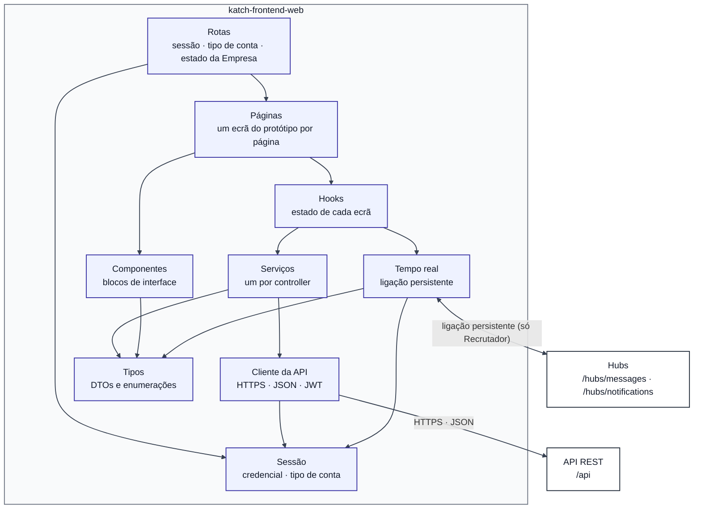

### 2.2. Convenções de código e de diagrama

- **Nomes:** Airbnb TypeScript/React Style Guide, verificado por ESLint e Prettier (RI, secções 11.3 e 11.4). Componentes, páginas e tipos em PascalCase; funções, variáveis e propriedades em camelCase; hooks com o prefixo `use`; interfaces com o prefixo `I`.
- **Tipos:** os tipos do cliente espelham os DTOs do backend com os mesmos nomes e os mesmos campos em camelCase (por exemplo, `CompanyStatusDto.CompanyId` ↔ `companyId`), que é a forma por omissão da serialização JSON do ASP.NET Core. Correspondências: `Guid` ↔ `string`; `DateTimeOffset` ↔ `string` em ISO 8601; `DateOnly` ↔ `string` no formato `aaaa-MM-dd`; `decimal` e `int` ↔ `number`; `bool` ↔ `boolean`; `List<T>` ↔ `T[]`; `T?` ↔ `T | null`. As datas e horas chegam em UTC com o sufixo `Z` e são convertidas para a hora local só na apresentação. As enumerações do backend são uniões de literais de texto com os valores JSON da API, em maiúsculas com `_` e iguais aos do PostgreSQL: `ContractType.ServiceProvision` ↔ `"SERVICE_PROVISION"` (documentação da API, secções 2.3 e 2.4, DAPI-01). As enumerações próprias do cliente (`LoginArea`, `RealtimeStatus`) não vão para a API e usam PascalCase.
- **Diagramas Mermaid (`classDiagram`):** `+` público, `-` privado; atributos na forma `tipo nome`, como no modelo de classes do backend; `T?` = valor que pode ser `null`; `~T~` = tipo genérico. Estereótipos: `<<interface>>`, `<<enumeration>>`, `<<type>>` (tipo de dados sem lógica), `<<page>>`, `<<component>>`, `<<hook>>` e `<<context>>` (contexto React).
- **Relações:** `--` associação com multiplicidades; `*--` composição (o elemento composto só existe dentro do todo); `..>` dependência (uso por importação ou por propriedade); `..|>` realização de interface; `<|--` especialização.
- **Assíncrono:** as operações dos serviços, do cliente da API e dos hooks que fazem pedidos devolvem `Promise<T>`; nos diagramas indica-se apenas `T`, como no modelo de classes do backend (secção 2.2).
- **Páginas, componentes e hooks:** são funções React. A notação de classe representa as propriedades (atributos), o estado exposto e os comandos de interface (operações), como exige a secção 19 do Regulamento da UC para os modelos de classes.

---

## 3. Tipos do cliente

### 3.1. Enumerações

As enumerações são as do backend (modelo de classes do backend, secção 3.5) usadas pela área de gestão web, com os valores JSON da documentação da API (secção 2.4). Um valor fora da lista é rejeitado pelo servidor com `400`.

```mermaid
classDiagram
    direction LR
    class UserType {
        <<enumeration>>
        CANDIDATE
        RECRUITER
        ADMIN
    }
    class AccountStatus {
        <<enumeration>>
        ACTIVE
        BLOCKED
        SUSPENDED
    }
    class CompanyStatus {
        <<enumeration>>
        PENDING
        APPROVED
        REJECTED
        SUSPENDED
    }
    class JobStatus {
        <<enumeration>>
        UNPUBLISHED
        PUBLISHED
        SUSPENDED
        CLOSED
    }
    class ContractType {
        <<enumeration>>
        PERMANENT
        FIXED_TERM
        INTERNSHIP
        SERVICE_PROVISION
    }
    class WorkMode {
        <<enumeration>>
        ON_SITE
        HYBRID
        REMOTE
    }
    class Availability {
        <<enumeration>>
        IMMEDIATE
        FIFTEEN_DAYS
        ONE_MONTH
        TO_BE_AGREED
    }
    class Industry {
        <<enumeration>>
        TECHNOLOGY
        HEALTHCARE
        RETAIL
        HOSPITALITY
        CONSTRUCTION
        MANUFACTURING
        EDUCATION
        FINANCE
        LOGISTICS
        SERVICES
        OTHER
    }
    class ConversationStatus {
        <<enumeration>>
        OPEN
        CLOSED
    }
    class ConversationCloseReason {
        <<enumeration>>
        CLOSED_BY_PARTY
        ACCOUNT_BLOCKED_OR_SUSPENDED
        COMPANY_SUSPENDED
    }
    class NotificationType {
        <<enumeration>>
        MATCH_CONFIRMED
        NEW_MESSAGE
        NEW_INTEREST
        COMPANY_APPROVED
        COMPANY_REJECTED
        INTEREST_QUOTA_RESTORED
    }
```

`CandidateDecision`, `RecruiterDecision`, `MatchStatus`, `JobCloseReason`, `EntityType`, `OperationType`, `FileKind` e `ClientApp` não são usadas: nenhum DTO as contém e não fazem parte do contrato (documentação da API, secção 2.4). O ponto de acesso (`ClientApp`) é indicado no cabeçalho `X-Client-App` (secção 4.1). `INTEREST_QUOTA_RESTORED` existe no tipo, mas nunca é dirigida ao Recrutador nem ao Administrador.

A língua da interface é apenas o português (arquitetura, secção 2.5). As designações apresentadas estão num único mapa de apresentação (`src/types/labels.ts`):

| Enumeração | Designações em português | Origem |
| --- | --- | --- |
| `UserType` | Candidato; Recrutador; Administrador | RF085 |
| `AccountStatus` | ativa; bloqueada; suspensa | RF085, RF088 |
| `CompanyStatus` | pendente; aprovada; recusada; suspensa | RF044, RF097 |
| `JobStatus` | Não publicada; Publicada; Suspensa; Encerrada | W09, W21 |
| `ContractType` | Sem termo; A termo; Estágio; Prestação de serviços | P09 |
| `WorkMode` | Presencial; Híbrido; Remoto | P16 |
| `Availability` | Imediata; 15 dias; 1 mês; A combinar | P14 |
| `Industry` | Tecnologia; Saúde; Comércio; Hotelaria e restauração; Construção; Indústria; Educação; Finanças; Logística; Serviços; Outro | P15 |
| `ConversationStatus` | Aberta; Encerrada | W22, W23 |
| `ConversationCloseReason` | Encerrada por uma das partes; Conta bloqueada ou suspensa; Empresa suspensa | RF074, RF075 |
| `NotificationType` | Ação apresentada: `NEW_INTEREST` «Ver candidatos»; `MATCH_CONFIRMED` «Ver match»; `NEW_MESSAGE` «Abrir conversa»; `COMPANY_APPROVED` e `COMPANY_REJECTED` «Ver dados da Empresa» | W24, RF082 |

O texto de cada notificação vem pronto do servidor (`NotificationDto.text`); o cliente só escolhe a ação pelo tipo e abre o elemento indicado em `targetId` (documentação da API, secção 7.3): `NEW_INTEREST` → identificador da vaga (`/candidatos?vaga=:jobId`); `MATCH_CONFIRMED` → identificador do match (`/matches`); `NEW_MESSAGE` → identificador do match (`/conversas?match=:matchId`); `COMPANY_APPROVED` e `COMPANY_REJECTED` → identificador da Empresa (`/empresa` se aprovada, `/empresa/estado` se recusada). A documentação da API (secção 7.3) indica, para os dois tipos, o «Estado do pedido de registo»; no `COMPANY_APPROVED`, o cliente abre `/empresa` porque a rota `/empresa/estado` só admite Empresas pendentes, recusadas ou suspensas (secção 7.2, decisão DF-13).

### 3.2. Tipos dos DTOs

Os tipos espelham os DTOs do backend (modelo de classes do backend, secções 7.1 e 7.2), campo a campo. São tipos de dados sem lógica.

```mermaid
classDiagram
    direction LR
    class LoginRequest {
        <<type>>
        +string email
        +string password
    }
    class LoginResponse {
        <<type>>
        +string token
        +string expiresAt
        +UserType userType
        +string userId
    }
    class CreateRecruiterAccountRequest {
        <<type>>
        +string email
        +string password
        +boolean acceptTerms
    }
    class ChangePasswordRequest {
        <<type>>
        +string currentPassword
        +string newPassword
    }
    class CompanyRegistrationRequest {
        <<type>>
        +string companyName
        +string taxId
        +Industry industry
        +string address
        +string locationId
        +string contactEmail
        +string contactPhone
        +string responsibleName
    }
    class CompanyRegistrationDto {
        <<type>>
        +string companyId
        +string companyName
        +string taxId
        +Industry industry
        +string address
        +string locationName
        +string contactEmail
        +string contactPhone
        +string responsibleName
        +string submittedAt
    }
    class CompanyStatusDto {
        <<type>>
        +string companyId
        +CompanyStatus status
        +string? rejectionReason
        +string submittedAt
    }
    class CompanyPageDto {
        <<type>>
        +string companyId
        +string companyName
        +string? description
        +string? website
        +string? logoUrl
        +string[] photoUrls
    }
    class CompanyPageRequest {
        <<type>>
        +string? description
        +string? website
    }
    class JobRequest {
        <<type>>
        +string title
        +string description
        +number minSalary
        +number maxSalary
        +string locationId
        +ContractType contractType
        +WorkMode workMode
        +string[] skillIds
        +string[] benefitIds
        +boolean isUrgent
        +string? expiresAt
    }
    class JobDto {
        <<type>>
        +string jobId
        +string title
        +string description
        +number minSalary
        +number maxSalary
        +string locationId
        +string locationName
        +ContractType contractType
        +WorkMode workMode
        +ReferenceItemDto[] skills
        +ReferenceItemDto[] benefits
        +boolean isUrgent
        +string? expiresAt
        +JobStatus status
        +string? publishedAt
        +string[] photoUrls
        +number waitingCandidates
    }
    class ReferenceItemDto {
        <<type>>
        +string id
        +string name
    }
    class ReferenceItemRequest {
        <<type>>
        +string name
    }
    JobDto "1" *-- "0..*" ReferenceItemDto : competências e benefícios
```

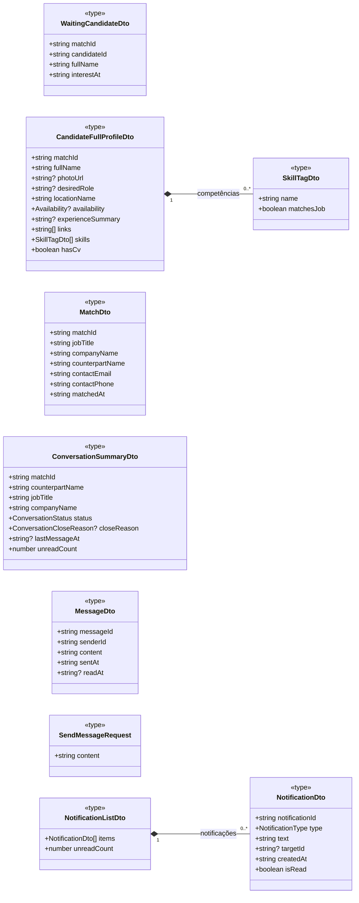

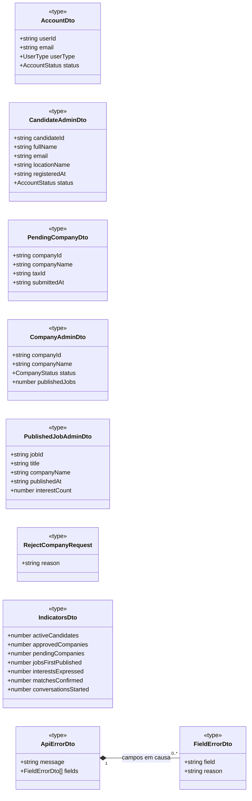

São 31 tipos. Os tipos próprios do Candidato (`RegisterCandidateRequest`, `CandidateProfileDto`, `ProfileSkillDto`, `UpdateCandidateProfileRequest`, `SearchPreferencesDto`, `AddSkillRequest`, `SetLinksRequest`, `JobCardDto`, `JobDetailDto`, `QuotaDto`) pertencem ao modelo de classes da aplicação móvel (`I091`).

`photoUrl`, `logoUrl` e `photoUrls` são endereços da API que servem o ficheiro depois de verificar a autorização (backend, secção 7.2). O cliente nunca constrói caminhos de ficheiros; obtém o conteúdo como descrito na secção 4.3. A operação que serve esses endereços ainda não existe (dependência G11; documentação da API, PA-01).

---

## 4. Acesso à API

### 4.1. Cliente da API

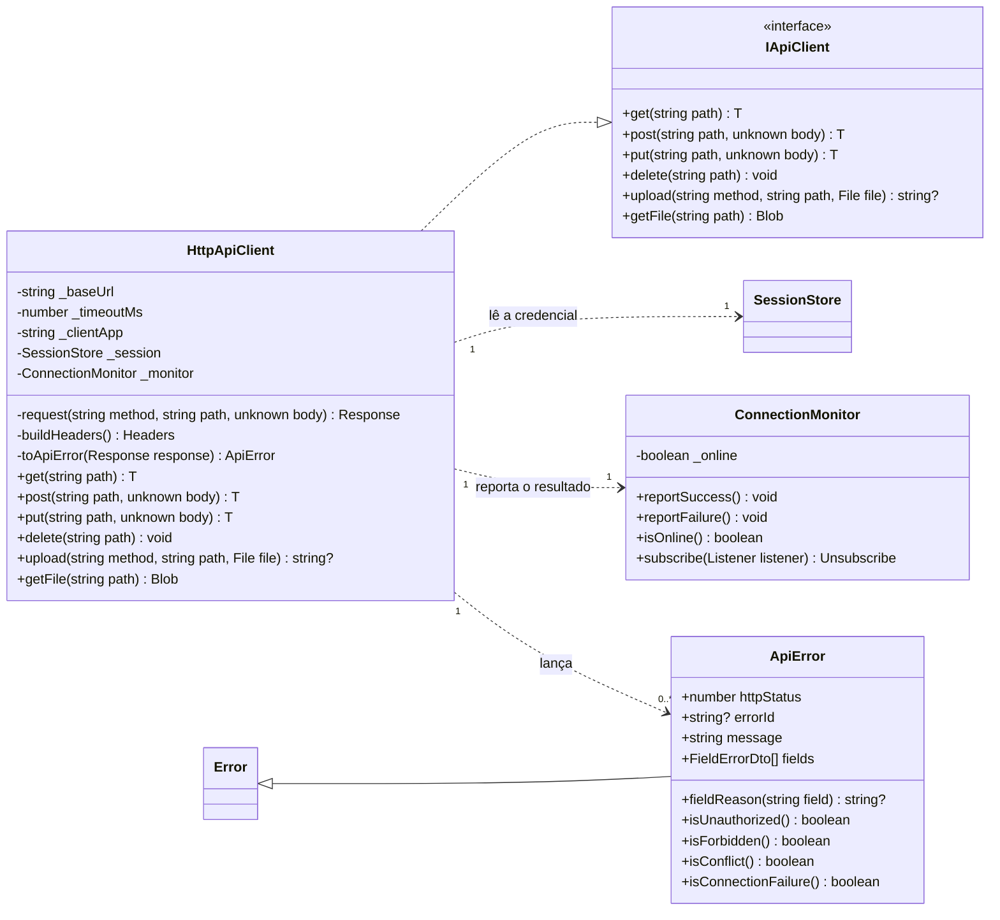

`get`, `post`, `put` e `request` são genéricas no tipo da resposta esperada; por exemplo, `get<CompanyStatusDto>(…)` devolve `Promise<CompanyStatusDto>`. O parâmetro de tipo está omitido no diagrama.

| Elemento | Responsabilidade | Requisitos |
| --- | --- | --- |
| `HttpApiClient.buildHeaders` | Acrescenta a credencial de sessão no cabeçalho `Authorization` (`Bearer`) em todos os pedidos autenticados e o cabeçalho `X-Client-App` com `_clientApp` = `web`, exigido no início de sessão (documentação da API, secção 3.2, DAPI-02). O identificador do utilizador nunca vai na rota nem no corpo do pedido: o servidor obtém-no da credencial (backend, DC-05; documentação da API, secção 2.5). | RF038, RF083, RNF004, RNF006 |
| `HttpApiClient.upload` | Envia o ficheiro em `multipart/form-data`, num único campo `file`, com `PUT` (fotografia única: logótipo) ou `POST` (galeria e fotografias da vaga), e devolve o endereço do cabeçalho `Location` da resposta (`204` ou `201`) (documentação da API, secção 2.6, DAPI-10). | RF047, RF048, RF052 |
| `HttpApiClient.request` | Aborta o pedido ao fim de `_timeoutMs`, que é inferior a 10 segundos, e reporta a falha ao `ConnectionMonitor`; nesse caso lança um `ApiError` com `isConnectionFailure()` verdadeiro. | RNF018, P19 |
| `HttpApiClient.toApiError` | Converte a resposta de erro no `ApiErrorDto`, que é o formato de todas as respostas de erro, incluindo `401`, `403`, `404`, `413`, `415` e `500` (documentação da API, secção 4.1), e expõe o motivo por campo, para a página o apresentar junto de cada campo (W04, A04d, A09b, A10b). O nome do campo vem em camelCase e, nas listas, com o índice (`skillIds[0]`); nos carregamentos é `file`. Preenche `errorId` (secção 4.2). | RF037, RF040, RF042, RF084, RF094, RF099 a RF102 |
| `HttpApiClient.getFile` | Obtém um ficheiro protegido (fotografia, logótipo ou CV) com a credencial no cabeçalho e devolve-o como `Blob` (secção 4.3). | RNF004, RNF007 |
| `ApiError.isUnauthorized` | Código `401`. Num pedido com sessão é ERR-01 (credencial em falta, inválida ou expirada): o `SessionProvider` termina a sessão e encaminha para o início de sessão. No pedido de início de sessão é ERR-02 (credenciais erradas) e só a `LoginPage` o trata. | RNF004, RNF005, RNF009, P20 |
| `ApiError.isForbidden` | Código `403`: conta bloqueada ou suspensa, ponto de acesso errado, tipo de conta não autorizado, Empresa não aprovada ou elemento de outro titular; o tratamento depende de `errorId` (secção 4.2). | RF039, RF104, RNF006 |
| `ApiError.isConflict` | Código `409`: a operação não é possível no estado atual do elemento; o tratamento depende de `errorId` (secção 4.2). | RF058, RF117 |
| `ConnectionMonitor` | Mantém o estado da ligação ao servidor e notifica o `ConnectionBanner`. | RNF018 |

O valor de `_timeoutMs` é fixado na configuração do repositório. Os verbos HTTP, as rotas completas e os códigos de estado de cada operação são os da documentação da API v01 (`I092`) e estão na tabela da secção 5.

### 4.2. Tratamento dos erros

O `ApiErrorDto` não tem código de erro (documentação da API, PA-05; dependência G12). Até essa proposta ser aceite, `toApiError` identifica o erro pelo código HTTP e pela `message`, comparada com as mensagens fixas do catálogo da API (secção 4.3 desse documento), guardadas em `src/api/errorCatalog.ts`; nas mensagens com valores preenchidos pelo servidor (ERR-07, ERR-30, ERR-31, ERR-39) a comparação é feita pelo início do texto. Quando a mensagem não corresponde a nenhuma do catálogo, `errorId` fica `null` e a página apresenta `message`. A mensagem apresentada ao utilizador é sempre a do servidor.

| Erro da API | Código | Tratamento na área de gestão web | Ecrãs | Requisitos |
| --- | --- | --- | --- | --- |
| ERR-01 | 401 | O `SessionProvider` termina a sessão, fecha a ligação persistente e encaminha para `/entrar` ou `/admin/entrar`. | Todos | RNF004, RNF005 |
| ERR-02 | 401 | Só no início de sessão: a `LoginPage` apresenta a mensagem única, sem distinguir correio inexistente de palavra-passe errada. | W01, A01 | RF038, RF083, RNF009 |
| ERR-03, ERR-04 | 403 | No início de sessão, a `LoginPage` apresenta a mensagem. Durante a sessão (conta bloqueada ou suspensa depois de iniciada), o `SessionProvider` termina a sessão e a `LoginPage` apresenta a mensagem. | W01, A01 | RF086, RNF004 |
| ERR-05 | 403 | Conta de Candidato na área de gestão web: a `LoginPage` apresenta a mensagem (secção 7.2, regra 5). | W01, A01 | RF038, RF083 |
| ERR-06 | 403 | Encaminhamento para `/acesso-negado`. | A11 | RF103, RF104 |
| ERR-07 | 403 | `refreshCompanyStatus`; o `RequireCompanyStatus` encaminha para `/empresa/estado`. Aplica-se também à lista de matches (documentação da API, 6.7.1). | W05, W06, W21, W26 | RF039 |
| ERR-08, ERR-20 | 403, 404 | A página apresenta a mensagem e volta a pedir a lista de origem. `ERR-20` em `getStatus` não é erro: significa Empresa por registar (secção 5, regra 7). | Todos | RF059, RNF006 |
| ERR-10, ERR-11 | 400 | Motivo junto de cada campo de `fields`; ERR-11 junto do campo de ficheiro. | W04, W06, W08, W10, W11, W25, A04d, A09b, A10b | RF037, RF042, RF051, RF084, RF094, RF099 a RF102 |
| ERR-12, ERR-13 | 413, 415 | Mensagem do servidor. Na prática não ocorrem, porque o formulário verifica o formato e a dimensão antes de enviar (secção 5, regra 8). | W07, W10, W11 | RF047, RF048, RF052 |
| ERR-30 | 409 | Transição de estado já não possível (vaga, Empresa ou conta mudou entretanto): mensagem e nova leitura da lista; no A04e, «Ver lista atualizada». | W12 a W14, A04e, A05b, A07b, A08b | RF053 a RF056, RF093 a RF095, RF115, RF116 |
| ERR-34, ERR-35 | 409 | ERR-34: decisão sem abertura do perfil registada. ERR-35: o interesse já não está em espera, na decisão, na abertura do perfil ou na obtenção do CV (documentação da API, 6.6.2 a 6.6.5; UC12, E1 e E4). Em ambos: mensagem e nova leitura dos candidatos em espera. | W16, W17, W18, W20 | RF061, RF063, RF064, RF117, RF118, RNF007 |
| ERR-36, ERR-37 | 409 | A conversa passa a só de consulta (W23) e a lista de conversas é lida de novo. | W22, W23 | RF069, RF070, RF075 |
| ERR-38 | 409 | Diálogo do W15, com a alternativa de encerrar a vaga. | W15 | RF058, RF114 |
| ERR-39 | 409 | Mensagem do número máximo de fotografias; o contador «n/6» ou «n/5» é atualizado. | W07, W10, W11 | RF048, RF052, P13 |
| ERR-40 | 409 | `refreshCompanyStatus` e encaminhamento para `/empresa/estado`. | W03 | RF041 |
| ERR-41 | 409 | Alteração concorrente: mensagem «Atualize e tente novamente» e nova leitura do elemento. | Todos os formulários | — |
| ERR-50 | 500 | Mensagem do servidor; nada ficou gravado e a ação pode ser repetida. | Todos | RNF013 |
| Sem resposta | — | `isConnectionFailure()`: o `ConnectionBanner` avisa e a página oferece «Tentar de novo». | A02d e todos | RNF018 |

Os erros ERR-31 a ERR-33 são exclusivos do Candidato e não ocorrem neste módulo.

### 4.3. Ficheiros protegidos

Um elemento `` ou uma ligação `<a href>` do browser não envia o cabeçalho `Authorization`. Como os endereços dos ficheiros só respondem depois de verificar a credencial (backend, secção 7.2; RNF007), o cliente não os usa diretamente: obtém o conteúdo com `IApiClient.getFile` e apresenta-o através de um endereço local do browser (`URL.createObjectURL`), libertado quando o componente desaparece.

O modelo de classes do backend v01 não tem a operação que serve estes endereços (documentação da API, PA-01; dependência G11). A correção proposta na documentação da API (`GET /api/files/{fileId}`, autorizado pela credencial de sessão) é compatível com esta solução: o cliente usa o endereço tal como vem no DTO ou no cabeçalho `Location`, sem o construir. O CV não tem endereço: é obtido em `GET /api/recruiter/interests/{matchId}/cv` (`application/pdf`), só enquanto o interesse está em espera (RNF007).

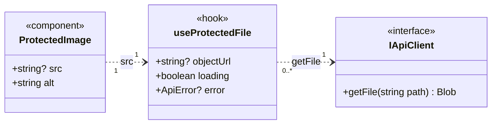

| Elemento | Responsabilidade | Ecrãs | Requisitos |
| --- | --- | --- | --- |
| `useProtectedFile` | Recebe o endereço devolvido pela API, obtém o ficheiro com a credencial e devolve o endereço local; revoga-o ao desmontar. | W07, W10, W11, W17, W19 | RNF004, RNF007 |
| `ProtectedImage` | Apresenta fotografias e logótipos protegidos; sem endereço, mostra o marcador vazio do protótipo. | W07, W10, W11, W17, W19 | RF047, RF048, RF052, RF061 |
| `CandidateEvaluationService.getCv` | Obtém o CV em PDF e abre-o num novo separador a partir do endereço local. Sem CV, o servidor devolve `404` (ERR-20); com o interesse fora de espera, `409` (ERR-35); com a vaga de outra Empresa, `403` (ERR-08). O botão «Abrir CV (PDF)» só aparece com `hasCv` verdadeiro. | W17 | RF061, RNF007 |

---

## 5. Serviços

Há um serviço por controller do backend usado pela área de gestão web, com as operações do controller em camelCase e os mesmos nomes (backend, secção 6). `CompanyService.getRegistration` e `getPage` não existem ainda no backend (dependências G1 e G2; documentação da API, PA-03).

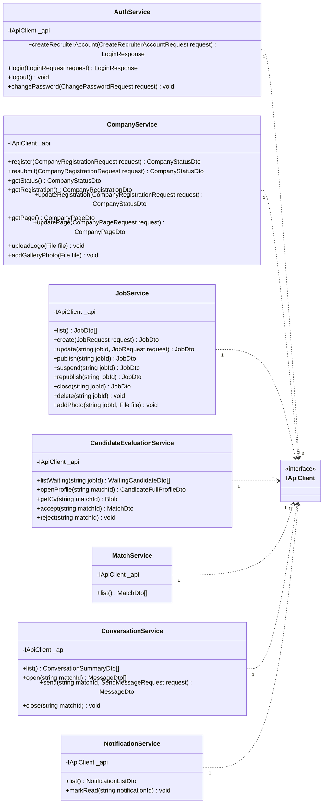

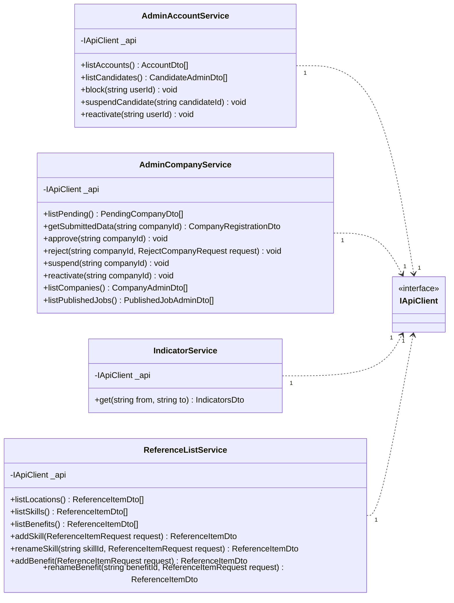

| Serviço | Controller correspondente | Rota base | Quem usa | Casos de uso |
| --- | --- | --- | --- | --- |
| `AuthService` | `AuthController` | `/api/auth` | Recrutador e Administrador | UC01, UC02, UC07 |
| `CompanyService` | `CompanyController` | `/api/recruiter/company` | Recrutador | UC07, UC08 |
| `JobService` | `JobsController` | `/api/recruiter/jobs` | Recrutador | UC09, UC10 |
| `CandidateEvaluationService` | `CandidateEvaluationController` | `/api/recruiter` | Recrutador | UC11, UC12 |
| `MatchService` | `MatchesController` | `/api/matches` | Recrutador | UC13 |
| `ConversationService` | `ConversationsController` | `/api/conversations` | Recrutador | UC14 |
| `NotificationService` | `NotificationsController` | `/api/notifications` | Recrutador | UC15 |
| `AdminAccountService` | `AdminAccountsController` | `/api/admin/accounts` | Administrador | UC18 |
| `AdminCompanyService` | `AdminCompaniesController` | `/api/admin/companies` | Administrador | UC16, UC17 |
| `IndicatorService` | `AdminIndicatorsController` | `/api/admin/indicators` | Administrador | UC19 |
| `ReferenceListService` | `ReferenceListsController` | `/api/reference-lists` | Recrutador (consulta) e Administrador | UC09, UC10, UC20 |

Pedido HTTP de cada operação, segundo a documentação da API v01 (secções 5 e 6). As rotas com `{…}` recebem o identificador como texto (`Guid`).

| Serviço | Operação | Pedido | Resposta de sucesso |
| --- | --- | --- | --- |
| `AuthService` | `createRecruiterAccount` | `POST /api/auth/recruiters` | `201` · `LoginResponse` |
| | `login` | `POST /api/auth/login` (com `X-Client-App: web`) | `200` · `LoginResponse` |
| | `logout` | `POST /api/auth/logout` | `204` |
| | `changePassword` | `PUT /api/auth/password` | `204` |
| `CompanyService` | `register` | `POST /api/recruiter/company` | `201` · `CompanyStatusDto` |
| | `resubmit` | `POST /api/recruiter/company/resubmission` | `200` · `CompanyStatusDto` |
| | `getStatus` | `GET /api/recruiter/company/status` | `200` · `CompanyStatusDto`; `404` sem Empresa |
| | `getRegistration` | Proposta `GET /api/recruiter/company` (G1, PA-03) | `200` · `CompanyRegistrationDto` |
| | `updateRegistration` | `PUT /api/recruiter/company` | `200` · `CompanyStatusDto` |
| | `getPage` | Proposta `GET /api/recruiter/company/page` (G2, PA-03) | `200` · `CompanyPageDto` |
| | `updatePage` | `PUT /api/recruiter/company/page` | `200` · `CompanyPageDto` |
| | `uploadLogo` | `PUT /api/recruiter/company/logo` (`multipart/form-data`) | `204` · `Location` |
| | `addGalleryPhoto` | `POST /api/recruiter/company/photos` (`multipart/form-data`) | `201` · `Location` |
| `JobService` | `list` | `GET /api/recruiter/jobs` | `200` · `JobDto[]` |
| | `create` | `POST /api/recruiter/jobs` | `201` · `JobDto` |
| | `update` | `PUT /api/recruiter/jobs/{jobId}` | `200` · `JobDto` |
| | `publish`, `suspend`, `republish`, `close` | `POST /api/recruiter/jobs/{jobId}/publish`, `…/suspend`, `…/republish`, `…/close` | `200` · `JobDto` |
| | `delete` | `DELETE /api/recruiter/jobs/{jobId}` | `204` |
| | `addPhoto` | `POST /api/recruiter/jobs/{jobId}/photos` (`multipart/form-data`) | `201` · `Location` |
| `CandidateEvaluationService` | `listWaiting` | `GET /api/recruiter/jobs/{jobId}/waiting-candidates` | `200` · `WaitingCandidateDto[]` |
| | `openProfile` | `GET /api/recruiter/interests/{matchId}/profile` | `200` · `CandidateFullProfileDto` |
| | `getCv` | `GET /api/recruiter/interests/{matchId}/cv` | `200` · `application/pdf` |
| | `accept` | `POST /api/recruiter/interests/{matchId}/accept` | `200` · `MatchDto` |
| | `reject` | `POST /api/recruiter/interests/{matchId}/reject` | `204` |
| `MatchService` | `list` | `GET /api/matches` | `200` · `MatchDto[]` |
| `ConversationService` | `list` | `GET /api/conversations` | `200` · `ConversationSummaryDto[]` |
| | `open` | `GET /api/conversations/{matchId}/messages` | `200` · `MessageDto[]` |
| | `send` | `POST /api/conversations/{matchId}/messages` | `201` · `MessageDto` |
| | `close` | `POST /api/conversations/{matchId}/close` | `204` |
| `NotificationService` | `list` | `GET /api/notifications` | `200` · `NotificationListDto` |
| | `markRead` | `POST /api/notifications/{notificationId}/read` | `204` |
| `AdminAccountService` | `listAccounts` | `GET /api/admin/accounts` | `200` · `AccountDto[]` |
| | `listCandidates` | `GET /api/admin/accounts/candidates` | `200` · `CandidateAdminDto[]` |
| | `block` | `POST /api/admin/accounts/{userId}/block` | `204` |
| | `suspendCandidate` | `POST /api/admin/accounts/candidates/{candidateId}/suspend` | `204` |
| | `reactivate` | `POST /api/admin/accounts/{userId}/reactivate` | `204` |
| `AdminCompanyService` | `listPending` | `GET /api/admin/companies/pending` | `200` · `PendingCompanyDto[]` |
| | `getSubmittedData` | `GET /api/admin/companies/{companyId}/registration` | `200` · `CompanyRegistrationDto` |
| | `approve`, `suspend`, `reactivate` | `POST /api/admin/companies/{companyId}/approve`, `…/suspend`, `…/reactivate` | `204` |
| | `reject` | `POST /api/admin/companies/{companyId}/reject` | `204` |
| | `listCompanies` | `GET /api/admin/companies` | `200` · `CompanyAdminDto[]` |
| | `listPublishedJobs` | `GET /api/admin/companies/published-jobs` | `200` · `PublishedJobAdminDto[]` |
| `IndicatorService` | `get` | `GET /api/admin/indicators?from=aaaa-MM-dd&to=aaaa-MM-dd` | `200` · `IndicatorsDto` |
| `ReferenceListService` | `listLocations`, `listSkills`, `listBenefits` | `GET /api/reference-lists/locations`, `…/skills`, `…/benefits` | `200` · `ReferenceItemDto[]` |
| | `addSkill`, `addBenefit` | `POST /api/reference-lists/skills`, `…/benefits` | `201` · `ReferenceItemDto` |
| | `renameSkill`, `renameBenefit` | `PUT /api/reference-lists/skills/{skillId}`, `…/benefits/{benefitId}` | `200` · `ReferenceItemDto` |

Regras dos serviços:

1. `AuthService.createRecruiterAccount` devolve a credencial de sessão (`LoginResponse`), como no backend: depois de criar a conta (W02), o Recrutador fica com sessão iniciada e segue para o registo da Empresa (W03).
2. `AuthService.logout` apenas confirma o pedido (`204`); o fim de sessão efetivo é o descarte da credencial no cliente, porque o servidor não guarda estado de sessão (backend, secção 6).
3. `JobService.addPhoto` exige o identificador da vaga. Na criação (W10), as fotografias escolhidas ficam em espera no formulário e só são enviadas depois de `create` devolver a vaga.
4. `CandidateEvaluationService.accept` e `reject` só são chamadas a partir da página do perfil completo, depois de `openProfile`, porque é essa chamada que regista a abertura exigida pelo RF118 (UC12, pré-condição 5). O servidor rejeita a decisão sem esse registo (UC12, E1).
5. `JobService.delete` é pedido sem verificação prévia no cliente: `JobDto.waitingCandidates` só conta os interesses em espera e não todos os interesses registados. Se a vaga tiver interesses, o servidor rejeita a eliminação com `409` (ERR-38) e a página apresenta o diálogo do W15, com a alternativa de encerrar a vaga (RF058, RF114).
6. `IndicatorService.get` envia as datas no formato `aaaa-MM-dd` (`DateOnly` no backend), como parâmetros de consulta; o servidor interpreta-as como dias completos no fuso `Europe/Lisbon` e rejeita, com `400`, a data inicial posterior à final e a data final posterior à atual (documentação da API, 6.12.1, DAPI-07). A página faz as mesmas verificações antes do pedido (A02c).
7. `CompanyService.getStatus` devolve `404` (ERR-20) quando o Recrutador ainda não registou a Empresa (documentação da API, 6.4.3). O serviço converte essa resposta em `null`, que o `SessionProvider` guarda como «sem Empresa registada» (secção 7.1).
8. Antes de cada carregamento, o formulário verifica o formato e a dimensão do ficheiro: logótipo JPEG ou PNG até 2 MB; fotografias da galeria e da vaga JPEG ou PNG até 5 MB; no máximo 6 fotografias na galeria e 5 por vaga (P01, P13). O servidor volta a verificar tudo, incluindo o conteúdo do ficheiro (RNF016).
9. `AdminAccountService.reactivate` recebe o identificador da conta. Na `CandidatesPage` é usado o `candidateId`, que é o mesmo identificador, porque a tabela `candidate` partilha a chave primária com `app_user` (modelo de dados, DM-02).

---

## 6. Ligação persistente

Só o Recrutador abre a ligação bidirecional persistente. Os dois hubs só admitem Candidato ou Recrutador e rejeitam o Administrador na ligação (RF103; backend, secção 6.1; documentação da API, secção 7.1); a área de supervisão também não tem conversas nem área de notificações (protótipo da `I041`). O cliente não envia operações pela ligação: o envio de mensagens, a marcação como lida e o encerramento continuam a ser pedidos à API.

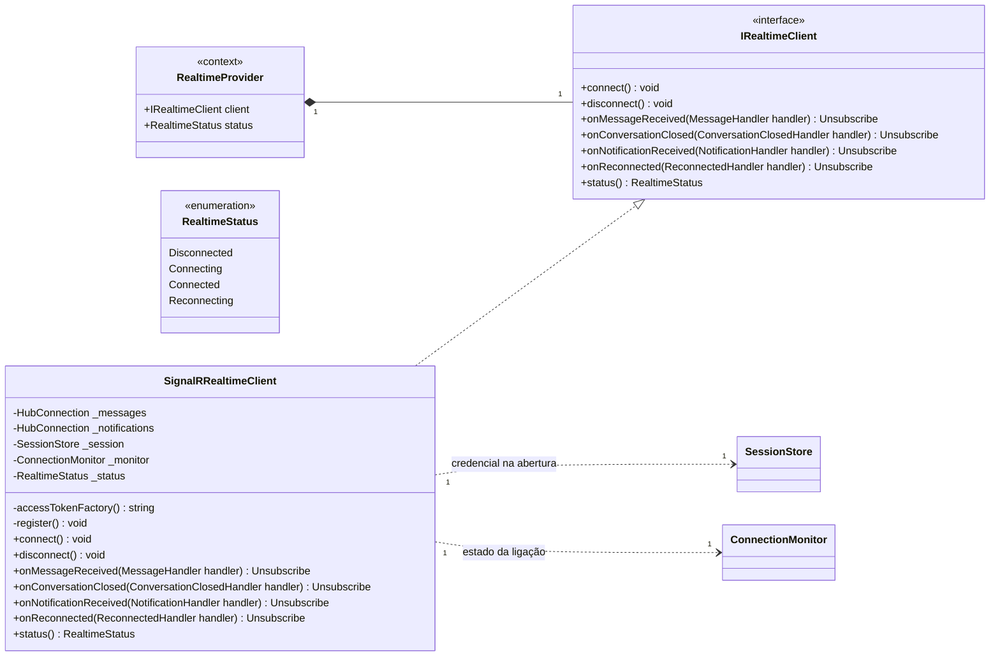

| Hub | Rota | Acontecimento recebido | Efeito no cliente | Requisitos |
| --- | --- | --- | --- | --- |
| Mensagens | `/hubs/messages` | `MessageReceived` com `MessageDto` | O `useConversations` acrescenta a mensagem à conversa aberta e atualiza o número de mensagens por ler da lista e da barra lateral (regras 2 e 3). | RF071, RF073, P17 |
| Mensagens | `/hubs/messages` | `ConversationClosed` com o identificador do match | A conversa passa a só de consulta: aparece a faixa «Conversa encerrada. Apenas consulta.», e o campo de escrita, «Enviar» e «Encerrar conversa» ficam desativados (W23). O cliente volta a pedir a lista de conversas para ler o motivo (`closeReason`), que o acontecimento não traz. | RF074, RF075 |
| Notificações | `/hubs/notifications` | `NotificationReceived` com `NotificationDto` e o número de não lidas | O `useNotifications` acrescenta a notificação e atualiza o contador da barra lateral; uma notificação `COMPANY_APPROVED` ou `COMPANY_REJECTED` faz também `refreshCompanyStatus`. | RF079, RF080, RF111, P17 |

Regras do cliente:

1. A ligação é aberta depois do início de sessão de uma conta de Recrutador, com a mesma credencial dos pedidos HTTP, fornecida por `accessTokenFactory`; o browser não permite cabeçalhos no WebSocket, pelo que a biblioteca a envia no parâmetro `access_token` (documentação da API, secção 7.1). A ligação é fechada no fim de sessão e quando a credencial expira; uma reposição recusada com `401` termina a sessão (RNF004, RNF005).
2. `MessageDto` não identifica a conversa a que pertence (dependência G6; documentação da API, PA-02). Até essa dependência ser resolvida, ao receber `MessageReceived` o cliente volta a pedir a lista de conversas e, se houver uma conversa aberta, o respetivo histórico. Com a correção proposta (`MessageReceived(matchId, message)`), muda apenas o `MessageHandler` e o `useConversations`.
3. O servidor entrega `MessageReceived` a todas as ligações das duas partes, incluindo a do Recrutador que enviou a mensagem. O `useConversations` ignora uma mensagem cujo `messageId` já está no histórico, porque `send` também a devolve.
4. Depois de uma reposição da ligação (`onReconnected`), o cliente volta a pedir à API a lista de conversas, o histórico da conversa aberta e a lista de notificações, porque pode ter perdido acontecimentos. Não existe consulta periódica (backend, DC-07).
5. Enquanto o estado for `Reconnecting` ou `Disconnected`, o `ConnectionBanner` avisa o utilizador, dentro do limite de 10 segundos do RNF018.
6. Os acontecimentos só são emitidos depois de confirmada a transação no servidor (documentação da API, secção 7.1); o cliente não tem de os confirmar pela API.
7. A biblioteca cliente (`@microsoft/signalr`) depende da confirmação da proposta D-08 (arquitetura, secção 3.5; documentação da API, PA-06); a versão é fixada no `package.json`, porque o RI não a fixa.

---

## 7. Sessão e autorização

### 7.1. Estado da sessão

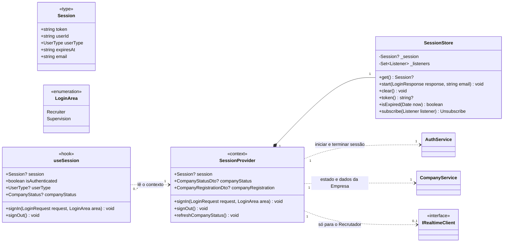

| Elemento | Responsabilidade | Requisitos |
| --- | --- | --- |
| `SessionStore.start` | Guarda a credencial, o identificador, o tipo de conta e a data de expiração devolvidos pelo servidor, e o endereço de correio eletrónico indicado no início de sessão (apresentado no W25). | RF038, RF083 |
| `SessionStore.isExpired` | Compara a data de expiração com o instante atual; a credencial expira ao fim de 8 horas. | RNF005, P20 |
| `SessionProvider.signIn` | Inicia sessão e encaminha conforme a área de entrada e o tipo de conta (secção 7.2). Para o Recrutador, obtém o estado e os dados da Empresa e abre a ligação persistente. | RF038, RF083, RF104 |
| `SessionProvider.signOut` | Pede `logout`, descarta a credencial, fecha a ligação persistente, limpa o estado e encaminha para o início de sessão da área respetiva. | RF106, RF107 |
| `SessionProvider.companyStatus` | Estado da Empresa do Recrutador, `null` quando ainda não há Empresa registada (`getStatus` com `404`; secção 5, regra 7). Atualizado depois de cada submissão e de cada notificação de decisão. | RF039, RF043, RF044 |
| `SessionProvider.companyRegistration` | Dados de registo da Empresa, usados na barra superior (designação social e nome do responsável), no W05, W06, W08 e W26 (dependência G1; documentação da API, PA-03). | RF044, RF045, RF049 |

O estado da Empresa guardado no cliente serve apenas para escolher o que mostrar. A restrição é aplicada no servidor em cada operação reservada, pela política `ApprovedCompany` (backend, secção 6; RF039, RNF006): um estado desatualizado no cliente não permite nenhuma operação indevida, porque o pedido é rejeitado e o cliente volta a pedir o estado.

A credencial é guardada em memória no `SessionStore` e espelhada no `sessionStorage` do browser (decisão DF-05).

### 7.2. Rotas protegidas

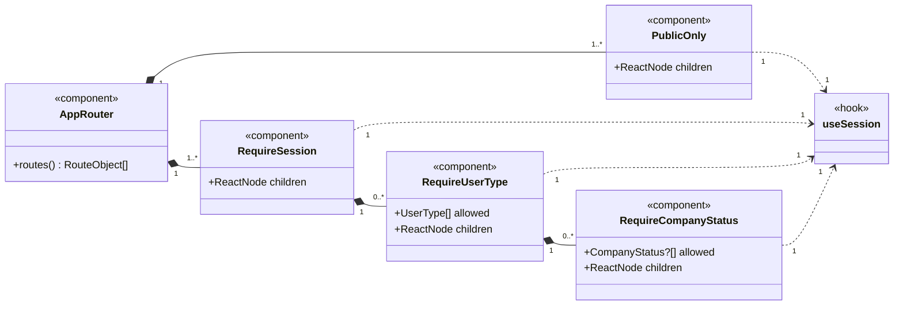

| Rota | Proteção | Página | Ecrãs do protótipo |
| --- | --- | --- | --- |
| `/entrar` | Pública | `LoginPage` (área do Recrutador) | W01 |
| `/criar-conta` | Pública | `CreateRecruiterAccountPage` | W02 |
| `/admin/entrar` | Pública | `LoginPage` (área de supervisão) | A01, A01b |
| `/empresa/registo` | Recrutador sem Empresa registada | `CompanyRegistrationPage` | W03, W04 |
| `/empresa/estado` | Recrutador com Empresa pendente, recusada ou suspensa | `CompanyRequestStatusPage` | W05, W06, W26 |
| `/empresa` | Recrutador com Empresa aprovada | `CompanyProfilePage` | W07, W08 |
| `/vagas` | Recrutador com Empresa aprovada | `JobListPage` | W09, W12, W13, W14, W15 |
| `/vagas/nova` | Recrutador com Empresa aprovada | `JobFormPage` | W10 |
| `/vagas/:jobId/editar` | Recrutador com Empresa aprovada | `JobFormPage` | W11 |
| `/candidatos?vaga=:jobId` | Recrutador com Empresa aprovada | `WaitingCandidatesPage` | W16 |
| `/candidatos/:matchId` | Recrutador com Empresa aprovada | `CandidateProfilePage` | W17, W18, W20 |
| `/candidatos/:matchId/match` | Recrutador com Empresa aprovada | `MatchConfirmedPage` | W19 |
| `/matches` | Recrutador com Empresa aprovada | `MatchesPage` | W21 |
| `/conversas?match=:matchId` | Recrutador com Empresa aprovada ou suspensa | `ConversationsPage` | W22, W23 |
| `/notificacoes` | Recrutador | `NotificationsPage` | W24 |
| `/conta` | Recrutador | `AccountPage` | W25 |
| `/admin/indicadores` | Administrador | `IndicatorsPage` | A02, A02c, A02d |
| `/admin/pendentes` | Administrador | `PendingCompaniesPage` | A03, A03b, A03c, A03d |
| `/admin/pendentes/:companyId` | Administrador | `PendingCompanyDetailPage` | A04, A04b, A04c, A04d, A04e |
| `/admin/empresas` | Administrador | `CompaniesPage` | A05, A05b |
| `/admin/vagas` | Administrador | `PublishedJobsPage` | A06 |
| `/admin/contas` | Administrador | `AccountsPage` | A07, A07b, A07c, A07d |
| `/admin/candidatos` | Administrador | `CandidatesPage` | A08, A08b |
| `/admin/listas` | Administrador | `ReferenceListsPage` | A09, A09b |
| `/admin/conta` | Administrador | `ChangePasswordPage` | A10, A10b |
| `/acesso-negado` | Sessão iniciada | `AccessDeniedPage` | A11 |

O ecrã A02b é o `UserMenu` da barra superior da área de supervisão e está disponível em todas as rotas `/admin/...` com sessão (secção 8.1).

Regras de encaminhamento:

1. `PublicOnly` encaminha quem já tem sessão para a página inicial do seu tipo de conta. `RequireSession` encaminha quem não tem sessão, ou tem a credencial expirada, para `/entrar` ou `/admin/entrar`, conforme a rota pedida (RNF004, RNF005).
2. Depois do início de sessão em `/entrar`: Recrutador → página inicial do Recrutador (regra 4); Administrador → `/admin/indicadores`. Depois do início de sessão em `/admin/entrar`: Administrador → `/admin/indicadores`; Recrutador → `/acesso-negado` (A01, navegação «A11 (conta de Recrutador)»).
3. `RequireUserType`: um Recrutador que abra uma rota `/admin/...` vai para `/acesso-negado` (A11), e não para uma página em branco (RF104); um Administrador que abra uma rota do Recrutador vai para `/admin/indicadores`. O servidor rejeita sempre o pedido não autorizado (RNF006).
4. `RequireCompanyStatus` admite `null` em `allowed`, que representa «sem Empresa registada» (rota `/empresa/registo`). Página inicial do Recrutador: sem Empresa registada → `/empresa/registo`; Empresa pendente, recusada ou suspensa → `/empresa/estado`; Empresa aprovada → `/vagas` (RF039).
5. Uma conta de Candidato não usa a área de gestão web: o cliente envia `X-Client-App: web` e o servidor rejeita a conta de Candidato com `403` (ERR-05), depois de verificar as credenciais e o estado da conta (documentação da API, secções 3.2 e 6.1.3); a página apresenta o motivo devolvido pelo servidor. O texto «Os Candidatos utilizam a aplicação móvel» é uma nota fixa do ecrã A01, e não a mensagem de rejeição.
6. Nenhuma destas proteções é uma medida de segurança: são uma conveniência de navegação. A autorização é verificada no servidor em cada pedido (RNF006).

---

## 8. Páginas e componentes

### 8.1. Estrutura comum

O protótipo tem duas molduras diferentes: a do Recrutador (barra lateral com contadores e barra superior com a designação social e o nome do responsável) e a da área de supervisão (barra lateral por secções, barra superior com o caminho do ecrã e menu do utilizador).

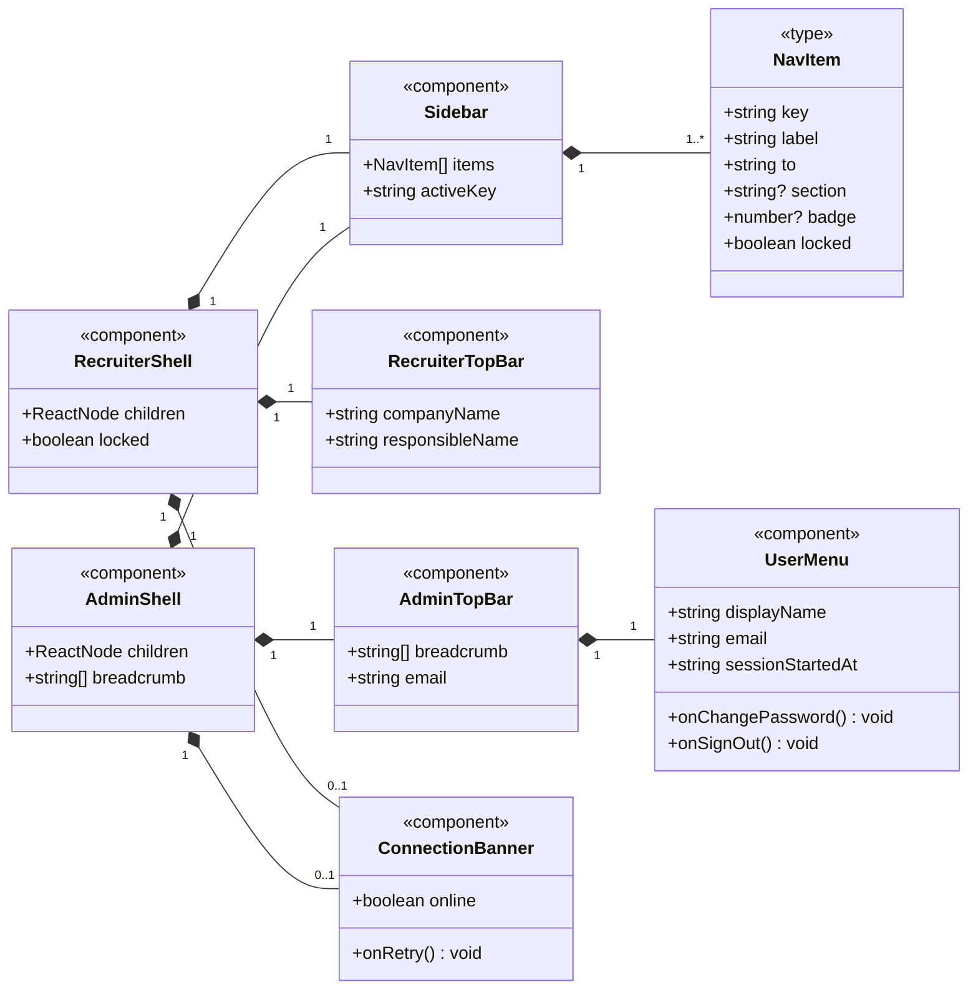

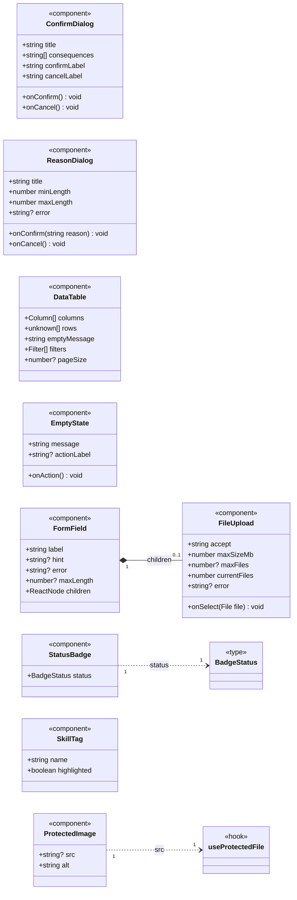

Os componentes partilhados não dependem uns dos outros, exceto o `FileUpload`, que é apresentado dentro de um `FormField` (rótulo, ajuda e erro do ficheiro). Só o `ProtectedImage` usa um hook (secção 2.1). As páginas que usam cada componente estão na secção 8.4.

| Componente | Responsabilidade | Ecrãs | Requisitos |
| --- | --- | --- | --- |
| `RecruiterShell` | Moldura do Recrutador. Com a Empresa não aprovada (`locked`), mostra Vagas e Candidatos com cadeado e o item «Estado do pedido»; Matches fica com cadeado sempre que a Empresa não está aprovada (documentação da API, 6.7.1); Conversas fica com cadeado nos estados pendente e recusada; Notificações e Conta ficam sempre acessíveis (divergências P1 e P2 da secção 12). | W05 a W26 | RF039, RF075, RF079, RF080, RF106 |
| `AdminShell` | Moldura da área de supervisão: Indicadores; Empresas (Pendentes de aprovação, com o número de pendentes; Todas as Empresas; Vagas publicadas); Utilizadores (Contas de utilizador; Candidatos); Configuração (Listas pré-definidas). Não tem conversas nem notificações. | A02 a A10 | RF103, RF104 |
| `Sidebar` | Navegação, com o item ativo em destaque e os contadores: conversas (soma das mensagens por ler) e notificações por ler, no Recrutador; Empresas pendentes, no Administrador. | W05 a W26, A02 a A10 | RF071, RF080, RF091 |
| `RecruiterTopBar` | Designação social e nome do responsável da Empresa (dependência G1). | W05 a W26 | RF044 |
| `AdminTopBar`, `UserMenu` | Caminho do ecrã e menu do utilizador com «Alterar palavra-passe» e «Terminar sessão»; fecha ao clicar fora. Nenhum DTO tem o nome do Administrador: `displayName` é o texto fixo «Administrador Katch» do A02b; `sessionStartedAt` é calculado como `expiresAt` menos 8 horas (P20). | A02 a A10, A02b | RF084, RF107 |
| `ConnectionBanner` | Aviso «Sem ligação ao servidor», com «Tentar de novo», que repete o último pedido falhado. | A02d e qualquer ecrã | RNF018, P19 |
| `ConfirmDialog` | Confirmação antes de uma ação, com a lista dos efeitos; também usado para informar uma rejeição com ação alternativa (W15: «Encerrar vaga» ou «Voltar»). | W12, W13, W14, W15, W18, W20, A04b, A05b, A07b, A07c, A08b | RF053, RF055, RF056, RF058, RF063, RF064, RF093, RF095, RF086, RF087, RF089, RF117 |
| `ReasonDialog` | Pedido do motivo da recusa do registo, com contador de 10 a 500 caracteres e a mensagem de motivo inválido. | A04c, A04d | RF094, P12 |
| `DataTable` | Tabela com cabeçalho, linhas e mensagem de lista vazia. Os filtros, a pesquisa e a paginação, quando existem, são aplicados no cliente sobre a lista completa devolvida pela API: filtro por estado (A05), pesquisa por correio eletrónico e filtros por tipo e estado (A07), paginação de 12 linhas com «Anterior» e «Seguinte» (A06 e A07). A lista de Candidatos (A08) não é paginada e indica o total e o número de ativos. A lista de candidatos em espera não tem filtros, classificação nem ações de decisão (W16). | W09, W16, W21, A03, A05 a A08 | RF053, RF060, RF067, RF085, RF088, RF091, RF097, RF098 |
| `EmptyState` | Lista vazia, com ação opcional (A03d: acesso a todas as Empresas). | A03d e listas vazias | RF091 |
| `FormField`, `FileUpload` | Rótulo, ajuda, contador de caracteres e mensagem de erro por campo; escolha de ficheiro com o formato, a dimensão e o número máximo de ficheiros. | W02 a W04, W06 a W08, W10, W11, W22, W25, A09, A10 | RF037, RF042, RF046 a RF048, RF050 a RF052, RF069; P01, P03, P08, P13 |
| `StatusBadge` | Estado da Empresa, da vaga ou da conta, com a designação do mapa de apresentação. | W05, W06, W08, W09, W21, W26, A04, A05, A07, A08 | RF044, RF053, RF085, RF097 |
| `SkillTag` | Competência em etiqueta, em destaque quando coincide com as pretendidas na vaga. | W10, W11, W17 | RF050, RF062 |
| `ProtectedImage` | Fotografia ou logótipo protegido (secção 4.3). | W07, W10, W11, W17, W19 | RF047, RF048, RF052, RF061 |

`BadgeStatus` é a união de `CompanyStatus`, `JobStatus` e `AccountStatus`. Todos os ecrãs são desenhados sem deslocamento horizontal entre 1280 e 1920 píxeis de largura (RNF012, P21).

### 8.2. Páginas do Recrutador

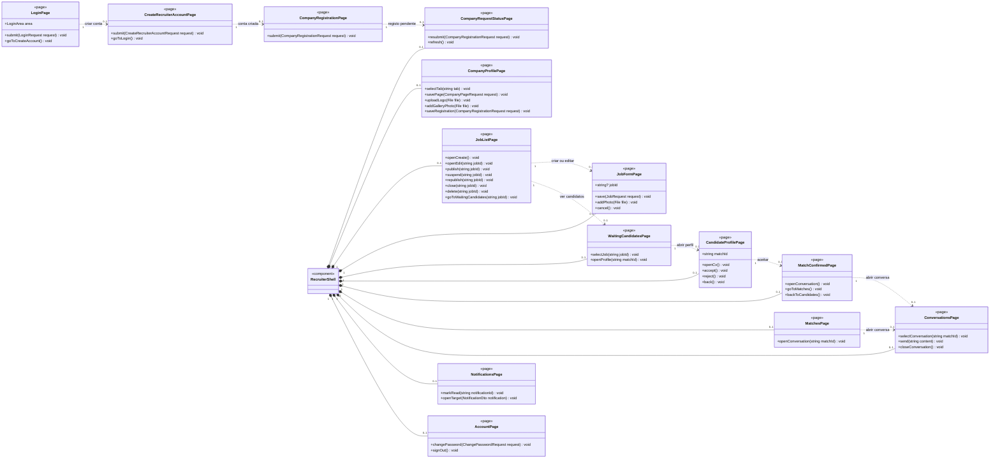

A `LoginPage`, a `CreateRecruiterAccountPage` e a `CompanyRegistrationPage` não têm moldura (W01 a W04). As restantes páginas do Recrutador são apresentadas dentro da `RecruiterShell`, uma de cada vez.

| Página | Responsabilidade | Hook | Serviço | Requisitos |
| --- | --- | --- | --- | --- |
| `LoginPage` | Início de sessão na área do Recrutador (W01, com «Criar conta») ou na área de supervisão (A01). Credenciais erradas: mensagem única do servidor (ERR-02), que não distingue endereço inexistente de palavra-passe errada; conta bloqueada ou suspensa: mensagem própria (ERR-03, ERR-04; W01); conta de Candidato: ERR-05 (secção 4.2). | `useSession` | `AuthService` | RF038, RF083, RF086, RNF009 |
| `CreateRecruiterAccountPage` | Criação da conta de Recrutador com correio eletrónico, palavra-passe e aceitação das condições; «Já tenho conta» volta ao W01. | `useSession` | `AuthService` | RF037 |
| `CompanyRegistrationPage` | Primeiro registo da Empresa com os oito dados e o erro por campo (W04). | `useCompany` | `CompanyService`, `ReferenceListService` | RF041, RF042, RF043 |
| `CompanyRequestStatusPage` | Estado do pedido: pendente, com os dados submetidos só de leitura (W05); recusada, com o motivo e o formulário preenchido para corrigir e «Submeter novamente» (W06); suspensa, com os dados só de leitura (W26). Indica sempre que não pode publicar vagas nem aceder a candidatos. | `useCompany` | `CompanyService`, `ReferenceListService` | RF039, RF043, RF044, RF045 |
| `CompanyProfilePage` | Separador «Página da Empresa»: descrição (contador até 1000), sítio na Internet, logótipo e galeria com contador «n/6» (W07). Separador «Dados da Empresa»: dados de registo com o NIF bloqueado e o estado «Aprovada» (W08). | `useCompany` | `CompanyService`, `ReferenceListService` | RF046 a RF049 |
| `JobListPage` | Vagas com função, estado, candidatos em espera, data-limite e as ações de cada estado: Publicada (Editar, Suspender, Encerrar, Eliminar); Não publicada (Editar, Publicar, Eliminar); Suspensa (Editar, Voltar a publicar, Encerrar); Encerrada (sem ações). Cada ação passa por `ConfirmDialog` (W12 a W14); a eliminação rejeitada abre o W15. | `useJobs` | `JobService` | RF053 a RF059, RF114, RF115 |
| `JobFormPage` | Criação e alteração da vaga: campos obrigatórios e opcionais, localidade proposta com a da Empresa, competências e benefícios das listas, até 5 fotografias; a vaga é gravada como não publicada. | `useJobs`, `useReferenceLists` | `JobService`, `ReferenceListService` | RF050, RF051, RF052, RF054 |
| `WaitingCandidatesPage` | Vaga escolhida e candidatos em espera, com função pretendida, localidade e data do interesse; a única ação é «Abrir perfil» (dependência G4). Aberta também a partir de uma notificação de novo interesse. | `useWaitingCandidates`, `useJobs` | `CandidateEvaluationService`, `JobService` | RF060, RF082 |
| `CandidateProfilePage` | Perfil completo, competências coincidentes em destaque, hiperligações, «Abrir CV (PDF)» e a indicação da abertura registada; «Aceitar» e «Recusar» com confirmação (W18, W20). | `useCandidateProfile` | `CandidateEvaluationService` | RF061 a RF064, RF117, RF118, RNF007 |
| `MatchConfirmedPage` | Match confirmado com a fotografia, o nome, a vaga e os contactos do Candidato; «Abrir conversa», «Ver matches» e «Voltar aos candidatos». | `useCandidateProfile` | `CandidateEvaluationService` | RF066, RF067 |
| `MatchesPage` | Matches da Empresa com Candidato, vaga, estado da vaga, contactos e «Abrir conversa», incluindo vagas encerradas (dependência G5). | `useMatches` | `MatchService` | RF067 |
| `ConversationsPage` | Lista de conversas com as mensagens por ler e a indicação «Encerrada»; conversa aberta com texto, data e hora e indicação «Lida»; envio com contador até 1000; encerramento; modo só de consulta (W23). Abrir a conversa marca como lidas as mensagens do Candidato. | `useConversations` | `ConversationService` | RF069 a RF075, RF109 |
| `NotificationsPage` | Notificações por ler e lidas, com o número de não lidas, «Marcar como lida» e o acesso ao elemento de origem: vaga com candidatos em espera, matches, conversa ou dados da Empresa. | `useNotifications` | `NotificationService` | RF076 a RF082, RF111 |
| `AccountPage` | Nome do responsável e correio eletrónico da conta, alteração da palavra-passe e «Terminar sessão». | `useSession` | `AuthService` | RF040, RF106 |

A `MatchConfirmedPage` recebe o `MatchDto` devolvido por `accept`. Como a API não tem leitura de um match isolado, ao recarregar a página o cliente encaminha para `/matches`.

### 8.3. Páginas do Administrador

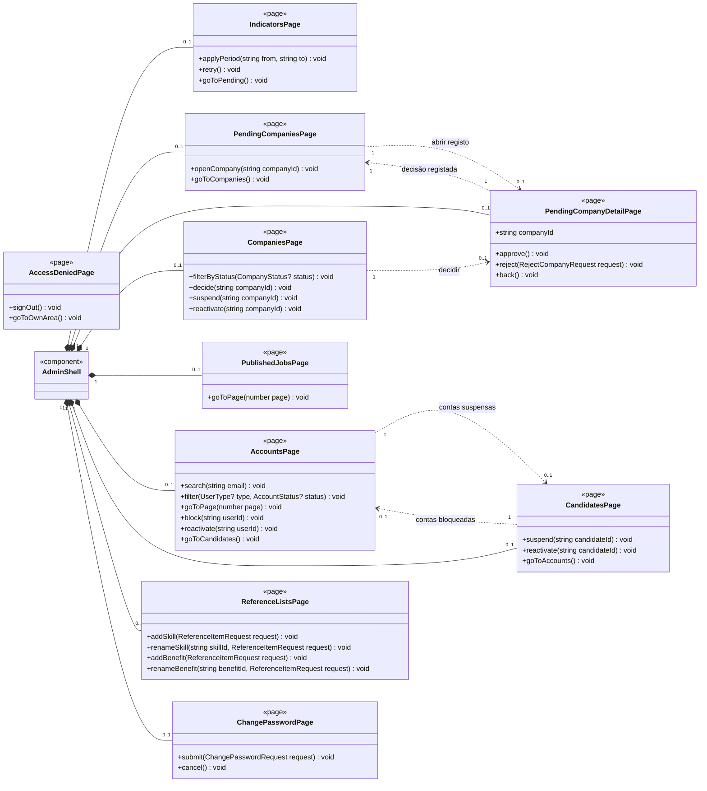

A `AccessDeniedPage` não tem moldura (A11).

| Página | Responsabilidade | Hook | Serviço | Requisitos |
| --- | --- | --- | --- | --- |
| `IndicatorsPage` | Data inicial e final, «Aplicar período» e número de dias; os três indicadores de estado na data final e os quatro de atividade no período; barras «Do interesse à conversa» calculadas no cliente com os mesmos valores. Faixa «Há n Empresa(s) a aguardar aprovação» com «Ver pendentes» (A03), apresentada quando há Empresas pendentes; o número é o mesmo do contador da barra lateral, obtido pelo `usePendingCompanies`. Rejeita o período com data inicial posterior à final (A02c); falha de ligação com «Tentar de novo» (A02d). | `useIndicators`, `usePendingCompanies` | `IndicatorService`, `AdminCompanyService` | RF091, RF096, RF103, RNF018 |
| `PendingCompaniesPage` | Empresas pendentes com designação social, NIF e data de submissão, das mais antigas para as mais recentes; mensagem depois de uma aprovação (A03b) ou de uma recusa (A03c); estado vazio com acesso a todas as Empresas (A03d). | `usePendingCompanies` | `AdminCompanyService` | RF043, RF079, RF091 |
| `PendingCompanyDetailPage` | Os oito dados submetidos, data de submissão e estado; «Aprovar registo» com confirmação (A04b); «Recusar registo» com motivo de 10 a 500 caracteres (A04c, A04d); decisão rejeitada por a Empresa já ter sido decidida, com «Ver lista atualizada» (A04e). | `usePendingCompanies` | `AdminCompanyService` | RF092, RF093, RF094, RF112 |
| `CompaniesPage` | Todas as Empresas, com filtro por estado, designação social, estado, vagas publicadas e ações: «Decidir» (pendente), «Suspender» com confirmação (aprovada, A05b) e «Reativar» (suspensa). | `useCompaniesAdmin` | `AdminCompanyService` | RF075, RF095, RF097, RF116 |
| `PublishedJobsPage` | Vagas publicadas com função, Empresa, data de publicação e interesses, só de consulta, paginadas no cliente. | `usePublishedJobs` | `AdminCompanyService` | RF098 |
| `AccountsPage` | Contas com correio eletrónico, tipo e estado, com pesquisa, filtros e paginação de 12 linhas; «Bloquear» com confirmação (A07b) e «Reativar» uma conta bloqueada (A07c, A07d). As contas de Administrador não têm ações e as contas suspensas reativam-se em Candidatos. | `useAccounts` | `AdminAccountService` | RF075, RF085, RF086, RF087 |
| `CandidatesPage` | Candidatos com nome, correio eletrónico, localidade, data de registo e estado; «Suspender» com confirmação (A08b) e «Reativar» uma conta suspensa. | `useCandidatesAdmin` | `AdminAccountService` | RF075, RF088, RF089, RF090 |
| `ReferenceListsPage` | Competências e benefícios com «Alterar designação» na própria lista e «Acrescentar»; rejeição das designações vazias ou repetidas com o motivo (A09b). A lista de localidades não é editável e não aparece. | `useReferenceLists` | `ReferenceListService` | RF099 a RF102 |
| `ChangePasswordPage` | Palavra-passe atual e nova, com a mensagem de nova palavra-passe inválida (A10b); «Cancelar» volta ao A02. | `useSession` | `AuthService` | RF084 |
| `AccessDeniedPage` | Apresentada a uma conta que não é de Administrador e tenta abrir a área de supervisão: «Terminar sessão» ou «Ir para a área do Recrutador». | `useSession` | — | RF104, RNF006 |

A área de supervisão não tem nenhum ecrã de conversas nem acesso ao conteúdo das mensagens (RF103).

---

### 8.4. Ligações das páginas aos hooks e aos componentes

Os diagramas seguintes representam as colunas «Hook» das tabelas das secções 8.2 e 8.3 e os ecrãs da tabela de componentes da secção 8.1, com as multiplicidades. Cada página usa uma instância de cada hook; as multiplicidades dos componentes indicam quantas instâncias a página apresenta (`0..1` nos diálogos, que só aparecem quando a ação é pedida). As molduras (`RecruiterShell`, `AdminShell`) e o `ConnectionBanner` estão no primeiro diagrama da secção 8.1. A ligação dos hooks aos serviços está na secção 9.

Páginas do Recrutador e hooks:

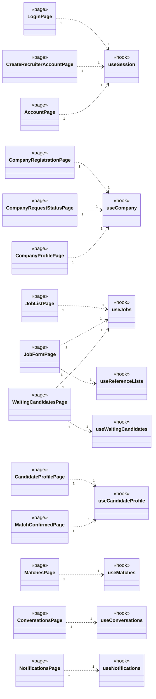

Páginas do Recrutador e componentes partilhados (a `LoginPage` e a `NotificationsPage` não usam nenhum):

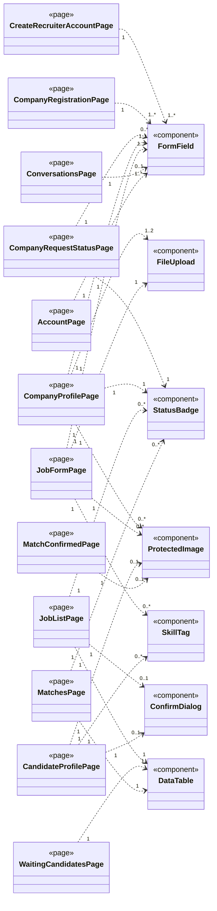

Páginas do Administrador e hooks:

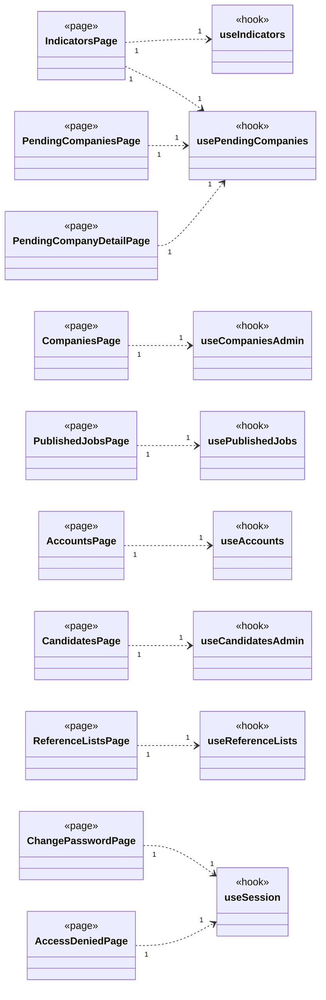

Páginas do Administrador e componentes partilhados (a `IndicatorsPage` e a `AccessDeniedPage` não usam nenhum):

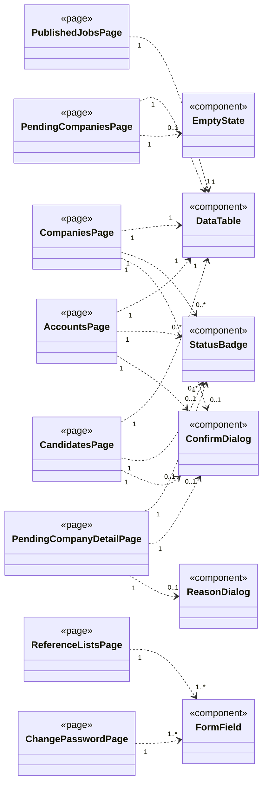

O `useSession` não chama serviços: lê o `SessionProvider`, que usa o `AuthService` e o `CompanyService` (secção 7.1). O `useProtectedFile` não é usado pelas páginas, mas pelo componente `ProtectedImage` (secção 8.1).

## 9. Estado dos ecrãs

Os hooks concentram o estado de cada ecrã. Todos os hooks que obtêm dados para um ecrã realizam o contrato `IResourceState<T>`, exceto o `useProtectedFile` (secção 4.3), que serve um componente e devolve apenas o endereço local de um ficheiro, sem recurso nem lista a apresentar; para que as páginas tratem o carregamento, o erro e a lista vazia da mesma forma: `data` é o recurso principal do hook, com o tipo `T` indicado na tabela desta secção, e os atributos acrescentados por cada hook são estado complementar. Os hooks são funções: compõem-se, não se especializam.

```mermaid
classDiagram
    direction LR
    class IResourceState~T~ {
        <<interface>>
        +T? data
        +boolean loading
        +ApiError? error
        +reload() void
    }
    class ReferenceLists {
        <<type>>
        +ReferenceItemDto[] locations
        +ReferenceItemDto[] skills
        +ReferenceItemDto[] benefits
    }
    class useCompany {
        <<hook>>
        +CompanyRegistrationDto? registration
        +CompanyPageDto? page
        +register(CompanyRegistrationRequest request) void
        +resubmit(CompanyRegistrationRequest request) void
        +updateRegistration(CompanyRegistrationRequest request) void
        +updatePage(CompanyPageRequest request) void
        +uploadLogo(File file) void
        +addGalleryPhoto(File file) void
    }
    class useJobs {
        <<hook>>
        +create(JobRequest request, File[] photos) JobDto
        +update(string jobId, JobRequest request) JobDto
        +publish(string jobId) void
        +suspend(string jobId) void
        +republish(string jobId) void
        +close(string jobId) void
        +delete(string jobId) void
    }
    class useReferenceLists {
        <<hook>>
        +addSkill(ReferenceItemRequest request) void
        +renameSkill(string skillId, ReferenceItemRequest request) void
        +addBenefit(ReferenceItemRequest request) void
        +renameBenefit(string benefitId, ReferenceItemRequest request) void
    }
    class useWaitingCandidates {
        <<hook>>
        +JobDto? selectedJob
        +selectJob(string jobId) void
    }
    class useCandidateProfile {
        <<hook>>
        +boolean profileOpened
        +MatchDto? confirmedMatch
        +open(string matchId) void
        +accept() MatchDto
        +reject() void
        +openCv() void
    }
    class useMatches {
        <<hook>>
    }
    class useConversations {
        <<hook>>
        +string? openMatchId
        +MessageDto[] messages
        +number unreadTotal
        +select(string matchId) void
        +send(string content) void
        +close() void
    }
    class useNotifications {
        <<hook>>
        +markRead(string notificationId) void
    }
    class IRealtimeClient {
        <<interface>>
    }
    useReferenceLists ..> ReferenceLists : data
    useCompany ..|> IResourceState
    useJobs ..|> IResourceState
    useReferenceLists ..|> IResourceState
    useWaitingCandidates ..|> IResourceState
    useCandidateProfile ..|> IResourceState
    useMatches ..|> IResourceState
    useConversations ..|> IResourceState
    useNotifications ..|> IResourceState
    useConversations "1" ..> "1" IRealtimeClient : MessageReceived e ConversationClosed
    useNotifications "1" ..> "1" IRealtimeClient : NotificationReceived
    class CompanyService
    class JobService
    class ReferenceListService
    class CandidateEvaluationService
    class MatchService
    class ConversationService
    class NotificationService
    useCompany "0..*" ..> "1" CompanyService
    useCompany "0..*" ..> "1" ReferenceListService : localidades
    useJobs "0..*" ..> "1" JobService
    useReferenceLists "0..*" ..> "1" ReferenceListService
    useWaitingCandidates "0..*" ..> "1" CandidateEvaluationService
    useCandidateProfile "0..*" ..> "1" CandidateEvaluationService
    useMatches "0..*" ..> "1" MatchService
    useConversations "0..*" ..> "1" ConversationService
    useNotifications "0..*" ..> "1" NotificationService
```

```mermaid
classDiagram
    direction LR
    class IResourceState~T~ {
        <<interface>>
        +T? data
        +boolean loading
        +ApiError? error
        +reload() void
    }
    class useIndicators {
        <<hook>>
        +string from
        +string to
        +number periodDays
        +string? periodError
        +applyPeriod(string from, string to) void
    }
    class usePendingCompanies {
        <<hook>>
        +CompanyRegistrationDto? selected
        +string? lastDecisionMessage
        +open(string companyId) void
        +approve(string companyId) void
        +reject(string companyId, RejectCompanyRequest request) void
    }
    class useCompaniesAdmin {
        <<hook>>
        +CompanyStatus? statusFilter
        +CompanyAdminDto[] visibleRows
        +filterByStatus(CompanyStatus? status) void
        +suspend(string companyId) void
        +reactivate(string companyId) void
    }
    class usePublishedJobs {
        <<hook>>
        +number page
        +number pageCount
        +PublishedJobAdminDto[] visibleRows
        +goToPage(number page) void
    }
    class useAccounts {
        <<hook>>
        +string emailQuery
        +UserType? typeFilter
        +AccountStatus? statusFilter
        +number page
        +number pageCount
        +AccountDto[] visibleRows
        +search(string email) void
        +filter(UserType? type, AccountStatus? status) void
        +goToPage(number page) void
        +block(string userId) void
        +reactivate(string userId) void
    }
    class useCandidatesAdmin {
        <<hook>>
        +number activeCount
        +suspend(string candidateId) void
        +reactivate(string candidateId) void
    }
    useIndicators ..|> IResourceState
    usePendingCompanies ..|> IResourceState
    useCompaniesAdmin ..|> IResourceState
    usePublishedJobs ..|> IResourceState
    useAccounts ..|> IResourceState
    useCandidatesAdmin ..|> IResourceState
    class IndicatorService
    class AdminCompanyService
    class AdminAccountService
    useIndicators "0..*" ..> "1" IndicatorService
    usePendingCompanies "0..*" ..> "1" AdminCompanyService
    useCompaniesAdmin "0..*" ..> "1" AdminCompanyService
    usePublishedJobs "0..*" ..> "1" AdminCompanyService
    useAccounts "0..*" ..> "1" AdminAccountService
    useCandidatesAdmin "0..*" ..> "1" AdminAccountService
```

Cada serviço é uma instância única, partilhada por todos os hooks que o usam (`0..*` → `1`). O `useReferenceLists` do Administrador usa o mesmo `ReferenceListService` do primeiro diagrama, com as operações de acrescento e alteração.

| Hook | `data` (T) | Estado complementar | Origem das atualizações |
| --- | --- | --- | --- |
| `useSession` | — (lê o `SessionProvider`, secção 7.1) | Sessão, estado e dados da Empresa | Início e fim de sessão; `refreshCompanyStatus` |
| `useCompany` | `CompanyStatusDto` | Dados de registo e página da Empresa | Pedido à API; nova leitura depois de submeter e depois de uma notificação de decisão |
| `useJobs` | `JobDto[]` | — | Pedido à API; nova leitura depois de cada ação de estado |
| `useReferenceLists` | `ReferenceLists` | — | Pedido à API; no Administrador, nova leitura depois de cada acrescento ou alteração |
| `useWaitingCandidates` | `WaitingCandidateDto[]` | Vaga escolhida; a sua função dá o título do W17 («nome — vaga função»), porque o `CandidateFullProfileDto` não a contém | Pedido à API; nova leitura depois de uma decisão |
| `useCandidateProfile` | `CandidateFullProfileDto` | Indicação de abertura registada e match confirmado | Pedido à API; `accept` e `reject` só ficam disponíveis com `profileOpened` verdadeiro |
| `useMatches` | `MatchDto[]` | — | Pedido à API ao abrir o ecrã |
| `useConversations` | `ConversationSummaryDto[]` | Conversa aberta, histórico e total de mensagens por ler | Pedido à API e acontecimentos da ligação persistente (secção 6) |
| `useNotifications` | `NotificationListDto` | — (o contador é `data.unreadCount`) | Pedido à API e acontecimentos da ligação persistente (secção 6) |
| `useProtectedFile` | — (endereço local, secção 4.3) | — | Pedido à API; libertado ao desmontar |
| `useIndicators` | `IndicatorsDto` | Período, número de dias e erro de período | Pedido à API depois de validar o período |
| `usePendingCompanies` | `PendingCompanyDto[]` | Dados submetidos da Empresa aberta e mensagem da última decisão (A03b, A03c) | Pedido à API; nova leitura depois de cada decisão (atualiza também o contador da barra lateral e a faixa do A02) |
| `useCompaniesAdmin` | `CompanyAdminDto[]` | Filtro por estado e linhas visíveis | Pedido à API; nova leitura depois de cada mudança de estado |
| `usePublishedJobs` | `PublishedJobAdminDto[]` | Página atual e linhas visíveis (12 por página) | Pedido à API ao abrir o ecrã |
| `useAccounts` | `AccountDto[]` | Pesquisa, filtros, página atual e linhas visíveis (12 por página) | Pedido à API; nova leitura depois de cada mudança de estado |
| `useCandidatesAdmin` | `CandidateAdminDto[]` | Número de Candidatos ativos («22 Candidatos · 20 ativos») | Pedido à API; nova leitura depois de cada mudança de estado |

Além dos contextos da sessão e da ligação persistente, os contadores da barra lateral do Recrutador (`useConversations.unreadTotal` e `useNotifications.data.unreadCount`) vivem na `RecruiterShell`, que se mantém montada enquanto o Recrutador muda de página. Cada ecrã lê o que precisa quando é aberto; o servidor é a única fonte de verdade.

---

## 10. Exemplo de interação entre camadas

Aceitação de um Candidato pelo Recrutador (UC12), com as multiplicidades de cada ligação. O fluxo mostra a regra do RF118: a decisão só é possível depois de a abertura do perfil ter sido registada.

```mermaid
classDiagram
    direction LR
    class WaitingCandidatesPage {
        <<page>>
        +openProfile(string matchId) void
    }
    class CandidateProfilePage {
        <<page>>
        +accept() void
    }
    class useCandidateProfile {
        <<hook>>
        +open(string matchId) void
        +accept() MatchDto
    }
    class CandidateEvaluationService {
        +openProfile(string matchId) CandidateFullProfileDto
        +accept(string matchId) MatchDto
    }
    class HttpApiClient {
        +get(string path) T
        +post(string path, unknown body) T
    }
    class SessionStore {
        +token() string?
    }
    class MatchConfirmedPage {
        <<page>>
    }
    class SignalRRealtimeClient {
        +onNotificationReceived(NotificationHandler handler) Unsubscribe
    }
    class useNotifications {
        <<hook>>
    }
    WaitingCandidatesPage "1" ..> "1" CandidateProfilePage : 1 abrir perfil
    CandidateProfilePage "1" ..> "1" useCandidateProfile : 2 e 4 open e accept
    useCandidateProfile "1" ..> "1" CandidateEvaluationService : 2 e 4
    CandidateEvaluationService "1" ..> "1" HttpApiClient : 2 e 4
    HttpApiClient "1" ..> "1" SessionStore : credencial
    CandidateProfilePage "1" ..> "1" MatchConfirmedPage : 6 match confirmado
    SignalRRealtimeClient "1" ..> "1" useNotifications : 7 NotificationReceived
```

1. Na `WaitingCandidatesPage` (W16), o Recrutador escolhe «Abrir perfil». A lista não tem ações de decisão (RF060).
2. A `CandidateProfilePage` (W17) chama `useCandidateProfile.open`, que pede o perfil completo (`GET /api/recruiter/interests/{matchId}/profile`). O servidor regista a abertura para a vaga (RF118) e o hook passa `profileOpened` a verdadeiro.
3. Só então «Aceitar» e «Recusar» ficam disponíveis. A confirmação (W18) enumera os efeitos e avisa que a decisão não pode ser alterada (RF117).
4. `CandidateEvaluationService.accept` envia `POST /api/recruiter/interests/{matchId}/accept` com a credencial de sessão no cabeçalho; o identificador do Recrutador vem da credencial e não do corpo (RNF006).
5. O servidor executa a operação atómica (backend, secção 8) e devolve `200` com o `MatchDto`.
6. A página abre a `MatchConfirmedPage` (W19) com o contacto do Candidato e o acesso à conversa (RF066, RF067).
7. A notificação de novo match dirigida ao Recrutador chega pela ligação persistente e o contador da barra lateral é atualizado no máximo 5 segundos depois (RF077, RF111, P17).

Se o servidor rejeitar a decisão com `409` porque o Candidato já foi avaliado noutro pedido (ERR-35; UC12, E4), o `ApiError` é apresentado na página e a lista de candidatos em espera é recarregada; a decisão registada não muda (RF117).

---

## 11. Dependências do backend por resolver

A verificação cruzada com o modelo de classes do backend (`I036`) e com os protótipos aceites (`I040`, `I041`) encontrou elementos de que a área de gestão web precisa e que o backend ainda não define. O frontend web só é implementado em `m4`, mas o contrato tem de estar fechado antes: estas dependências devem ser resolvidas na documentação da API (`I092`) e, quando alteram o modelo de classes do backend, numa nova Issue, porque a `I036` está concluída e uma tarefa Done não é reaberta (Regulamento da UC, secção 14.2).

| ID | Dependência | Onde se manifesta | Proposta | Estado na documentação da API v01 (`I092`) |
| --- | --- | --- | --- | --- |
| G1 | O `CompanyController` não tem operação para o Recrutador ler os dados de registo da própria Empresa (a tabela 7.2 do backend associa `CompanyRegistrationDto` ao `CompanyController`, mas nenhuma operação o devolve). | W05, W06, W08, W26, barra superior, W25 (nome do responsável); UC07 A3 («o sistema apresenta os dados submetidos e o motivo da recusa»); RF044, RF045, RF049 | `GetRegistration() ActionResult<CompanyRegistrationDto>` no `CompanyController` e `GetRegistrationAsync` no `ICompanyService`, com a política `Recruiter` e não `ApprovedCompany`, porque os ecrãs W05, W06 e W26 são de Empresa pendente, recusada ou suspensa | Em aberto: PA-03 propõe `GET /api/recruiter/company`, com a política `Recruiter` e `404` sem Empresa registada |
| G2 | O `CompanyController` não tem operação para o Recrutador ler a página de apresentação da própria Empresa (só o `JobExplorationController`, reservado ao Candidato, a devolve). | W07; RF046 a RF048 | `GetPage() ActionResult<CompanyPageDto>` no `CompanyController` | Em aberto: PA-03 propõe `GET /api/recruiter/company/page`, com a política `ApprovedCompany` |
| G3 | `CompanyRegistrationDto` só tem `LocationName`; o pedido de alteração exige `LocationId`. | W06 e W08 (seleção da localidade preenchida); W10 (localidade proposta com a da Empresa, RF050) | Acrescentar `Guid LocationId` ao `CompanyRegistrationDto` | Em aberto: incluída na proposta do PA-03 |
| G4 | `WaitingCandidateDto` não tem a função pretendida nem a localidade. | W16 (colunas «Função pretendida» e «Localidade») | Acrescentar `string? DesiredRole` e `string LocationName` | Em aberto: PA-07 (proposta de melhoria) |
| G5 | `MatchDto` não tem o estado da vaga. | W21 (coluna «Estado da vaga») | Acrescentar `JobStatus JobStatus` | Em aberto: PA-08 (proposta de melhoria) |
| G6 | O acontecimento `MessageReceived` envia só o `MessageDto`, que não identifica a conversa. | RF073 (acrescentar a mensagem à conversa certa) | Enviar o identificador do match no acontecimento; até lá aplica-se a regra 2 da secção 6 | Em aberto: PA-02 propõe `MessageReceived(matchId, message)` |
| G7 | `IAuthService.LoginAsync` recebe `ClientApp`, mas o contrato não define como o cliente o indica. | Rejeição do início de sessão de um Candidato na área de gestão web (A01) | Fixar na documentação da API | Resolvida: cabeçalho `X-Client-App: web` (secção 3.2, DAPI-02); aplicada na secção 4.1 |
| G8 | Não estava definida a resposta de `GetStatus` quando o Recrutador ainda não registou a Empresa. | Encaminhamento para `/empresa/registo` depois do W02 e no início de sessão | Fixar na documentação da API | Resolvida: `404` com ERR-20 (6.4.3); aplicada na secção 5, regra 7 |
| G9 | Não estava definida a serialização das enumerações em JSON. | Todos os tipos da secção 3 | Serialização das enumerações como texto | Resolvida: valores em maiúsculas com `_` (secção 2.4, DAPI-01); aplicada nas secções 2.2 e 3.1 |
| G10 | `CandidateFullProfileDto` não tem a data e hora da abertura do perfil. | W17 («Abertura do perfil registada hoje às 10:32») | Acrescentar `DateTimeOffset ProfileOpenedAt` | Em aberto: PA-09 (proposta de melhoria) |
| G11 | Não há operação que sirva os ficheiros referidos por `photoUrl`, `logoUrl` e `photoUrls`. | W07, W10, W11, W17, W19 (logótipo, galeria, fotografias da vaga e do Candidato); RF047, RF048, RF052, RF061 | A proposta da API, com autorização pela credencial de sessão no cabeçalho, para manter a secção 4.3 | Em aberto: PA-01 propõe `GET /api/files/{fileId}` |
| G12 | `ApiErrorDto` não tem código de erro. | Distinção dos erros `403` e `409` (secção 4.2) | Acrescentar `string Code` com os identificadores ERR-xx | Em aberto: PA-05 (proposta de melhoria); até lá, comparação com as mensagens fixas |

O ponto em aberto PA-04 da documentação da API (lista de localidades só com sessão iniciada) não afeta a área de gestão web: o Recrutador obtém a credencial ao criar a conta (W02), antes de escolher a localidade no registo da Empresa (W03). O PA-06 (ratificação de D-08 e AD-01) está nas limitações (secção 14).

As dependências G4, G5 e G10 correspondem aos pontos em aberto PA-07 a PA-09 da documentação da API, classificados nesse documento como propostas de melhoria. A PA-03 fixa as políticas propostas para G1 (`Recruiter`) e G2 (`ApprovedCompany`).

As operações `CompanyService.getRegistration` e `CompanyService.getPage` estão no modelo do cliente porque os ecrãs aceites as exigem; ficam dependentes de G1 e G2 (PA-03).

---

## 12. Divergências com os protótipos

O modelo segue os protótipos aceites, exceto onde contrariam os requisitos ou o backend. Nesses casos prevalecem os requisitos, e a divergência fica registada para correção dos protótipos numa Issue própria (a `I087` só consolida os ecrãs aceites, sem os alterar).

| ID | Divergência | Decisão no modelo | Fundamento |
| --- | --- | --- | --- |
| P1 | Na variante bloqueada da barra lateral (W05, W06, W26) não existem os itens Notificações e Conta. | Notificações e Conta ficam sempre acessíveis ao Recrutador. | RF079 e RF080 (o Recrutador consulta a notificação da decisão sobre a Empresa); RF106 (terminar sessão) |
| P2 | No W26 (Empresa suspensa), Conversas está bloqueado. | Com a Empresa suspensa, Conversas fica acessível em modo só de consulta; nos estados pendente e recusada continua bloqueado, porque não pode haver conversas. Matches fica bloqueado, como no W26, porque a lista de matches exige Empresa aprovada. | RF075 (conversas passam a só de consulta, não a inacessíveis); documentação da API, 6.7.1 (`ApprovedCompany` na lista de matches do Recrutador, RF039) e 6.8 (`CandidateOrRecruiter` nas conversas) |
| P3 | O W01 («Backoffice do Recrutador») e o A01 («Recrutadores e Administrador») são dois ecrãs de início de sessão. | Uma `LoginPage` em duas rotas (`/entrar` e `/admin/entrar`), com o encaminhamento da secção 7.2. | Mantém os dois ecrãs aceites e a navegação do A01 para o A11 com conta de Recrutador |
| P4 | Os botões tracejados «Simular: …» (W01, W03, W05, W22, W26) só servem para navegar no protótipo. | Não são modelados. | Não correspondem a nenhuma funcionalidade |

---

## 13. Decisões de desenho

| ID | Decisão | Fundamentação |
| --- | --- | --- |
| DF-01 | Separação em páginas, componentes, rotas, hooks, serviços, cliente da API, tempo real, sessão e tipos. | As páginas ficam sem conhecimento do protocolo e os serviços sem conhecimento da interface, o que permite testar hooks e serviços com Jest e o cliente da API simulado (RI, secção 11.5). |
| DF-02 | Um serviço por controller do backend, com os mesmos nomes de operação em camelCase. | Torna imediata a verificação da coerência entre o cliente e a API (backend, secção 6). |
| DF-03 | Os tipos do cliente espelham os DTOs, sem tipos intermédios. | Uma divergência entre o cliente e a API aparece como erro de compilação do TypeScript. |
| DF-04 | Uma página por ecrã do protótipo, com os estados e diálogos do mesmo ecrã na mesma página. | Mantém a rastreabilidade aos ecrãs aceites nas `I040` e `I041`. |
| DF-05 | A credencial é guardada em memória e espelhada no `sessionStorage`, limpo no fim de sessão e quando a credencial expira. | Recarregar a página não obriga a novo início de sessão; o `sessionStorage` é por separador e desaparece ao fechá-lo, ao contrário do `localStorage`. A credencial expira ao fim de 8 horas no servidor (RNF005, P20). O RI não fixa esta escolha. |
| DF-06 | Os ficheiros protegidos são obtidos com a credencial e apresentados por endereço local. | O browser não envia o cabeçalho `Authorization` em `` e `<a href>`; o acesso aos ficheiros é verificado no servidor (RNF007; backend, secção 7.2). |
| DF-07 | As proteções de rota são de navegação, e não de segurança. | A autorização é sempre verificada no servidor (RNF006); o cliente apenas evita mostrar ecrãs inacessíveis e apresenta o ecrã de acesso negado (RF104). |
| DF-08 | Mensagens e notificações chegam pela ligação persistente, só para o Recrutador; depois de uma reposição da ligação, o cliente volta a ler as listas pela API. Não há consulta periódica. | DA v02 (F010, F011); arquitetura, AD-02 e D-08; backend, secção 6.1 e DC-07; P17. |
| DF-09 | As ações de decisão sobre um Candidato só existem na página do perfil completo e só ficam disponíveis depois de a abertura ser registada. | UC12, pré-condição 5 e E1; RF063, RF064, RF118. A mesma regra é verificada no servidor. |
| DF-10 | Filtros, pesquisa e paginação das listas da área de supervisão são aplicados no cliente. | O backend devolve as listas completas, sem parâmetros de filtragem nem de paginação (backend, secção 6); os volumes de demonstração são pequenos (P18). |
| DF-11 | As ações irreversíveis e as mudanças de estado passam por `ConfirmDialog` com a lista dos efeitos. | Ecrãs W12 a W15, W18, W20, A04b, A05b, A07b, A07c e A08b, aceites nas `I040` e `I041`; RF117. |
| DF-12 | O cliente identifica os erros pelo código HTTP e pelas mensagens fixas do catálogo da API até existir um código de erro no `ApiErrorDto`. | A documentação da API fixa as mensagens para que os clientes as possam verificar (secção 4.3) e regista o código de erro como proposta (PA-05); quando for aceite, muda apenas `toApiError`. |
| DF-13 | A notificação `COMPANY_APPROVED` abre a página da Empresa (`/empresa`) e não o estado do pedido de registo indicado na documentação da API (secção 7.3). | Com a Empresa aprovada, a proteção da rota `/empresa/estado` encaminha para `/empresa` (secção 7.2); a página da Empresa mostra o estado «Aprovada» no separador «Dados da Empresa» (W08). A `COMPANY_REJECTED` abre `/empresa/estado`, como na API. |

---

## 14. Limitações

| Limitação | Consequência |
| --- | --- |
| As dependências G1 a G6 e G10 a G12 (secção 11) estão em aberto. | Até serem corrigidas no modelo de classes do backend e numa nova versão da documentação da API, as páginas que delas dependem não podem ser implementadas como descritas. |
| As divergências P1 e P2 (secção 12) ficam por corrigir nos protótipos. | O comportamento implementado segue este modelo, os requisitos e a documentação da API, e não os ecrãs W05, W06 e W26 nesses pontos. |
| A alternativa de consulta periódica à API (`m2-decisao-consulta-periodica-mensagens-notificacoes-v01.md`) continua pendente de decisão (arquitetura, secção 2.4 e AD-02). | Se for aprovada em reunião formal, a secção 6 deixa de se aplicar: o `IRealtimeClient` é substituído por consultas periódicas nos hooks de conversas e de notificações, sem alterar páginas nem serviços. |
| A tecnologia da ligação persistente (ASP.NET Core SignalR, D-08) está por confirmar em reunião formal (documentação da API, PA-06). | Se for escolhida outra biblioteca, muda apenas o `SignalRRealtimeClient`; os hooks dependem de `IRealtimeClient`. |
| Os pedidos da secção 5 seguem a documentação da API v01 (`I092`). | Uma nova versão dessa documentação obriga a rever a tabela da secção 5, a secção 4.2 e a secção 6, e a acrescentar uma linha ao histórico de versões. |
| As assinaturas mostram os tipos de retorno sem `Promise`. | Simplificação de leitura; a implementação em `m4` segue a convenção da secção 2.2. |
| A decisão DF-05 não está fixada no Regulamento Interno. | Se o grupo decidir outra forma de persistência da credencial, muda apenas o `SessionStore`. |
| O modelo segue os protótipos de baixa fidelidade aceites. | Um protótipo de alta fidelidade, se existir, pode alterar componentes de apresentação sem alterar páginas, hooks nem serviços. |

---

## 15. Rastreabilidade

| Casos de uso | Páginas | Hooks | Serviços | Ecrãs do protótipo |
| --- | --- | --- | --- | --- |
| UC01 (início e fim de sessão) | `LoginPage`, `AccountPage`, `AccessDeniedPage` | `useSession` | `AuthService` | W01, W25, A01, A01b, A02b, A11 |
| UC02 (alterar a palavra-passe) | `AccountPage`, `ChangePasswordPage` | `useSession` | `AuthService` | W25, A02b, A10, A10b |
| UC07 (registo da Empresa) | `CreateRecruiterAccountPage`, `CompanyRegistrationPage`, `CompanyRequestStatusPage` | `useSession`, `useCompany`, `useReferenceLists` | `AuthService`, `CompanyService`, `ReferenceListService` | W02 a W06, W26 |
| UC08 (página e dados da Empresa) | `CompanyProfilePage` | `useCompany`, `useProtectedFile` | `CompanyService` | W07, W08 |
| UC09, UC10 (vagas) | `JobListPage`, `JobFormPage` | `useJobs`, `useReferenceLists` | `JobService`, `ReferenceListService` | W09 a W15 |
| UC11 (perfil do Candidato) | `WaitingCandidatesPage`, `CandidateProfilePage` | `useWaitingCandidates`, `useCandidateProfile`, `useProtectedFile` | `CandidateEvaluationService` | W16, W17 |
| UC12 (aceitar ou recusar) | `CandidateProfilePage`, `MatchConfirmedPage` | `useCandidateProfile` | `CandidateEvaluationService` | W17 a W20 |
| UC13 (matches e contactos) | `MatchConfirmedPage`, `MatchesPage` | `useCandidateProfile`, `useMatches` | `CandidateEvaluationService`, `MatchService` | W19, W21 |
| UC14 (conversas) | `ConversationsPage` | `useConversations` | `ConversationService`, `SignalRRealtimeClient` | W22, W23 |
| UC15 (notificações) | `NotificationsPage` | `useNotifications` | `NotificationService`, `SignalRRealtimeClient` | W24 |
| UC16 (aprovar ou recusar o registo de Empresa) | `PendingCompaniesPage`, `PendingCompanyDetailPage`, `AccessDeniedPage` | `usePendingCompanies` | `AdminCompanyService` | A03 a A04e, A11 |
| UC17 (supervisionar Empresas e vagas) | `CompaniesPage`, `PublishedJobsPage` | `useCompaniesAdmin`, `usePublishedJobs` | `AdminCompanyService` | A05, A05b, A06 |
| UC18 (contas de utilizador) | `AccountsPage`, `CandidatesPage` | `useAccounts`, `useCandidatesAdmin` | `AdminAccountService` | A07 a A08b |
| UC19 (painel de indicadores) | `IndicatorsPage` | `useIndicators` | `IndicatorService` | A02, A02c, A02d |
| UC20 (listas pré-definidas) | `ReferenceListsPage` | `useReferenceLists` | `ReferenceListService` | A09, A09b |

| Verificação | Resultado |
| --- | --- |
| Ecrãs do protótipo da `I040` com página, estado ou diálogo correspondente | 26 de 26 (W01 a W26) |
| Ecrãs e estados do protótipo da `I041` com página, estado, diálogo ou componente correspondente | 29 de 29 (A01 a A11, com os 18 estados) |
| Controllers do backend usados pela área de gestão web com serviço correspondente | 11 de 13; `CandidateProfileController` e `JobExplorationController` são exclusivos do Candidato |
| Hubs do backend com cliente | 2 de 2, só para o Recrutador |
| DTOs usados pela área de gestão web declarados como tipos | 31, com os mesmos campos dos DTOs do backend; enumerações: 11 |
| Operações dos serviços com pedido na documentação da API v01 | 53 de 55; `CompanyService.getRegistration` e `getPage` dependem de G1 e G2 (PA-03) |
| Endpoints da documentação da API usados pela área de gestão web | 53 de 68; os restantes 15 são exclusivos do Candidato (`RegisterCandidate` e os controllers `CandidateProfileController` e `JobExplorationController`) |
| Requisitos funcionais com componente «Frontend web» representados | 75 de 75 (RF037 a RF064, RF066 a RF104, RF106, RF107, RF109, RF111, RF114 a RF117); RF065, RF112, RF113 e RF118 são só do backend e são respeitados pelas regras das secções 5 e 10 |
| Rotas declaradas | 26: 3 públicas, 13 do Recrutador, 9 do Administrador e 1 que exige apenas sessão |
| Fonte textual dos diagramas incluída | Sim, em Mermaid, em todas as secções com diagrama |
