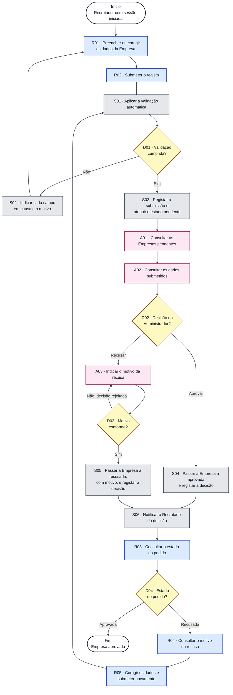

# Diagrama de Atividades — Aprovação de Empresas

**Unidade curricular:** Laboratório de Desenvolvimento de Software — LDS
**Milestone:** `m2`
**Ficheiro:** `m2-diagrama-atividades-aprovacao-empresas-v01.md`
**Pasta de arquivo:** `04-artefactos-tecnicos/04.08-modelos-de-comportamento`
**Compromisso na CCA:** `AD-002` — Diagrama de atividades — aprovação de empresas v1

---

## 1. Identificação do documento

| Campo | Informação |
| --- | --- |
| Grupo | G11 |
| Sistema | Katch |
| Ano letivo | 2026/2027 |
| Curso | LEI — Licenciatura em Engenharia Informática |
| Turma | LEI3T2 |
| Versão do documento | v01 |
| Issue | `I038` |
| Documentos de origem | `m1-proposta-sistema-v02.pdf` (F001, F003, F009, F011), `m1-declaracao-ambito-v02.pdf` (F003), `m2-especificacao-requisitos-v01.md` (RF001 a RF118) e `m1-checklist-controlo-artefactos-v02.pdf` (AD-002) |

### 1.1. Responsáveis

| Issue | Executor | Revisor | Auditor |
| --- | --- | --- | --- |
| `I038` | Miguel Santos | A indicar segundo o Sprint Backlog | A indicar segundo o Sprint Backlog |

### 1.2. Histórico de versões

| Versão | Data | Descrição das alterações | Issue |
| --- | --- | --- | --- |
| v01 | 2026-10-02 | Criação do diagrama de atividades do fluxo de aprovação de empresas. | `I038` |

Cada alteração posterior acrescenta uma linha. As versões anteriores são conservadas, nos termos da secção 18.2 do Regulamento de Funcionamento da Unidade Curricular.

---

## 2. Contexto

No Katch, uma Empresa só pode publicar vagas e aceder a candidatos depois de aprovada. A aprovação não é automática: o registo passa por uma validação automática e fica pendente até uma verificação manual obrigatória do Administrador, que aprova ou recusa o pedido (F003). Este documento modela esse fluxo, conforme o compromisso `AD-002` da Checklist de Controlo de Artefactos, para que o comportamento esperado do sistema, as responsabilidades de cada participante e as decisões possíveis fiquem explícitos antes da implementação.

O fluxo começa quando um Recrutador com sessão iniciada na área de gestão web inicia o registo da Empresa. Termina quando a Empresa fica aprovada. Uma recusa não termina o fluxo: o Recrutador pode corrigir os dados e submeter novamente, e o fluxo regressa à validação automática.

### 2.1. Âmbito do modelo

| Dentro do modelo | Fora do modelo |
| --- | --- |
| Preenchimento e submissão do registo da Empresa. | Criação da conta do Recrutador (RF037). |
| Validação automática do registo e unicidade do número de identificação fiscal. | Página de apresentação da Empresa, logótipo e galeria (RF046 a RF048), que só existe depois da aprovação. |
| Estado pendente até à decisão. | Alteração dos dados de uma Empresa já aprovada (RF049). |
| Consulta das Empresas pendentes e dos dados submetidos pelo Administrador. | Suspensão e reativação de uma Empresa aprovada (RF095, RF116). |
| Aprovação ou recusa com motivo. | Validação do número de identificação fiscal junto de entidades oficiais, carregamento de documentação comprovativa e comunicação da decisão por correio eletrónico (excluídos pela DA v02, F003). |
| Notificação da decisão ao Recrutador. | |
| Consulta do estado e do motivo da recusa, correção e nova submissão. | |

---

## 3. Participantes e responsabilidades

| Participante | Responsabilidade neste fluxo | Ponto de acesso |
| --- | --- | --- |
| Recrutador | Preenche e submete o registo da Empresa, consulta o estado do pedido e o motivo de uma recusa, corrige os dados e submete novamente. | Área de gestão web |
| Administrador | Realiza a verificação manual obrigatória: consulta as Empresas pendentes e os dados submetidos, e decide aprovar ou recusar, indicando o motivo na recusa. | Área de gestão web (área de supervisão, reservada ao Administrador) |
| Sistema | Valida automaticamente o registo, atribui e altera o estado da Empresa, regista o autor e a data e hora de cada operação e notifica o Recrutador da decisão. | Backend |

---

## 4. Diagrama de atividades

### 4.1. Convenções

| Elemento | Representação |
| --- | --- |
| Início e fim | Retângulo de cantos arredondados, com contorno escuro e fundo branco. |
| Atividade do Recrutador | Retângulo azul, código `Rnn`. |
| Atividade do Sistema | Retângulo cinzento, código `Snn`. |
| Atividade do Administrador | Retângulo rosa, código `Ann`. |
| Decisão | Losango amarelo, código `Dnn`, com o resultado de cada ramo na seta. |
| Fluxo | Seta contínua. |

O responsável por cada atividade é identificado pela cor e pela letra inicial do código. O processo não tem atividades paralelas: todas as atividades são sequenciais. As cores estão fixadas no próprio diagrama, para que se leia da mesma forma em tema claro e em tema escuro.

### 4.2. Diagrama

---

## 5. Descrição das atividades

| Código | Atividade | Responsável | Descrição | Requisitos |
| --- | --- | --- | --- | --- |
| R01 | Preencher ou corrigir os dados da Empresa | Recrutador | Indica a designação social, o número de identificação fiscal, o setor de atividade, a morada, a localidade da lista pré-definida, o endereço de correio eletrónico, o contacto telefónico e o nome do responsável. Depois de S02, corrige os campos indicados. | RF041 |
| R02 | Submeter o registo | Recrutador | Submete o registo da Empresa na área de gestão web. | RF041 |
| S01 | Aplicar a validação automática | Sistema | Verifica os campos obrigatórios, o formato do endereço de correio eletrónico (local@domínio), o contacto telefónico e o número de identificação fiscal com 9 algarismos, e se o número de identificação fiscal já está registado. | RF042 |
| S02 | Indicar cada campo em causa e o motivo | Sistema | Impede que o registo seja concluído e indica ao Recrutador cada campo em causa e o motivo. | RF042 |
| S03 | Registar a submissão e atribuir o estado pendente | Sistema | Atribui à Empresa o estado pendente e mantém-no até à decisão do Administrador. Regista o Recrutador que submeteu e a data e hora. | RF043, RF112 |
| A01 | Consultar as Empresas pendentes | Administrador | Consulta a lista das Empresas no estado pendente, com a designação social, o número de identificação fiscal e a data de submissão do pedido. | RF091 |
| A02 | Consultar os dados submetidos | Administrador | Consulta os oito dados submetidos no registo da Empresa pendente. | RF092 |
| A03 | Indicar o motivo da recusa | Administrador | Ao decidir recusar, indica o motivo, com 10 a 500 caracteres. | RF094 |
| S04 | Passar a Empresa a aprovada e registar a decisão | Sistema | Passa a Empresa de pendente a aprovada. Regista o Administrador que decidiu e a data e hora. | RF093, RF112 |
| S05 | Passar a Empresa a recusada, com motivo, e registar a decisão | Sistema | Passa a Empresa de pendente a recusada e guarda o motivo. Regista o Administrador que decidiu e a data e hora. | RF094, RF112 |
| S06 | Notificar o Recrutador da decisão | Sistema | No instante da decisão, gera uma notificação com a decisão e, na recusa, o motivo, apresentada na área de notificações do Recrutador, dentro da plataforma. | RF079 |
| R03 | Consultar o estado do pedido | Recrutador | Consulta o estado do pedido de registo da Empresa. Enquanto o estado for pendente, aguarda a decisão do Administrador. | RF044 |
| R04 | Consultar o motivo da recusa | Recrutador | Consulta o motivo indicado pelo Administrador. | RF044 |
| R05 | Corrigir os dados e submeter novamente | Recrutador | Corrige os dados do registo recusado e submete-o novamente. O fluxo regressa a S01. | RF045 |

---

## 6. Decisões

| Código | Decisão | Decide | Condição | Resultado |
| --- | --- | --- | --- | --- |
| D01 | Validação cumprida? | Sistema | O registo cumpre todas as verificações de S01. | Sim: S03. Não, por campo obrigatório vazio, endereço de correio eletrónico fora do formato, contacto telefónico ou número de identificação fiscal sem 9 algarismos, ou número de identificação fiscal já registado: S02 e regresso a R01. |
| D02 | Decisão do Administrador? | Administrador | Decisão sobre uma Empresa pendente. | Aprovar: S04. Recusar: A03. |
| D03 | Motivo conforme? | Sistema | O motivo da recusa tem entre 10 e 500 caracteres. | Sim: S05. Não: a decisão é rejeitada e o Administrador volta a A03. A Empresa mantém-se pendente. |
| D04 | Estado do pedido? | Recrutador | Estado da Empresa consultado em R03. | Aprovada: fim do fluxo. Recusada: R04, R05 e regresso a S01. |

---

## 7. Estados da Empresa neste fluxo

| Transição | Atividade | Requisito |
| --- | --- | --- |
| (registo submetido e válido) para pendente | S03 | RF043 |
| pendente para aprovada | S04 | RF093 |
| pendente para recusada | S05 | RF094 |
| recusada para pendente | R05 seguido de S01 e S03 | RF045 |

O estado suspensa (RF095) não faz parte deste fluxo.

---

## 8. Regras e restrições

1. A verificação manual do Administrador é obrigatória: nenhuma Empresa passa a aprovada sem decisão do Administrador (F003, RF093).
2. Só o Administrador decide sobre o registo de Empresas. A área de supervisão é reservada ao Administrador (RF093, RF094, RF104).
3. A recusa exige um motivo com 10 a 500 caracteres, e uma decisão sem motivo conforme é rejeitada (RF094, parâmetro `P12`).
4. Enquanto a Empresa não estiver aprovada, o Recrutador não pode publicar vagas nem aceder a candidatos, e o sistema indica o estado atual da Empresa (RF039).
5. O número de identificação fiscal é único em todo o sistema e não pode ser alterado depois da aprovação (RF042, RF049).
6. O autor e a data e hora da submissão, da aprovação e da recusa ficam registados (RF112).
7. A decisão é comunicada ao Recrutador dentro da plataforma. Não é enviada por correio eletrónico nem por mensagem telefónica (DA v02, F003 e limites transversais).

---

## 9. Rastreabilidade

| Atividade ou decisão | Funcionalidade | Requisitos | Caso de uso |
| --- | --- | --- | --- |
| R01, R02 | F003 | RF041 | UC07 |
| S01, S02, D01 | F003 | RF042 | UC07 |
| S03 | F003 | RF043 | UC07 |
| R03, R04, D04 | F003 | RF044 | UC07 |
| R05 | F003 | RF045 | UC07 |
| A01 | F003, F009 | RF091 | UC16 |
| A02 | F003, F009 | RF092 | UC16 |
| D02, S04 | F003, F009 | RF093 | UC16 |
| A03, D03, S05 | F003, F009 | RF094 | UC16 |
| S06 | F003, F011 | RF079 | UC16 |
| S03, S04, S05 | F001 | RF112 | UC01 |

---

## 10. Verificação

| Verificação | Resultado |
| --- | --- |
| Requisitos funcionais do fluxo representados no diagrama | RF041 a RF045, RF079, RF091 a RF094 e RF112. O RF039 é uma regra do fluxo (secção 8). |
| Atividades com responsável identificado | 14 de 14 atividades, mais 4 decisões. |
| Fonte textual do diagrama incluída | Sim (secção 4.2, Mermaid). |
| Elementos excluídos pela DA v02 representados | Nenhum. |
