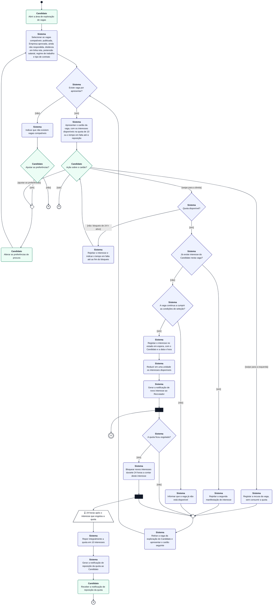
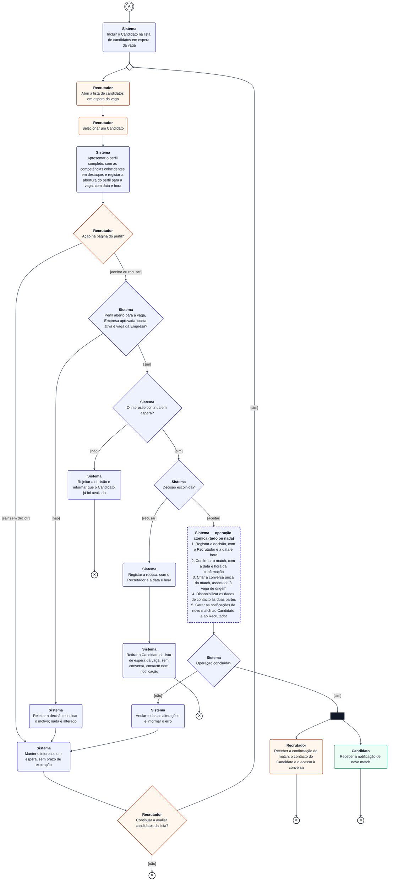

# Modelo de Comportamento — Fluxo de Match (Diagrama de Atividades) — Katch

**Unidade curricular:** Laboratório de Desenvolvimento de Software — LDS
**Milestone:** `m2`
**Ficheiro:** `m2-diagrama-atividades-fluxo-match-v01.md`
**Pasta de arquivo:** `04-artefactos-tecnicos/04.08-modelos-de-comportamento`

---

## 1. Identificação do documento

| Campo | Informação |
| --- | --- |
| Grupo | G11 |
| Sistema | Katch |
| Ano letivo | 2026/2027 |
| Curso | LEI — Licenciatura em Engenharia Informática |
| Turma | LEI3T2 |
| Versão do documento | v01 |
| Issue | `I037` — Elaborar o modelo de comportamento do fluxo de match (diagrama de atividades) |
| Documentos de origem | `m1-proposta-sistema-v02.pdf` (F006, F007, F008), `m1-declaracao-ambito-v02.pdf`, `m2-especificacao-requisitos-v01.md` (requisitos funcionais de F006, F007 e F008) e `m2-especificacoes-casos-uso-v01.md` (UC12 — secção 8.6) |

As especificações do UC05 (secção 8.5) e do UC11 (secção 8.7) ainda estão por preencher (Issues `I030` e `I032`). Até à aceitação dessas Issues, as atividades da parte A e a abertura do perfil na parte B são rastreadas apenas aos requisitos funcionais. A correspondência com os passos e fluxos do UC05 e do UC11 será acrescentada depois de a I030 e a I032 serem aceites.

### 1.1. Responsáveis

| Issue | Executor | Revisor | Auditor |
| --- | --- | --- | --- |
| `I037` | João Borguem | João Coelho | Miguel Santos |

### 1.2. Histórico de versões

| Versão | Data | Descrição das alterações | Issue |
| --- | --- | --- | --- |
| v01 | 2026-10-03 | Criação do documento: contexto, convenções, diagrama de atividades do fluxo de match (partes A e B), descrição das decisões e rastreabilidade. | `I037` |
| v01 | 2026-10-07 | Correção dos defeitos D01 a D03 do relatório de revisão `m2-s02-i037-20261006-relatorio-revisao-v01`: origens das decisões da parte A substituídas por requisitos funcionais (D01); saída do ciclo de espera na parte B (D02); ajuste de preferências a partir do cartão e correção da rastreabilidade de F006 (D03). | `I037` |

Cada alteração posterior acrescenta uma linha. As versões anteriores são conservadas, nos termos da secção 18.2 do Regulamento de Funcionamento da Unidade Curricular.

---

## 2. Contexto e objetivo

O match é o processo central do Katch: uma ligação entre um Candidato e uma Empresa só existe quando há interesse confirmado pelas duas partes — a manifestação de interesse do Candidato numa vaga e a posterior aceitação desse Candidato pelo Recrutador responsável pela vaga (F008). Nenhuma ação unilateral confirma a ligação.

Este modelo de comportamento descreve, num diagrama de atividades, o percurso completo de um interesse, desde o swipe do Candidato até à confirmação do match ou à recusa, com todas as decisões tomadas pelo Candidato, pelo Recrutador e pelo sistema. Serve para:

- clarificar a ordem das atividades e as condições de cada decisão, antes da implementação das funcionalidades F006 a F008;
- orientar o desenho dos testes (cada ramo de decisão corresponde a, pelo menos, um caso de teste);
- reunir num único modelo os comportamentos especificados nos requisitos funcionais de F006, F007 e F008 e no caso de uso UC12.

### 2.1. Âmbito do diagrama

| Incluído | Fora do diagrama (modelado noutro artefacto) |
| --- | --- |
| Seleção das vagas compatíveis e apresentação do cartão (RF013, RF014, RF015, RF022). | Consulta do detalhe da vaga e da página da Empresa (RF016, RF017): não altera o fluxo de match e regressa ao mesmo cartão. |
| Ajuste das preferências de procura a partir da área de exploração (RF023). Recusa da vaga e manifestação de interesse, com as verificações da quota de 10 interesses, do bloqueio de 24 horas, da unicidade do interesse e da disponibilidade da vaga (RF018, RF019, RF020). | Troca de mensagens na conversa do match (RF026 a RF030) e consulta de matches (RF024). |
| Reposição automática da quota no fim do bloqueio (RF021, RF033). | Efeito do encerramento da vaga e da suspensão da Empresa sobre um match já confirmado (modelo de estados do interesse e do match). |
| Interesse em espera (RF113), abertura obrigatória do perfil completo (RF060, RF061, RF118), aceitação ou recusa do Candidato e confirmação do match com criação da conversa (UC12). | Fluxo de aprovação de Empresas (`I038`). |

---

## 3. Convenções

O Mermaid não tem um tipo de diagrama UML de atividades. O diagrama usa um `flowchart` com as convenções seguintes:

| Elemento UML | Representação no diagrama |
| --- | --- |
| Nó inicial | Círculo preto preenchido |
| Ação | Retângulo de cantos arredondados, com a responsabilidade a negrito na primeira linha |
| Decisão e junção (merge) | Losango; o losango pequeno sem texto é uma junção de fluxos |
| Guarda | Texto entre parênteses retos na transição (`[sim]`, `[não]`, `[aceitar]`…) |
| Bifurcação (fork) | Barra preta; todos os fluxos de saída são executados em paralelo |
| Evento de tempo | Trapézio com ⌛ |
| Fim de fluxo (flow final) | Círculo com ✕; termina só o fluxo que lá chega, os restantes continuam |
| Conector | Círculo duplo com letra (`A`); liga a parte A à parte B do diagrama |
| Operação atómica | Ação com contorno tracejado, com as subações numeradas; ou são todas aplicadas ou nenhuma é |

**Responsabilidade (partições).** Como o Mermaid não posiciona de forma fiável as partições (swimlanes) quando há muitas transições entre elas, a responsabilidade de cada ação e decisão é indicada de duas formas redundantes: o nome a negrito na primeira linha do nó e a cor do nó. A redundância garante a leitura em impressão a preto e branco.

| Responsabilidade | Cor | Ponto de acesso |
| --- | --- | --- |
| Candidato | Verde | Aplicação móvel |
| Sistema Katch | Azul | Backend (executado sem intervenção direta de um ator) |
| Recrutador | Laranja | Área de gestão web |

As cores estão fixadas no próprio diagrama (fundo branco, linhas escuras), para que se leia da mesma forma em tema claro e em tema escuro.

**Uso do fim de fluxo.** O diagrama não tem nó final de atividade. A exploração de vagas pelo Candidato e a avaliação do interesse pelo Recrutador decorrem em paralelo depois da bifurcação; o Candidato sair da exploração não termina a avaliação do interesse, e vice-versa. Por isso, todos os términos são fins de fluxo e a atividade termina quando nenhum fluxo está ativo. Todos os ciclos do diagrama têm uma saída para um fim de fluxo.

---

## 4. Diagrama de atividades

O diagrama está dividido em duas partes ligadas pelo conector **A**, que corresponde à bifurcação após o registo do interesse.

### 4.1. Parte A — Exploração de vagas e manifestação de interesse

### 4.2. Parte B — Avaliação do interesse e confirmação do match

---

## 5. Descrição das decisões

### 5.1. Decisões da parte A

As origens indicadas nesta secção são os requisitos funcionais de `m2-especificacao-requisitos-v01.md`. A correspondência com os passos e fluxos do UC05 é acrescentada depois de a especificação deste caso de uso ser aceite (I030), nos termos da secção 1.

| Decisão | Responsável | Guardas e resultado | Origem |
| --- | --- | --- | --- |
| Existe vaga por apresentar? | Sistema | `[sim]` apresenta o cartão; `[não]` indica que não há vagas compatíveis. | RF013; RF014 |
| Ajustar as preferências? | Candidato | `[sim]` grava as novas preferências e repete a seleção; `[não]` termina a exploração. | RF023 |
| Ação sobre o cartão? | Candidato | `[swipe para a esquerda]` recusa a vaga; `[swipe para a direita]` manifesta interesse; `[ajustar as preferências]` grava as novas preferências e repete a seleção, aplicando-as às vagas apresentadas a seguir; `[sair]` termina a exploração. | RF013; RF018; RF019; RF023 |
| Quota disponível? | Sistema | `[sim]` continua; `[não: bloqueio de 24 h ativo]` rejeita o interesse, mostra o tempo em falta e mantém o mesmo cartão (o Candidato ainda pode recusar, ajustar as preferências ou sair). | RF020; RF022 |
| Já existe interesse do Candidato nesta vaga? | Sistema | `[sim]` rejeita a segunda manifestação; `[não]` continua. | RF019 |
| A vaga continua a cumprir as condições de seleção? | Sistema | `[sim]` regista o interesse; `[não]` (vaga suspensa ou encerrada, Empresa suspensa) informa que a vaga já não está disponível. | RF014; RF019 |
| A quota ficou esgotada? | Sistema | `[sim]` bloqueia novos interesses durante 24 horas a contar do instante deste interesse e agenda a reposição; `[não]` apresenta o cartão seguinte. | RF020; RF021 (P11) |

Nas três rejeições (quota, interesse repetido e vaga indisponível) nada é registado e a quota não é alterada. A recusa da vaga nunca consome a quota e não tem limite.

### 5.2. Decisões da parte B

| Decisão | Responsável | Guardas e resultado | Origem |
| --- | --- | --- | --- |
| Ação na página do perfil? | Recrutador | `[aceitar ou recusar]` pede a decisão; `[sair sem decidir]` mantém o interesse em espera, sem prazo, e o Candidato continua na lista. | UC12 passo 4; UC12-A2 |
| Continuar a avaliar candidatos da lista? | Recrutador | `[sim]` regressa à lista de candidatos em espera da vaga; `[não]` termina este fluxo de avaliação. Em ambos os casos o interesse continua em espera, sem prazo de expiração, e o Candidato continua na lista. | UC12-A2; RF113 |
| Perfil aberto para a vaga, Empresa aprovada, conta ativa e vaga da Empresa? | Sistema | `[sim]` continua; `[não]` rejeita a decisão sem alterar nada e o interesse continua em espera. | UC12 passo 5; E1, E2, E3 |
| O interesse continua em espera? | Sistema | `[sim]` continua; `[não]` (decidido noutro pedido simultâneo) rejeita e mantém a decisão já registada. | UC12; E4; RF117 |
| Decisão escolhida? | Sistema | `[aceitar]` executa a operação atómica; `[recusar]` regista a recusa e retira o Candidato da lista de espera dessa vaga. | UC12 passo 6; UC12-A1 |
| Operação concluída? | Sistema | `[sim]` bifurca: o Recrutador recebe a confirmação, o contacto e o acesso à conversa e o Candidato recebe a notificação de novo match; `[não]` anula todas as alterações e o interesse continua em espera. | UC12 passos 6 e 7; E5 |

A abertura obrigatória do perfil é garantida duas vezes: pela ordem das atividades (a ação de decisão só existe na página do perfil, depois de o sistema registar a abertura) e pela verificação no servidor (decisão «Perfil aberto para a vaga…»), que cobre pedidos diretos à API.

O fim de fluxo após «Continuar a avaliar candidatos da lista? `[não]`» termina apenas a avaliação em curso; não altera o estado do interesse, que continua em espera (RF113). Quando o Recrutador volta a abrir a lista de candidatos em espera da vaga, a avaliação do mesmo interesse recomeça na ação «Abrir a lista de candidatos em espera da vaga».

---

## 6. Rastreabilidade

### 6.1. Funcionalidades e requisitos

| Funcionalidade | Atividades do diagrama | Casos de uso | Requisitos |
| --- | --- | --- | --- |
| F006 — Exploração de vagas e manifestação de interesse | Parte A completa | UC05 (passos a associar após a aceitação da I030) | RF013, RF014, RF018 a RF022; RF023 (ajuste de preferências, sem vagas por apresentar e a partir do cartão); RF015 (distância em linha reta); RF113 (interesse em espera); RF033 (notificação da reposição da quota); RF076 (notificação de novo interesse); RF112 (autor e data e hora) |
| F007 — Avaliação de candidatos interessados | Parte B, da lista de espera até à decisão | UC11 (passos a associar após a aceitação da I032), UC12 | RF060, RF061, RF062, RF118 (abertura do perfil); RF063, RF064, RF065, RF066, RF117; RF113 (interesse em espera sem decisão); RF039 (Empresa aprovada) |
| F008 — Confirmação de match e disponibilização de contacto | Operação atómica e bifurcação final da parte B | UC12 | RF068 (criação da conversa); RF031 e RF077 (notificações de novo match) |

Os requisitos RF016 (detalhe da vaga, F006) e RF017 (página de apresentação da Empresa, F003) não estão representados no diagrama, por a consulta do detalhe da vaga e da página da Empresa ficar fora do âmbito definido na secção 2.1.

### 6.2. Estados do interesse produzidos pelo fluxo

| Atividade do diagrama | Estado do interesse antes | Estado depois |
| --- | --- | --- |
| Registar o interesse no estado em espera | — (não existe) | Em espera |
| Manter o interesse em espera (sair sem decidir, rejeição por pré-condição, falha da operação atómica) e terminar a avaliação sem decisão | Em espera | Em espera |
| Registar a recusa | Em espera | Recusado |
| Operação atómica concluída | Em espera | Aceite — match confirmado |
| Rejeitar porque o Candidato já foi avaliado | Recusado ou aceite | Inalterado (RF117) |
