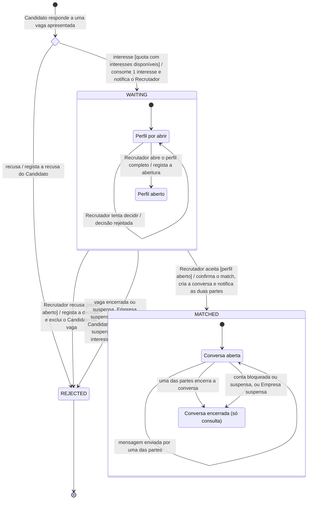

# Diagrama de Estados — Interesse e Match

**Unidade curricular:** Laboratório de Desenvolvimento de Software — LDS
**Milestone:** `m2`
**Ficheiro:** `m2-diagrama-estados-interesse-match-v01.md`
**Pasta de arquivo:** `04-artefactos-tecnicos/04.08-modelos-de-comportamento`

---

## 1. Identificação do documento

| Campo | Informação |
| --- | --- |
| Grupo | G11 |
| Sistema | Katch |
| Ano letivo | 2026/2027 |
| Curso | LEI — Licenciatura em Engenharia Informática |
| Turma | LEI3T2 |
| Versão do documento | v01 |
| Documentos de origem | `m1-proposta-sistema-v02.pdf`, `m1-declaracao-ambito-v02.pdf`, `m2-especificacao-requisitos-v01.md` (RF001 a RF118), `m2-especificacoes-casos-uso-v01.md` (UC05, UC11, UC12 e UC14) e modelo de dados PostgreSQL v02, com os campos `profile_opened_at` e `profile_opened_by` acrescentados à tabela `match` |

### 1.1. Responsáveis

| Issue | Executor | Revisor | Auditor |
| --- | --- | --- | --- |
| `I086` — Diagrama de estados do interesse e do match | João Coelho | João Borguem | Miguel Santos |

### 1.2. Histórico de versões

| Versão | Data | Descrição das alterações | Issue |
| --- | --- | --- | --- |
| v01 | 2026-10-02 | Criação do documento e do diagrama de estados do interesse e do match. | `I086` |

---

## 2. Contexto

O elemento modelado é a **resposta de um Candidato a uma vaga**. Começa com a recusa ou com a manifestação de interesse e pode terminar num match. Existe um único registo por par Candidato–vaga: o Candidato só responde uma vez a cada vaga.

O registo é criado quando o Candidato responde a uma vaga que lhe é apresentada (UC05). Se a quota de interesses estiver esgotada, o interesse é rejeitado e não é criado nenhum registo (RF020). Esse caso fica, por isso, fora do diagrama. A quota de interesses pertence ao Candidato e não a cada interesse, por isso não está modelada aqui.

O match não é uma entidade separada: é o estado final positivo do mesmo registo. A conversa entre as partes existe apenas enquanto o registo está em match e é modelada como subestado desse estado.

`REJECTED` é o estado final negativo e significa **encerrado sem match**. Tem três causas: recusa do Candidato, recusa do Recrutador e encerramento do interesse em espera por alteração da vaga, da Empresa ou da conta do Candidato. A secção 4 mostra como distinguir as três.

No modelo de dados, o registo corresponde à tabela `match` e os estados principais coincidem com os valores do tipo `match_status`.

---

## 3. Diagrama

**Notação.** As transições seguem a forma UML `evento [guarda] / ação`. O losango `resposta` é um pseudoestado de escolha. `WAITING` e `MATCHED` são estados compostos. `REJECTED` é um estado final: o registo mantém-se para histórico, mas não volta a mudar. `MATCHED` não tem saída, porque um match confirmado nunca é anulado. `Conversa encerrada` também não tem saída: a conversa não reabre, mesmo que a conta ou a Empresa seja reativada.

---

## 4. Estados

| Estado | Descrição | Correspondência no modelo de dados | Requisitos |
| --- | --- | --- | --- |
| `WAITING` — Em espera | O Candidato manifestou interesse e aguarda a decisão do Recrutador. Aparece na lista de candidatos em espera da vaga. | `candidate_status = INTERESTED`, `recruiter_status = PENDING`, `status = WAITING` | RF019, RF060, RF113 |
| `WAITING` › Perfil por abrir | O Recrutador ainda não abriu o perfil completo do Candidato para esta vaga. Nenhuma decisão é aceite. | `profile_opened_at IS NULL` | RF063, RF064, RF118 |
| `WAITING` › Perfil aberto | O Recrutador abriu o perfil completo e pode aceitar ou recusar. | `profile_opened_at` e `profile_opened_by` preenchidos | RF061, RF118 |
| `MATCHED` — Match confirmado | Existe interesse do Candidato e aceitação do Recrutador. Os dados de contacto estão disponíveis às duas partes. | `candidate_status = INTERESTED`, `recruiter_status = ACCEPTED`, `status = MATCHED`, `matched_at`, `decided_by` | RF025, RF066, RF067 |
| `MATCHED` › Conversa aberta | As duas partes trocam mensagens. | `conversation_status = OPEN` | RF026, RF068, RF069 |
| `MATCHED` › Conversa encerrada | A conversa fica só de consulta. O histórico mantém-se e não são aceites novas mensagens. Não reabre. | `conversation_status = CLOSED`, `conversation_closed_at`, `conversation_closed_by` | RF030, RF074, RF075 |
| `REJECTED` — Encerrado sem match | Estado final. O Candidato fica excluído desta vaga e esta não lhe volta a ser apresentada. A causa distingue-se pelos campos abaixo. | `status = REJECTED` | RF018, RF064, RF065 |

### 4.1. Causas do estado `REJECTED`

| Causa | `candidate_status` | `recruiter_status` | Campos preenchidos | Requisitos |
| --- | --- | --- | --- | --- |
| Recusa do Candidato | `DECLINED` | `PENDING` | `candidate_action_at`; `recruiter_action_at` e `decided_by` ficam vazios | RF018 |
| Recusa do Recrutador | `INTERESTED` | `DECLINED` | `recruiter_action_at`, `decided_by`, `profile_opened_at` e `profile_opened_by` | RF064, RF065 |
| Encerramento sem decisão do Recrutador | `INTERESTED` | `PENDING` | `candidate_action_at`; `recruiter_action_at` e `decided_by` ficam vazios | RF055, RF056, RF057, RF086, RF089, RF095 |

---

## 5. Transições

| # | Origem | Evento | Guarda | Ação | Destino | Requisitos |
| --- | --- | --- | --- | --- | --- | --- |
| T1 | Início | Candidato recusa uma vaga apresentada | Vaga elegível e sem resposta anterior do Candidato | Regista a recusa; a vaga não volta a ser apresentada | `REJECTED` | RF014, RF018 |
| T2 | Início | Candidato manifesta interesse numa vaga apresentada | Vaga elegível, sem resposta anterior do Candidato e quota com interesses disponíveis | Consome 1 interesse da quota e notifica o Recrutador do novo interesse | `WAITING` › Perfil por abrir | RF019, RF020, RF076, RF113 |
| T3 | Perfil por abrir | Recrutador abre o perfil completo do Candidato | — | Regista a abertura do perfil para esta vaga | Perfil aberto | RF061, RF118 |
| T4 | Perfil por abrir | Recrutador tenta aceitar ou recusar | — | Rejeita a decisão | Perfil por abrir | RF063, RF064 |
| T5 | `WAITING` | Recrutador aceita o Candidato | Perfil aberto | Regista a decisão com autor e data, confirma o match, cria a conversa e notifica o Candidato e o Recrutador | `MATCHED` › Conversa aberta | RF063, RF065, RF066, RF068, RF031, RF077 |
| T6 | `WAITING` | Recrutador recusa o Candidato | Perfil aberto | Regista a decisão com autor e data e exclui o Candidato desta vaga | `REJECTED` | RF064, RF065 |
| T7 | `WAITING` | A vaga é encerrada ou suspensa, a Empresa é suspensa ou a conta do Candidato é bloqueada ou suspensa | O registo ainda está em `WAITING` | Encerra o interesse sem decisão do Recrutador; `recruiter_status` mantém-se `PENDING` | `REJECTED` | RF055, RF056, RF057, RF086, RF089, RF095 |
| T8 | Conversa aberta | Uma das partes envia uma mensagem | Mensagem não vazia e dentro do comprimento máximo | Guarda a mensagem e notifica o destinatário | Conversa aberta | RF026, RF069, RF032, RF078 |
| T9 | Conversa aberta | O Candidato ou o Recrutador encerra a conversa | — | Regista quem encerrou e quando | Conversa encerrada | RF030, RF074 |
| T10 | Conversa aberta | Bloqueio ou suspensão da conta de uma das partes, ou suspensão da Empresa | — | Passa a conversa a só de consulta | Conversa encerrada | RF075, RF086, RF089, RF095 |

---

## 6. Regras e invariantes

| Regra | Requisitos |
| --- | --- |
| Existe no máximo um registo por par Candidato–vaga. O Candidato não volta a responder a uma vaga já respondida. | RF014, RF019 |
| O match só se confirma com interesse do Candidato **e** aceitação do Recrutador. Nenhuma das partes o confirma sozinha. | RF066 |
| O Recrutador só decide depois de abrir o perfil completo do Candidato para essa vaga. | RF063, RF064, RF118 |
| Uma decisão registada não pode ser alterada. Se dois Recrutadores decidirem ao mesmo tempo sobre o mesmo registo, só a primeira decisão é aceite. | RF117 |
| `REJECTED` é final. A reativação da vaga, da Empresa ou da conta não volta a pôr o registo em `WAITING`. | RF087, RF090, RF115, RF116 |
| Um match confirmado nunca é anulado. O encerramento da vaga e a suspensão da Empresa não eliminam o match. | F008 |
| A conversa encerrada não reabre, mesmo depois de reativada a conta ou a Empresa. | RF075, RF087, RF090, RF116 |
| Não há comunicação entre as partes fora do estado `MATCHED`. | RF070 |
| O Administrador não acede ao conteúdo das conversas em nenhum estado. | RF103 |
| A confirmação do match (T5) é atómica: a decisão, o match, a conversa e as duas notificações são registados em conjunto, ou nada é registado. | RF066, RF068, RF031, RF077 |
